---
## Front matter
lang: ru-RU
title: Лабораторная работа № 1.
subtitle: Подготовка лабораторного стенда
author:
  - Cадова Д. А.
institute:
  - Российский университет дружбы народов, Москва, Россия

## i18n babel
babel-lang: russian
babel-otherlangs: english
## Fonts
mainfont: PT Serif
romanfont: PT Serif
sansfont: PT Sans
monofont: PT Mono
mainfontoptions: Ligatures=TeX
romanfontoptions: Ligatures=TeX
sansfontoptions: Ligatures=TeX,Scale=MatchLowercase
monofontoptions: Scale=MatchLowercase,Scale=0.9

## Formatting pdf
toc: false
toc-title: Содержание
slide_level: 2
aspectratio: 169
section-titles: true
theme: metropolis
header-includes:
 - \metroset{progressbar=frametitle,sectionpage=progressbar,numbering=fraction}
 - '\makeatletter'
 - '\beamer@ignorenonframefalse'
 - '\makeatother'
---

# Информация

## Докладчик

:::::::::::::: {.columns align=center}
::: {.column width="70%"}

  * Садова Диана Алексеевна
  * студент бакалавриата
  * Российский университет дружбы народов
  * [113229118@pfur.ru]
  * <https://DianaSadova.github.io/ru/>

:::
::::::::::::::

# Вводная часть

## Актуальность

- Освоение инструментов автоматизации развёртывания виртуальных машин (Vagrant) формирует фундаментальную базу для дальнейшего роста в областях системного администрирования и кибербезопасности.

## Цели и задачи

- Целью данной работы является приобретение практических навыков установки Rocky Linux на виртуальную машину с помощью инструмента Vagrant.

## Материалы и методы

- Текст лабороторной работы № 1
- Интернет для исправления ошибок 

## Содержание исследования

1. Сформируйте box-файл с дистрибутивом Rocky Linux для VirtualBox.
2. Запустите виртуальные машины сервера и клиента и убедитесь в их работоспособности.
3. Внесите изменения в настройки загрузки образов виртуальных машин server и client, добавив пользователя с правами администратора и изменив названия хостов.
4. Скопируйте необходимые для работы с Vagrant файлы и box-файлы виртуальных машин на внешний носитель. Используя эти файлы, вы можете попробовать развернуть виртуальные машины на другом компьютере.

## Последовательность выполнения работы

В ОС Windows:

1. В созданном рабочем каталоге в подкаталоге packer разместите образ варианта операционной системы Rocky Linux (в этом практикуме будем использовать Rocky-9.4-x86_64-minimal.iso — минимальный дистрибутив Rocky Linux, который можно взять с сайта https://rockylinux.org/download/). 

##

В этом же рабочем каталоге в подкаталоге vagrant создайте каталог provision с подкаталогами default, server и client, в которых будут размещаться скрипты, изменяющие настройки внутреннего окружения базового (общего) образа виртуальной машины, сервера или клиента соответственно.

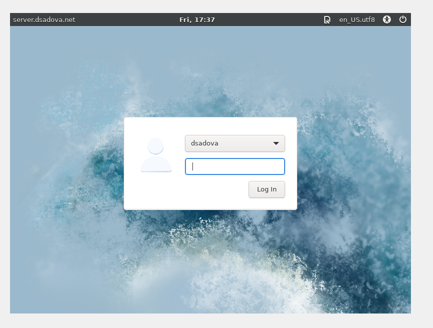

##

В каталогах default, server и client разместите заранее подготовленный скрипт-заглушку 01-dummy.sh следующего содержания:

#!/bin/bash

echo "Provisioning script $0"

##

В каталоге default разместите заранее подготовленный скрипт 01-user.sh по изменению названия виртуальной машины следующего содержания:

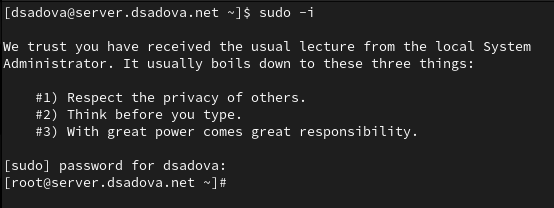

##

В каталоге default разместите заранее подготовленный скрипт 01-hostname.sh по изменению названия виртуальной машины следующего содержания:

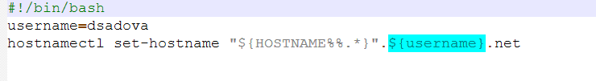

##

В каталоге server разместите заранее подготовленный скрипт 02-forward.sh следующего содержания:

Этот скрипт обеспечивает корректную маршрутизацию ip-адресов между сервером и клиентом.

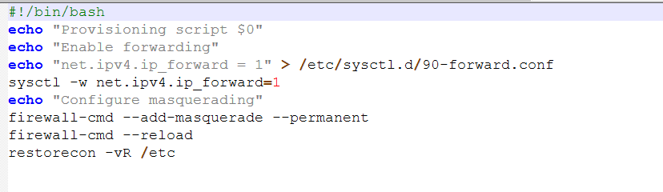

##

В каталоге client разместите заранее подготовленный скрипт 01-routing.sh следующего содержания:

Этот скрипт обеспечивает корректную работу сетевых интерфейсов клиента.

## Развёртывание лабораторного стенда на ОС Windows

В данном разделе приведена последовательность действий при развёртывании образа виртуальной машины в ОС Windows на домашнем компьютере в VirtualBox с использованием Vagrant. После установки необходимого программного обеспечения не забудьте перегрузить систему.

##

1. Используя FAR, перейдите в созданный вами рабочий каталог с проектом. В этом же каталоге должен быть размещён файл packer.exe. В командной строке введите 

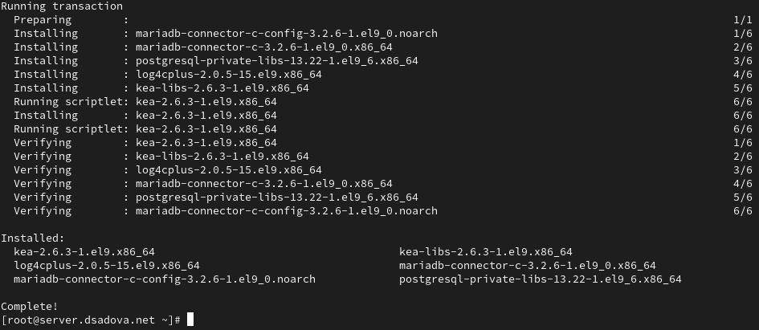

##

Для начала автоматической установки образа операционной системы Rocky Linux в VirtualBox и последующего формирования box-файла с дистрибутивом Rocky Linux для VirtualBox. По окончании процесса в рабочем каталоге сформируется box-файл с названием vagrant-virtualbox-rocky-9-x86_64.box.

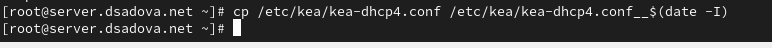{#fig:002 width=90%}

##

2. Для регистрации образа виртуальной машины в vagrant в командной строке введите

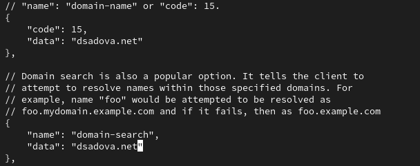

##

3. Для запуска виртуальной машины Server введите в консоли

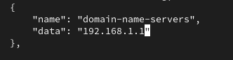

##

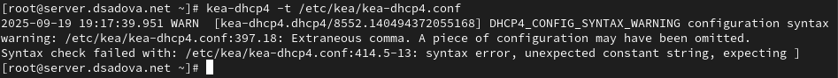

##

4. Для запуска виртуальной машины Client введите в консоли

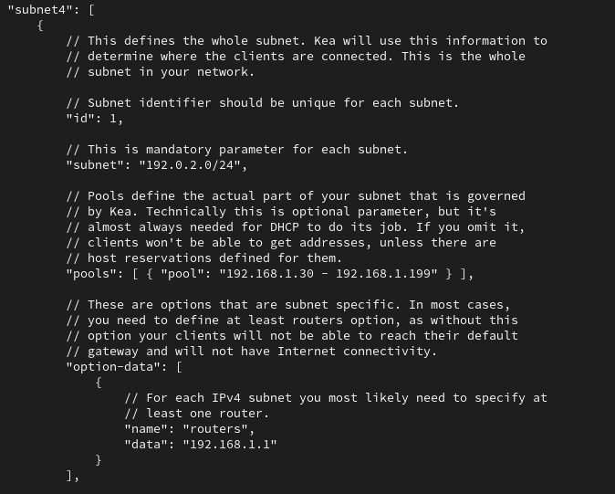

##

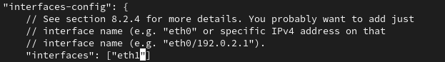

##

5. Убедитесь, что запуск обеих виртуальных машин прошёл успешно, залогиньтесь под пользователем vagrant с паролем vagrant в графическом окружении.

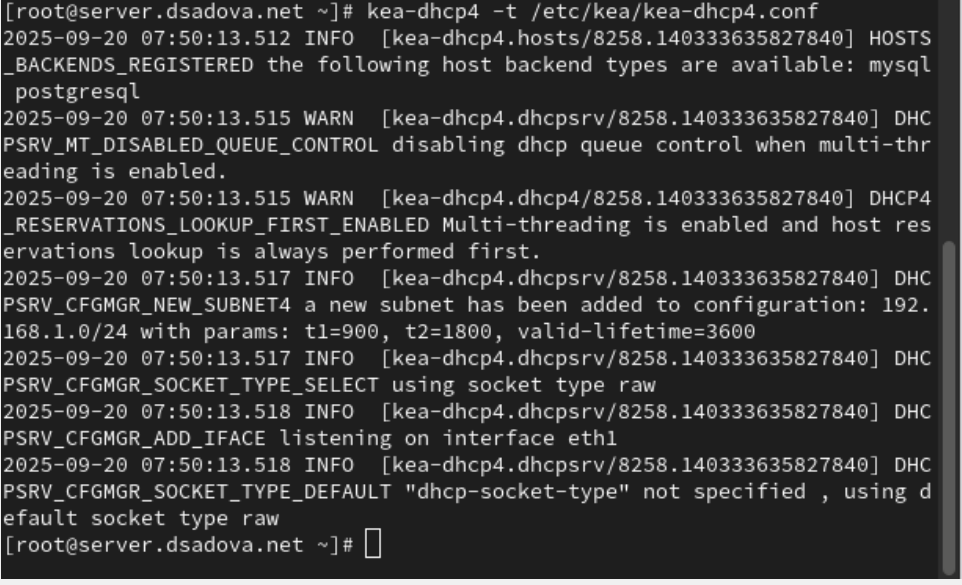

##

6. Подключитесь к серверу из консоли

7. Введите пароль vagrant.

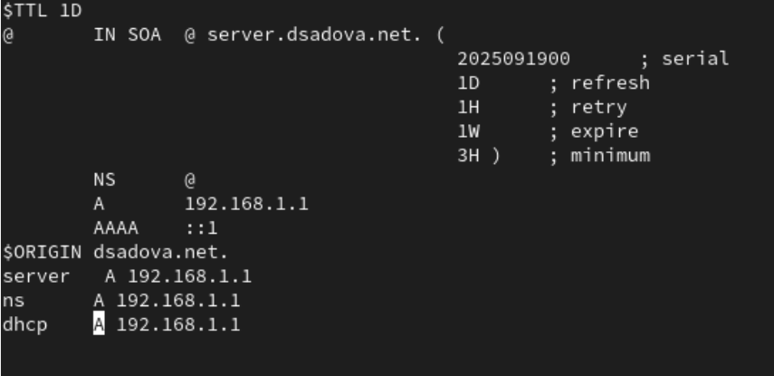

##

8. Перейдите к пользователю user (вместо user должен быть указан ваш логин):

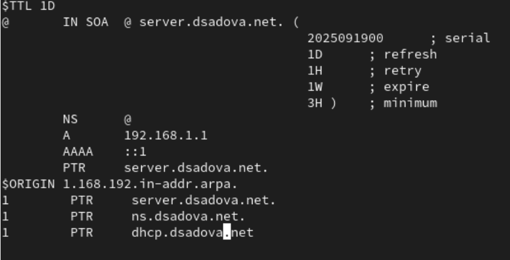

##

9. Отлогиньтесь.

10. Выполните тоже самое для клиента.

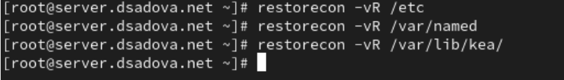

## Внесение изменений в настройки внутреннего окружения виртуальной машины

1. Для отработки созданных скриптов во время загрузки виртуальных машин убедитесь, что в конфигурационном файле Vagrantfile до строк с конфигурацией сервера имеется следующая запись:

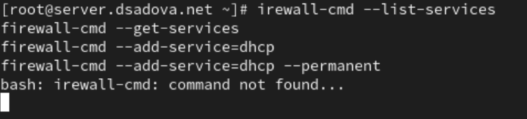

##

2. Зафиксируйте внесённые изменения для внутренних настроек виртуальных машин, введя в терминале:

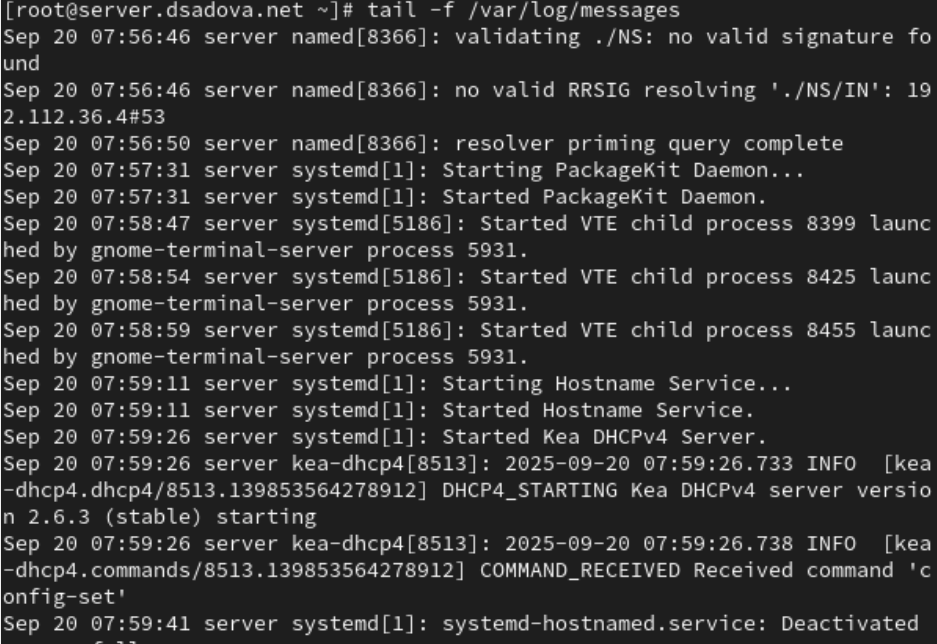

##

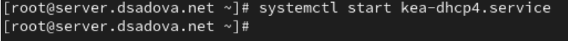

##

3. Залогиньтесь на сервере и клиенте под созданным пользователем. Убедитесь, что в терминале приглашение отображается в виде user@server.user.net на сервере и в виде user@client.user.net на клиенте, где вместо user указан ваш логин.

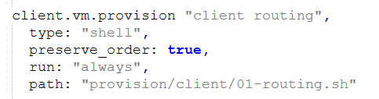

##

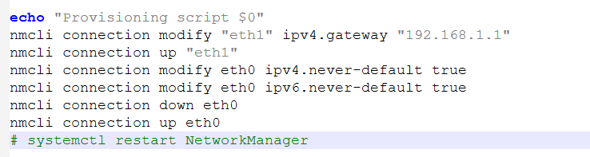

##

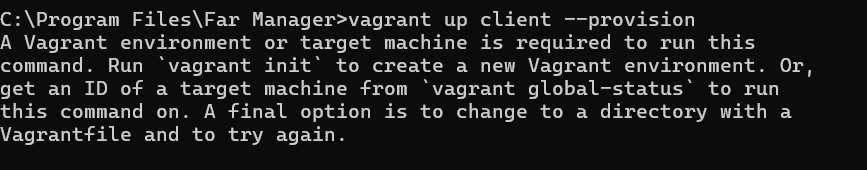

##

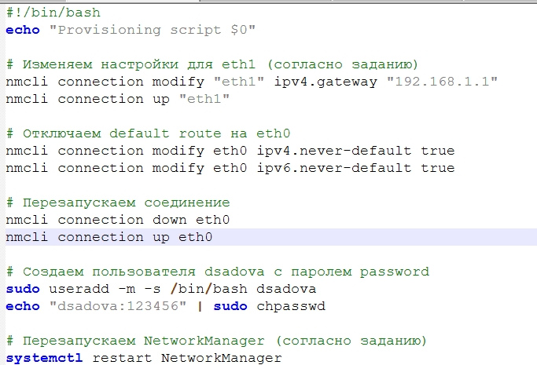

##

4. Выключите виртуальные машины.

5. После выключения виртуальных машин скопируйте необходимые для работы с Vagrant файлы и box-файлы виртуальных машин на внешний носитель или в другой каталог вашей ОС. Используя эти файлы, вы можете развернуть виртуальные машины на другом компьютере.

## Результаты

- Приобрели практические навыки по установке Rocky Linux на виртуальную машину с помощью инструмента Vagrant.

