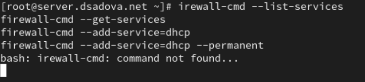
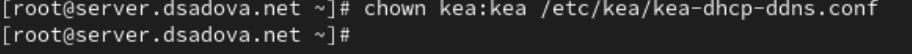
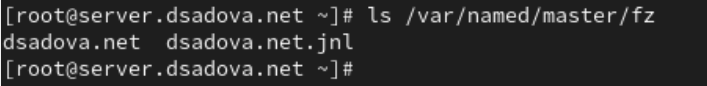

---
## Front matter
lang: ru-RU
title: Лабораторная работа № 3.
subtitle: Настройка DHCP-сервера
author:
  - Cадова Д. А.
institute:
  - Российский университет дружбы народов, Москва, Россия

## i18n babel
babel-lang: russian
babel-otherlangs: english
## Fonts
mainfont: PT Serif
romanfont: PT Serif
sansfont: PT Sans
monofont: PT Mono
mainfontoptions: Ligatures=TeX
romanfontoptions: Ligatures=TeX
sansfontoptions: Ligatures=TeX,Scale=MatchLowercase
monofontoptions: Scale=MatchLowercase,Scale=0.9

## Formatting pdf
toc: false
toc-title: Содержание
slide_level: 2
aspectratio: 169
section-titles: true
theme: metropolis
header-includes:
 - \metroset{progressbar=frametitle,sectionpage=progressbar,numbering=fraction}
 - '\makeatletter'
 - '\beamer@ignorenonframefalse'
 - '\makeatother'
---

# Информация

## Докладчик

:::::::::::::: {.columns align=center}
::: {.column width="70%"}

  * Садова Диана Алексеевна
  * студент бакалавриата
  * Российский университет дружбы народов
  * [113229118@pfur.ru]
  * <https://DianaSadova.github.io/ru/>

:::
::::::::::::::

# Вводная часть

## Актуальность

- Понимание как устроен DHCP-сервера
- Умение его подключать 

## Цели и задачи

- Приобретение практических навыков по установке и конфигурированию DHCP-сервера

## Материалы и методы

- Текст лабороторной работы № 3
- Интернет для исправления ошибок 

## Содержание исследования

1. Установите на виртуальной машине server DHCP-сервер.

2. Настройте виртуальную машину server в качестве DHCP-сервера для виртуальной внутренней сети.

3. Проверьте корректность работы DHCP-сервера в виртуальной внутренней сети путём запуска виртуальной машины client и применения соответствующих утилит диагностики.

##

4. Настройте обновление DNS-зоны при появлении в виртуальной внутренней сети новых узлов.

5. Проверьте корректность работы DHCP-сервера и обновления DNS-зоны в виртуальной внутренней сети путём запуска виртуальной машины client и применения соответствующих утилит диагностики.

6. Напишите скрипт для Vagrant, фиксирующий действия по установке и настройке DHCP-сервера во внутреннем окружении виртуальной машины server. Соответствующим образом внести изменения в Vagrantfile.

## Установка DHCP-сервера

- Запустите виртуальную машину server:

##

- На виртуальной машине server войдите под вашим пользователем и откройте терминал. Перейдите в режим суперпользователя:

##

- Установите dhcp:

##

- Сохраните на всякий случай конфигурационный файл:

##

- Откройте файл /etc/kea/kea-dhcp4.conf на редактирование. В этом файле: замените шаблон для domain-name

{#fig:005 width=90%}

##

{#fig:006 width=90%}

##

- на базе одного из приведённых в файле примеров конфигурирования подсети задайте собственную конфигурацию dhcp-сети, задав адрес подсети, диапазон адресов для распределения клиентам, адрес маршрутизатора и broadcast-адрес:

##

- Настройте привязку dhcpd к интерфейсу eth1 виртуальной машины server:

##

- Проверьте правильность конфигурационного файла:

##

- Перезагрузите конфигурацию dhcpd и разрешите загрузку DHCP-сервера при запуске виртуальной машины server:

##

- Добавьте запись для DHCP-сервера в конце файла прямой DNS-зоны /var/named/master/fz/user.net:

##

и в конце файла обратной зоны /var/named/master/rz/192.168.1:

##
- Перезапустите named:

##

- Проверьте, что можно обратиться к DHCP-серверу по имени:

##

- Внесите изменения в настройки межсетевого экрана узла server, разрешив работу с DHCP:

##

- Восстановите контекст безопасности в SELinux:

##

- В дополнительном терминале запустите мониторинг происходящих в системе процессов в реальном времени:

##

- В основном рабочем терминале запустите DHCP-сервер:

## Анализ работы DHCP-сервера

1. Перед запуском виртуальной машины client в каталоге с проектом в вашей операционной системе в подкаталоге vagrant/provision/client создайте файл 01-routing.sh. Открыв его на редактирование, пропишите в нём следующий скрипт:

##

2. В Vagrantfile подключите этот скрипт в разделе конфигурации для клиента:

##

3. Зафиксируйте внесённые изменения для внутренних настроек виртуальной машины client и запустите её, введя в терминале:
vagrant up client --provision.

4. После загрузки виртуальной машины client вы можете увидеть на виртуальной машине server на терминале с мониторингом происходящих в системе процессов записи о подключении к виртуальной внутренней сети узла client и выдачи ему IP-адреса из соответствующего диапазона адресов. Также информацию о работе DHCP-сервера можно наблюдать в файле /var/lib/kea/kea-leases4.csv.

##

5. Войдите в систему виртуальной машины client под вашим пользователем и откройте терминал. В терминале введите

##

Система имеет три сетевых интерфейса - eth0, eth1 и loopback (lo). Интерфейс eth1 соответствует записям из DHCP-сервера.

Интерфейс eth0:

- flags=4163<UP,BROADCAST,RUNNING,MULTICAST> - интерфейс активен, поддерживает широковещание и multicast

- inet 10.0.2.15 - IPv4 адрес (вероятно NAT-интерфейс VirtualBox)

- netmask 255.255.255.0 - маска подсети класса C

- broadcast 10.0.2.255 - широковещательный адрес

- inet6 fe80::a00:27ff:fe69:a8d - link-local IPv6 адрес

- inet6 fdl7:625c:f037:2:a00:27ff:fe69:a8d - глобальный IPv6 адрес (с ошибкой в записи)

- ether 08:00:27:69:0a:8d - MAC-адрес интерфейса

##

Интерфейс eth1 (основной интерес):

- flags=4163<UP,BROADCAST,RUNNING,MULTICAST> - интерфейс активен

- inet 192.168.1.30 - IPv4 адрес, совпадает с арендой из DHCP-сервера

- netmask 255.255.255.0 - маска подсети

- broadcast 192.168.1.255 - широковещательный адрес

- inet6 fe80::a00:27ff:fe22:9ad6 - link-local IPv6 адрес

- ether 08:00:27:22:9a:d6 - MAC-адрес, полностью совпадает с записью в DHCP: 08:00:27:22:9a:d6

##

Интерфейс lo (loopback):

- flags=73<UP,LOOPBACK,RUNNING> - loopback интерфейс активен

- inet 127.0.0.1 - стандартный loopback адрес

- netmask 255.0.0.0 - маска класса A

- inet6 ::1 - IPv6 loopback адрес

##

6. На машине server посмотрите список выданных адресов:

##

Файл /var/lib/kea/kea-leases4.csv содержит историю аренды IPv4 адресов сервером Kea DHCP.

Строка 1-2: Заголовок с полями:

- address - IP-адрес

- hwaddr - MAC-адрес клиента

- client_id - идентификатор клиента

- valid_lifetime - время жизни аренды (секунды)

- expire - timestamp истечения аренды

- subnet_id - ID подсети

- fqdn_fwd, fqdn_rev - флаги DNS-записей

- hostname - имя хоста

- state - состояние аренды

- user_context, pool_id - дополнительные параметры

##

Строка 3: 192.168.1.30,08:00:27:22:9a:d6,01:08:00:27:22:9a:d6,3600,1758359296,1,0,0,,client,0,,0

Адрес: 192.168.1.30. MAC: 08:00:27:22:9a:d6 (вероятно виртуальная машина VirtualBox). Время жизни: 3600 секунд (1 час). Истекает: 1758359296 (Unix timestamp). Подсеть: ID 1. Имя хоста: client. Состояние: 0 (активная/нормальная аренда)

Строка 4: 192.168.1.30,08:00:27:22:9a:d6,01:08:00:27:22:9a:d6,3600,1758359879,1,0,0,,client,0,,0

Обновление аренды того же клиента. Новое время истечения: 1758359879. Увеличение времени аренды

Строка 5: 192.168.1.30,08:00:27:22:9a:d6,01:08:00:27:22:9a:d6,3600,1758359885,1,0,0,,client,0,,0

## Настройка обновления DNS-зоны

1. Создадим ключ на сервере с Bind9 (на виртуальной машине server):

##

2. Файл /etc/named/keys/dhcp_updater.key будет иметь следующий вид:

##

3. Поправим права доступа:

##

4. Подключим ключ в файле /etc/named.conf:

##

5. На виртуальной машине server под пользователем с правами суперпользователя отредактируйте файл /etc/named/user.net (вместо user укажите свой логин), разрешив обновление зоны:

##

6. Сделаем проверку конфигурационного файла:

##

7. Перезапустите DNS-сервер:

##

8. Сформируем ключ для Kea. Файл ключа назовём /etc/kea/tsig-keys.json:

##

9. Перенесём ключ на сервер Kea DHCP и перепишем его в формате json:

##

10. Сменим владельца:

##

11. Поправим права доступа:

##

12. Настройка происходит в файле /etc/kea/kea-dhcp-ddns.conf:

##

13. Изменим владельца файла:

##

14. Проверим файл на наличие возможных синтаксических ошибок:

##

15. Запустим службу ddns:

##

16. Проверим статус работы службы:

##

17. Внесите изменения в конфигурационный файл /etc/kea/kea-dhcp4.conf, добавив в него разрешение на динамическое обновление DNS-записей с локального узла прямой и обратной зон:

##

18. Проверим файл на наличие возможных синтаксических ошибок:

##

19. Перезапустите DHCP-сервер:

##

20. Проверим статус:

##

21. На машине client переполучите адрес:

##

22. В каталоге прямой DNS-зоны /var/named/master/fz должен появиться файл user.net.jnl, в котором в бинарном файле автоматически вносятся изменения записей зоны.

## Анализ работы DHCP-сервера после настройки обновления DNS-зоны

На виртуальной машине client под вашим пользователем откройте терминал и с помощью утилиты dig убедитесь в наличии DNS-записи о клиенте в прямой DNS-зоне:

##

- opcode: QUERY - тип операции: запрос

- status: NOERROR - успешное выполнение

- id: 60274 - идентификатор запроса

- flags: qr aa rd ra - флаги: qr - это ответ (query response), aa - авторитетный ответ (authoritative answer), rd - рекурсия запрошена (recursion desired), ra - рекурсия доступна (recursion available)

##

Секция QUESTION:

- client.dsadova.net. IN A - запрос IPv4 адреса для client.dsadova.net

Секция ANSWER:

- client.dsadova.net. 1200 IN A 192.168.1.30 - ключевой результат!

- Время жизни записи: 1200 секунд (20 минут)

- Класс: IN (Internet)

- Тип: A (IPv4 адрес)

- Адрес: 192.168.1.30 - полностью совпадает с DHCP-арендой

## Внесение изменений в настройки внутреннего окружения виртуальной машины

1. На виртуальной машине server перейдите в каталог для внесения изменений в настройки внутреннего окружения /vagrant/provision/server/, создайте в нём каталог dhcp, в который поместите в соответствующие подкаталоги конфигурационные файлы DHCP:

##

2. Замените конфигурационные файлы DNS-сервера:

##

3. В каталоге /vagrant/provision/server создайте исполняемый файл dhcp.sh. Открыв его на редактирование, пропишите в нём следующий скрипт: 

##

4. Для отработки созданного скрипта во время загрузки виртуальной машины server в конфигурационном файле Vagrantfile необходимо добавить в разделе конфигурации для сервера:

## Результаты

- Приобрели практические навыки по установке и конфигурированию DHCP-сервера. Решили проблемы и неисправности при настройке и конфигурированию DHCP-сервера.

