---
## Front matter
title: "Лабораторная работа № 1."
subtitle: "Подготовка лабораторного стенда"
author: "Диана Алексеевна Садова"

## Generic otions
lang: ru-RU
toc-title: "Содержание"

## Bibliography
bibliography: bib/cite.bib
csl: pandoc/csl/gost-r-7-0-5-2008-numeric.csl

## Pdf output format
toc: true # Table of contents
toc-depth: 2
lof: true # List of figures
lot: true # List of tables
fontsize: 12pt
linestretch: 1.5
papersize: a4
documentclass: scrreprt
## I18n polyglossia
polyglossia-lang:
  name: russian
  options:
	- spelling=modern
	- babelshorthands=true
polyglossia-otherlangs:
  name: english
## I18n babel
babel-lang: russian
babel-otherlangs: english
## Fonts
mainfont: PT Serif
romanfont: PT Serif
sansfont: PT Sans
monofont: PT Mono
mainfontoptions: Ligatures=TeX
romanfontoptions: Ligatures=TeX
sansfontoptions: Ligatures=TeX,Scale=MatchLowercase
monofontoptions: Scale=MatchLowercase,Scale=0.9
## Biblatex
biblatex: true
biblio-style: "gost-numeric"
biblatexoptions:
  - parentracker=true
  - backend=biber
  - hyperref=auto
  - language=auto
  - autolang=other*
  - citestyle=gost-numeric
## Pandoc-crossref LaTeX customization
figureTitle: "Рис."
tableTitle: "Таблица"
listingTitle: "Листинг"
lofTitle: "Список иллюстраций"
lotTitle: "Список таблиц"
lolTitle: "Листинги"
## Misc options
indent: true
header-includes:
  - \usepackage{indentfirst}
  - \usepackage{float} # keep figures where there are in the text
  - \floatplacement{figure}{H} # keep figures where there are in the text
---

# Цель работы

Целью данной работы является приобретение практических навыков установки Rocky Linux на виртуальную машину с помощью инструмента Vagrant.

# Последовательность выполнения работы

## Задание

1. Сформируйте box-файл с дистрибутивом Rocky Linux для VirtualBox.
2. Запустите виртуальные машины сервера и клиента и убедитесь в их работоспособности.
3. Внесите изменения в настройки загрузки образов виртуальных машин server и client, добавив пользователя с правами администратора и изменив названия хостов.
4. Скопируйте необходимые для работы с Vagrant файлы и box-файлы виртуальных машин на внешний носитель. Используя эти файлы, вы можете попробовать развернуть виртуальные машины на другом компьютере.

## Последовательность выполнения работы

В ОС Windows:

1. В созданном рабочем каталоге в подкаталоге packer разместите образ варианта операционной системы Rocky Linux (в этом практикуме будем использовать Rocky-9.4-x86_64-minimal.iso — минимальный дистрибутив Rocky Linux, который можно взять с сайта https://rockylinux.org/download/). 

2. В этом же рабочем каталоге разместите подготовленные заранее для работы с Vagrant файлы:

– в подкаталоге packer файл vagrant-rocky.pkr.hcl — специальный файл с описанием метаданных по установке дистрибутива на виртуальную машину; 

– в подкаталоге vagrant файл Vagrantfile — файл с конфигурацией запуска виртуальных машин — сервера и клиента;

– в подкаталоге vagrant файл Makefile — набор инструкций для программы make по работе с Vagrant.

Для пользователей, работающих с Vagrant в ОС Windows, Makefile не понадобится.

3. В этом же рабочем каталоге в подкаталоге vagrant создайте каталог provision с подкаталогами default, server и client, в которых будут размещаться скрипты, изменяющие настройки внутреннего окружения базового (общего) образа виртуальной машины, сервера или клиента соответственно.(рис. [-@fig:100]).

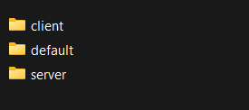{#fig:100 width=90%}

4. В каталогах default, server и client разместите заранее подготовленный скрипт-заглушку 01-dummy.sh следующего содержания:

#!/bin/bash

echo "Provisioning script $0"

5. В каталоге default разместите заранее подготовленный скрипт 01-user.sh по изменению названия виртуальной машины следующего содержания:(рис. [-@fig:101]).

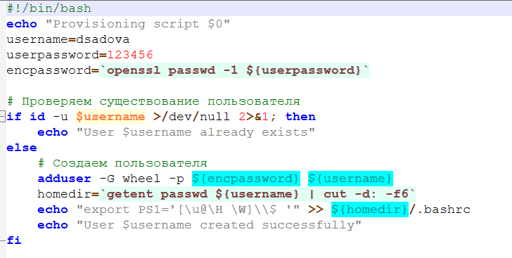{#fig:101 width=90%}

6. В каталоге default разместите заранее подготовленный скрипт 01-hostname.sh по изменению названия виртуальной машины следующего содержания:(рис. [-@fig:102]).

{#fig:102 width=90%}

7. В каталоге server разместите заранее подготовленный скрипт 02-forward.sh следующего содержания:(рис. [-@fig:103]).

{#fig:103 width=90%}

Этот скрипт обеспечивает корректную маршрутизацию ip-адресов между сервером и клиентом.

8. В каталоге client разместите заранее подготовленный скрипт 01-routing.sh следующего содержания:(рис. [-@fig:104]).

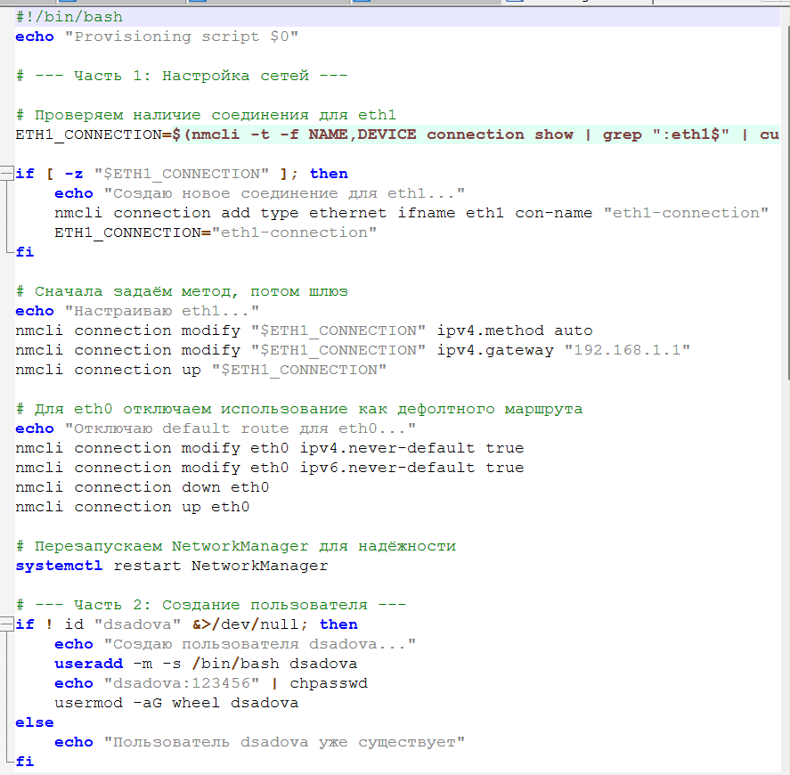{#fig:104 width=90%}

Этот скрипт обеспечивает корректную работу сетевых интерфейсов клиента.

### Развёртывание лабораторного стенда на ОС Windows

В данном разделе приведена последовательность действий при развёртывании образа виртуальной машины в ОС Windows на домашнем компьютере в VirtualBox с использованием Vagrant. После установки необходимого программного обеспечения не забудьте перегрузить систему.

Далее выполните следующие действия:

1. Используя FAR, перейдите в созданный вами рабочий каталог с проектом. В этом же каталоге должен быть размещён файл packer.exe. В командной строке введите (рис. [-@fig:001]).

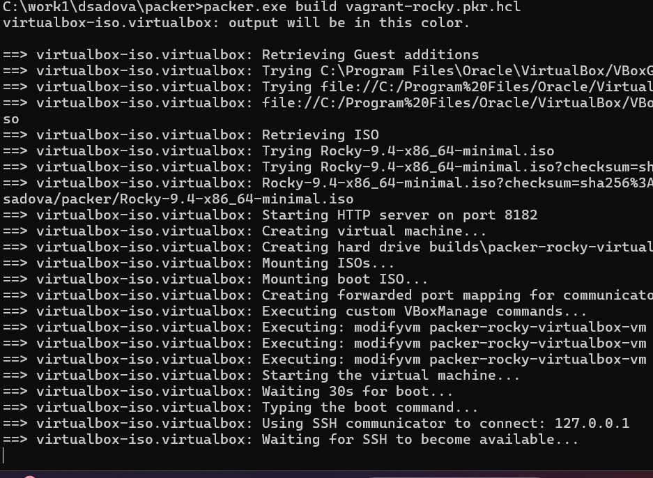{#fig:001 width=90%}

для начала автоматической установки образа операционной системы Rocky Linux в VirtualBox и последующего формирования box-файла с дистрибутивом Rocky Linux для VirtualBox. По окончании процесса в рабочем каталоге сформируется box-файл с названием vagrant-virtualbox-rocky-9-x86_64.box.(рис. [-@fig:002]).

{#fig:002 width=90%}

2. Для регистрации образа виртуальной машины в vagrant в командной строке введите(рис. [-@fig:003]).

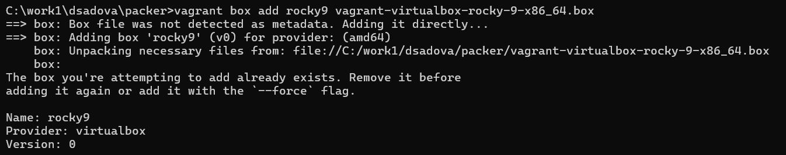{#fig:003 width=90%}

3. Для запуска виртуальной машины Server введите в консоли(рис. [-@fig:004]),(рис. [-@fig:005]).

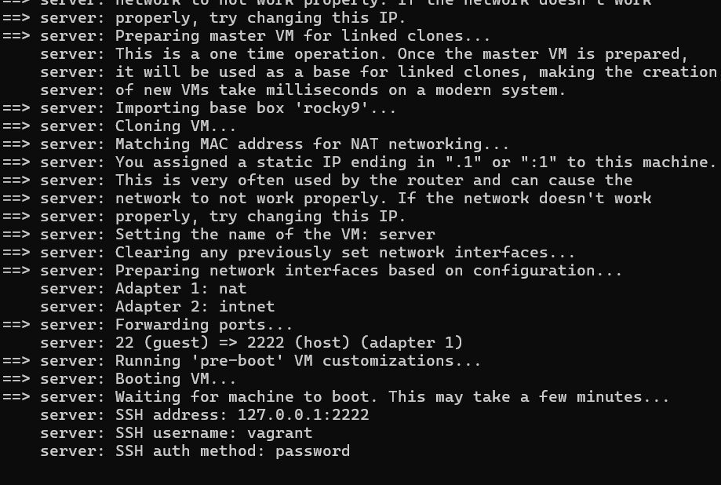{#fig:004 width=90%}

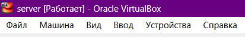{#fig:005 width=90%}

4. Для запуска виртуальной машины Client введите в консоли(рис. [-@fig:006]),(рис. [-@fig:007]).

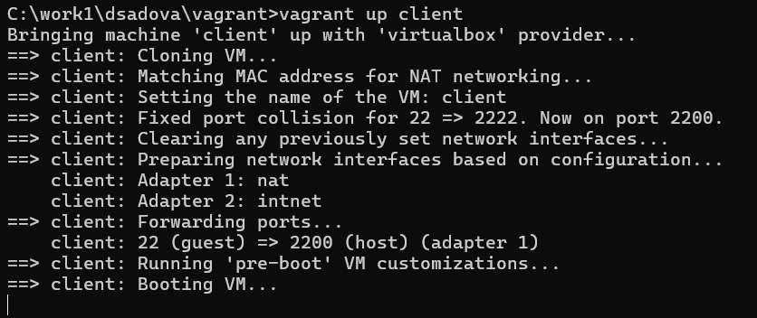{#fig:006 width=90%}

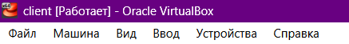{#fig:007 width=90%}

5. Убедитесь, что запуск обеих виртуальных машин прошёл успешно, залогиньтесь под пользователем vagrant с паролем vagrant в графическом окружении.(рис. [-@fig:008]).

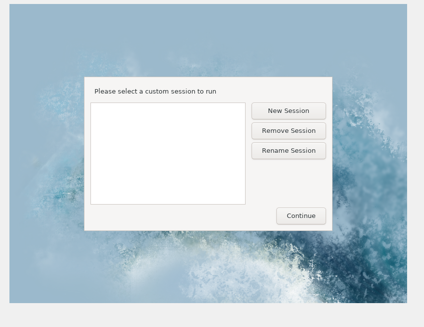{#fig:008 width=90%}

6. Подключитесь к серверу из консоли

7. Введите пароль vagrant.(рис. [-@fig:009]).

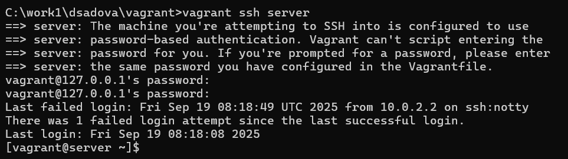{#fig:009 width=90%}

8. Перейдите к пользователю user (вместо user должен быть указан ваш логин):(рис. [-@fig:010]).

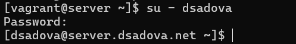{#fig:010 width=90%}

9. Отлогиньтесь.

10. Выполните тоже самое для клиента.(рис. [-@fig:011]).

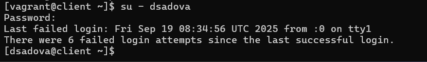{#fig:011 width=90%}

11. Выключите обе виртуальные машины

### Внесение изменений в настройки внутреннего окружения виртуальной машины
1. Для отработки созданных скриптов во время загрузки виртуальных машин убедитесь, что в конфигурационном файле Vagrantfile до строк с конфигурацией сервера имеется следующая запись:(рис. [-@fig:012]).

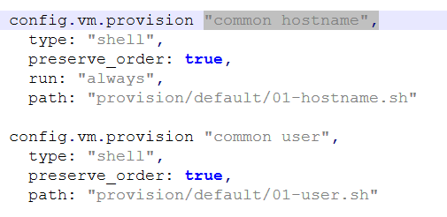{#fig:012 width=90%}

2. Зафиксируйте внесённые изменения для внутренних настроек виртуальных машин, введя в терминале:(рис. [-@fig:013]),(рис. [-@fig:014]).

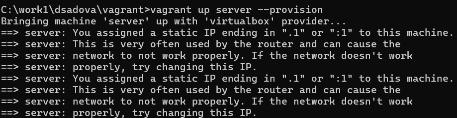{#fig:013 width=90%}

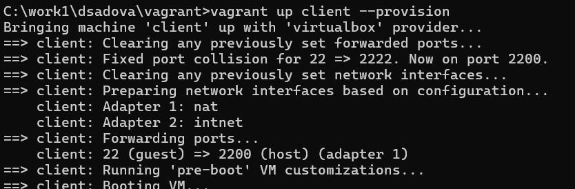{#fig:014 width=90%}

3. Залогиньтесь на сервере и клиенте под созданным пользователем. Убедитесь, что в терминале приглашение отображается в виде user@server.user.net на сервере и в виде user@client.user.net на клиенте, где вместо user указан ваш логин.(рис. [-@fig:015]),(рис. [-@fig:016]).,(рис. [-@fig:017]),(рис. [-@fig:018]).

{#fig:015 width=90%}

{#fig:016 width=90%}

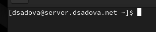{#fig:017 width=90%}

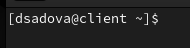{#fig:018 width=90%}

4. Выключите виртуальные машины.

5. После выключения виртуальных машин скопируйте необходимые для работы с Vagrant файлы и box-файлы виртуальных машин на внешний носитель или в другой каталог вашей ОС. Используя эти файлы, вы можете развернуть виртуальные машины на другом компьютере.

# Выводы

Приобрели практические навыки по установке Rocky Linux на виртуальную машину с помощью инструмента Vagrant.

# Список литературы{.unnumbered}

::: {#refs}
:::
