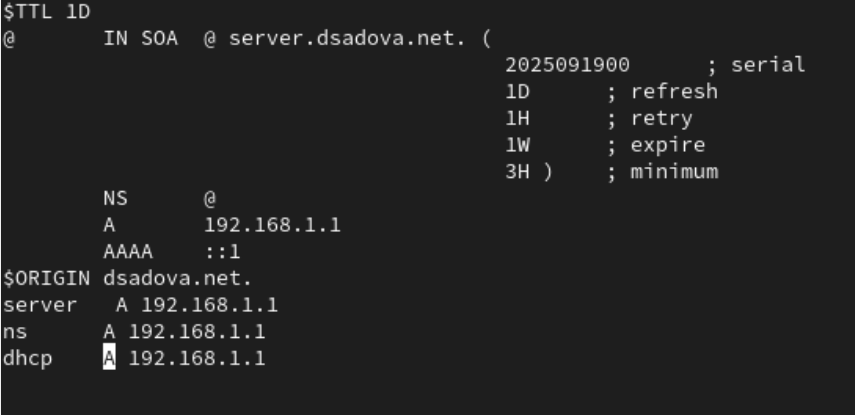
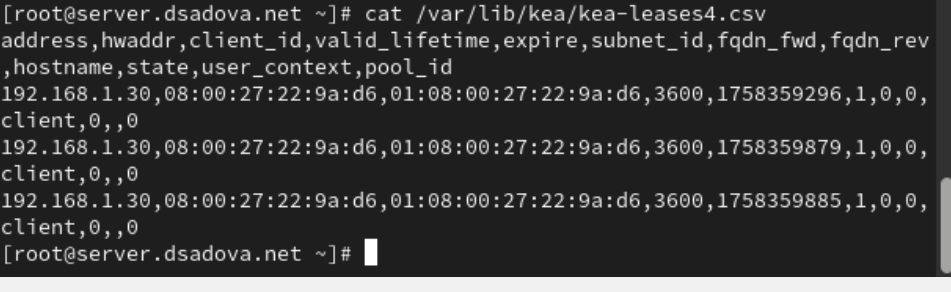
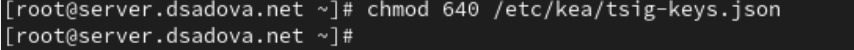
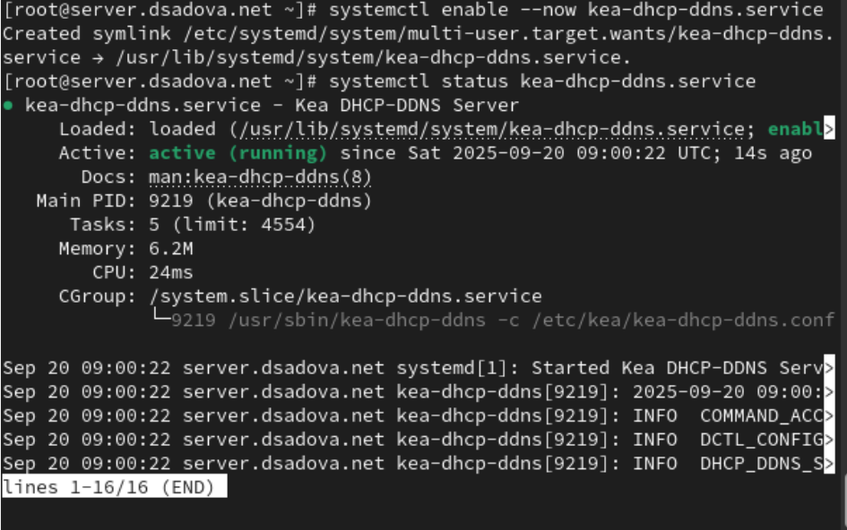
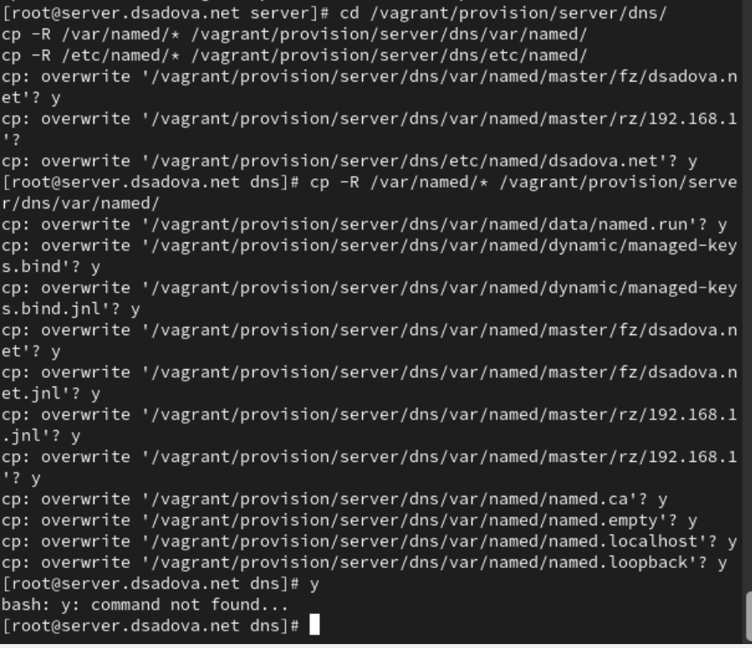
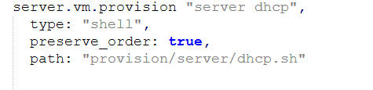

---
## Front matter
title: "Лабораторная работа № 3."
subtitle: "Настройка DHCP-сервера"
author: "Диана Алексеевна Садова"

## Generic otions
lang: ru-RU
toc-title: "Содержание"

## Bibliography
bibliography: bib/cite.bib
csl: pandoc/csl/gost-r-7-0-5-2008-numeric.csl

## Pdf output format
toc: true # Table of contents
toc-depth: 2
lof: true # List of figures
lot: true # List of tables
fontsize: 12pt
linestretch: 1.5
papersize: a4
documentclass: scrreprt
## I18n polyglossia
polyglossia-lang:
  name: russian
  options:
	- spelling=modern
	- babelshorthands=true
polyglossia-otherlangs:
  name: english
## I18n babel
babel-lang: russian
babel-otherlangs: english
## Fonts
mainfont: PT Serif
romanfont: PT Serif
sansfont: PT Sans
monofont: PT Mono
mainfontoptions: Ligatures=TeX
romanfontoptions: Ligatures=TeX
sansfontoptions: Ligatures=TeX,Scale=MatchLowercase
monofontoptions: Scale=MatchLowercase,Scale=0.9
## Biblatex
biblatex: true
biblio-style: "gost-numeric"
biblatexoptions:
  - parentracker=true
  - backend=biber
  - hyperref=auto
  - language=auto
  - autolang=other*
  - citestyle=gost-numeric
## Pandoc-crossref LaTeX customization
figureTitle: "Рис."
tableTitle: "Таблица"
listingTitle: "Листинг"
lofTitle: "Список иллюстраций"
lotTitle: "Список таблиц"
lolTitle: "Листинги"
## Misc options
indent: true
header-includes:
  - \usepackage{indentfirst}
  - \usepackage{float} # keep figures where there are in the text
  - \floatplacement{figure}{H} # keep figures where there are in the text
---

# Цель работы

Приобретение практических навыков по установке и конфигурированию DHCP-сервера

# Последовательность выполнения работы

## Задание

1. Установите на виртуальной машине server DHCP-сервер.

2. Настройте виртуальную машину server в качестве DHCP-сервера для виртуальной внутренней сети.

3. Проверьте корректность работы DHCP-сервера в виртуальной внутренней сети путём запуска виртуальной машины client и применения соответствующих утилит диагностики.

4. Настройте обновление DNS-зоны при появлении в виртуальной внутренней сети новых узлов.

5. Проверьте корректность работы DHCP-сервера и обновления DNS-зоны в виртуальной внутренней сети путём запуска виртуальной машины client и применения соответствующих утилит диагностики.

6. Напишите скрипт для Vagrant, фиксирующий действия по установке и настройке DHCP-сервера во внутреннем окружении виртуальной машины server. Соответствующим образом внести изменения в Vagrantfile.

## Последовательность выполнения работы

### Установка DHCP-сервера

1. Загрузите вашу операционную систему и перейдите в рабочий каталог с проектом:
cd /var/tmp/user_name/vagrant

2. Запустите виртуальную машину server:(рис. [-@fig:001]).

{#fig:001 width=90%}

3. На виртуальной машине server войдите под вашим пользователем и откройте терминал. Перейдите в режим суперпользователя:(рис. [-@fig:002]).

{#fig:002 width=90%}

4. Установите dhcp:(рис. [-@fig:003]).

{#fig:003 width=90%}

### Конфигурирование DHCP-сервера

1. Сохраните на всякий случай конфигурационный файл:(рис. [-@fig:004]).

{#fig:004 width=90%}

2. Откройте файл /etc/kea/kea-dhcp4.conf на редактирование. В этом файле: замените шаблон для domain-name(рис. [-@fig:005]),(рис. [-@fig:006]).

{#fig:005 width=90%}

{#fig:006 width=90%}

– на базе одного из приведённых в файле примеров конфигурирования подсети задайте собственную конфигурацию dhcp-сети, задав адрес подсети, диапазон адресов для распределения клиентам, адрес маршрутизатора и broadcast-адрес:(рис. [-@fig:007]).

{#fig:007 width=90%}

Остальные примеры задания конфигураций подсетей удалите.

3. Настройте привязку dhcpd к интерфейсу eth1 виртуальной машины server:(рис. [-@fig:008]).

{#fig:008 width=90%}

4. Проверьте правильность конфигурационного файла:(рис. [-@fig:009]).

{#fig:009 width=90%}

5. Перезагрузите конфигурацию dhcpd и разрешите загрузку DHCP-сервера при запуске виртуальной машины server:(рис. [-@fig:010]).

{#fig:010 width=90%}

6. Добавьте запись для DHCP-сервера в конце файла прямой DNS-зоны /var/named/master/fz/user.net:(рис. [-@fig:011]).

{#fig:011 width=90%}

и в конце файла обратной зоны /var/named/master/rz/192.168.1:(рис. [-@fig:012]).

{#fig:012 width=90%}

При этом не забудьте в обоих файлах изменить серийный номер файла зоны, указав текущую дату в нотации ГГГГММДДВВ.

7. Перезапустите named:(рис. [-@fig:013]).

{#fig:013 width=90%}

8. Проверьте, что можно обратиться к DHCP-серверу по имени:(рис. [-@fig:014]).

{#fig:014 width=90%}

9. Внесите изменения в настройки межсетевого экрана узла server, разрешив работу с DHCP:(рис. [-@fig:015]).

{#fig:015 width=90%}

10. Восстановите контекст безопасности в SELinux:(рис. [-@fig:016]).

{#fig:016 width=90%}

11. В дополнительном терминале запустите мониторинг происходящих в системе процессов в реальном времени:(рис. [-@fig:017]).

{#fig:017 width=90%}

12. В основном рабочем терминале запустите DHCP-сервер:(рис. [-@fig:018]).

{#fig:018 width=90%}

13. Если запуск DHCP-сервера прошёл успешно, то, не выключая виртуальной машины
server и не прерывая на ней мониторинга происходящих в системе процессов,
приступите к анализу работы DHCP-сервера на клиенте.

Запуск произошел без ошибок. Идем дальше. 

### Анализ работы DHCP-сервера

1. Перед запуском виртуальной машины client в каталоге с проектом в вашей операционной системе в подкаталоге vagrant/provision/client создайте файл 01-routing.sh. Открыв его на редактирование, пропишите в нём следующий скрипт:(рис. [-@fig:019]).

{#fig:019 width=90%}

Этот скрипт изменяет настройки NetworkManager так, чтобы весь трафик на виртуальной машине client шёл по умолчанию через интерфейс eth1.

2. В Vagrantfile подключите этот скрипт в разделе конфигурации для клиента:(рис. [-@fig:020]).

{#fig:020 width=90%}

3. Зафиксируйте внесённые изменения для внутренних настроек виртуальной машины client и запустите её, введя в терминале:
vagrant up client --provision.

4. После загрузки виртуальной машины client вы можете увидеть на виртуальной машине server на терминале с мониторингом происходящих в системе процессов записи о подключении к виртуальной внутренней сети узла client и выдачи ему IP-адреса из соответствующего диапазона адресов. Также информацию о работе DHCP-сервера можно наблюдать в файле /var/lib/kea/kea-leases4.csv. В отчёте прокомментируйте построчно информацию из этого файла.(рис. [-@fig:100]).

{#fig:100 width=90%}

Файл /var/lib/kea/kea-leases4.csv содержит историю аренды IPv4 адресов сервером Kea DHCP.

Строка 1-2: Заголовок с полями:

- address - IP-адрес

- hwaddr - MAC-адрес клиента

- client_id - идентификатор клиента

- valid_lifetime - время жизни аренды (секунды)

- expire - timestamp истечения аренды

- subnet_id - ID подсети

- fqdn_fwd, fqdn_rev - флаги DNS-записей

- hostname - имя хоста

- state - состояние аренды

- user_context, pool_id - дополнительные параметры

Строка 3: 192.168.1.30,08:00:27:22:9a:d6,01:08:00:27:22:9a:d6,3600,1758359296,1,0,0,,client,0,,0

Адрес: 192.168.1.30. MAC: 08:00:27:22:9a:d6 (вероятно виртуальная машина VirtualBox). Время жизни: 3600 секунд (1 час). Истекает: 1758359296 (Unix timestamp). Подсеть: ID 1. Имя хоста: client. Состояние: 0 (активная/нормальная аренда)

Строка 4: 192.168.1.30,08:00:27:22:9a:d6,01:08:00:27:22:9a:d6,3600,1758359879,1,0,0,,client,0,,0

Обновление аренды того же клиента. Новое время истечения: 1758359879. Увеличение времени аренды

Строка 5: 192.168.1.30,08:00:27:22:9a:d6,01:08:00:27:22:9a:d6,3600,1758359885,1,0,0,,client,0,,0

5. Войдите в систему виртуальной машины client под вашим пользователем и откройте терминал. В терминале введите(рис. [-@fig:021]).

{#fig:021 width=90%}

На экран будет выведена информация об имеющихся интерфейсах. Прокомментируйте её построчно в отчёте.

Система имеет три сетевых интерфейса - eth0, eth1 и loopback (lo). Интерфейс eth1 соответствует записям из DHCP-сервера.

Интерфейс eth0:

- flags=4163<UP,BROADCAST,RUNNING,MULTICAST> - интерфейс активен, поддерживает широковещание и multicast

- inet 10.0.2.15 - IPv4 адрес (вероятно NAT-интерфейс VirtualBox)

- netmask 255.255.255.0 - маска подсети класса C

- broadcast 10.0.2.255 - широковещательный адрес

- inet6 fe80::a00:27ff:fe69:a8d - link-local IPv6 адрес

- inet6 fdl7:625c:f037:2:a00:27ff:fe69:a8d - глобальный IPv6 адрес (с ошибкой в записи)

- ether 08:00:27:69:0a:8d - MAC-адрес интерфейса

Интерфейс eth1 (основной интерес):

- flags=4163<UP,BROADCAST,RUNNING,MULTICAST> - интерфейс активен

- inet 192.168.1.30 - IPv4 адрес, совпадает с арендой из DHCP-сервера

- netmask 255.255.255.0 - маска подсети

- broadcast 192.168.1.255 - широковещательный адрес

- inet6 fe80::a00:27ff:fe22:9ad6 - link-local IPv6 адрес

- ether 08:00:27:22:9a:d6 - MAC-адрес, полностью совпадает с записью в DHCP: 08:00:27:22:9a:d6

Интерфейс lo (loopback):

- flags=73<UP,LOOPBACK,RUNNING> - loopback интерфейс активен

- inet 127.0.0.1 - стандартный loopback адрес

- netmask 255.0.0.0 - маска класса A

- inet6 ::1 - IPv6 loopback адрес

6. На машине server посмотрите список выданных адресов:(рис. [-@fig:022]).

{#fig:022 width=90%}

Прокомментируйте построчно в отчёте.

Файл /var/lib/kea/kea-leases4.csv содержит историю аренды IPv4 адресов сервером Kea DHCP.

Строка 1-2: Заголовок с полями:

- address - IP-адрес

- hwaddr - MAC-адрес клиента

- client_id - идентификатор клиента

- valid_lifetime - время жизни аренды (секунды)

- expire - timestamp истечения аренды

- subnet_id - ID подсети

- fqdn_fwd, fqdn_rev - флаги DNS-записей

- hostname - имя хоста

- state - состояние аренды

- user_context, pool_id - дополнительные параметры

Строка 3: 192.168.1.30,08:00:27:22:9a:d6,01:08:00:27:22:9a:d6,3600,1758359296,1,0,0,,client,0,,0

Адрес: 192.168.1.30. MAC: 08:00:27:22:9a:d6 (вероятно виртуальная машина VirtualBox). Время жизни: 3600 секунд (1 час). Истекает: 1758359296 (Unix timestamp). Подсеть: ID 1. Имя хоста: client. Состояние: 0 (активная/нормальная аренда)

Строка 4: 192.168.1.30,08:00:27:22:9a:d6,01:08:00:27:22:9a:d6,3600,1758359879,1,0,0,,client,0,,0

Обновление аренды того же клиента. Новое время истечения: 1758359879. Увеличение времени аренды

Строка 5: 192.168.1.30,08:00:27:22:9a:d6,01:08:00:27:22:9a:d6,3600,1758359885,1,0,0,,client,0,,0

Еще одно обновление аренды. Последнее записанное время истечения: 1758359885

### Настройка обновления DNS-зоны

Требуется настроить обновление DNS-зоны при появлении в виртуальной внутренней сети новых узлов.

1. Создадим ключ на сервере с Bind9 (на виртуальной машине server):(рис. [-@fig:023]).

{#fig:023 width=90%}

2. Файл /etc/named/keys/dhcp_updater.key будет иметь следующий вид:(рис. [-@fig:024]).

{#fig:024 width=90%}

3. Поправим права доступа:(рис. [-@fig:025]).

{#fig:025 width=90%}

4. Подключим ключ в файле /etc/named.conf:(рис. [-@fig:026]).

{#fig:026 width=90%}

5. На виртуальной машине server под пользователем с правами суперпользователя отредактируйте файл /etc/named/user.net (вместо user укажите свой логин), разрешив обновление зоны:(рис. [-@fig:027]).

{#fig:027 width=90%}

6. Сделаем проверку конфигурационного файла:(рис. [-@fig:028]).

{#fig:028 width=90%}

7. Перезапустите DNS-сервер:(рис. [-@fig:029]).

{#fig:029 width=90%}

8. Сформируем ключ для Kea. Файл ключа назовём /etc/kea/tsig-keys.json:(рис. [-@fig:030]).

{#fig:030 width=90%}

9. Перенесём ключ на сервер Kea DHCP и перепишем его в формате json:(рис. [-@fig:031]).

{#fig:031 width=90%}

10. Сменим владельца:(рис. [-@fig:032]).

{#fig:032 width=90%}

11. Поправим права доступа:(рис. [-@fig:033]).

{#fig:033 width=90%}

12. Настройка происходит в файле /etc/kea/kea-dhcp-ddns.conf:(рис. [-@fig:034]).

{#fig:034 width=90%}

Обратите особое внимание на точку в конце имени зоны, иначе DDNS завершится сбоем и сообщит, что не удалось найти соответствующее полное доменное имя.

13. Изменим владельца файла:(рис. [-@fig:035]).

{#fig:035 width=90%}

14. Проверим файл на наличие возможных синтаксических ошибок:(рис. [-@fig:036]).

{#fig:036 width=90%}

15. Запустим службу ddns:(рис. [-@fig:037]).

{#fig:037 width=90%}

16. Проверим статус работы службы:(рис. [-@fig:038]).

{#fig:038 width=90%}

17. Внесите изменения в конфигурационный файл /etc/kea/kea-dhcp4.conf, добавив в него разрешение на динамическое обновление DNS-записей с локального узла прямой и обратной зон:(рис. [-@fig:039]).

{#fig:039 width=90%}

18. Проверим файл на наличие возможных синтаксических ошибок:(рис. [-@fig:040]).

{#fig:040 width=90%}

19. Перезапустите DHCP-сервер:(рис. [-@fig:041]).

{#fig:041 width=90%}

20. Проверим статус:(рис. [-@fig:042]).

{#fig:042 width=90%}

21. На машине client переполучите адрес:(рис. [-@fig:043]).

{#fig:043 width=90%}

22. В каталоге прямой DNS-зоны /var/named/master/fz должен появиться файл user.net.jnl, в котором в бинарном файле автоматически вносятся изменения записей зоны.(рис. [-@fig:044]).

{#fig:044 width=90%}

### Анализ работы DHCP-сервера после настройки обновления DNS-зоны

На виртуальной машине client под вашим пользователем откройте терминал и с помощью утилиты dig убедитесь в наличии DNS-записи о клиенте в прямой DNS-зоне:(рис. [-@fig:045]).

{#fig:045 width=90%}

В отчёте построчно прокомментируйте выведенную на экран информацию.

- opcode: QUERY - тип операции: запрос

- status: NOERROR - успешное выполнение

- id: 60274 - идентификатор запроса

- flags: qr aa rd ra - флаги: qr - это ответ (query response), aa - авторитетный ответ (authoritative answer), rd - рекурсия запрошена (recursion desired), ra - рекурсия доступна (recursion available)

Секция QUESTION:

- client.dsadova.net. IN A - запрос IPv4 адреса для client.dsadova.net

Секция ANSWER:

- client.dsadova.net. 1200 IN A 192.168.1.30 - ключевой результат!

- Время жизни записи: 1200 секунд (20 минут)

- Класс: IN (Internet)

- Тип: A (IPv4 адрес)

- Адрес: 192.168.1.30 - полностью совпадает с DHCP-арендой

### Внесение изменений в настройки внутреннего окружения виртуальной машины

1. На виртуальной машине server перейдите в каталог для внесения изменений в настройки внутреннего окружения /vagrant/provision/server/, создайте в нём каталог dhcp, в который поместите в соответствующие подкаталоги конфигурационные файлы DHCP:(рис. [-@fig:046]).

{#fig:046 width=90%}

2. Замените конфигурационные файлы DNS-сервера:(рис. [-@fig:047]).

{#fig:047 width=90%}

3. В каталоге /vagrant/provision/server создайте исполняемый файл dhcp.sh. Открыв его на редактирование, пропишите в нём следующий скрипт: (рис. [-@fig:048]).

{#fig:048 width=90%}

Этот скрипт, по сути, повторяет произведённые вами действия по установке и настройке DHCP-сервера.

4. Для отработки созданного скрипта во время загрузки виртуальной машины server в конфигурационном файле Vagrantfile необходимо добавить в разделе конфигурации для сервера:(рис. [-@fig:049]).

{#fig:049 width=90%}

5. После этого виртуальные машины client и server можно выключить.

# Выводы

Приобрели практические навыки по установке и конфигурированию DHCP-сервера. Решили проблемы и неисправности при настройке и конфигурированию DHCP-сервера.

# Список литературы{.unnumbered}

::: {#refs}
:::
