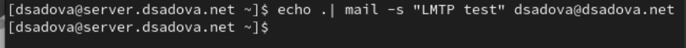
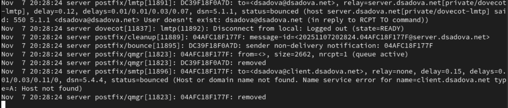

---
## Front matter
lang: ru-RU
title: Лабораторная работа № 7.
subtitle: Расширенные настройки межсетевого экрана
author:
  - Cадова Д. А.
institute:
  - Российский университет дружбы народов, Москва, Россия

## i18n babel
babel-lang: russian
babel-otherlangs: english
## Fonts
mainfont: PT Serif
romanfont: PT Serif
sansfont: PT Sans
monofont: PT Mono
mainfontoptions: Ligatures=TeX
romanfontoptions: Ligatures=TeX
sansfontoptions: Ligatures=TeX,Scale=MatchLowercase
monofontoptions: Scale=MatchLowercase,Scale=0.9

## Formatting pdf
toc: false
toc-title: Содержание
slide_level: 2
aspectratio: 169
section-titles: true
theme: metropolis
header-includes:
 - \metroset{progressbar=frametitle,sectionpage=progressbar,numbering=fraction}
 - '\makeatletter'
 - '\beamer@ignorenonframefalse'
 - '\makeatother'
---

# Информация

## Докладчик

:::::::::::::: {.columns align=center}
::: {.column width="70%"}

  * Садова Диана Алексеевна
  * студент бакалавриата
  * Российский университет дружбы народов
  * [113229118@pfur.ru]
  * <https://DianaSadova.github.io/ru/>

:::
::::::::::::::

# Вводная часть

## Актуальность

- Важно понимать настройки межсетевого экрана в Linux 
- Нужно уметь работать с настройкой Masquerading

## Цели и задачи

- Получить навыки настройки межсетевого экрана в Linux в части переадресации портов и настройки Masquerading.

## Материалы и методы

- Текст лабороторной работы № 7
- Интеранет для устранения ошибок 

## Содержание 

1. Настройте межсетевой экран виртуальной машины server для доступа к серверу по протоколу SSH не через 22-й порт, а через порт 2022.
2. Настройте Port Forwarding на виртуальной машине server.
3. Настройте маскарадинг на виртуальной машине server для организации доступа клиента к сети Интернет.
4. Напишите скрипт для Vagrant, фиксирующий действия по расширенной настройке межсетевого экрана. Соответствующим образом внести изменения в Vagrantfile.

## Создание пользовательской службы firewalld

1. Загрузите вашу операционную систему и перейдите в рабочий каталог с проектом.

2. Запустите виртуальную машину server:

##

3. На виртуальной машине server войдите под вашим пользователем и откройте терминал. Перейдите в режим суперпользователя

##

4. На основе существующего файла описания службы ssh создайте файл с собственным описанием:

##

5. Посмотрите содержимое файла службы:

##

В отчёте построчно прокомментируйте принцип синтаксиса файла описания службы.

В файле содержится несколько разделов с информацией

- service — корневой элемент XML-файла, который определяет службу. Все параметры службы (название, описание, порты) заключаются внутрь этого тега.

- short — краткое название службы, которое будет отображаться в интерфейсах управления firewalld.

- description - это коментарий в котором расписано о чем сам файл, для чего он нужен.

- port - определяет сетевой порт, связанный со службой.

##

6. Откройте файл описания службы на редактирование и замените порт 22 на новый порт (2022). В этом же файле скорректируйте описание службы для демонстрации, укажите, что это модифицированный файл службы.

##

7. Просмотрите список доступных FirewallD служб:

##

8. Перегрузите правила межсетевого экрана с сохранением информации о состоянии и вновь выведите на экран список служб, а также список активных служб:

##

Убедитесь, что созданная вами служба отображается в списке доступных для FirewallD служб, но не активирована.

##

9. Добавьте новую службу в FirewallD и выведите на экран список активных служб:

##

10. Если служба успешно добавлена в FirewallD, то перегрузите правила межсетевого экрана с сохранением информации о состоянии:

## Перенаправление портов

1. Организуйте на сервере переадресацию с порта 2022 на порт 22: 

##

2. На клиенте попробуйте получить доступ по SSH к серверу через порт 2022: 

## Настройка Port Forwarding и Masquerading

1. На сервере посмотрите, активирована ли в ядре системы возможность перенаправления IPv4-пакетов пакетов: 

##

2. Включите перенаправление IPv4-пакетов на сервере:

##

3. Включите маскарадинг на сервере:

##

4. На клиенте проверьте доступность выхода в Интернет.

## Внесение изменений в настройки внутреннего окружения виртуальной машины

1. На виртуальной машине server перейдите в каталог для внесения изменений в настройки внутреннего окружения /vagrant/provision/server/, создайте в нём каталог firewall, в который поместите в соответствующие подкаталоги конфигура- ционные файлы FirewallD:

##

2. В каталоге /vagrant/provision/server создайте файл firewall.sh.

Открыв его на редактирование, пропишите в нём следующий скрипт:

##

3. Для отработки созданного скрипта во время загрузки виртуальной машины server в конфигурационном файле Vagrantfile необходимо добавить в разделе конфигурации для сервера:

## Результаты

- Получили навыки настройки межсетевого экрана в Linux в части переадресации портов и настройки Masquerading. Добавили в Vagrantfile необходимый раздел для дальнейшей работы с машинами server и client.

