---
## Front matter
lang: ru-RU
title: Лабораторная работа № 10.
subtitle: Расширенные настройки SMTP-сервера
author:
  - Cадова Д. А.
institute:
  - Российский университет дружбы народов, Москва, Россия

## i18n babel
babel-lang: russian
babel-otherlangs: english
## Fonts
mainfont: PT Serif
romanfont: PT Serif
sansfont: PT Sans
monofont: PT Mono
mainfontoptions: Ligatures=TeX
romanfontoptions: Ligatures=TeX
sansfontoptions: Ligatures=TeX,Scale=MatchLowercase
monofontoptions: Scale=MatchLowercase,Scale=0.9

## Formatting pdf
toc: false
toc-title: Содержание
slide_level: 2
aspectratio: 169
section-titles: true
theme: metropolis
header-includes:
 - \metroset{progressbar=frametitle,sectionpage=progressbar,numbering=fraction}
 - '\makeatletter'
 - '\beamer@ignorenonframefalse'
 - '\makeatother'
---

# Информация

## Докладчик

:::::::::::::: {.columns align=center}
::: {.column width="70%"}

  * Садова Диана Алексеевна
  * студент бакалавриата
  * Российский университет дружбы народов
  * [113229118@pfur.ru]
  * <https://DianaSadova.github.io/ru/>

:::
::::::::::::::

# Вводная часть

## Актуальность

- Нужно понимаит как обезопасить сервер от не нужных сообщений и разобрать как работает аутентификации.

## Цели и задачи

- Приобретение практических навыков по конфигурированию SMTP-сервера в части настройки аутентификации.

## Материалы и методы

- Текст лабороторной работы № 10
- Интеранет для устранения ошибок 

## Содержание 

1. Настройте Dovecot для работы с LMTP 
2. Настройте аутентификацию посредством SASL на SMTP-сервере 
3. Настройте работу SMTP-сервера поверх TLS 
4. Скорректируйте скрипт для Vagrant, фиксирующий действия расширенной настройки SMTP-сервера во внутреннем окружении виртуальной машины server 

## Настройка LMTP в Dovecote

1. На виртуальной машине server войдите под вашим пользователем и откройте терминал. Перейдите в режим суперпользователя

##

2. В дополнительном терминале запустите мониторинг работы почтовой службы:

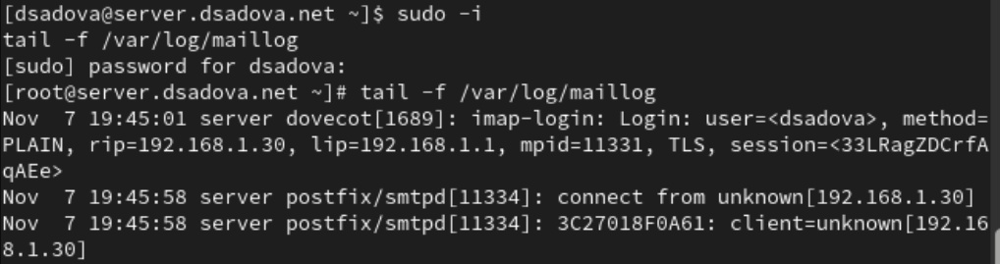

##

3. Добавьте в список протоколов, с которыми может работать Dovecot, протокол LMTP. Для этого в файле /etc/dovecot/dovecot.conf укажите

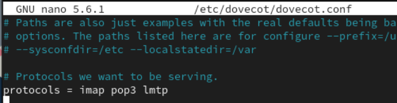

##

4. Настройте в Dovecot сервис lmtp для связи с Postfix. Для этого в файле /etc/dovecot/conf.d/10-master.conf замените определение сервиса lmtp на следующую запись:

##

5. Переопределите в Postfix с помощью postconf передачу сообщений не на прямую, а через заданный unix-сокет:

##

6. В файле /etc/dovecot/conf.d/10-auth.conf задайте формат имени пользователя для аутентификации в форме логина пользователя без указания домена:

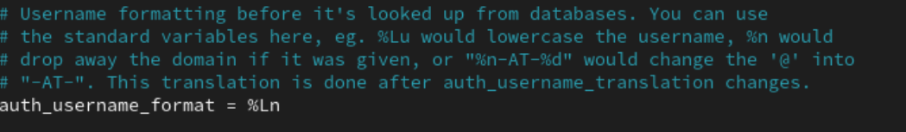

##

7. Перезапустите Postfix и Dovecot:

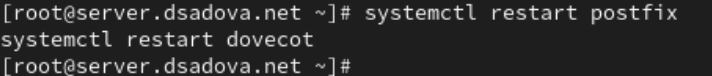

##

8. Из-под учётной записи своего пользователя отправьте письмо с клиента (вместо user укажите ваш логин):

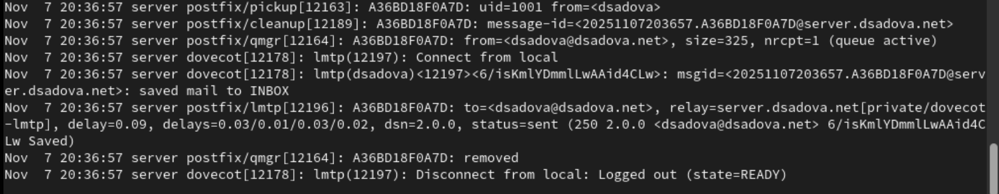

##

В отчёт включите свои пояснения по содержанию логов при мониторинге почтовой службы.

Приём письма Postfix

- postfix/pickup[12163]: Процесс Postfix забрал письмо из очереди.

- Идентификатор письма: A36BD18F0A7D.

- Отправитель: dsadova@dsadova.net.

- Размер письма: 325 байт.

##

Обработка письма

- postfix/cleanup[12189]: Сообщению присвоен message-id.

- postfix/qmgr[12164]: Письмо помещено в активную очередь для доставки.

##

Доставка через Dovecot LMTP

- dovecot[12178]: Установлено LMTP-соединение с Postfix.

- Письмо сохранено в папке INBOX для пользователя dsadova@dsadova.net.

- Статус: saved mail to INBOX.

##

Завершение обработки

- postfix/lmtp[12196]: Статус доставки: sent (успешно).

- postfix/qmgr[12164]: Письмо удалено из очереди.

- dovecot[12178]: LMTP-соединение закрыто.

##

9. На сервере просмотрите почтовый ящик пользователя:

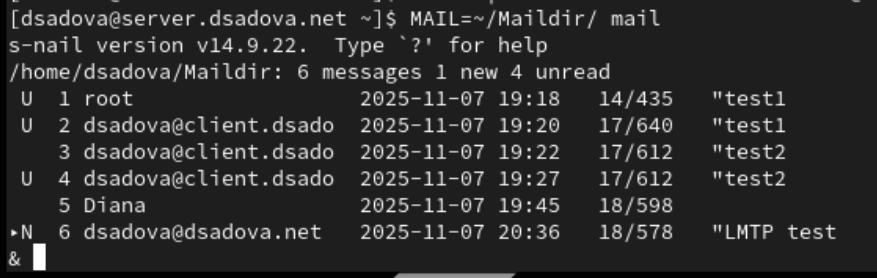

##

Убедитесь, что отправленное вами с клиента письмо доставлено в почтовый ящик на сервере.

Как видно на фотографии письмо доставлено в почтовый ящик. 

## Настройка SMTP-аутентификации

1. В файле /etc/dovecot/conf.d/10-master.conf определите службу аутентификации пользователей:

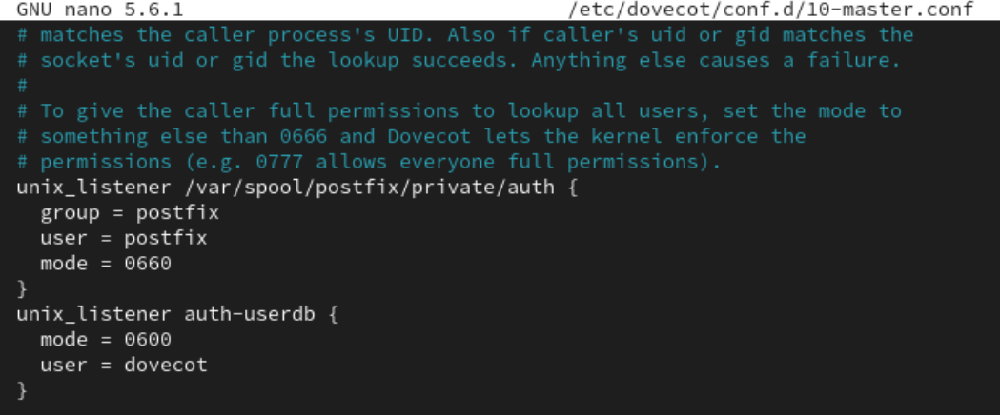

##

В отчёте поясните построчно эту запись.

Путь: /var/spool/postfix/private/auth - стандартный путь для SASL-аутентификации Postfix

Владелец: user=postfix, group=postfix - обеспечивает доступ только процессам Postfix

Права: 0660 (чтение/запись для владельца и группы) - строгая безопасность

Имя: auth-userdb - внутренний сокет Dovecot для запросов к базе пользователей

Права: 0600 (только для владельца) - максимальная защита

Владелец: user=dovecot - доступ только процессам Dovecot

##

2. Для Postfix задайте тип аутентификации SASL для smtpd и путь к соответствующему unix-сокету:

##

3. Настройте Postfix для приёма почты из Интернета только для обслуживаемых нашим сервером пользователей или для произвольных пользователей локальной машины (имеется в виду локальных пользователей сервера), обеспечивая тем
самым запрет на использование почтового сервера в качестве SMTP relay для спам-рассылок (порядок указания опций имеет значение):

##

В отчёте прокомментируйте указанные опции.

reject_unknown_recipient_domain - Отклонять письма, где домен получателя не существует.

permit_mynetworks - Разрешить ретрансляцию для клиентов из доверенных сетей (указанных в mynetworks).

reject_non_fqdn_recipient - Отклонять письма, где адрес получателя не является полным доменным именем (FQDN).

reject_unauth_destination - отклонять письма, где получатель не принадлежит доменам, обслуживаемым сервером (указанным в mydestination, relay_domains, virtual_alias_domains, virtual_mailbox_domains).

reject_unverified_recipient - Отклонять письма, где локальный получатель не существует (проверяет наличие пользователя в системе).

permit - Разрешить все остальные случаи, которые прошли предыдущие проверки.

##

4. В настройках Postfix ограничьте приём почты только локальным адресом SMTP-сервера сети:

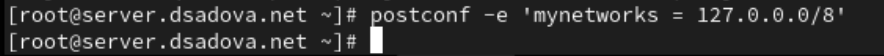

##

5. Для проверки работы аутентификации временно запустим SMTP-сервер (порт 25) с возможностью аутентификации. Для этого необходимо в файле /etc/postfix/master.cf заменить строку
smtp inet n - n - - smtpd
на строку
smtp inet n - n - - smtpd
-o smtpd_sasl_auth_enable=yes
-o smtpd_recipient_restrictions=reject_non_fqdn_recipient,reject_unknown_recipient_domain,permit_sasl_authenticated,reject

##

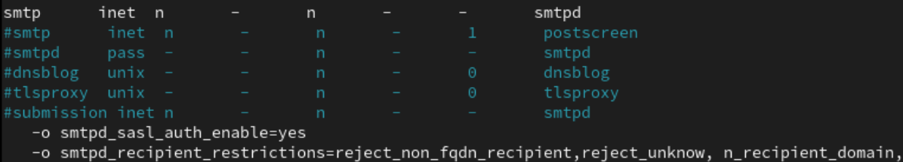

##

6. Перезапустите Postfix и Dovecot:

##

7. На клиенте установите telnet:

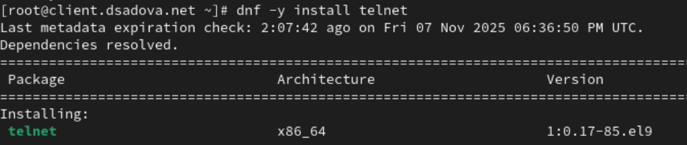

##

8. На клиенте получите строку для аутентификации, вместо username указав логин вашего пользователя, а вместо password указав пароль этого пользователя. Получим в качестве результата строку для аутентификации в формате base64:

##

9. Подключитесь на клиенте к SMTP-серверу посредством telnet (вместо user укажите ваш логин):

##

Протестируйте соединение, введя

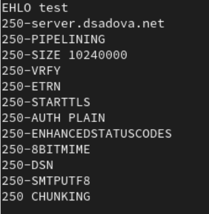

##

Проверьте авторизацию, задав:

##

Завершите сессию telnet на клиенте.

## Настройка SMTP over TLS

1. Настройте на сервере TLS, воспользовавшись временным сертификатом Dovecot. Предварительно скопируйте необходимые файлы сертификата и ключа из каталога /etc/pki/dovecot в каталог /etc/pki/tls/ в соответствующие подкаталоги (чтобы не было проблем с SELinux):

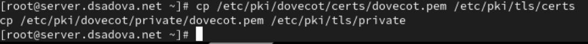

##

Сконфигурируйте Postfix, указав пути к сертификату и ключу, а также к каталогу для хранения TLS-сессий и уровень безопасности:

##

2. Для того чтобы запустить SMTP-сервер на 587-м порту, в файле /etc/postfix/master.cf замените строки

smtp inet n - n - - smtpd
-o smtpd_sasl_auth_enable=yes
-o smtpd_recipient_restrictions=reject_non_fqdn_recipient,reject_unknown_recipient_domain,permit_sasl_authenticated,reject

на следующую запись:

smtp inet n - n - - smtpd

и добавьте следующие строки:

submission inet n - n - - smtpd
-o smtpd_tls_security_level=encrypt
-o smtpd_sasl_auth_enable=yes
-o smtpd_recipient_restrictions=reject_non_fqdn_recipient,reject_unknown_recipient_domain,permit_sasl_authenticated,reject

##

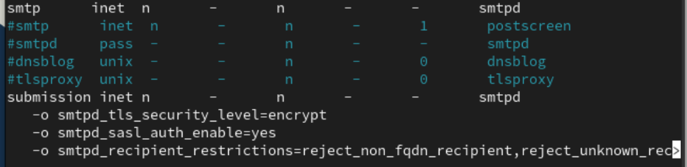

##

3. Настройте межсетевой экран, разрешив работать службе smtp-submission.

4. Перезапустите Postfix.

##

5. На клиенте подключитесь к SMTP-серверу через 587-й порт посредством openssl (вместо user используйте свой логин):

##

Протестируйте подключение по telnet:

##

Проверьте аутентификацию:

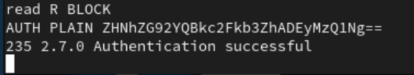

##

6. Проверьте корректность отправки почтовых сообщений с клиента посредством почтового клиента Evolution, предварительно скорректировав настройки учётной записи, а именно для SMTP-сервера укажите порт 587, STARTTLS и обычный пароль.

##

## Внесение изменений в настройки внутреннего окружения виртуальной машины

1. На виртуальной машине server перейдите в каталог для внесения изменений в настройки внутреннего окружения /vagrant/provision/server/. В соответствующие подкаталоги поместите конфигурационные файлы Dovecot и Postfix:

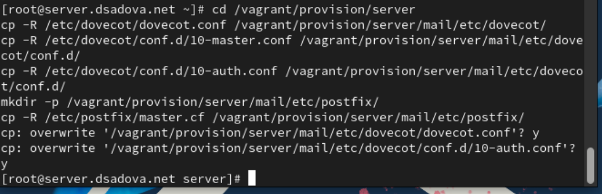

##

2. Внесите соответствующие изменения по расширенной конфигурации SMTP-сервера в файл /vagrant/provision/server/mail.sh:

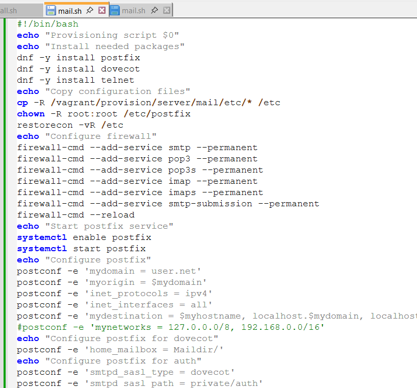

##

3. Внесите изменения в файл /vagrant/provision/client/mail.sh, добавив установку telnet.

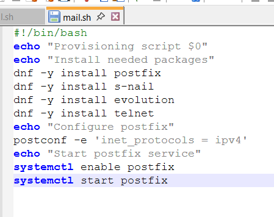

## Результаты

- Приобрели практические навыки по конфигурированию SMTP-сервера в части настройки аутентификации. Дополнительно протестировали работу почтовой службы.

