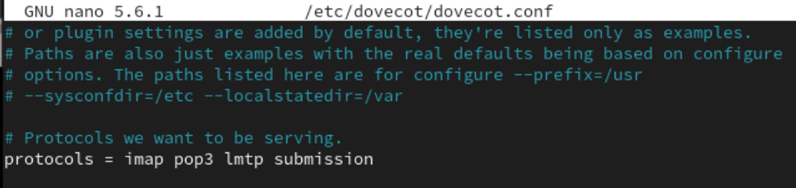
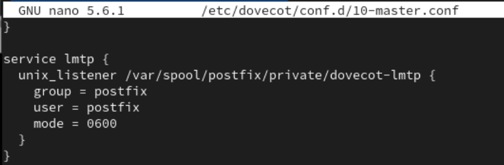
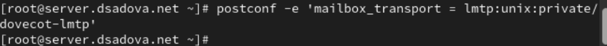
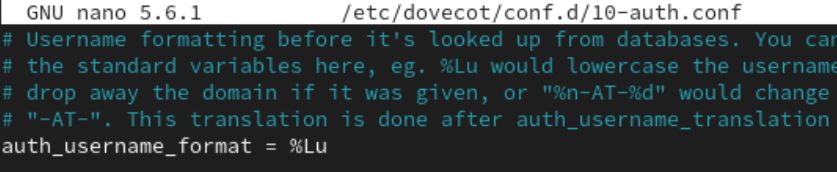
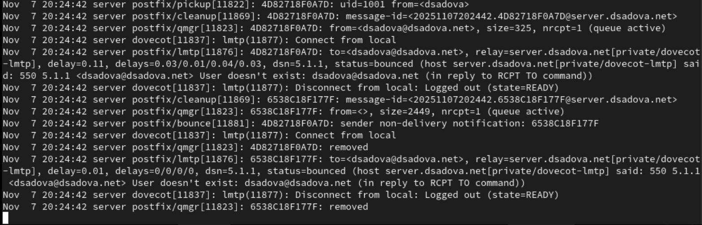
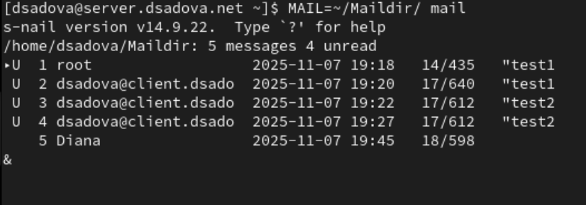
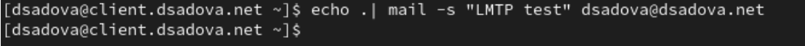
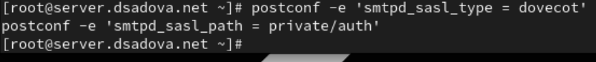
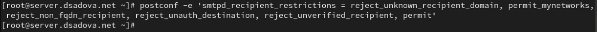
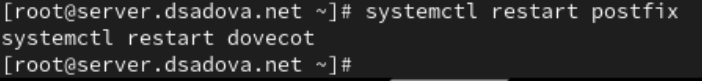

---
## Front matter
title: "Лабораторная работа № 5."
subtitle: "Расширенная настройка HTTP-сервера Apache"
author: "Диана Алексеевна Садова"

## Generic otions
lang: ru-RU
toc-title: "Содержание"

## Bibliography
bibliography: bib/cite.bib
csl: pandoc/csl/gost-r-7-0-5-2008-numeric.csl

## Pdf output format
toc: true # Table of contents
toc-depth: 2
lof: true # List of figures
lot: true # List of tables
fontsize: 12pt
linestretch: 1.5
papersize: a4
documentclass: scrreprt
## I18n polyglossia
polyglossia-lang:
  name: russian
  options:
	- spelling=modern
	- babelshorthands=true
polyglossia-otherlangs:
  name: english
## I18n babel
babel-lang: russian
babel-otherlangs: english
## Fonts
mainfont: PT Serif
romanfont: PT Serif
sansfont: PT Sans
monofont: PT Mono
mainfontoptions: Ligatures=TeX
romanfontoptions: Ligatures=TeX
sansfontoptions: Ligatures=TeX,Scale=MatchLowercase
monofontoptions: Scale=MatchLowercase,Scale=0.9
## Biblatex
biblatex: true
biblio-style: "gost-numeric"
biblatexoptions:
  - parentracker=true
  - backend=biber
  - hyperref=auto
  - language=auto
  - autolang=other*
  - citestyle=gost-numeric
## Pandoc-crossref LaTeX customization
figureTitle: "Рис."
tableTitle: "Таблица"
listingTitle: "Листинг"
lofTitle: "Список иллюстраций"
lotTitle: "Список таблиц"
lolTitle: "Листинги"
## Misc options
indent: true
header-includes:
  - \usepackage{indentfirst}
  - \usepackage{float} # keep figures where there are in the text
  - \floatplacement{figure}{H} # keep figures where there are in the text
---

# Цель работы

Приобретение практических навыков по расширенному конфигурированию HTTP-сервера Apache в части безопасности и возможности использования PHP.

# Задание

1. Сгенерируйте криптографический ключ и самоподписанный сертификат безопасности для возможности перехода веб-сервера от работы через протокол HTTP к работе через протокол HTTPS 
2. Настройте веб-сервер для работы с PHP
3. Напишите (или скорректируйте) скрипт для Vagrant, фиксирующий действия по расширенной настройке HTTP-сервера во внутреннем окружении виртуальной машины server

## Последовательность выполнения работы

## Конфигурирование HTTP-сервера для работы через протокол HTTPS

1. Загрузите вашу операционную систему и перейдите в рабочий каталог с проектом. 

2. Запустите виртуальную машину server:

##
 
3. На виртуальной машине server войдите под вашим пользователем и откройте терминал. Перейдите в режим суперпользователя

##

4. В каталоге /etc/ssl создайте каталог private:

##

Сгенерируйте ключ и сертификат, используя следующую команду:

##

В этой строке:

- req -x509 означает, что используется запрос подписи сертификата x509 (CSR);

- параметр -nodes указывает OpenSSL, что нужно пропустить шифрование сертификата SSL с использованием парольной фразы, т.е. позволить Apache читать файл без какого-либо вмешательства пользователя (без ввода пароля при попытке доступа к странице, в частности);

- параметр -newkey rsa: 2048 указывает, что одновременно создаются новый ключ и новый сертификат, причём используется 2048-битный ключ RSA;

- параметр -keyout указывает, где хранить сгенерированный файл закрытого ключа при создании;

- параметр -out указывает, где разместить созданный сертификат SSL.

##

Далее требуется заполнить сертификат:

- в строке кода страны укажите RU;
- в строке названия страны укажите Russia;
- в строке названия города укажите Moscow;
- в строке названия организации укажите свой логин;
- в строке названия подразделения укажите свой логин;
- в строке названия хоста должно быть указано доменное имя вашего веб-сервера user.net (вместо user укажите свой логин);
- в строке e-mail адреса должен быть указан user@user.net (вместо user укажите свой логин).

##

##

Сгенерированные ключ и сертификат появятся в соответствующем каталоге /etc/ssl/private. Скопируйте сертификат в каталог /etc/ssl/certs (вместо user укажите свой логин):

##

5. Для перехода веб-сервера www.user.net на функционирование через протокол HTTPS требуется изменить его конфигурационный файл. Перейдите в каталог с конфигурационными файлами:

##

Откройте на редактирование файл /etc/httpd/conf.d/www.user.net.conf и замените его содержимое на следующее (вместо user укажите свой логин):

##

В отчёте поясните построчно содержание этого файла.

Информация для хостов: 80 и 443

Для 80:

- Почта сервер админа. Это адрес, который может отображаться пользователю при возникновении ошибок.

- Путь к папке с документацией. Именно из этой папки Apache будет брать файлы (HTML, CSS, изображения) для отображения пользователю.

- Основное доменное имя этого виртуального хоста.

##

- Псевдонимы домена. В данном случае продублировано основное имя, но здесь можно указать другие домены, которые должны вести на этот же сайт.

- Путь к файлу для хранения ошибок. 

- Путь к файлу для храненяи логов доступа. 

- Включает механизм перезаписи URL.

- Правило перенаправления.

##

Для 443:

- Включает SSL/TLS движок для этого виртуального хоста, активируя шифрование.

- Почта сервер админа. Это адрес, который может отображаться пользователю при возникновении ошибок.

- Путь к папке с документацией. Именно из этой папки Apache будет брать файлы (HTML, CSS, изображения) для отображения пользователю

- Основное доменное имя этого виртуального хоста.

##

- Псевдонимы домена. В данном случае продублировано основное имя, но здесь можно указать другие домены, которые должны вести на этот же сайт.

- Путь к файлу для хранения ошибок 

- Путь к файлу для храненяи логов доступа. 

- Путь к SSL-сертификату. 

- Путь к закрытому ключу SSL-сертификата. 

IfModule mod_ssl.c - Проверяет, загружен ли модуль mod_ssl 

##

6. Внесите изменения в настройки межсетевого экрана на сервере, разрешив работу с https:

##

7. Перезапустите веб-сервер:

##

8. На виртуальной машине client в строке браузера введите название веб-сервера www.user.net (вместо user укажите свой логин) и убедитесь, что произойдёт автоматическое переключение на работу по протоколу HTTPS. На открывшейся странице с сообщением о незащищённости соединения нажмите кнопку «Дополнительно», затем добавьте адрес вашего сервера в постоянные исключения. Затем просмотрите содержание сертификата (нажмите на значок с замком в адресной строке и кнопку «Подробнее»).

## Конфигурирование HTTP-сервера для работы с PHP

1. Установите пакеты для работы с PHP:

##

2. В каталоге /var/www/html/www.user.net (вместо user укажите свой логин) замените файл index.html на index.php следующего содержания:

##

3. Скорректируйте права доступа в каталог с веб-контентом:

##

4. Восстановите контекст безопасности в SELinux:

##

5. Перезапустите HTTP-сервер:

##

6. На виртуальной машине client в строке браузера введите название веб-сервера www.user.net (вместо user укажите свой логин) и убедитесь, что будет выведена страница с информацией об используемой на веб-сервере версии PHP.

### Внесение изменений в настройки внутреннего окружения виртуальной машины

1. На виртуальной машине server перейдите в каталог для внесения изменений в настройки внутреннего окружения /vagrant/provision/server/http и в соответ- ствующие каталоги скопируйте конфигурационные файлы:

##

2. В имеющийся скрипт /vagrant/provision/server/http.sh внесите изменения, добавив установку PHP и настройку межсетевого экрана, разрешающую работать с https.

# Выводы

Приобрели практические навыки по расширенному конфигурированию HTTP-сервера Apache в части безопасности и усвояли все возможности использования PHP.

# Список литературы{.unnumbered}

::: {#refs}
:::
