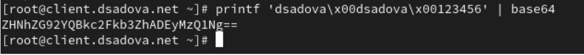
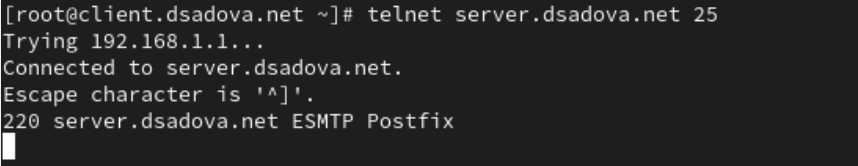
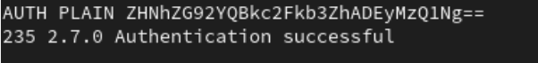
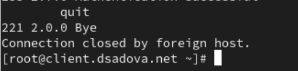
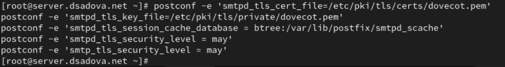
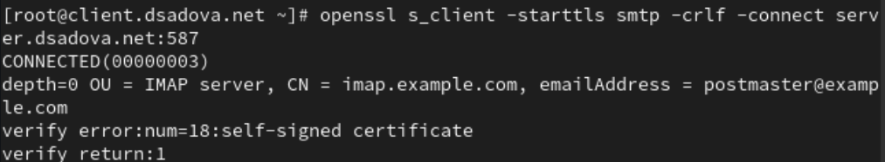
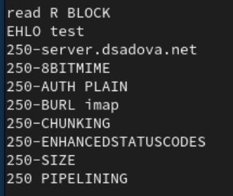
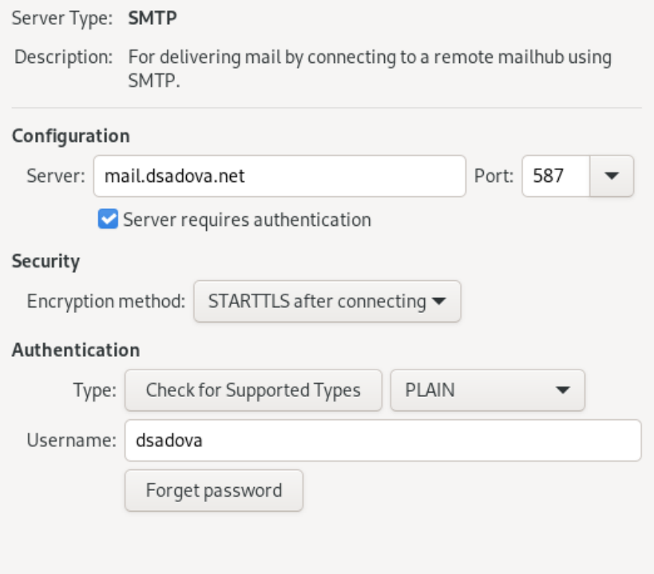
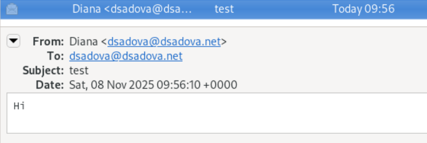

---
## Front matter
title: "Лабораторная работа № 10."
subtitle: "Расширенные настройки SMTP-сервера"
author: "Диана Алексеевна Садова"

## Generic otions
lang: ru-RU
toc-title: "Содержание"

## Bibliography
bibliography: bib/cite.bib
csl: pandoc/csl/gost-r-7-0-5-2008-numeric.csl

## Pdf output format
toc: true # Table of contents
toc-depth: 2
lof: true # List of figures
lot: true # List of tables
fontsize: 12pt
linestretch: 1.5
papersize: a4
documentclass: scrreprt
## I18n polyglossia
polyglossia-lang:
  name: russian
  options:
	- spelling=modern
	- babelshorthands=true
polyglossia-otherlangs:
  name: english
## I18n babel
babel-lang: russian
babel-otherlangs: english
## Fonts
mainfont: PT Serif
romanfont: PT Serif
sansfont: PT Sans
monofont: PT Mono
mainfontoptions: Ligatures=TeX
romanfontoptions: Ligatures=TeX
sansfontoptions: Ligatures=TeX,Scale=MatchLowercase
monofontoptions: Scale=MatchLowercase,Scale=0.9
## Biblatex
biblatex: true
biblio-style: "gost-numeric"
biblatexoptions:
  - parentracker=true
  - backend=biber
  - hyperref=auto
  - language=auto
  - autolang=other*
  - citestyle=gost-numeric
## Pandoc-crossref LaTeX customization
figureTitle: "Рис."
tableTitle: "Таблица"
listingTitle: "Листинг"
lofTitle: "Список иллюстраций"
lotTitle: "Список таблиц"
lolTitle: "Листинги"
## Misc options
indent: true
header-includes:
  - \usepackage{indentfirst}
  - \usepackage{float} # keep figures where there are in the text
  - \floatplacement{figure}{H} # keep figures where there are in the text
---

# Цель работы

Приобретение практических навыков по конфигурированию SMTP-сервера в части настройки аутентификации.

# Задание

1. Настройте Dovecot для работы с LMTP 
2. Настройте аутентификацию посредством SASL на SMTP-сервере 
3. Настройте работу SMTP-сервера поверх TLS 
4. Скорректируйте скрипт для Vagrant, фиксирующий действия расширенной настройки SMTP-сервера во внутреннем окружении виртуальной машины server 

## Последовательность выполнения работы

### Настройка LMTP в Dovecote

1. На виртуальной машине server войдите под вашим пользователем и откройте терминал. Перейдите в режим суперпользователя

2. В дополнительном терминале запустите мониторинг работы почтовой службы:(рис. [-@fig:001])

{#fig:001 width=90%}

3. Добавьте в список протоколов, с которыми может работать Dovecot, протокол LMTP. Для этого в файле /etc/dovecot/dovecot.conf укажите(рис. [-@fig:002])

{#fig:002 width=90%}

4. Настройте в Dovecot сервис lmtp для связи с Postfix. Для этого в файле /etc/dovecot/conf.d/10-master.conf замените определение сервиса lmtp на следующую запись:(рис. [-@fig:003])

{#fig:003 width=90%}

Эта запись определяет расположение файла с описанием прослушиваемого unixсокета, а также задаёт права доступа к нему и определяет принадлежность к группе и пользователю postfix.

5. Переопределите в Postfix с помощью postconf передачу сообщений не на прямую, а через заданный unix-сокет:(рис. [-@fig:004])

{#fig:004 width=90%}

6. В файле /etc/dovecot/conf.d/10-auth.conf задайте формат имени пользователя для аутентификации в форме логина пользователя без указания домена:(рис. [-@fig:005])

{#fig:005 width=90%}

7. Перезапустите Postfix и Dovecot:(рис. [-@fig:006])

{#fig:006 width=90%}

8. Из-под учётной записи своего пользователя отправьте письмо с клиента (вместо user укажите ваш логин):(рис. [-@fig:007])

{#fig:007 width=90%}

В отчёт включите свои пояснения по содержанию логов при мониторинге почтовой службы.

Приём письма Postfix

- postfix/pickup[12163]: Процесс Postfix забрал письмо из очереди.

- Идентификатор письма: A36BD18F0A7D.

- Отправитель: dsadova@dsadova.net.

- Размер письма: 325 байт.

Обработка письма

- postfix/cleanup[12189]: Сообщению присвоен message-id.

- postfix/qmgr[12164]: Письмо помещено в активную очередь для доставки.

Доставка через Dovecot LMTP

- dovecot[12178]: Установлено LMTP-соединение с Postfix.

- Письмо сохранено в папке INBOX для пользователя dsadova@dsadova.net.

- Статус: saved mail to INBOX.

Завершение обработки

- postfix/lmtp[12196]: Статус доставки: sent (успешно).

- postfix/qmgr[12164]: Письмо удалено из очереди.

- dovecot[12178]: LMTP-соединение закрыто.

9. На сервере просмотрите почтовый ящик пользователя:(рис. [-@fig:008])

{#fig:008 width=90%}

Убедитесь, что отправленное вами с клиента письмо доставлено в почтовый ящик на сервере.

Как видно на фотографии письмо доставлено в почтовый ящик. 

### Настройка SMTP-аутентификации
1. В файле /etc/dovecot/conf.d/10-master.conf определите службу аутентификации пользователей:(рис. [-@fig:009])

{#fig:009 width=90%}

В отчёте поясните построчно эту запись.

Путь: /var/spool/postfix/private/auth - стандартный путь для SASL-аутентификации Postfix

Владелец: user=postfix, group=postfix - обеспечивает доступ только процессам Postfix

Права: 0660 (чтение/запись для владельца и группы) - строгая безопасность

Имя: auth-userdb - внутренний сокет Dovecot для запросов к базе пользователей

Права: 0600 (только для владельца) - максимальная защита

Владелец: user=dovecot - доступ только процессам Dovecot

2. Для Postfix задайте тип аутентификации SASL для smtpd и путь к соответствующему unix-сокету:(рис. [-@fig:010])

{#fig:010 width=90%}

3. Настройте Postfix для приёма почты из Интернета только для обслуживаемых нашим сервером пользователей или для произвольных пользователей локальной машины (имеется в виду локальных пользователей сервера), обеспечивая тем
самым запрет на использование почтового сервера в качестве SMTP relay для спам-рассылок (порядок указания опций имеет значение):(рис. [-@fig:011])

{#fig:011 width=90%}

В отчёте прокомментируйте указанные опции.

reject_unknown_recipient_domain - Отклонять письма, где домен получателя не существует.

permit_mynetworks - Разрешить ретрансляцию для клиентов из доверенных сетей (указанных в mynetworks).

reject_non_fqdn_recipient - Отклонять письма, где адрес получателя не является полным доменным именем (FQDN).

reject_unauth_destination - отклонять письма, где получатель не принадлежит доменам, обслуживаемым сервером (указанным в mydestination, relay_domains, virtual_alias_domains, virtual_mailbox_domains).

reject_unverified_recipient - Отклонять письма, где локальный получатель не существует (проверяет наличие пользователя в системе).

permit - Разрешить все остальные случаи, которые прошли предыдущие проверки.

4. В настройках Postfix ограничьте приём почты только локальным адресом SMTP-сервера сети:(рис. [-@fig:012])

{#fig:012 width=90%}

5. Для проверки работы аутентификации временно запустим SMTP-сервер (порт 25) с возможностью аутентификации. Для этого необходимо в файле /etc/postfix/master.cf заменить строку
smtp inet n - n - - smtpd
на строку
smtp inet n - n - - smtpd
-o smtpd_sasl_auth_enable=yes
-o smtpd_recipient_restrictions=reject_non_fqdn_recipient,reject_unknown_recipient_domain,permit_sasl_authenticated,reject(рис. [-@fig:013])

{#fig:013 width=90%}

6. Перезапустите Postfix и Dovecot:(рис. [-@fig:014])

{#fig:014 width=90%}

7. На клиенте установите telnet:(рис. [-@fig:015])

{#fig:015 width=90%}

8. На клиенте получите строку для аутентификации, вместо username указав логин вашего пользователя, а вместо password указав пароль этого пользователя. Получим в качестве результата строку для аутентификации в формате base64:(рис. [-@fig:016])

{#fig:016 width=90%}

9. Подключитесь на клиенте к SMTP-серверу посредством telnet (вместо user укажите ваш логин):(рис. [-@fig:017])

{#fig:017 width=90%}

Протестируйте соединение, введя(рис. [-@fig:018])

{#fig:018 width=90%}

Проверьте авторизацию, задав:(рис. [-@fig:019])

{#fig:019 width=90%}

Завершите сессию telnet на клиенте.(рис. [-@fig:020])

{#fig:020 width=90%}

### Настройка SMTP over TLS

1. Настройте на сервере TLS, воспользовавшись временным сертификатом Dovecot. Предварительно скопируйте необходимые файлы сертификата и ключа из каталога /etc/pki/dovecot в каталог /etc/pki/tls/ в соответствующие подкаталоги (чтобы не было проблем с SELinux):(рис. [-@fig:021])

{#fig:021 width=90%}

Сконфигурируйте Postfix, указав пути к сертификату и ключу, а также к каталогу для хранения TLS-сессий и уровень безопасности:(рис. [-@fig:022])

{#fig:022 width=90%}

2. Для того чтобы запустить SMTP-сервер на 587-м порту, в файле /etc/postfix/master.cf замените строки

smtp inet n - n - - smtpd
-o smtpd_sasl_auth_enable=yes
-o smtpd_recipient_restrictions=reject_non_fqdn_recipient,reject_unknown_recipient_domain,permit_sasl_authenticated,reject

на следующую запись:

smtp inet n - n - - smtpd

и добавьте следующие строки:

submission inet n - n - - smtpd
-o smtpd_tls_security_level=encrypt
-o smtpd_sasl_auth_enable=yes
-o smtpd_recipient_restrictions=reject_non_fqdn_recipient,reject_unknown_recipient_domain,permit_sasl_authenticated,reject(рис. [-@fig:023])

{#fig:023 width=90%}

3. Настройте межсетевой экран, разрешив работать службе smtp-submission.

4. Перезапустите Postfix.(рис. [-@fig:024])

{#fig:024 width=90%}

5. На клиенте подключитесь к SMTP-серверу через 587-й порт посредством openssl (вместо user используйте свой логин):(рис. [-@fig:025])

{#fig:025 width=90%}

Протестируйте подключение по telnet:(рис. [-@fig:100])

{#fig:100 width=90%}

Проверьте аутентификацию:(рис. [-@fig:120])

{#fig:120 width=90%}

6. Проверьте корректность отправки почтовых сообщений с клиента посредством почтового клиента Evolution, предварительно скорректировав настройки учётной записи, а именно для SMTP-сервера укажите порт 587, STARTTLS и обычный пароль.(рис. [-@fig:026]),(рис. [-@fig:027])

{#fig:026 width=90%}

{#fig:027 width=90%}

### Внесение изменений в настройки внутреннего окружения виртуальной машины

1. На виртуальной машине server перейдите в каталог для внесения изменений в настройки внутреннего окружения /vagrant/provision/server/. В соответствующие подкаталоги поместите конфигурационные файлы Dovecot и Postfix:(рис. [-@fig:028])

{#fig:028 width=90%}

2. Внесите соответствующие изменения по расширенной конфигурации SMTP-сервера в файл /vagrant/provision/server/mail.sh:
(рис. [-@fig:029])

{#fig:029 width=90%}

3. Внесите изменения в файл /vagrant/provision/client/mail.sh, добавив установку telnet.(рис. [-@fig:030])

{#fig:030 width=90%}

# Выводы

Приобрели практические навыки по конфигурированию SMTP-сервера в части настройки аутентификации. Дополнительно протестировали работу почтовой службы.

# Список литературы{.unnumbered}

::: {#refs}
:::
