---
## Front matter
lang: ru-RU
title: Лабораторная работа № 11.
subtitle: Настройка безопасного удалённого доступа по протоколу SSH
author:
  - Cадова Д. А.
institute:
  - Российский университет дружбы народов, Москва, Россия

## i18n babel
babel-lang: russian
babel-otherlangs: english
## Fonts
mainfont: PT Serif
romanfont: PT Serif
sansfont: PT Sans
monofont: PT Mono
mainfontoptions: Ligatures=TeX
romanfontoptions: Ligatures=TeX
sansfontoptions: Ligatures=TeX,Scale=MatchLowercase
monofontoptions: Scale=MatchLowercase,Scale=0.9

## Formatting pdf
toc: false
toc-title: Содержание
slide_level: 2
aspectratio: 169
section-titles: true
theme: metropolis
header-includes:
 - \metroset{progressbar=frametitle,sectionpage=progressbar,numbering=fraction}
 - '\makeatletter'
 - '\beamer@ignorenonframefalse'
 - '\makeatother'
---

# Информация

## Докладчик

:::::::::::::: {.columns align=center}
::: {.column width="70%"}

  * Садова Диана Алексеевна
  * студент бакалавриата
  * Российский университет дружбы народов
  * [113229118@pfur.ru]
  * <https://DianaSadova.github.io/ru/>

:::
::::::::::::::

# Вводная часть

## Актуальность

- Важно обезопасить сервер от возможности зайти на него с устройства, у которого нет разрешения на вход. 

## Цели и задачи

- Приобретение практических навыков по настройке удалённого доступа к серверу с помощью SSH.

## Материалы и методы

- Текст лабороторной работы № 11
- Интеранет для устранения ошибок 

## Содержание 

1. Настройте запрет удалённого доступа на сервер по SSH для пользователя root.
2. Настройте разрешение удалённого доступа к серверу по SSH только для пользователей группы vagrant и вашего пользователя. 
3. Настройте удалённый доступ к серверу по SSH через порт 2022.
4. Настройте удалённый доступ к серверу по SSH по ключу.
5. Организуйте SSH-туннель с клиента на сервер, перенаправив локальное соединение с TCP-порта 80 на порт 8080.
6. Используя удалённое SSH-соединение, выполните с клиента несколько команд на сервере.
7. Используя удалённое SSH-соединение, запустите с клиента графическое приложение на сервере.
8. Напишите скрипт для Vagrant, фиксирующий действия по настройке SSH-сервера во внутреннем окружении виртуальной машины server. Соответствующим образом внесите изменения в Vagrantfile.

## Запрет удалённого доступа по SSH для пользователя root

1. . На сервере задайте пароль для пользователя root, если этого не было сделано ранее:

##

2. На сервере в дополнительном терминале запустите мониторинг системных событий:

##

3. С клиента попытайтесь получить доступ к серверу посредством SSH-соединения через пользователя root:

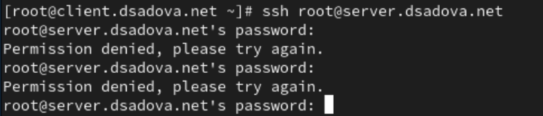

##

В отчёте поясните, что при этом происходит.

Нас не пускает на сервер под записью root и это правильно. Параметр PasswordAuthentication в файле конфигурации SSH-демона (/etc/ssh/sshd_config) на сервере установлен в no. Система безопасности работает коректно. 

##

4. На сервере откройте файл /etc/ssh/sshd_config конфигурации sshd для редактирования и запретите вход на сервер пользователю root, установив:

##

5. После сохранения изменений в файле конфигурации перезапустите sshd:

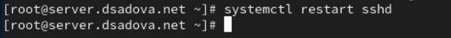

##

6. Повторите попытку получения доступа с клиента к серверу посредством SSH-соединения через пользователя root:

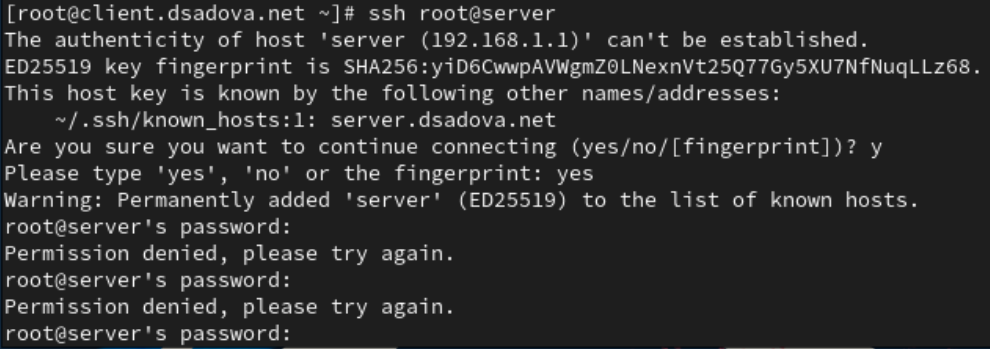

##

В отчёте поясните, что при этом происходит.

Нас не пускает. Сервер SSH на хосте server сконфигурирован таким образом, что прямой вход под пользователем root с использованием пароля запрещен. Система безопасности работает коректно. 

## Ограничение списка пользователей для удалённого доступа по SSH

1. С клиента попытайтесь получить доступ к серверу посредством SSH-соединения через пользователя:

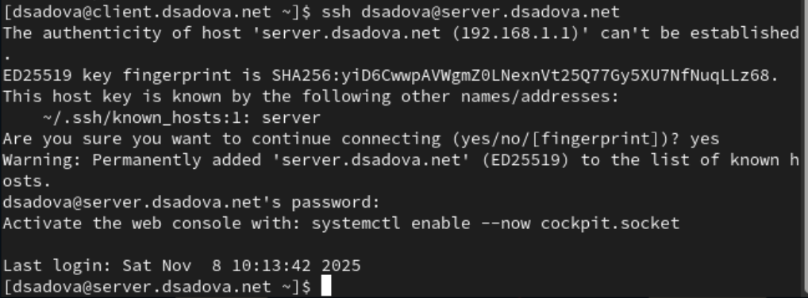

##

В отчёте поясните, что при этом происходит.

С клиента мы смогли попасть на сервер. 

##

2. На сервере откройте файл /etc/ssh/sshd_config конфигурации sshd на редактирование и добавьте строку

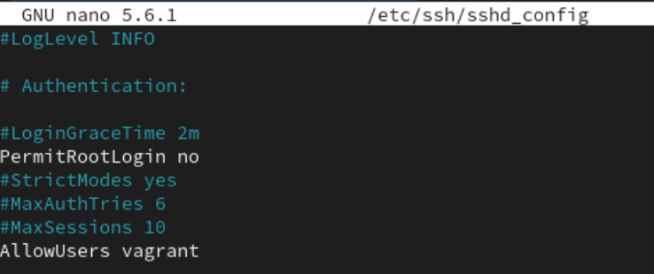

##

3. После сохранения изменений в файле конфигурации перезапустите sshd:

##

4. Повторите попытку получения доступа с клиента к серверу посредством SSH-соединения через пользователя:

##

В отчёте поясните, что при этом происходит.

Нас не пускат к серверу, так как мы указали, что только vagrant может заходить на сервер. AllowUsers vagrant явно разрешает подключение по SSH только для пользователя vagrant. Все остальные пользователи, включая dsadova и root, автоматически блокируются.

##

5. В файле /etc/ssh/sshd_config конфигурации sshd внесите следующее изменение:

##

6. После сохранения изменений в файле конфигурации перезапустите sshd и вновь попытайтесь получить доступ с клиента к серверу посредством SSH-соединения через пользователя user.

##
В отчёте поясните, что при этом происходит. 

Мы получили доступ с клиента. AllowUsers vagrant user явно разрешает подключение по SSH для двух пользователей: vagrant и dsadova. Теперь пользователь dsadova находится в белом списке разрешённых пользователей.

Сервер принимает запрос на подключение и проверяет, что пользователь user есть в списке разрешённых -> Система переходит к этапу аутентификации - запрашивает пароль или SSH-ключ -> Если аутентификация проходит успешно, подключение устанавливается

## Настройка дополнительных портов для удалённого доступа по SSH

1. На сервере в файле конфигурации sshd /etc/ssh/sshd_config найдите строку Port и ниже этой строки добавьте:

Эта запись сообщает процессу sshd о необходимости организации соединения через два разных порта, что даёт гарантию возможности открыть сеансы SSH, даже если была сделана ошибка в конфигурации.

##

2. После сохранения изменений в файле конфигурации перезапустите sshd:

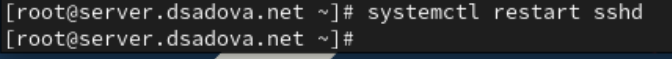

##

3. Посмотрите расширенный статус работы sshd. Система должна сообщить вам об отказе в работе sshd через порт 2022. Дополнительно посмотрите сообщения в терминале с мониторингом системных событий.

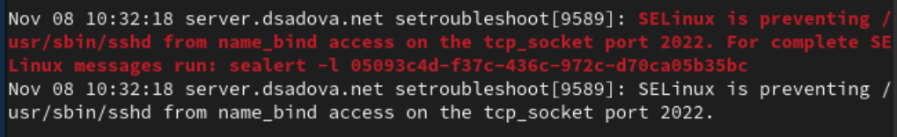

##

В отчёте поясните суть системных сообщений.

У нас происходит блокировка SELinux и система безопасности SELinux предотвращает запуск SSH-демона (/usr/sbin/sshd) на порту 2022. SELinux запрещает процессу sshd выполнять операцию name_bind (привязку к порту) для TCP-сокета на порту 2022.

##

4. Исправьте на сервере метки SELinux к порту 2022:

##

5. В настройках межсетевого экрана откройте порт 2022 протокола TCP:

##

6. Вновь перезапустите sshd и посмотрите расширенный статус его работы. Статус должен показать, что процесс sshd теперь прослушивает два порта.

##

7. С клиента попытайтесь получить доступ к серверу посредством SSH-соединения через пользователя:

##

После открытия оболочки пользователя введите sudo -i для получения доступа root. Отлогиньтесь от root и вашего пользователя на сервере, введя дважды logout или используя дважды комбинацию клавиш Ctrl + d .

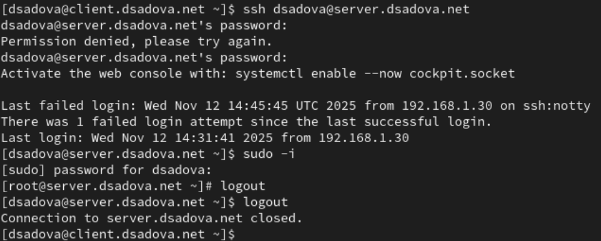

##

8. Повторите попытку получения доступа с клиента к серверу посредством SSH-соединения через пользователя user, указав порт 2022:

##

После открытия оболочки пользователя введите sudo -i для получения доступа root. Отлогиньтесь от root и вашего пользователя на сервере, введя дважды logout или используя дважды комбинацию клавиш Ctrl + d .

## Настройка удалённого доступа по SSH по ключу

В этом упражнении вы создаёте пару из открытого и закрытого ключей для входа на сервер.

1. На сервере в конфигурационном файле /etc/ssh/sshd_config задайте параметр, разрешающий аутентификацию по ключу:

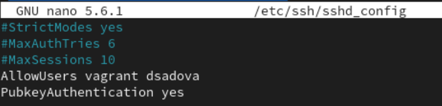

##

2. После сохранения изменений в файле конфигурации перезапустите sshd.

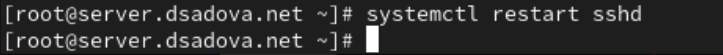

##

3. На клиенте сформируйте SSH-ключ, введя в терминале под пользователем:

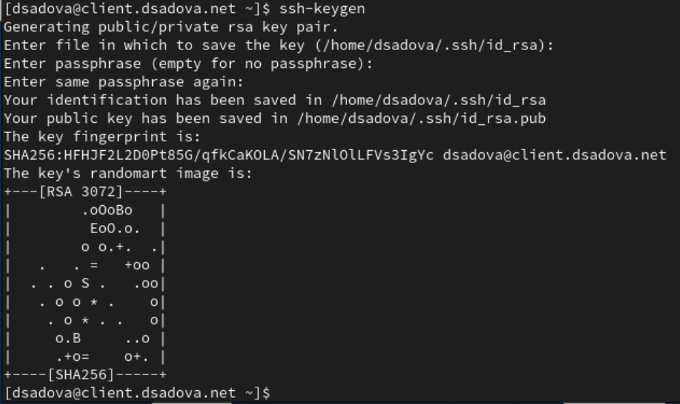

##

Когда вас спросят, хотите ли вы использовать кодовую фразу, нажмите Enter , что-бы использовать установку без пароля. При запросе имени файла, в котором будет храниться закрытый ключ, примите предлагаемое по умолчанию имя файла (~/.ssh/id_rsa). Когда вас попросят ввести кодовую фразу, нажмите Enter дважды.

4. Закрытый ключ теперь будет записан в файл ~/.ssh/id_rsa, а открытый ключ записывается в файл ~/.ssh/id_rsa.pub.

##
5. Скопируйте открытый ключ на сервер, введя на клиенте:

##

6. Попробуйте получить доступ с клиента к серверу посредством SSH-соединения:

##

Теперь вы должны пройти аутентификацию без ввода пароля для учётной записи удалённого пользователя. Отлогиньтесь с сервера, используя комбинацию клавиш Ctrl + d .

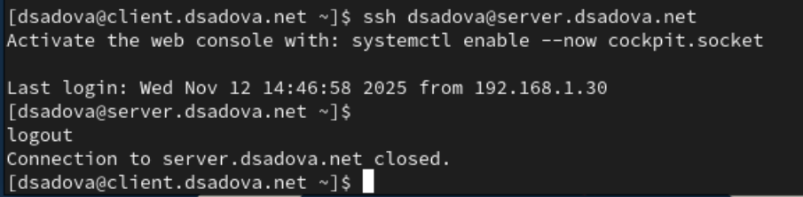

## Организация туннелей SSH, перенаправление TCP-портов

1. На клиенте посмотрите, запущены ли какие-то службы с протоколом TCP:

##

2. Перенаправьте порт 80 на server.user.net на порт 8080 на локальной машине:

##

3. Вновь на клиенте посмотрите, запущены ли какие-то службы с протоколом TCP:

##

В отчёте прокомментируйте полученную при выводе на экран информацию.

1) Установленное SSH-соединение TCP client.dsadova.net:51822->ns.dsadova.net:ssh (ESTABLISHED) 

- Откуда клиент client.dsadova.net с порта 51822. 
- Куда: сервер ns.dsadova.net на порт SSH (22). 
- Статус: ESTABLISHED (соединение установлено)

2) Локальные службы в режиме прослушивания: TCP localhost:webcache (LISTEN)

- Процесс: Тот же SSH (PID 9859)
- Адрес: localhost (только локальные подключения)
- Порт: webcache (порт 8080)
- Cтатус: LISTEN (ожидание подключений)
- Две записи: для IPv4 и IPv6 протоколов

##

4. На клиенте запустите браузер и в адресной строке введите localhost:8080. Убедитесь, что отобразится страница с приветствием «Welcome to the server.user.net server».

## Запуск консольных приложений через SSH

1. На клиенте откройте терминал под пользователем.

2. Посмотрите с клиента имя узла сервера:

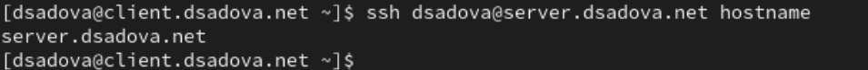

##

3. Посмотрите с клиента список файлов на сервере:

##

4. Посмотрите с клиента почту на сервере:

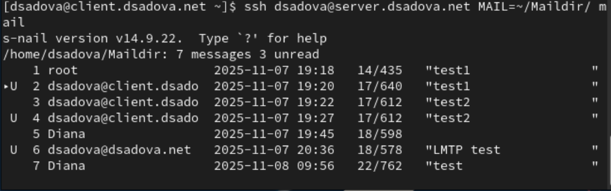

## Запуск графических приложений через SSH (X11Forwarding)

1. На сервере в конфигурационном файле /etc/ssh/sshd_config разрешите отображать на локальном клиентском компьютере графические интерфейсы X11:

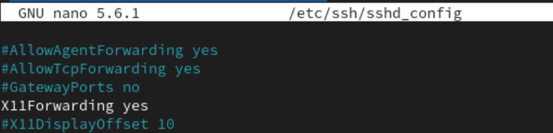

##

2. После сохранения изменения в конфигурационном файле перезапустите sshd.

##

3. Попробуйте с клиента удалённо подключиться к серверу и запустить графическое приложение, например firefox:

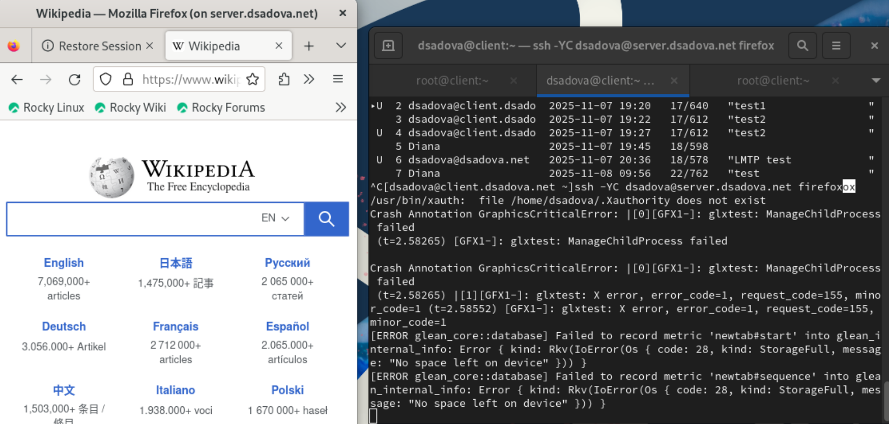

## Внесение изменений в настройки внутреннего окружения виртуальной машины

1. На виртуальной машине server перейдите в каталог для внесения изменений в настройки внутреннего окружения /vagrant/provision/server/, создайте в нём каталог ssh, в который поместите в соответствующие подкаталоги конфигурацион- ный файл sshd_config:

##

2. В каталоге /vagrant/provision/server создайте исполняемый файл ssh.sh. Открыв его на редактирование, пропишите в нём следующий скрипт:

##

3. Для отработки созданного скрипта во время загрузки виртуальной машины server в конфигурационном файле Vagrantfile необходимо добавить в разделе конфигурации для сервера:

# Выводы

- Приобрели практические навыки по настройке удалённого доступа к серверу с помощью SSH. Смогли проверить с клиента папки на сервере и запустить гарафический интерфейс с клиента.
