---
## Front matter
title: "Лабораторная работа № 11."
subtitle: "Настройка безопасного удалённого доступа по протоколу SSH"
author: "Диана Алексеевна Садова"

## Generic otions
lang: ru-RU
toc-title: "Содержание"

## Bibliography
bibliography: bib/cite.bib
csl: pandoc/csl/gost-r-7-0-5-2008-numeric.csl

## Pdf output format
toc: true # Table of contents
toc-depth: 2
lof: true # List of figures
lot: true # List of tables
fontsize: 12pt
linestretch: 1.5
papersize: a4
documentclass: scrreprt
## I18n polyglossia
polyglossia-lang:
  name: russian
  options:
	- spelling=modern
	- babelshorthands=true
polyglossia-otherlangs:
  name: english
## I18n babel
babel-lang: russian
babel-otherlangs: english
## Fonts
mainfont: PT Serif
romanfont: PT Serif
sansfont: PT Sans
monofont: PT Mono
mainfontoptions: Ligatures=TeX
romanfontoptions: Ligatures=TeX
sansfontoptions: Ligatures=TeX,Scale=MatchLowercase
monofontoptions: Scale=MatchLowercase,Scale=0.9
## Biblatex
biblatex: true
biblio-style: "gost-numeric"
biblatexoptions:
  - parentracker=true
  - backend=biber
  - hyperref=auto
  - language=auto
  - autolang=other*
  - citestyle=gost-numeric
## Pandoc-crossref LaTeX customization
figureTitle: "Рис."
tableTitle: "Таблица"
listingTitle: "Листинг"
lofTitle: "Список иллюстраций"
lotTitle: "Список таблиц"
lolTitle: "Листинги"
## Misc options
indent: true
header-includes:
  - \usepackage{indentfirst}
  - \usepackage{float} # keep figures where there are in the text
  - \floatplacement{figure}{H} # keep figures where there are in the text
---

# Цель работы

Приобретение практических навыков по настройке удалённого доступа к серверу с помощью SSH.

# Задание

1. Настройте запрет удалённого доступа на сервер по SSH для пользователя root.
2. Настройте разрешение удалённого доступа к серверу по SSH только для пользователей группы vagrant и вашего пользователя. 
3. Настройте удалённый доступ к серверу по SSH через порт 2022.
4. Настройте удалённый доступ к серверу по SSH по ключу.
5. Организуйте SSH-туннель с клиента на сервер, перенаправив локальное соединение с TCP-порта 80 на порт 8080.
6. Используя удалённое SSH-соединение, выполните с клиента несколько команд на сервере.
7. Используя удалённое SSH-соединение, запустите с клиента графическое приложение на сервере.
8. Напишите скрипт для Vagrant, фиксирующий действия по настройке SSH-сервера во внутреннем окружении виртуальной машины server. Соответствующим образом внесите изменения в Vagrantfile.

## Последовательность выполнения работы

### Запрет удалённого доступа по SSH для пользователя root

1. . На сервере задайте пароль для пользователя root, если этого не было сделано ранее:(рис. [-@fig:001])

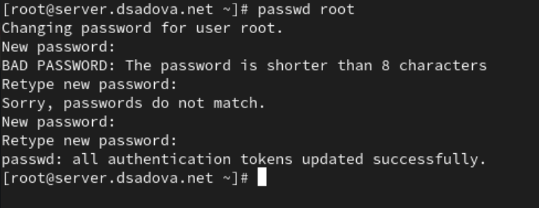{#fig:001 width=90%}

2. На сервере в дополнительном терминале запустите мониторинг системных событий:(рис. [-@fig:002])

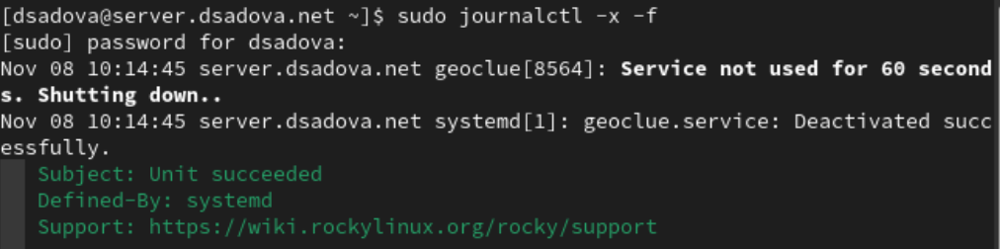{#fig:002 width=90%}

3. С клиента попытайтесь получить доступ к серверу посредством SSH-соединения через пользователя root:(рис. [-@fig:003])

{#fig:003 width=90%}

В отчёте поясните, что при этом происходит.

Нас не пускает на сервер под записью root и это правильно. Параметр PasswordAuthentication в файле конфигурации SSH-демона (/etc/ssh/sshd_config) на сервере установлен в no. Система безопасности работает коректно. 

4. На сервере откройте файл /etc/ssh/sshd_config конфигурации sshd для редактирования и запретите вход на сервер пользователю root, установив:(рис. [-@fig:004])

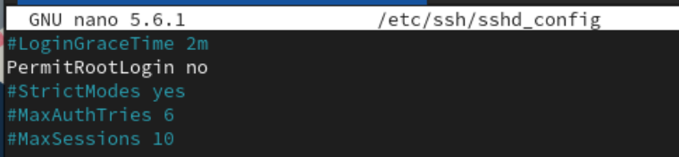{#fig:004 width=90%}

5. После сохранения изменений в файле конфигурации перезапустите sshd:(рис. [-@fig:005])

{#fig:005 width=90%}

6. Повторите попытку получения доступа с клиента к серверу посредством SSH-соединения через пользователя root:(рис. [-@fig:006])

{#fig:006 width=90%}

В отчёте поясните, что при этом происходит.

Нас не пускает. Сервер SSH на хосте server сконфигурирован таким образом, что прямой вход под пользователем root с использованием пароля запрещен. Система безопасности работает коректно. 

### Ограничение списка пользователей для удалённого доступа по SSH

1. С клиента попытайтесь получить доступ к серверу посредством SSH-соединения через пользователя:(рис. [-@fig:007])

{#fig:007 width=90%}

В отчёте поясните, что при этом происходит.

С клиента мы смогли попасть на сервер. 

2. На сервере откройте файл /etc/ssh/sshd_config конфигурации sshd на редактирование и добавьте строку(рис. [-@fig:008])

{#fig:008 width=90%}

3. После сохранения изменений в файле конфигурации перезапустите sshd:(рис. [-@fig:009])

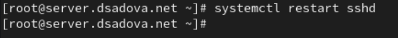{#fig:009 width=90%}

4. Повторите попытку получения доступа с клиента к серверу посредством SSH-соединения через пользователя:(рис. [-@fig:010])

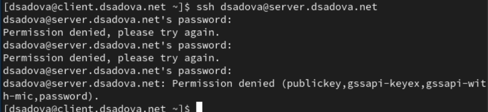{#fig:010 width=90%}

В отчёте поясните, что при этом происходит.

Нас не пускат к серверу, так как мы указали, что только vagrant может заходить на сервер. AllowUsers vagrant явно разрешает подключение по SSH только для пользователя vagrant. Все остальные пользователи, включая dsadova и root, автоматически блокируются.

5. В файле /etc/ssh/sshd_config конфигурации sshd внесите следующее изменение:(рис. [-@fig:011])

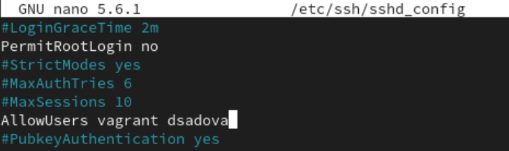{#fig:011 width=90%}

В тексте лабороторной работы нас просят указать user, но для коректной работы далее обязательно нужно указать имено ваше имя пользователя. 

6. После сохранения изменений в файле конфигурации перезапустите sshd и вновь попытайтесь получить доступ с клиента к серверу посредством SSH-соединения через пользователя user.(рис. [-@fig:012])

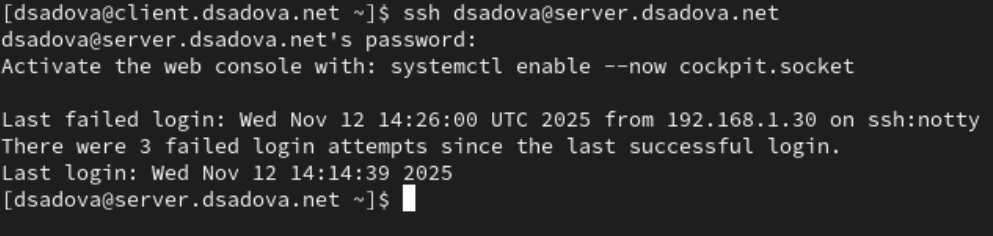{#fig:012 width=90%}

В отчёте поясните, что при этом происходит. 

Мы получили доступ с клиента. AllowUsers vagrant user явно разрешает подключение по SSH для двух пользователей: vagrant и dsadova. Теперь пользователь dsadova находится в белом списке разрешённых пользователей.

Сервер принимает запрос на подключение и проверяет, что пользователь user есть в списке разрешённых -> Система переходит к этапу аутентификации - запрашивает пароль или SSH-ключ -> Если аутентификация проходит успешно, подключение устанавливается

### Настройка дополнительных портов для удалённого доступа по SSH

1. На сервере в файле конфигурации sshd /etc/ssh/sshd_config найдите строку Port и ниже этой строки добавьте:(рис. [-@fig:013])

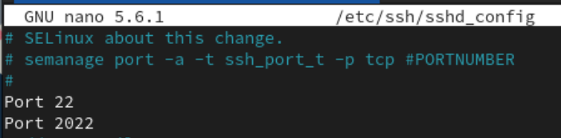{#fig:013 width=90%}

Эта запись сообщает процессу sshd о необходимости организации соединения через два разных порта, что даёт гарантию возможности открыть сеансы SSH, даже если была сделана ошибка в конфигурации.

2. После сохранения изменений в файле конфигурации перезапустите sshd:(рис. [-@fig:014])

{#fig:014 width=90%}

3. Посмотрите расширенный статус работы sshd. Система должна сообщить вам об отказе в работе sshd через порт 2022. Дополнительно посмотрите сообщения в терминале с мониторингом системных событий.(рис. [-@fig:015])

{#fig:015 width=90%}

В отчёте поясните суть системных сообщений.

У нас происходит блокировка SELinux и система безопасности SELinux предотвращает запуск SSH-демона (/usr/sbin/sshd) на порту 2022. SELinux запрещает процессу sshd выполнять операцию name_bind (привязку к порту) для TCP-сокета на порту 2022.

4. Исправьте на сервере метки SELinux к порту 2022:(рис. [-@fig:016])

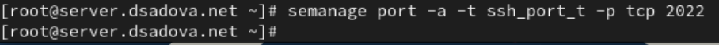{#fig:016 width=90%}

5. В настройках межсетевого экрана откройте порт 2022 протокола TCP:(рис. [-@fig:017])

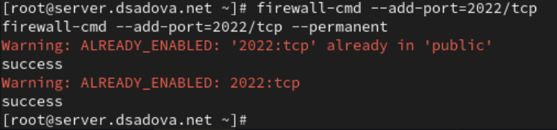{#fig:017 width=90%}

6. Вновь перезапустите sshd и посмотрите расширенный статус его работы. Статус должен показать, что процесс sshd теперь прослушивает два порта.(рис. [-@fig:018])

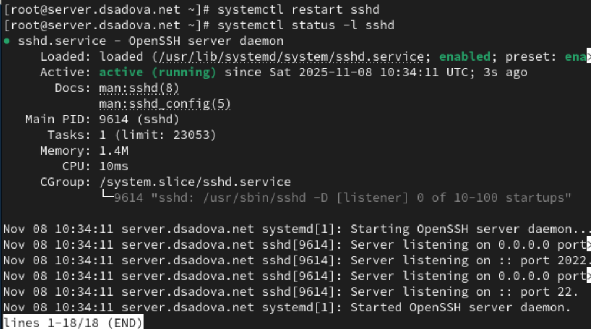{#fig:018 width=90%}

7. С клиента попытайтесь получить доступ к серверу посредством SSH-соединения через пользователя:(рис. [-@fig:019])

{#fig:019 width=90%}

После открытия оболочки пользователя введите sudo -i для получения доступа root. Отлогиньтесь от root и вашего пользователя на сервере, введя дважды logout или используя дважды комбинацию клавиш Ctrl + d .(рис. [-@fig:020])

{#fig:020 width=90%}

8. Повторите попытку получения доступа с клиента к серверу посредством SSH-соединения через пользователя user, указав порт 2022:(рис. [-@fig:021])

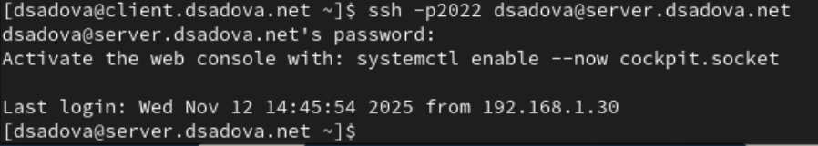{#fig:021 width=90%}

После открытия оболочки пользователя введите sudo -i для получения доступа root. Отлогиньтесь от root и вашего пользователя на сервере, введя дважды logout или используя дважды комбинацию клавиш Ctrl + d .(рис. [-@fig:022])

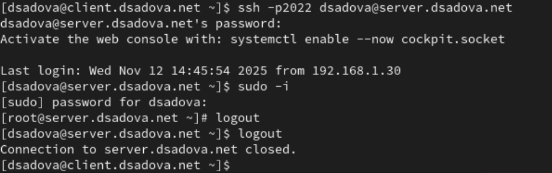{#fig:022 width=90%}

### Настройка удалённого доступа по SSH по ключу

В этом упражнении вы создаёте пару из открытого и закрытого ключей для входа на сервер.

1. На сервере в конфигурационном файле /etc/ssh/sshd_config задайте параметр, разрешающий аутентификацию по ключу:(рис. [-@fig:023])

{#fig:023 width=90%}

2. После сохранения изменений в файле конфигурации перезапустите sshd.(рис. [-@fig:024])

{#fig:024 width=90%}

3. На клиенте сформируйте SSH-ключ, введя в терминале под пользователем:(рис. [-@fig:025])

{#fig:025 width=90%}

Когда вас спросят, хотите ли вы использовать кодовую фразу, нажмите Enter , что-бы использовать установку без пароля. При запросе имени файла, в котором будет храниться закрытый ключ, примите предлагаемое по умолчанию имя файла (~/.ssh/id_rsa). Когда вас попросят ввести кодовую фразу, нажмите Enter дважды.

4. Закрытый ключ теперь будет записан в файл ~/.ssh/id_rsa, а открытый ключ записывается в файл ~/.ssh/id_rsa.pub.

5. Скопируйте открытый ключ на сервер, введя на клиенте:(рис. [-@fig:026])

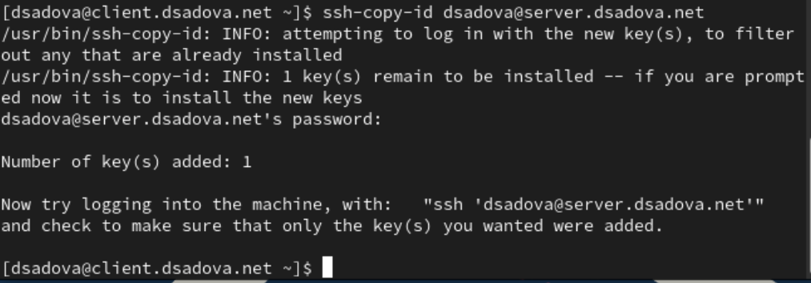{#fig:026 width=90%}

При запросе введите пароль пользователя на удалённом сервере.

6. Попробуйте получить доступ с клиента к серверу посредством SSH-соединения:(рис. [-@fig:027])

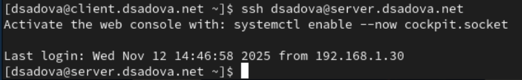{#fig:027 width=90%}

Теперь вы должны пройти аутентификацию без ввода пароля для учётной записи удалённого пользователя. Отлогиньтесь с сервера, используя комбинацию клавиш Ctrl + d .(рис. [-@fig:028])

{#fig:028 width=90%}

### Организация туннелей SSH, перенаправление TCP-портов

1. На клиенте посмотрите, запущены ли какие-то службы с протоколом TCP:(рис. [-@fig:029])

{#fig:029 width=90%}

2. Перенаправьте порт 80 на server.user.net на порт 8080 на локальной машине:(рис. [-@fig:030])

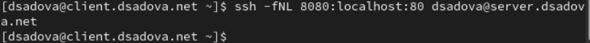{#fig:030 width=90%}

3. Вновь на клиенте посмотрите, запущены ли какие-то службы с протоколом TCP:(рис. [-@fig:031])

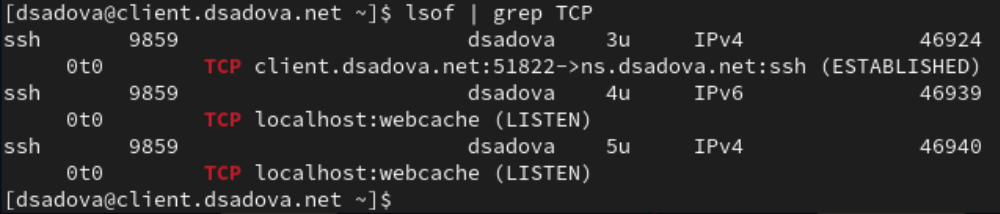{#fig:031 width=90%}

В отчёте прокомментируйте полученную при выводе на экран информацию.

У нас появились 3 службы. 

4. На клиенте запустите браузер и в адресной строке введите localhost:8080. Убедитесь, что отобразится страница с приветствием «Welcome to the server.user.net server».(рис. [-@fig:032])

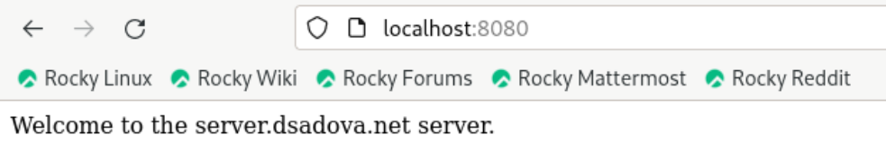{#fig:032 width=90%}

### Запуск консольных приложений через SSH

1. На клиенте откройте терминал под пользователем.

2. Посмотрите с клиента имя узла сервера:(рис. [-@fig:033])

{#fig:033 width=90%}

3. Посмотрите с клиента список файлов на сервере:(рис. [-@fig:034])

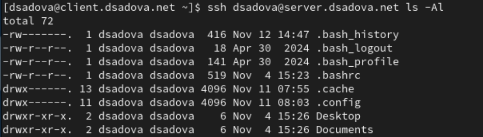{#fig:034 width=90%}

4. Посмотрите с клиента почту на сервере:(рис. [-@fig:035])

{#fig:035 width=90%}

### Запуск графических приложений через SSH (X11Forwarding)

1. На сервере в конфигурационном файле /etc/ssh/sshd_config разрешите отображать на локальном клиентском компьютере графические интерфейсы X11:(рис. [-@fig:036])

{#fig:036 width=90%}

2. После сохранения изменения в конфигурационном файле перезапустите sshd.(рис. [-@fig:037])

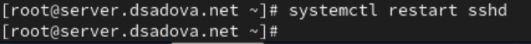{#fig:037 width=90%}

3. Попробуйте с клиента удалённо подключиться к серверу и запустить графическое приложение, например firefox:(рис. [-@fig:038])

{#fig:038 width=90%}

### Внесение изменений в настройки внутреннего окружения виртуальной машины

1. На виртуальной машине server перейдите в каталог для внесения изменений в настройки внутреннего окружения /vagrant/provision/server/, создайте в нём каталог ssh, в который поместите в соответствующие подкаталоги конфигурацион- ный файл sshd_config:(рис. [-@fig:039])

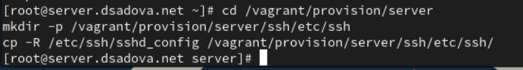{#fig:039 width=90%}

2. В каталоге /vagrant/provision/server создайте исполняемый файл ssh.sh. Открыв его на редактирование, пропишите в нём следующий скрипт:(рис. [-@fig:040])

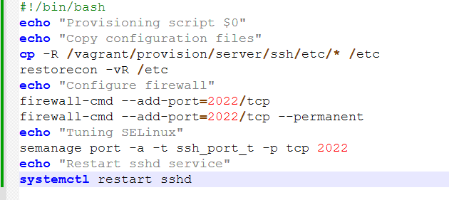{#fig:040 width=90%}

3. Для отработки созданного скрипта во время загрузки виртуальной машины server в конфигурационном файле Vagrantfile необходимо добавить в разделе конфигурации для сервера:(рис. [-@fig:041])

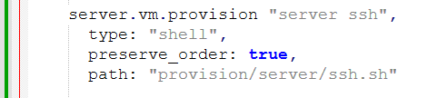{#fig:041 width=90%}

# Выводы

Приобрели практические навыки по настройке удалённого доступа к серверу с помощью SSH. Смогли проверить с клиента папки на сервере и запустить гарафический интерфейс с клиента.

# Список литературы{.unnumbered}

::: {#refs}
:::
