---
## Front matter
lang: ru-RU
title: Лабораторная работа № 12.
subtitle: Синхронизация времени
author:
  - Cадова Д. А.
institute:
  - Российский университет дружбы народов, Москва, Россия

## i18n babel
babel-lang: russian
babel-otherlangs: english
## Fonts
mainfont: PT Serif
romanfont: PT Serif
sansfont: PT Sans
monofont: PT Mono
mainfontoptions: Ligatures=TeX
romanfontoptions: Ligatures=TeX
sansfontoptions: Ligatures=TeX,Scale=MatchLowercase
monofontoptions: Scale=MatchLowercase,Scale=0.9

## Formatting pdf
toc: false
toc-title: Содержание
slide_level: 2
aspectratio: 169
section-titles: true
theme: metropolis
header-includes:
 - \metroset{progressbar=frametitle,sectionpage=progressbar,numbering=fraction}
 - '\makeatletter'
 - '\beamer@ignorenonframefalse'
 - '\makeatother'
---

# Информация

## Докладчик

:::::::::::::: {.columns align=center}
::: {.column width="70%"}

  * Садова Диана Алексеевна
  * студент бакалавриата
  * Российский университет дружбы народов
  * [113229118@pfur.ru]
  * <https://DianaSadova.github.io/ru/>

:::
::::::::::::::

# Вводная часть

## Актуальность

- Важно понимать ценность точного времени. В распределенных системах расхождения даже в секунды могут привести к критическим сбоям.

## Цели и задачи

- Получение навыков по управлению системным временем и настройке синхронизации времени.

## Материалы и методы

- Текст лабороторной работы № 12
- Интеранет для устранения ошибок 

## Содержание 

1. Изучите команды по настройке параметров времени.
2. Настройте сервер в качестве сервера синхронизации времени для локальной сети.
3. Напишите скрипты для Vagrant, фиксирующие действия по установке и настройке NTP-сервера и клиента.

## Настройка параметров времени

1. На сервере и клиенте посмотрите параметры настройки даты и времени:

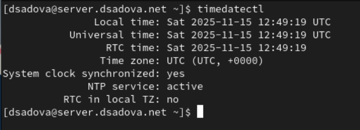

##

##

Определите, в какой временной зоне находятся сервер и клиент, проводится ли сетевая синхронизация времени и т.п. Поэкспериментируйте с параметрами этой команды.

##

timedatectl set-timezone используется в Linux для установки нового часового пояса для системного времени. 

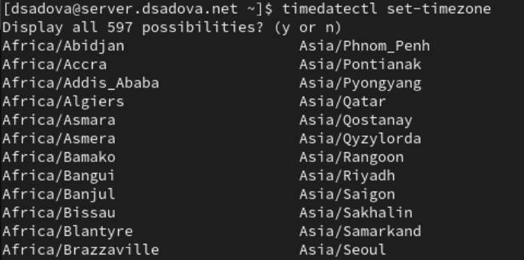

##

timedatectl list-timezones выводит полный список всех поддерживаемых в системе часовых поясов

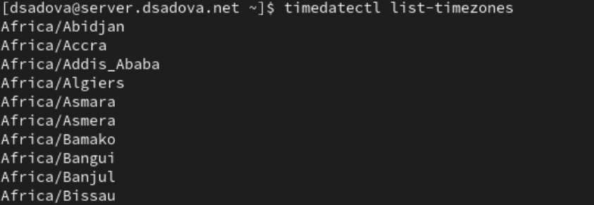

##

timedatectl show отображает подробную информацию о системных часах и настройках даты и времени в Linux, включая местное время, время UTC, часовой пояс, статус синхронизации времени по протоколу NTP и формат времени аппаратных часов (RTC).

##

2. На сервере и клиенте посмотрите текущее системное время:

##

##

3. На сервере и клиенте посмотрите аппаратное время:

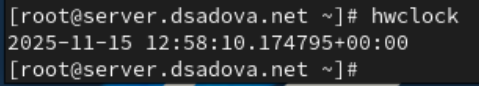

##

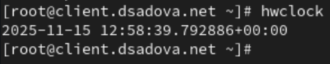

## Управление синхронизацией времени

1. При необходимости установите на сервере необходимое программное обеспечение:

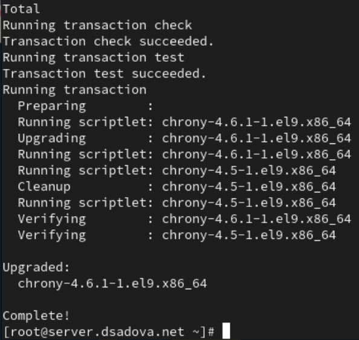

##

2. Проверьте источники времени на клиенте и на сервере:

##

##

Сервер использует chrony для синхронизации времени. Просматривается 8 источников времени. Только 3 источника активны и доступны

Активные источники:

95.165.149.109 (Stratum 2) - статус A-

- Время отстает на 11ms
- Погрешность: ±76ms
- Доступность: 17/377

##

185.211.244.47 (Stratum 2) - статус A-

- Время отстает на 4.6ms
- Погрешность: ±79ms
- Доступность: 17/377

87.103.245.205 (Stratum 2) - статус A*

- Текущий выбранный источник
- Время опережает на 1.1ms
- Погрешность: ±58ms
- Доступность: 17/377

##

Клиент также использует chrony. 4 источника времени, все активны. Лучшая ситуация с доступностью

Активные источники:

time.cloudflare.com (Stratum 3) - статус ^*

- Текущий выбранный источник
- Время опережает на 0.7ms
- Погрешность: ±18ms
- Доступность: 377/377 (отличная)

time.cloudflare.com (дубликат) - статус ^+

- Резервный источник
- Время опережает на 1.5ms
- Погрешность: ±17ms

##

mail.rashnikov.name (Stratum 2) - статус ^-

- Время отстает на 4.4ms
- Погрешность: ±58ms

45.141.102.99 (Stratum 2) - статус ^-

- Время отстает на 1.8ms
- Погрешность: ±47ms

##

3. На сервере откройте на редактирование файл /etc/chrony.conf и добавьте строку:

##

4. На сервере перезапустите службу chronyd:

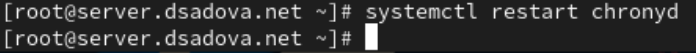

##

5. Настройте межсетевой экран на сервере:

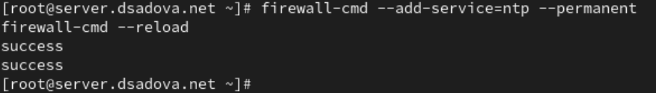

##

6. На клиенте откройте файл /etc/chrony.conf и добавьте строку (вместо user укажите свой логин):

##

7. На клиенте перезапустите службу chronyd:

##

8. Проверьте источники времени на клиенте и на сервере:

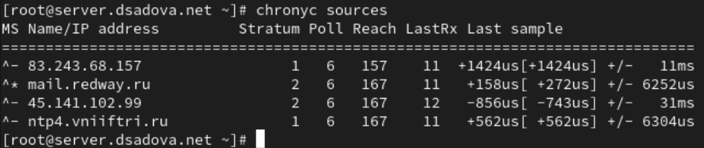

##

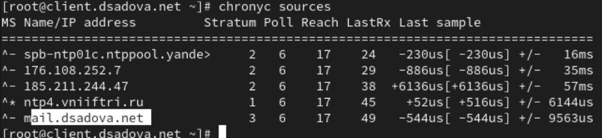

##

Сервер имеет хорошую доступность источников времени. 4 активных источника, все доступны. Reach значения высокие (157-167/377)

Текущий выбранный источник: mail.reduay.ru (Stratum 2) - статус ^*

- Текущий синхронизированный источник
- Время опережает на 158us (0.158ms)
- Погрешность: ±6252us (6.25ms)
- Доступность: 167/377 (хорошая)

Альтернативные источники: 83.243.68.157 (Stratum 1) - статус ^-

- Источник stratum 1 (высший приоритет)
- Время опережает на 1.4ms
- Низкая погрешность: ±11ms
- Доступность: 157/377

##

ntp4.vniftri.ru (Stratum 1) - статус ^-

- Еще один источник stratum 1
- Время опережает на 0.56ms
- Погрешность: ±6.3ms
- Доступность: 167/377

45.141.102.99 (Stratum 2) - статус ^-

- Время отстает на 0.86ms
- Погрешность: ±31ms
- Доступность: 167/377

##

Клиент имеет проблемы с доступностью источников. 5 источников, но низкие значения Reach (17/377). Это указывает на проблемы сетевого соединения

Текущий выбранный источник: ntp4.vniiftri.ru (Stratum 1) - статус ^*

- Текущий синхронизированный источник
- Время опережает на 52us (0.052ms)
- Очень низкая погрешность: ±6144us (6.14ms)
- Но доступность плохая: 17/377

Альтернативные источники: spb-ntp0lc.ntppool.yande> (Stratum 2) - статус ^-

- Время отстает на 230us
- Погрешность: ±16ms
- Доступность: 17/377

##

176.108.252.7 (Stratum 2) - статус ^-

- Время отстает на 0.89ms
- Погрешность: ±35ms
- Доступность: 17/377

185.211.244.47 (Stratum 2) - статус ^-

- Время опережает на 6.14ms
- Погрешность: ±57ms
- Доступность: 17/377

mail.dsadova.net (Stratum 3) - статус ^-

- Локальный сервер (вероятно, этот же сервер)
- Время отстает на 0.54ms
- Погрешность: ±9.56ms
- Доступность: 17/377

##

9. Посмотрите подробную информацию о синхронизации и поясните в отчёте выведенную на экран информацию.

##

##

Сервер

Основная информация:

- Reference ID: 596DFB18 (ntp4.vniiftri.ru)
- Stratum: 2 (получает время от источника Stratum 1)
- Время последней синхронизации: Sat Nov 15 13:07:04 2025 (UTC)

Точность времени:

- System time: +2.05 microseconds (опережение)
- Last offset: -1376.82 microseconds (последнее расхождение)
- RMS offset: 33465.93 microseconds (33.47 ms) - ВЫСОКИЙ ПОКАЗАТЕЛЬ

##

Стабильность работы:

- Frequency: 523.695 ppm slow (дрейф системных часов)
- Residual freq: -13.214 ppm (текущая коррекция)
- Skew: 57.972 ppm - ВЫСОКИЙ ПОКАЗАТЕЛЬ
- Update interval: 0.7 seconds - ОЧЕНЬ ЧАСТЫЕ ОБНОВЛЕНИЯ

Сетевые параметры:

- Root delay: 10.14 ms (задержка до источника)
- Root dispersion: 3.25 ms (погрешность)

##

Клиент 

Основная информация:

- Reference ID: 596DFB18 (ntp4.vniiftri.ru) - ТОТ ЖЕ ИСТОЧНИК
- Stratum: 2
- Время последней синхронизации: Sat Nov 15 13:07:08 2025 (UTC)

Точность времени:

- System time: -132.62 microseconds (отставание)
- Last offset: -135.86 microseconds
- RMS offset: 1112.32 microseconds (1.11 ms) - НОРМАЛЬНЫЙ

##

Стабильность работы:

- Frequency: 521.117 ppm slow
- Residual freq: +1.691 ppm
- Skew: 8.132 ppm - НОРМАЛЬНЫЙ
- Update interval: 64.9 seconds - СТАНДАРТНЫЙ ИНТЕРВАЛ

Сетевые параметры:

- Root delay: 11.39 ms
- Root dispersion: 8.88 ms

## Внесение изменений в настройки внутреннего окружения виртуальных машин

1. На виртуальной машине server перейдите в каталог для внесения изменений в настройки внутреннего окружения /vagrant/provision/server/, создайте в нём каталог ntp, в который поместите в соответствующие подкаталоги конфигурационные файлы:

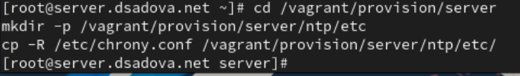

##

2. В каталоге /vagrant/provision/server создайте исполняемый файл ntp.sh. Открыв его на редактирование, пропишите в нём следующий скрипт:

##

3. На виртуальной машине client перейдите в каталог для внесения изменений в настройки внутреннего окружения /vagrant/provision/client/, создайте в нём каталог ntp, в который поместите в соответствующие подкаталоги конфигурационные файлы:

##

4. В каталоге /vagrant/provision/client создайте исполняемый файл ntp.sh. Открыв его на редактирование, пропишите в нём следующий скрипт:

##

5. Для отработки созданных скриптов во время загрузки виртуальных машин server и client в конфигурационном файле Vagrantfile необходимо добавить в соответствующих разделах конфигураций для сервера и клиента:

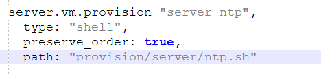

##

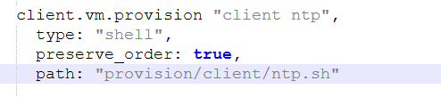

## Результаты

- Получили навыки по управлению системами временем и настройке синхронизации времени.

