---
## Front matter
title: "Лабораторная работа № 12."
subtitle: "Синхронизация времени"
author: "Диана Алексеевна Садова"

## Generic otions
lang: ru-RU
toc-title: "Содержание"

## Bibliography
bibliography: bib/cite.bib
csl: pandoc/csl/gost-r-7-0-5-2008-numeric.csl

## Pdf output format
toc: true # Table of contents
toc-depth: 2
lof: true # List of figures
lot: true # List of tables
fontsize: 12pt
linestretch: 1.5
papersize: a4
documentclass: scrreprt
## I18n polyglossia
polyglossia-lang:
  name: russian
  options:
	- spelling=modern
	- babelshorthands=true
polyglossia-otherlangs:
  name: english
## I18n babel
babel-lang: russian
babel-otherlangs: english
## Fonts
mainfont: PT Serif
romanfont: PT Serif
sansfont: PT Sans
monofont: PT Mono
mainfontoptions: Ligatures=TeX
romanfontoptions: Ligatures=TeX
sansfontoptions: Ligatures=TeX,Scale=MatchLowercase
monofontoptions: Scale=MatchLowercase,Scale=0.9
## Biblatex
biblatex: true
biblio-style: "gost-numeric"
biblatexoptions:
  - parentracker=true
  - backend=biber
  - hyperref=auto
  - language=auto
  - autolang=other*
  - citestyle=gost-numeric
## Pandoc-crossref LaTeX customization
figureTitle: "Рис."
tableTitle: "Таблица"
listingTitle: "Листинг"
lofTitle: "Список иллюстраций"
lotTitle: "Список таблиц"
lolTitle: "Листинги"
## Misc options
indent: true
header-includes:
  - \usepackage{indentfirst}
  - \usepackage{float} # keep figures where there are in the text
  - \floatplacement{figure}{H} # keep figures where there are in the text
---

# Цель работы

Получение навыков по управлению системным временем и настройке синхронизации времени.

# Задание

1. Изучите команды по настройке параметров времени.
2. Настройте сервер в качестве сервера синхронизации времени для локальной сети.
3. Напишите скрипты для Vagrant, фиксирующие действия по установке и настройке NTP-сервера и клиента.

## Последовательность выполнения работы

### Настройка параметров времени

1. На сервере и клиенте посмотрите параметры настройки даты и времени:(рис. [-@fig:001]),(рис. [-@fig:002])

{#fig:001 width=90%}

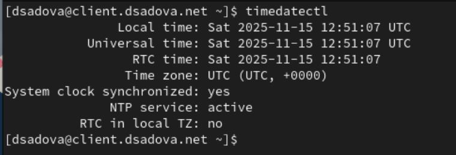{#fig:002 width=90%}

Определите, в какой временной зоне находятся сервер и клиент, проводится ли сетевая синхронизация времени и т.п. Поэкспериментируйте с параметрами этой команды.(рис. [-@fig:003]),(рис. [-@fig:004]),(рис. [-@fig:005]),(рис. [-@fig:006])

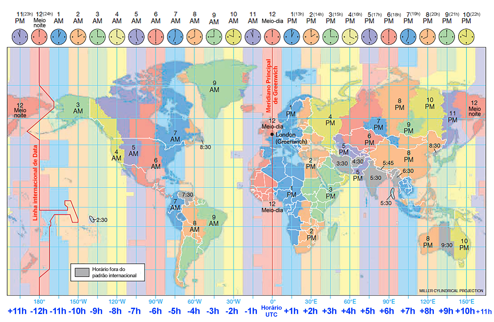{#fig:003 width=90%}

{#fig:004 width=90%}

timedatectl set-timezone используется в Linux для установки нового часового пояса для системного времени. 

{#fig:005 width=90%}

timedatectl list-timezones выводит полный список всех поддерживаемых в системе часовых поясов

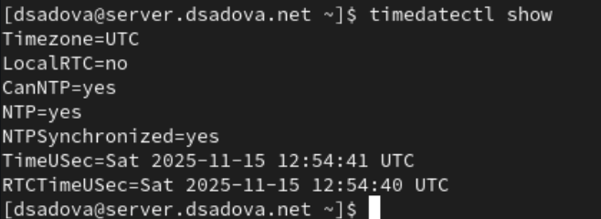{#fig:006 width=90%}

timedatectl show отображает подробную информацию о системных часах и настройках даты и времени в Linux, включая местное время, время UTC, часовой пояс, статус синхронизации времени по протоколу NTP и формат времени аппаратных часов (RTC).

2. На сервере и клиенте посмотрите текущее системное время:(рис. [-@fig:007]),(рис. [-@fig:008])

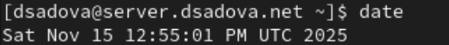{#fig:007 width=90%}

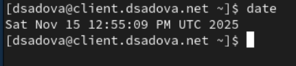{#fig:008 width=90%}

3. На сервере и клиенте посмотрите аппаратное время:(рис. [-@fig:009]),(рис. [-@fig:010])

{#fig:009 width=90%}

{#fig:010 width=90%}

### Управление синхронизацией времени

1. При необходимости установите на сервере необходимое программное обеспечение:(рис. [-@fig:011])

{#fig:011 width=90%}

2. Проверьте источники времени на клиенте и на сервере:(рис. [-@fig:012]),(рис. [-@fig:013])

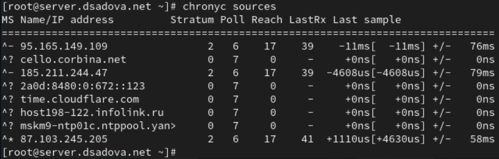{#fig:012 width=90%}

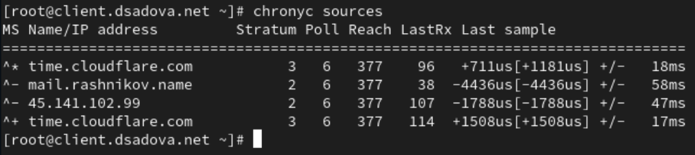{#fig:013 width=90%}

В отчёте поясните выведенную информацию.

Сервер использует chrony для синхронизации времени. Просматривается 8 источников времени. Только 3 источника активны и доступны

Активные источники:

95.165.149.109 (Stratum 2) - статус A-

- Время отстает на 11ms
- Погрешность: ±76ms
- Доступность: 17/377

185.211.244.47 (Stratum 2) - статус A-

- Время отстает на 4.6ms
- Погрешность: ±79ms
- Доступность: 17/377

87.103.245.205 (Stratum 2) - статус A*

- Текущий выбранный источник
- Время опережает на 1.1ms
- Погрешность: ±58ms
- Доступность: 17/377

Клиент также использует chrony. 4 источника времени, все активны. Лучшая ситуация с доступностью

Активные источники:

time.cloudflare.com (Stratum 3) - статус ^*

- Текущий выбранный источник
- Время опережает на 0.7ms
- Погрешность: ±18ms
- Доступность: 377/377 (отличная)

time.cloudflare.com (дубликат) - статус ^+

- Резервный источник
- Время опережает на 1.5ms
- Погрешность: ±17ms

mail.rashnikov.name (Stratum 2) - статус ^-

- Время отстает на 4.4ms
- Погрешность: ±58ms

45.141.102.99 (Stratum 2) - статус ^-

- Время отстает на 1.8ms
- Погрешность: ±47ms

3. На сервере откройте на редактирование файл /etc/chrony.conf и добавьте строку:(рис. [-@fig:014])

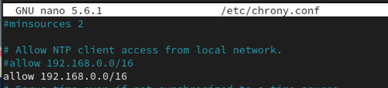{#fig:014 width=90%}

4. На сервере перезапустите службу chronyd:(рис. [-@fig:015])

{#fig:015 width=90%}

5. Настройте межсетевой экран на сервере:(рис. [-@fig:016])

{#fig:016 width=90%}

6. На клиенте откройте файл /etc/chrony.conf и добавьте строку (вместо user укажите свой логин):(рис. [-@fig:017])

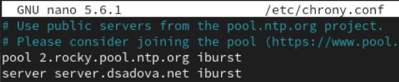{#fig:017 width=90%}

Удалите все остальные строки с директивой server.

7. На клиенте перезапустите службу chronyd:(рис. [-@fig:018])

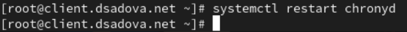{#fig:018 width=90%}

8. Проверьте источники времени на клиенте и на сервере:(рис. [-@fig:019]),(рис. [-@fig:020])

{#fig:019 width=90%}

{#fig:020 width=90%}

В отчёте поясните выведенную информацию.

Сервер имеет хорошую доступность источников времени. 4 активных источника, все доступны. Reach значения высокие (157-167/377)

Текущий выбранный источник: mail.reduay.ru (Stratum 2) - статус ^*

- Текущий синхронизированный источник
- Время опережает на 158us (0.158ms)
- Погрешность: ±6252us (6.25ms)
- Доступность: 167/377 (хорошая)

Альтернативные источники: 83.243.68.157 (Stratum 1) - статус ^-

- Источник stratum 1 (высший приоритет)
- Время опережает на 1.4ms
- Низкая погрешность: ±11ms
- Доступность: 157/377

ntp4.vniftri.ru (Stratum 1) - статус ^-

- Еще один источник stratum 1
- Время опережает на 0.56ms
- Погрешность: ±6.3ms
- Доступность: 167/377

45.141.102.99 (Stratum 2) - статус ^-

- Время отстает на 0.86ms
- Погрешность: ±31ms
- Доступность: 167/377

Клиент имеет проблемы с доступностью источников. 5 источников, но низкие значения Reach (17/377). Это указывает на проблемы сетевого соединения

Текущий выбранный источник: ntp4.vniiftri.ru (Stratum 1) - статус ^*

- Текущий синхронизированный источник
- Время опережает на 52us (0.052ms)
- Очень низкая погрешность: ±6144us (6.14ms)
- Но доступность плохая: 17/377

Альтернативные источники: spb-ntp0lc.ntppool.yande> (Stratum 2) - статус ^-

- Время отстает на 230us
- Погрешность: ±16ms
- Доступность: 17/377

176.108.252.7 (Stratum 2) - статус ^-

- Время отстает на 0.89ms
- Погрешность: ±35ms
- Доступность: 17/377

185.211.244.47 (Stratum 2) - статус ^-

- Время опережает на 6.14ms
- Погрешность: ±57ms
- Доступность: 17/377

mail.dsadova.net (Stratum 3) - статус ^-

- Локальный сервер (вероятно, этот же сервер)
- Время отстает на 0.54ms
- Погрешность: ±9.56ms
- Доступность: 17/377

9. Посмотрите подробную информацию о синхронизации и поясните в отчёте выведенную на экран информацию.(рис. [-@fig:021]),(рис. [-@fig:022])

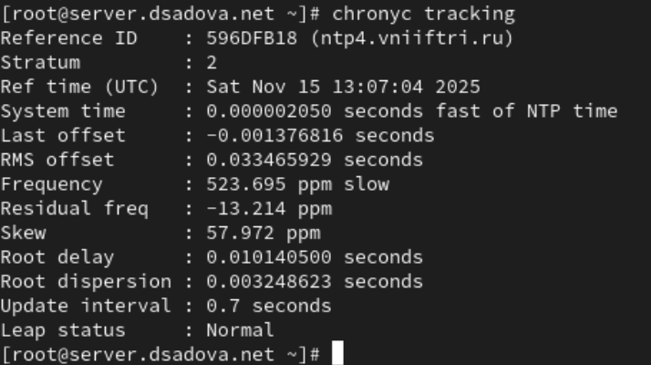{#fig:021 width=90%}

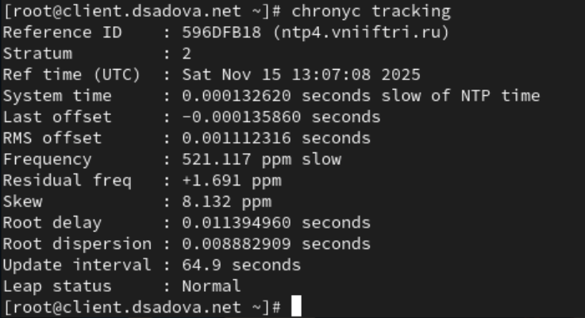{#fig:022 width=90%}

Сервер

Основная информация:

- Reference ID: 596DFB18 (ntp4.vniiftri.ru)
- Stratum: 2 (получает время от источника Stratum 1)
- Время последней синхронизации: Sat Nov 15 13:07:04 2025 (UTC)

Точность времени:

- System time: +2.05 microseconds (опережение)
- Last offset: -1376.82 microseconds (последнее расхождение)
- RMS offset: 33465.93 microseconds (33.47 ms) - ВЫСОКИЙ ПОКАЗАТЕЛЬ

Стабильность работы:

- Frequency: 523.695 ppm slow (дрейф системных часов)
- Residual freq: -13.214 ppm (текущая коррекция)
- Skew: 57.972 ppm - ВЫСОКИЙ ПОКАЗАТЕЛЬ
- Update interval: 0.7 seconds - ОЧЕНЬ ЧАСТЫЕ ОБНОВЛЕНИЯ

Сетевые параметры:

- Root delay: 10.14 ms (задержка до источника)
- Root dispersion: 3.25 ms (погрешность)

Клиент 

Основная информация:

- Reference ID: 596DFB18 (ntp4.vniiftri.ru) - ТОТ ЖЕ ИСТОЧНИК
- Stratum: 2
- Время последней синхронизации: Sat Nov 15 13:07:08 2025 (UTC)

Точность времени:

- System time: -132.62 microseconds (отставание)
- Last offset: -135.86 microseconds
- RMS offset: 1112.32 microseconds (1.11 ms) - НОРМАЛЬНЫЙ

Стабильность работы:

- Frequency: 521.117 ppm slow
- Residual freq: +1.691 ppm
- Skew: 8.132 ppm - НОРМАЛЬНЫЙ
- Update interval: 64.9 seconds - СТАНДАРТНЫЙ ИНТЕРВАЛ

Сетевые параметры:

- Root delay: 11.39 ms
- Root dispersion: 8.88 ms

### Внесение изменений в настройки внутреннего окружения виртуальных машин

1. На виртуальной машине server перейдите в каталог для внесения изменений в настройки внутреннего окружения /vagrant/provision/server/, создайте в нём каталог ntp, в который поместите в соответствующие подкаталоги конфигурационные файлы:(рис. [-@fig:023])

{#fig:023 width=90%}

2. В каталоге /vagrant/provision/server создайте исполняемый файл ntp.sh. Открыв его на редактирование, пропишите в нём следующий скрипт:(рис. [-@fig:024])

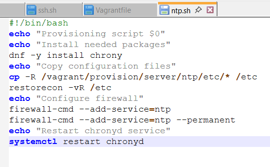{#fig:024 width=90%}

3. На виртуальной машине client перейдите в каталог для внесения изменений в настройки внутреннего окружения /vagrant/provision/client/, создайте в нём каталог ntp, в который поместите в соответствующие подкаталоги конфигурационные файлы:(рис. [-@fig:025])

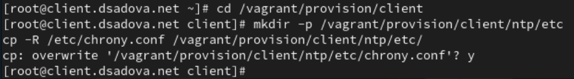{#fig:025 width=90%}

4. В каталоге /vagrant/provision/client создайте исполняемый файл ntp.sh. Открыв его на редактирование, пропишите в нём следующий скрипт:(рис. [-@fig:026])

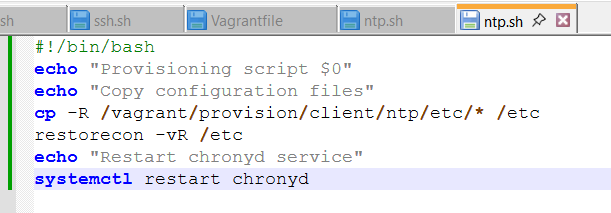{#fig:026 width=90%}

5. Для отработки созданных скриптов во время загрузки виртуальных машин server и client в конфигурационном файле Vagrantfile необходимо добавить в соответствующих разделах конфигураций для сервера и клиента:(рис. [-@fig:027]),(рис. [-@fig:028])

{#fig:027 width=90%}

{#fig:028 width=90%}

# Выводы

Получили навыки по управлению системами временем и настройке синхронизации времени.

# Список литературы{.unnumbered}

::: {#refs}
:::
