---
## Front matter
lang: ru-RU
title: Лабораторная работа № 13.
subtitle: Настройка NFS
author:
  - Cадова Д. А.
institute:
  - Российский университет дружбы народов, Москва, Россия

## i18n babel
babel-lang: russian
babel-otherlangs: english
## Fonts
mainfont: PT Serif
romanfont: PT Serif
sansfont: PT Sans
monofont: PT Mono
mainfontoptions: Ligatures=TeX
romanfontoptions: Ligatures=TeX
sansfontoptions: Ligatures=TeX,Scale=MatchLowercase
monofontoptions: Scale=MatchLowercase,Scale=0.9

## Formatting pdf
toc: false
toc-title: Содержание
slide_level: 2
aspectratio: 169
section-titles: true
theme: metropolis
header-includes:
 - \metroset{progressbar=frametitle,sectionpage=progressbar,numbering=fraction}
 - '\makeatletter'
 - '\beamer@ignorenonframefalse'
 - '\makeatother'
---

# Информация

## Докладчик

:::::::::::::: {.columns align=center}
::: {.column width="70%"}

  * Садова Диана Алексеевна
  * студент бакалавриата
  * Российский университет дружбы народов
  * [113229118@pfur.ru]
  * <https://DianaSadova.github.io/ru/>

:::
::::::::::::::

# Вводная часть

## Актуальность

- Нам важно понимать как настроить сервера NFS для удалённого доступа, так как это упрощает управление и резервное копирование, а так же основа для кластеров, виртуализации и облачных решений

## Цели и задачи

- Приобретение навыков настройки сервера NFS для удалённого доступа к ресурсам.

## Материалы и методы

- Текст лабороторной работы № 13
- Интеранет для устранения ошибок 

## Содержание 

1. Установите и настройте сервер NFSv4.
2. Подмонтируйте удалённый ресурс на клиенте.
3. Подключите каталог с контентом веб-сервера к дереву NFS.
4. Подключите каталог для удалённой работы вашего пользователя к дереву NFS.
5. Напишите скрипты для Vagrant, фиксирующие действия по установке и настройке сервера NFSv4 во внутреннем окружении виртуальных машин server и client. Соответствующим образом внесите изменения в Vagrantfile.

## Настройка сервера NFSv4

1. На сервере установите необходимое программное обеспечение:

##

2. На сервере создайте каталог, который предполагается сделать доступным всем пользователям сети (корень дерева NFS):

##

3. В файле /etc/exports пропишите подключаемый через NFS общий каталог с доступом только на чтение:

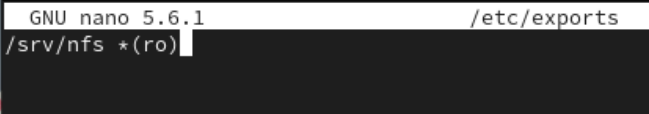

##

4. Для общего каталога задайте контекст безопасности NFS:

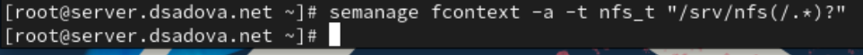

##

5. Примените изменённую настройку SELinux к файловой системе:

##

6. Запустите сервер NFS:

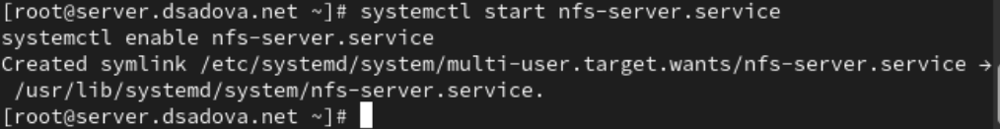

##

7. Настройте межсетевой экран для работы сервера NFS:

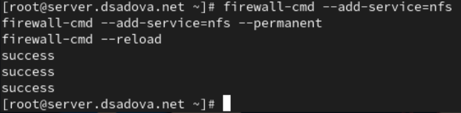

##

8. На клиенте установите необходимое для работы NFS программное обеспечение:

##

9. На клиенте попробуйте посмотреть имеющиеся подмонтированные удалённые ресурсы:

##

Ошибка RPC (Remote Procedure Call) — указывает на проблему связи между клиентом и сервером NFS через протокол удалённого вызова процедур. RPC используется NFS для взаимодействия между клиентом и сервером.

##

10. Попробуйте на сервере остановить сервис межсетевого экрана:

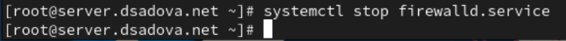

##

Затем на клиенте вновь попробуйте подключиться к удалённо смонтированному ресурсу:

##

1. NFS-сервер доступен и отвечает — в отличие от предыдущей попытки, теперь клиент успешно устанавливает RPC-соединение с сервером.
2. Получен список экспортируемых ресурсов — сервер server.dsadova.net экспортирует (предоставляет в общий доступ) директорию /srv/nfs.
3. Права доступа — символ * означает, что данный ресурс доступен для монтирования всеми клиентам (без ограничений по IP-адресам или сетям).

##

11. На сервере запустите сервис межсетевого экрана

##

12. На сервере посмотрите, какие службы задействованы при удалённом монтировании:

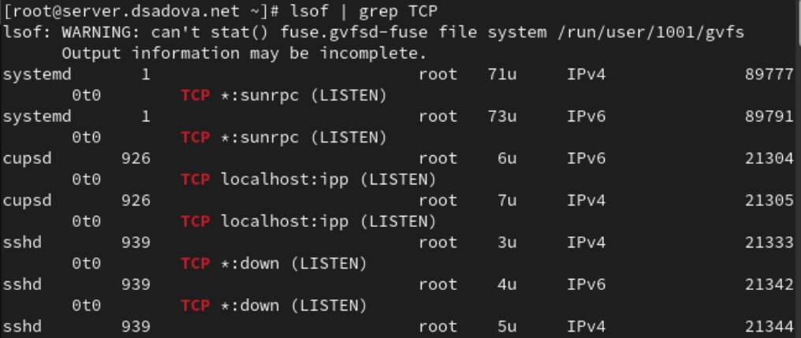

##

##

13. Добавьте службы rpc-bind и mountd в настройки межсетевого экрана на сервере:

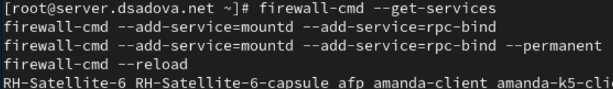

##

14. На клиенте проверьте подключение удалённого ресурса:

## Монтирование NFS на клиенте

1. На клиенте создайте каталог, в который будет монтироваться удалённый ресурс, и подмонтируйте дерево NFS:

##

2. Проверьте, что общий ресурс NFS подключён правильно:

##

В отчёте поясните выведенную информацию о монтировании удалённого ресурса.

NFS-ресурс подключён правильно и готов к использованию. Клиент может читать и записывать файлы в директорию /mnt/nfs, которые фактически будут храниться на сервере server.dsadova.net в директории /srv/nfs.

##

3. На клиенте в конце файла /etc/fstab добавьте следующую запись:

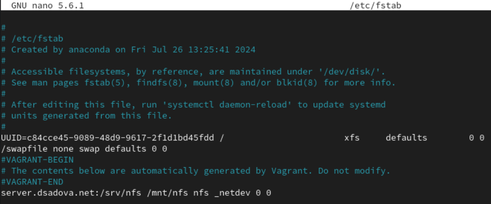

##

В отчёте поясните синтаксис этой записи.

- server.dsadova.net:/srv/nfs — устройство/источник монтирования

- /mnt/nfs — точка монтирования. Локальная директория, в которую будет монтироваться удалённый ресурс

- nfs — тип файловой системы. Указывает, что это NFS (Network File System)

- _netdev — опции монтирования. Без этой опции система может попытаться смонтировать NFS до инициализации сети, что приведёт к ошибке

- 0 — поле для dump

- 0 — поле для fsck

##

4. На клиенте проверьте наличие автоматического монтирования удалённых ресурсов при запуске операционной системы:

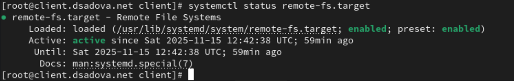

##

5. Перезапустите клиента и убедитесь, что удалённый ресурс подключается автоматически.

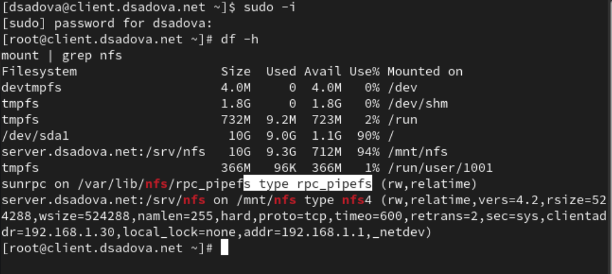

## Подключение каталогов к дереву NFS

1. На сервере создайте общий каталог, в который затем будет подмонтирован каталог с контентом веб-сервера:

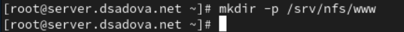

##

2. Подмонтируйте каталог web-сервера:

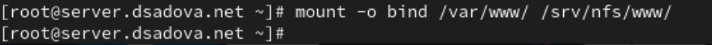

##

3. На сервере проверьте, что отображается в каталоге /srv/nfs.

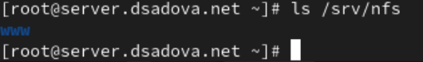

##

4. На клиенте посмотрите, что отображается в каталоге /mnt/nfs.

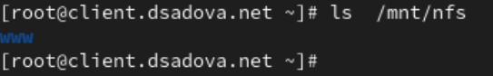

##

5. На сервере в файле /etc/exports добавьте экспорт каталога веб-сервера с удалённого ресурса:

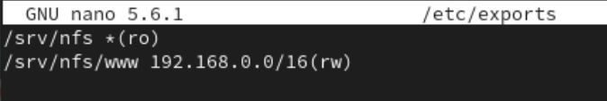

##

6. Экспортируйте все каталоги, упомянутые в файле /etc/exports:

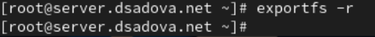

##

7. Проверьте на клиенте каталог /mnt/nfs.

8. На сервере в конце файла /etc/fstab добавьте следующую запись:

##

9. Повторно экспортируйте каталоги, указанные в файле /etc/exports:

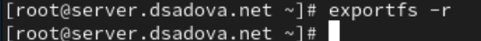

##

10. На клиенте проверьте каталог /mnt/nfs.

## Подключение каталогов для работы пользователей

1. На сервере под пользователем user в его домашнем каталоге создайте каталог common с полными правами доступа только для этого пользователя, а в нём файл user@server.txt (вместо user укажите свой логин):

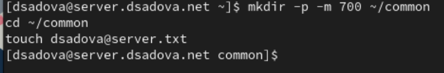

##

2. На сервере создайте общий каталог для работы пользователя user по сети:

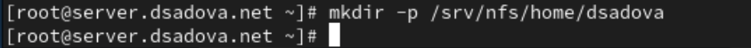

##

3. Подмонтируйте каталог common пользователя user в NFS (вместо user укажите свой логин):

##

В отчёте укажите, какие права доступа установлены на этот каталог.

Каталог /home/dsadova/common создан с правами 700 (drwx------), что означает:

- Только владелец (пользователь dsadova) имеет полный доступ к каталогу

- Все остальные пользователи (включая членов группы) не могут просматривать, читать или изменять содержимое этого каталога

##

4. Подключите каталог пользователя в файле /etc/exports, прописав в нём:

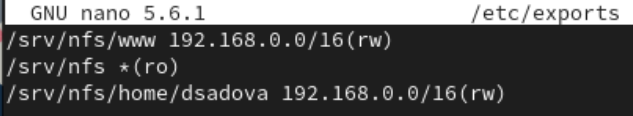

##

5. Внесите изменения в файл /etc/fstab (вместо user укажите свой логин):

##

6. Повторно экспортируйте каталоги:

##

7. На клиенте проверьте каталог /mnt/nfs.

8. На клиенте под пользователем user перейдите в каталог /mnt/nfs/home/user и попробуйте создать в нём файл user@client.txt и внести в него какие-либо изменения:

##

##

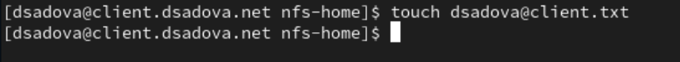

##

##

9. На сервере посмотрите, появились ли изменения в каталоге пользователя

## Внесение изменений в настройки внутреннего окружения виртуальных машин

1. На виртуальной машине server перейдите в каталог для внесения изменений в настройки внутреннего окружения /vagrant/provision/server/, создайте в нём каталог nfs, в который поместите в соответствующие подкаталоги конфигурационные файлы

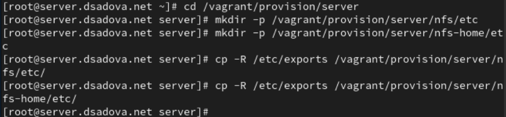

##

2. В каталоге /vagrant/provision/server создайте исполняемый файл nfs.sh.Открыв его на редактирование, пропишите в нём следующий скрипт:

##

3. На виртуальной машине client перейдите в каталог для внесения изменений в настройки внутреннего окружения /vagrant/provision/client/.

##

4. В каталоге /vagrant/provision/client создайте исполняемый файл nfs.sh. Открыв его на редактирование, пропишите в нём следующий скрипт:

##

5. Для отработки созданных скриптов во время загрузки виртуальных машин server и client в конфигурационном файле Vagrantfile необходимо добавить в соответствующих разделах конфигураций для сервера и клиента:

## Результаты

- Приобрели практические навыки настройки сервера NFS для удалённого доступа к ресурсам.

