---
## Front matter
title: "Лабораторная работа № 13."
subtitle: "Настройка NFS"
author: "Диана Алексеевна Садова"

## Generic otions
lang: ru-RU
toc-title: "Содержание"

## Bibliography
bibliography: bib/cite.bib
csl: pandoc/csl/gost-r-7-0-5-2008-numeric.csl

## Pdf output format
toc: true # Table of contents
toc-depth: 2
lof: true # List of figures
lot: true # List of tables
fontsize: 12pt
linestretch: 1.5
papersize: a4
documentclass: scrreprt
## I18n polyglossia
polyglossia-lang:
  name: russian
  options:
	- spelling=modern
	- babelshorthands=true
polyglossia-otherlangs:
  name: english
## I18n babel
babel-lang: russian
babel-otherlangs: english
## Fonts
mainfont: PT Serif
romanfont: PT Serif
sansfont: PT Sans
monofont: PT Mono
mainfontoptions: Ligatures=TeX
romanfontoptions: Ligatures=TeX
sansfontoptions: Ligatures=TeX,Scale=MatchLowercase
monofontoptions: Scale=MatchLowercase,Scale=0.9
## Biblatex
biblatex: true
biblio-style: "gost-numeric"
biblatexoptions:
  - parentracker=true
  - backend=biber
  - hyperref=auto
  - language=auto
  - autolang=other*
  - citestyle=gost-numeric
## Pandoc-crossref LaTeX customization
figureTitle: "Рис."
tableTitle: "Таблица"
listingTitle: "Листинг"
lofTitle: "Список иллюстраций"
lotTitle: "Список таблиц"
lolTitle: "Листинги"
## Misc options
indent: true
header-includes:
  - \usepackage{indentfirst}
  - \usepackage{float} # keep figures where there are in the text
  - \floatplacement{figure}{H} # keep figures where there are in the text
---

# Цель работы

Приобретение навыков настройки сервера NFS для удалённого доступа к ресурсам.

# Задание

1. Установите и настройте сервер NFSv4.
2. Подмонтируйте удалённый ресурс на клиенте.
3. Подключите каталог с контентом веб-сервера к дереву NFS.
4. Подключите каталог для удалённой работы вашего пользователя к дереву NFS.
5. Напишите скрипты для Vagrant, фиксирующие действия по установке и настройке сервера NFSv4 во внутреннем окружении виртуальных машин server и client. Соответствующим образом внесите изменения в Vagrantfile.

## Последовательность выполнения работы

### Настройка сервера NFSv4
1. На сервере установите необходимое программное обеспечение:(рис. [-@fig:001])

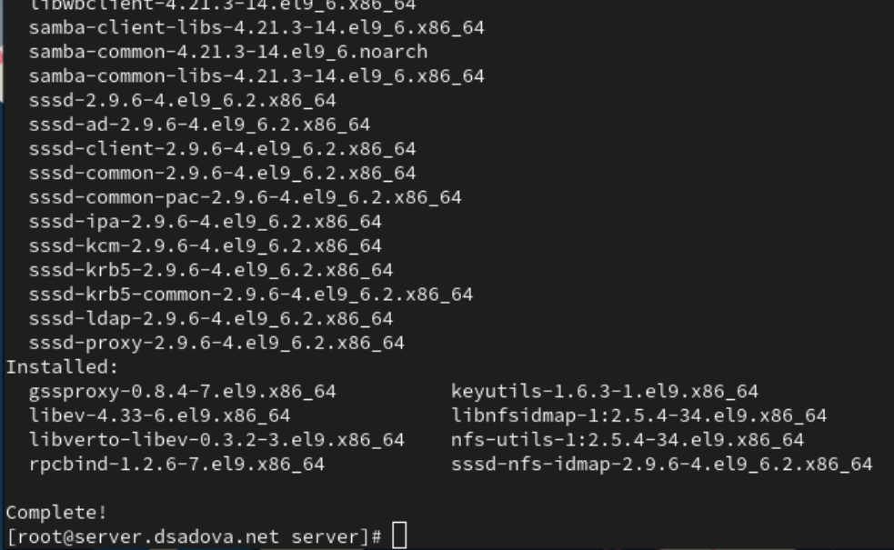{#fig:001 width=90%}

2. На сервере создайте каталог, который предполагается сделать доступным всем пользователям сети (корень дерева NFS):(рис. [-@fig:002])

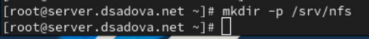{#fig:002 width=90%}

3. В файле /etc/exports пропишите подключаемый через NFS общий каталог с доступом только на чтение:(рис. [-@fig:003])

{#fig:003 width=90%}

4. Для общего каталога задайте контекст безопасности NFS:(рис. [-@fig:004])

{#fig:004 width=90%}

5. Примените изменённую настройку SELinux к файловой системе:(рис. [-@fig:005])

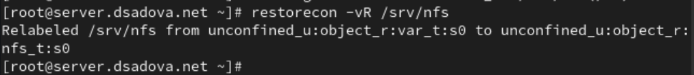{#fig:005 width=90%}

6. Запустите сервер NFS:(рис. [-@fig:006])

{#fig:006 width=90%}

7. Настройте межсетевой экран для работы сервера NFS:(рис. [-@fig:007])

{#fig:007 width=90%}

8. На клиенте установите необходимое для работы NFS программное обеспечение:(рис. [-@fig:008])

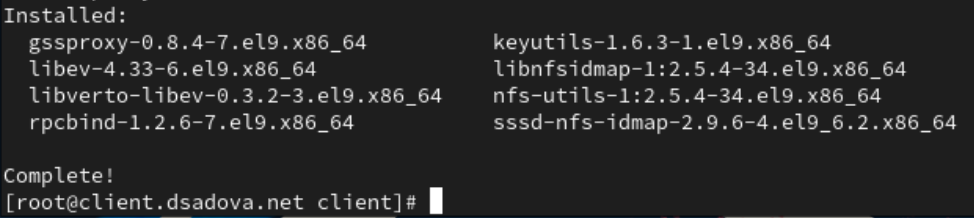{#fig:008 width=90%}

9. На клиенте попробуйте посмотреть имеющиеся подмонтированные удалённые ресурсы:(рис. [-@fig:009])

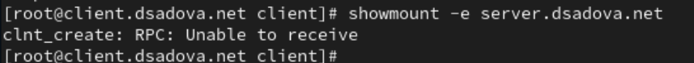{#fig:009 width=90%}

В отчёте поясните, что при этом происходит.

Ошибка RPC (Remote Procedure Call) — указывает на проблему связи между клиентом и сервером NFS через протокол удалённого вызова процедур. RPC используется NFS для взаимодействия между клиентом и сервером.

10. Попробуйте на сервере остановить сервис межсетевого экрана:(рис. [-@fig:010])

{#fig:010 width=90%}

Затем на клиенте вновь попробуйте подключиться к удалённо смонтированному ресурсу:(рис. [-@fig:011])

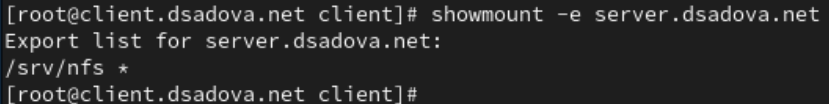{#fig:011 width=90%}

В отчёте поясните, что при этом происходит.

1. NFS-сервер доступен и отвечает — в отличие от предыдущей попытки, теперь клиент успешно устанавливает RPC-соединение с сервером.
2. Получен список экспортируемых ресурсов — сервер server.dsadova.net экспортирует (предоставляет в общий доступ) директорию /srv/nfs.
3. Права доступа — символ * означает, что данный ресурс доступен для монтирования всеми клиентам (без ограничений по IP-адресам или сетям).

11. На сервере запустите сервис межсетевого экрана(рис. [-@fig:012])

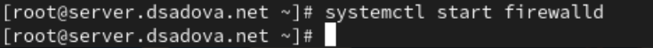{#fig:012 width=90%}

12. На сервере посмотрите, какие службы задействованы при удалённом монтировании:(рис. [-@fig:013]),(рис. [-@fig:014])

{#fig:013 width=90%}

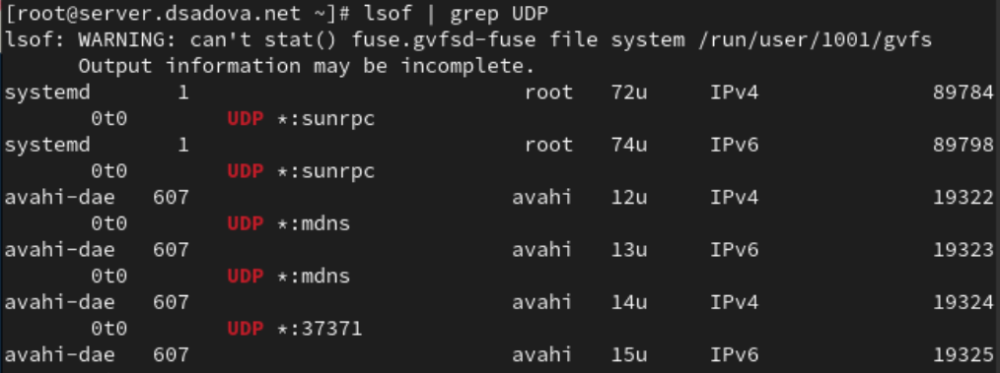{#fig:014 width=90%}

13. Добавьте службы rpc-bind и mountd в настройки межсетевого экрана на сервере:(рис. [-@fig:015])

{#fig:015 width=90%}

14. На клиенте проверьте подключение удалённого ресурса:(рис. [-@fig:016])

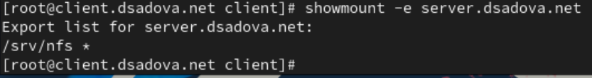{#fig:016 width=90%}

### Монтирование NFS на клиенте

1. На клиенте создайте каталог, в который будет монтироваться удалённый ресурс, и подмонтируйте дерево NFS:(рис. [-@fig:017])

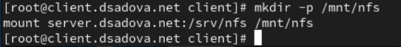{#fig:017 width=90%}

2. Проверьте, что общий ресурс NFS подключён правильно:(рис. [-@fig:018])

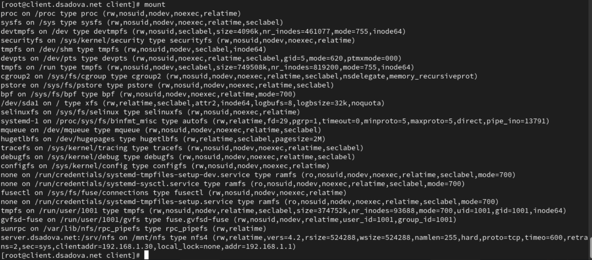{#fig:018 width=90%}

В отчёте поясните выведенную информацию о монтировании удалённого ресурса.

NFS-ресурс подключён правильно и готов к использованию. Клиент может читать и записывать файлы в директорию /mnt/nfs, которые фактически будут храниться на сервере server.dsadova.net в директории /srv/nfs.

3. На клиенте в конце файла /etc/fstab добавьте следующую запись:(рис. [-@fig:019])

{#fig:019 width=90%}

В отчёте поясните синтаксис этой записи.

- server.dsadova.net:/srv/nfs — устройство/источник монтирования

- /mnt/nfs — точка монтирования. Локальная директория, в которую будет монтироваться удалённый ресурс

- nfs — тип файловой системы. Указывает, что это NFS (Network File System)

- _netdev — опции монтирования. Без этой опции система может попытаться смонтировать NFS до инициализации сети, что приведёт к ошибке

- 0 — поле для dump

- 0 — поле для fsck

4. На клиенте проверьте наличие автоматического монтирования удалённых ресурсов при запуске операционной системы:(рис. [-@fig:020])

{#fig:020 width=90%}

5. Перезапустите клиента и убедитесь, что удалённый ресурс подключается автоматически.(рис. [-@fig:021])

{#fig:021 width=90%}

### Подключение каталогов к дереву NFS

1. На сервере создайте общий каталог, в который затем будет подмонтирован каталог с контентом веб-сервера:(рис. [-@fig:022])

{#fig:022 width=90%}

2. Подмонтируйте каталог web-сервера:(рис. [-@fig:023])

{#fig:023 width=90%}

3. На сервере проверьте, что отображается в каталоге /srv/nfs.(рис. [-@fig:024])

{#fig:024 width=90%}

4. На клиенте посмотрите, что отображается в каталоге /mnt/nfs.(рис. [-@fig:025])

{#fig:025 width=90%}

5. На сервере в файле /etc/exports добавьте экспорт каталога веб-сервера с удалённого ресурса:(рис. [-@fig:026])

{#fig:026 width=90%}

6. Экспортируйте все каталоги, упомянутые в файле /etc/exports:(рис. [-@fig:027])

{#fig:027 width=90%}

7. Проверьте на клиенте каталог /mnt/nfs.

8. На сервере в конце файла /etc/fstab добавьте следующую запись:(рис. [-@fig:029])

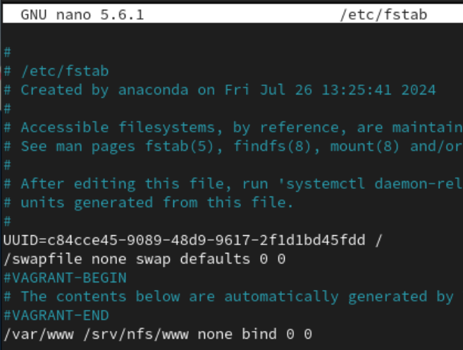{#fig:029 width=90%}

9. Повторно экспортируйте каталоги, указанные в файле /etc/exports:(рис. [-@fig:030])

{#fig:030 width=90%}

10. На клиенте проверьте каталог /mnt/nfs.(рис. [-@fig:031])

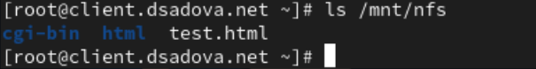{#fig:031 width=90%}

### Подключение каталогов для работы пользователей

1. На сервере под пользователем user в его домашнем каталоге создайте каталог common с полными правами доступа только для этого пользователя, а в нём файл user@server.txt (вместо user укажите свой логин):(рис. [-@fig:032])

{#fig:032 width=90%}

2. На сервере создайте общий каталог для работы пользователя user по сети:(рис. [-@fig:033])

{#fig:033 width=90%}

3. Подмонтируйте каталог common пользователя user в NFS (вместо user укажите свой логин):(рис. [-@fig:034])

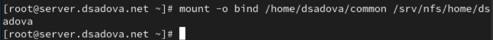{#fig:034 width=90%}

В отчёте укажите, какие права доступа установлены на этот каталог.

Каталог /home/dsadova/common создан с правами 700 (drwx------), что означает:

- Только владелец (пользователь dsadova) имеет полный доступ к каталогу

- Все остальные пользователи (включая членов группы) не могут просматривать, читать или изменять содержимое этого каталога

4. Подключите каталог пользователя в файле /etc/exports, прописав в нём:(рис. [-@fig:035])

{#fig:035 width=90%}

5. Внесите изменения в файл /etc/fstab (вместо user укажите свой логин):(рис. [-@fig:036])

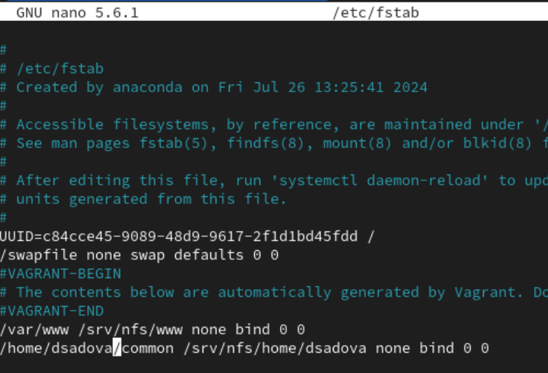{#fig:036 width=90%}

6. Повторно экспортируйте каталоги:(рис. [-@fig:037])

{#fig:037 width=90%}

7. На клиенте проверьте каталог /mnt/nfs.

8. На клиенте под пользователем user перейдите в каталог /mnt/nfs/home/user и попробуйте создать в нём файл user@client.txt и внести в него какие-либо изменения:(рис. [-@fig:038]),(рис. [-@fig:039]),(рис. [-@fig:040])

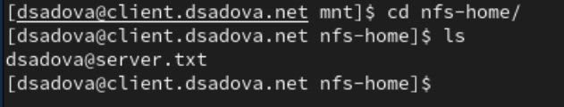{#fig:038 width=90%}

{#fig:039 width=90%}

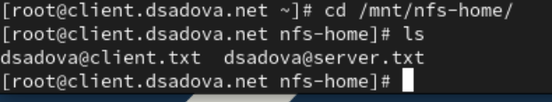{#fig:040 width=90%}

Попробуйте проделать это под пользователем root.

9. На сервере посмотрите, появились ли изменения в каталоге пользователя(рис. [-@fig:041])

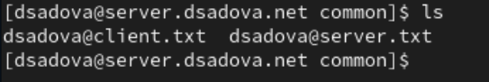{#fig:041 width=90%}

### Внесение изменений в настройки внутреннего окружения виртуальных машин

1. На виртуальной машине server перейдите в каталог для внесения изменений в настройки внутреннего окружения /vagrant/provision/server/, создайте в нём каталог nfs, в который поместите в соответствующие подкаталоги конфигурационные файлы:(рис. [-@fig:042])

{#fig:042 width=90%}

2. В каталоге /vagrant/provision/server создайте исполняемый файл nfs.sh.Открыв его на редактирование, пропишите в нём следующий скрипт: (рис. [-@fig:043])

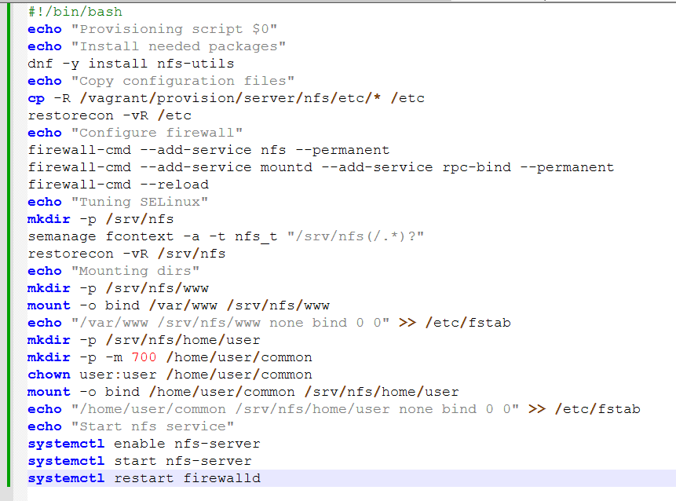{#fig:043 width=90%}

3. На виртуальной машине client перейдите в каталог для внесения изменений в настройки внутреннего окружения /vagrant/provision/client/.

4. В каталоге /vagrant/provision/client создайте исполняемый файл nfs.sh. Открыв его на редактирование, пропишите в нём следующий скрипт:(рис. [-@fig:045])

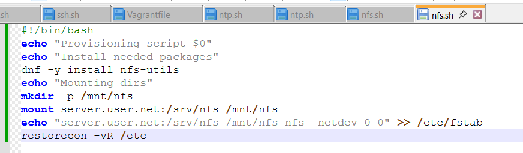{#fig:045 width=90%}

5. Для отработки созданных скриптов во время загрузки виртуальных машин server и client в конфигурационном файле Vagrantfile необходимо добавить в соответствующих разделах конфигураций для сервера и клиента:(рис. [-@fig:046])

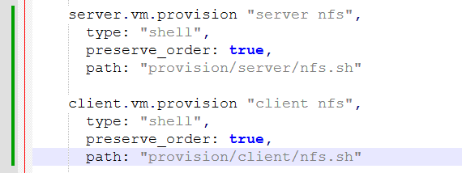{#fig:046 width=90%}

# Выводы

Приобрели практические навыки настройки сервера NFS для удалённого доступа к ресурсам.

# Список литературы{.unnumbered}

::: {#refs}
:::
