---
## Front matter
lang: ru-RU
title: Лабораторная работа № 14.
subtitle: Настройка файловых служб Samba
author:
  - Cадова Д. А.
institute:
  - Российский университет дружбы народов, Москва, Россия

## i18n babel
babel-lang: russian
babel-otherlangs: english
## Fonts
mainfont: PT Serif
romanfont: PT Serif
sansfont: PT Sans
monofont: PT Mono
mainfontoptions: Ligatures=TeX
romanfontoptions: Ligatures=TeX
sansfontoptions: Ligatures=TeX,Scale=MatchLowercase
monofontoptions: Scale=MatchLowercase,Scale=0.9

## Formatting pdf
toc: false
toc-title: Содержание
slide_level: 2
aspectratio: 169
section-titles: true
theme: metropolis
header-includes:
 - \metroset{progressbar=frametitle,sectionpage=progressbar,numbering=fraction}
 - '\makeatletter'
 - '\beamer@ignorenonframefalse'
 - '\makeatother'
---

# Информация

## Докладчик

:::::::::::::: {.columns align=center}
::: {.column width="70%"}

  * Садова Диана Алексеевна
  * студент бакалавриата
  * Российский университет дружбы народов
  * [113229118@pfur.ru]
  * <https://DianaSadova.github.io/ru/>

:::
::::::::::::::

# Вводная часть

## Актуальность

- Возможности Samba по созданию контроллеров домена и интеграции с существующей инфраструктурой Microsoft делают её стратегически важным решением для построения масштабируемых и экономически эффективных корпоративных сетей.

## Цели и задачи

- Приобретение навыков настройки доступа групп пользователей к общим ресурсам по протоколу SMB.

## Материалы и методы

- Текст лабороторной работы № 14
- Интеранет для устранения ошибок 

## Содержание 

1. Установите и настройте сервер Samba.
2. Настройте на клиенте доступ к разделяемым ресурсам.
3. Напишите скрипты для Vagrant, фиксирующие действия по установке и настройке сервера Samba для доступа к разделяемым ресурсам во внутреннем окружении виртуальных машин server и client. Соответствующим образом необходимо внести изменения в Vagrantfile.

## Настройка сервера Samba

1. На сервере установите необходимые пакеты:

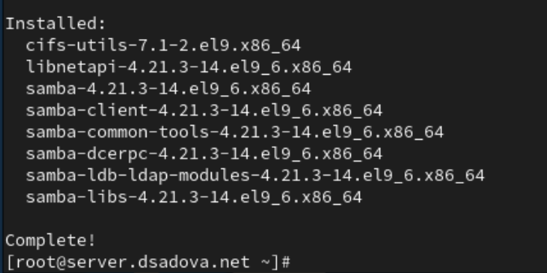

##

2. Создайте группу sambagroup для пользователей, которые будут работать с Samba-сервером, и присвойте ей GID 1010:

##

3. Добавьте пользователя user к группе sambagroup:

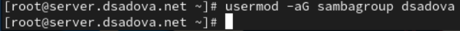

##

4. Создайте общий каталог в файловой системе Linux, в который предполагается монтировать разделяемые ресурсы:

##

5. В файле конфигурации /etc/samba/smb.conf:

(a) измените параметр рабочей группы (вместо USER укажите имя (логин) вашего пользователя):

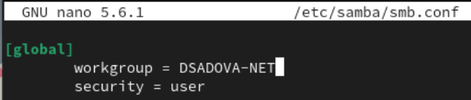

##

(b) в конце файла добавьте раздел с описанием общего доступа к разделяемому ресурсу /srv/sambashare:

##

6. Убедитесь, что вы не сделали синтаксических ошибок в файле smb.conf.

7. Запустите демон Samba и посмотрите его статус:

##

8. Для проверки наличия общего доступа попробуйте подключиться к серверу с помощью smbclient:

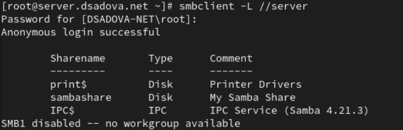

##

9. Посмотрите файл конфигурации межсетевого экрана для Samba:

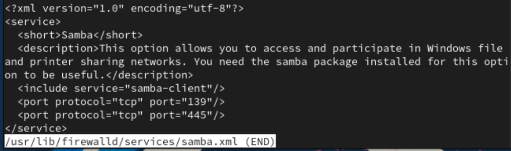

##

10. Настройте межсетевой экран:

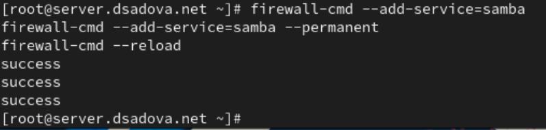

##

11. Настройте права доступа для каталога с разделяемым ресурсом:

##

12. Посмотрите контекст безопасности SELinux:

##

13. Настройте контекст безопасности SELinux для каталога с разделяемым ресурсом:

##

14. Проверьте, что контекст безопасности изменился:

##

15. Разрешите экспортировать разделяемые ресурсы для чтения и записи:

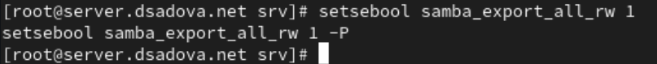

##

16. Посмотрите UID вашего пользователя и в какие группы он включён:

##

17. Под вашим пользователем user попробуйте создать файл на разделяемом ресурсе:

##

18. Добавьте вашего пользователя user в базу пользователей Samba :

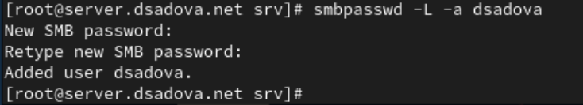

## Монтирование файловой системы Samba на клиенте

1. На клиенте установите необходимые пакеты:

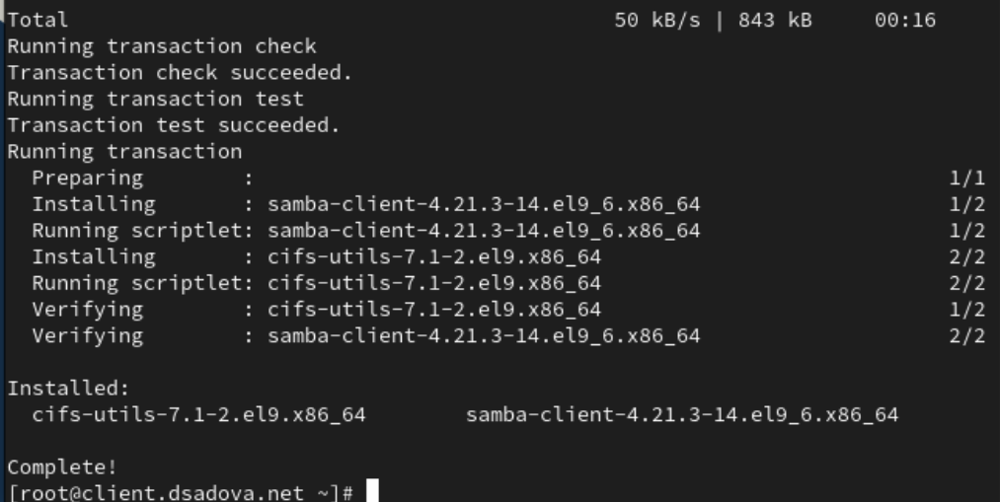

##

2. На клиенте посмотрите файл конфигурации межсетевого экрана для клиента Samba:

##

3. На клиенте настройте межсетевой экран:

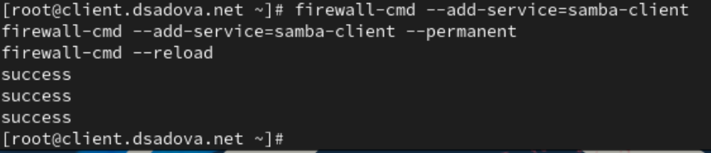

##

4. На клиенте создайте группу sambagroup и добавьте в неё пользователя user :

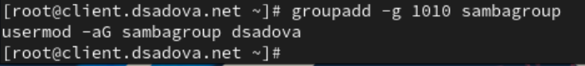

##

5. На клиенте в файле конфигурации /etc/samba/smb.conf измените параметр рабочей группы:

##

6. Для проверки наличия общего доступа попробуйте подключиться с клиента к серверу с помощью smbclient:

##

В отчёте укажите, под какой учётной записью вы просматриваете ресурсы сервера.

Подключение к серверу выполнено с анонимным доступом. Это означает, что просмотр общих ресурсов сервера осуществляется без использования учётной записи пользователя.

##

7. Подключитесь с клиента к серверу с помощью smbclient под учётной записью вашего пользователя:

##

В отчёте укажите, под какой учётной записью вы просматриваете ресурсы сервера.

Просмотр общих ресурсов сервера выполняется под учётной записью пользователя dsadova.

##

8. На клиенте создайте точку монтирования:

##

9. На клиенте получите доступ к общему ресурсу с помощью mount. При появлении запроса пароля введите пароль SMB-пользователя.

##

10. Убедитесь, что user может записывать файлы на разделяемом ресурсе:

##

11. Отмонтируйте каталог /mnt/samba:

##

12. Для настройки работы с Samba с помощью файла учётных данных:

(a) на клиенте создайте файл smbusers в каталоге /etc/samba/:

##

с содержанием следующего формата:

##

(b) На клиенте в файле /etc/fstab добавьте следующую строку:

##

(c) Подмонтируйте общий ресурс:

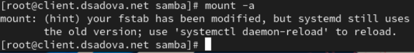

##

13. Убедившись, что ресурс монтируется, вы можете перезагрузить клиента для проверки, что ресурс монтируется и после перезагрузки, а у пользователя есть доступ к разделяемым ресурсам.

## Внесение изменений в настройки внутреннего окружения виртуальных машин

1. На виртуальной машине server перейдите в каталог для внесения изменений в настройки внутреннего окружения /vagrant/provision/server/, создайте в нём каталог smb, в который поместите в соответствующие подкаталоги конфигурационные файлы:

##

2. В каталоге /vagrant/provision/server создайте исполняемый файл smb.sh. Открыв его на редактирование, пропишите в нём следующий скрипт:

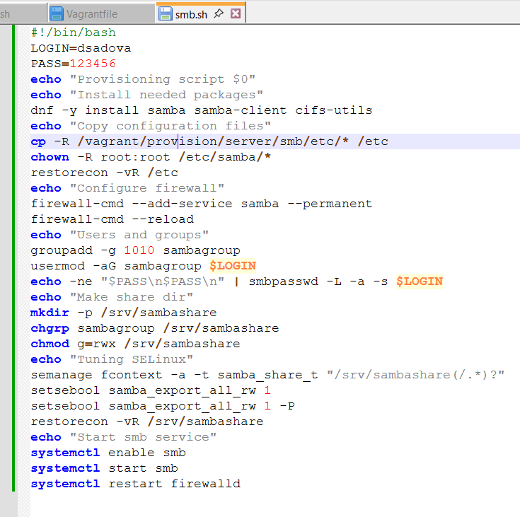

##

3. На виртуальной машине client перейдите в каталог для внесения изменений в настройки внутреннего окружения /vagrant/provision/client/, создайте в нём каталог smb, в который поместите в соответствующие подкаталоги конфигурационные файлы:

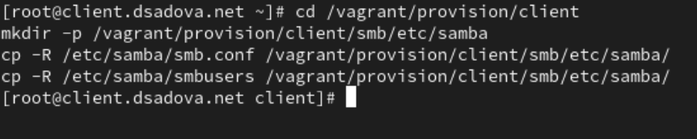

##

4. В каталоге /vagrant/provision/client создайте исполняемый файл smb.sh. Открыв его на редактирование, пропишите в нём следующий скрипт:

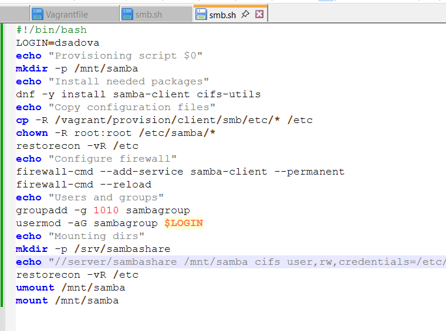

##

5. Для отработки созданных скриптов во время загрузки виртуальных машин server и client в конфигурационном файле Vagrantfile необходимо добавить в соответствующих разделах конфигураций для сервера и клиента:

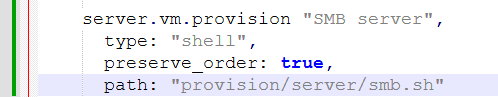

## Результаты

- Приобрели навыки по настройке доступа групп пользователей к общим ресурсам по протоколу SMB.

