---
## Front matter
title: "Лабораторная работа № 14."
subtitle: "Настройка файловых служб Samba"
author: "Диана Алексеевна Садова"

## Generic otions
lang: ru-RU
toc-title: "Содержание"

## Bibliography
bibliography: bib/cite.bib
csl: pandoc/csl/gost-r-7-0-5-2008-numeric.csl

## Pdf output format
toc: true # Table of contents
toc-depth: 2
lof: true # List of figures
lot: true # List of tables
fontsize: 12pt
linestretch: 1.5
papersize: a4
documentclass: scrreprt
## I18n polyglossia
polyglossia-lang:
  name: russian
  options:
	- spelling=modern
	- babelshorthands=true
polyglossia-otherlangs:
  name: english
## I18n babel
babel-lang: russian
babel-otherlangs: english
## Fonts
mainfont: PT Serif
romanfont: PT Serif
sansfont: PT Sans
monofont: PT Mono
mainfontoptions: Ligatures=TeX
romanfontoptions: Ligatures=TeX
sansfontoptions: Ligatures=TeX,Scale=MatchLowercase
monofontoptions: Scale=MatchLowercase,Scale=0.9
## Biblatex
biblatex: true
biblio-style: "gost-numeric"
biblatexoptions:
  - parentracker=true
  - backend=biber
  - hyperref=auto
  - language=auto
  - autolang=other*
  - citestyle=gost-numeric
## Pandoc-crossref LaTeX customization
figureTitle: "Рис."
tableTitle: "Таблица"
listingTitle: "Листинг"
lofTitle: "Список иллюстраций"
lotTitle: "Список таблиц"
lolTitle: "Листинги"
## Misc options
indent: true
header-includes:
  - \usepackage{indentfirst}
  - \usepackage{float} # keep figures where there are in the text
  - \floatplacement{figure}{H} # keep figures where there are in the text
---

# Цель работы

Приобретение навыков настройки доступа групп пользователей к общим ресурсам по протоколу SMB.

# Задание

1. Установите и настройте сервер Samba.
2. Настройте на клиенте доступ к разделяемым ресурсам.
3. Напишите скрипты для Vagrant, фиксирующие действия по установке и настройке сервера Samba для доступа к разделяемым ресурсам во внутреннем окружении виртуальных машин server и client. Соответствующим образом необходимо внести изменения в Vagrantfile.

## Последовательность выполнения работы

### Настройка сервера Samba

1. На сервере установите необходимые пакеты:(рис. [-@fig:001])

{#fig:001 width=90%}

2. Создайте группу sambagroup для пользователей, которые будут работать с Samba-сервером, и присвойте ей GID 1010:(рис. [-@fig:002])

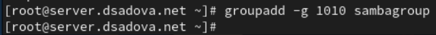{#fig:002 width=90%}

3. Добавьте пользователя user к группе sambagroup (вместо user используйте ваш логин):(рис. [-@fig:003])

{#fig:003 width=90%}

4. Создайте общий каталог в файловой системе Linux, в который предполагается монтировать разделяемые ресурсы:(рис. [-@fig:004])

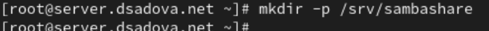{#fig:004 width=90%}

5. В файле конфигурации /etc/samba/smb.conf:

(a) измените параметр рабочей группы (вместо USER укажите имя (логин) вашего пользователя):(рис. [-@fig:005])

{#fig:005 width=90%}

(b) в конце файла добавьте раздел с описанием общего доступа к разделяемому ресурсу /srv/sambashare:(рис. [-@fig:006])

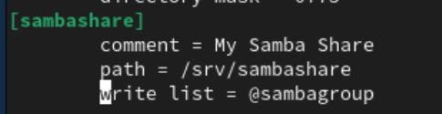{#fig:006 width=90%}

6. Убедитесь, что вы не сделали синтаксических ошибок в файле smb.conf.

7. Запустите демон Samba и посмотрите его статус:(рис. [-@fig:007])

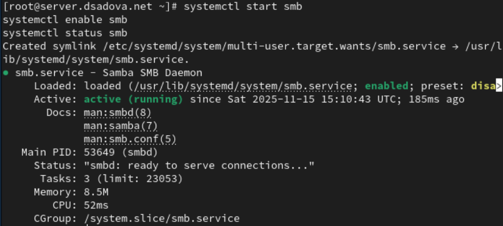{#fig:007 width=90%}

8. Для проверки наличия общего доступа попробуйте подключиться к серверу с помощью smbclient:(рис. [-@fig:008])

{#fig:008 width=90%}

9. Посмотрите файл конфигурации межсетевого экрана для Samba:(рис. [-@fig:009])

{#fig:009 width=90%}

10. Настройте межсетевой экран:(рис. [-@fig:010])

{#fig:010 width=90%}

11. Настройте права доступа для каталога с разделяемым ресурсом:(рис. [-@fig:011])

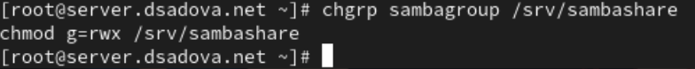{#fig:011 width=90%}

12. Посмотрите контекст безопасности SELinux:(рис. [-@fig:012])

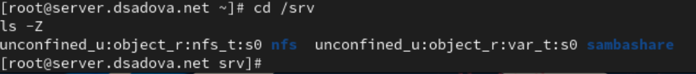{#fig:012 width=90%}

13. Настройте контекст безопасности SELinux для каталога с разделяемым ресурсом:(рис. [-@fig:013])

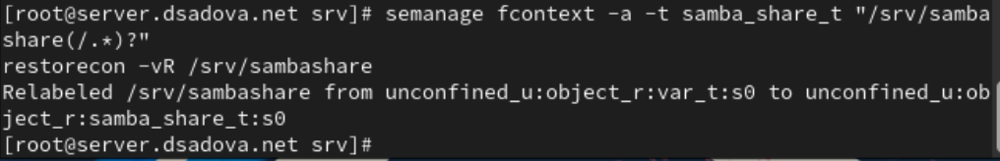{#fig:013 width=90%}

14. Проверьте, что контекст безопасности изменился:(рис. [-@fig:014])

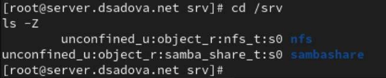{#fig:014 width=90%}

15. Разрешите экспортировать разделяемые ресурсы для чтения и записи:(рис. [-@fig:015])

{#fig:015 width=90%}

16. Посмотрите UID вашего пользователя и в какие группы он включён:(рис. [-@fig:016])

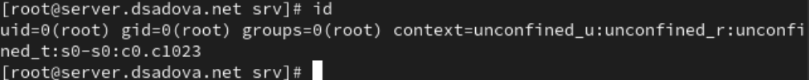{#fig:016 width=90%}

17. Под вашим пользователем user попробуйте создать файл на разделяемом ресурсе (вместо user используйте ваш логин):(рис. [-@fig:017])

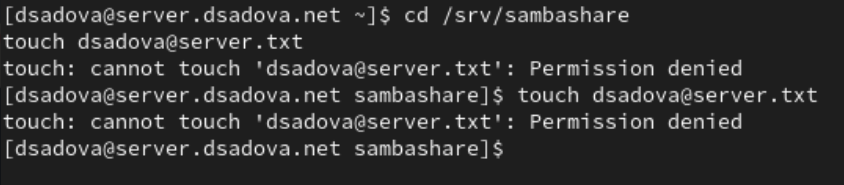{#fig:017 width=90%}

18. Добавьте вашего пользователя user в базу пользователей Samba (вместо user используйте ваш логин):(рис. [-@fig:018])

{#fig:018 width=90%}

### Монтирование файловой системы Samba на клиенте

1. На клиенте установите необходимые пакеты:(рис. [-@fig:019])

{#fig:019 width=90%}

2. На клиенте посмотрите файл конфигурации межсетевого экрана для клиента Samba:(рис. [-@fig:020])

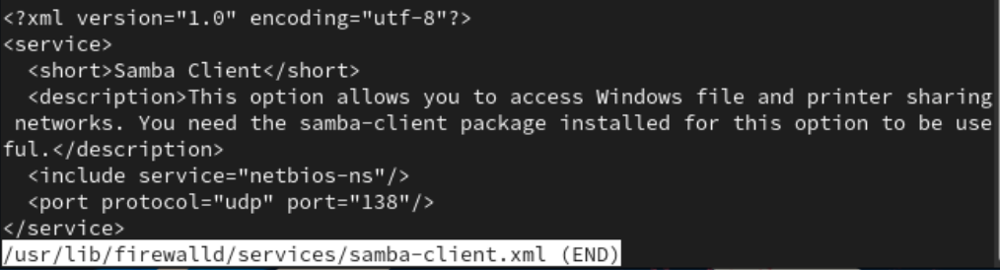{#fig:020 width=90%}

3. На клиенте настройте межсетевой экран:(рис. [-@fig:021])

{#fig:021 width=90%}

4. На клиенте создайте группу sambagroup и добавьте в неё пользователя user (вместо user используйте ваш логин):(рис. [-@fig:022])

{#fig:022 width=90%}

5. На клиенте в файле конфигурации /etc/samba/smb.conf измените параметр рабочей группы:(рис. [-@fig:023])

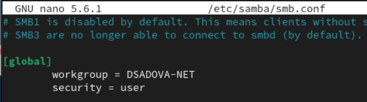{#fig:023 width=90%}

6. Для проверки наличия общего доступа попробуйте подключиться с клиента к серверу с помощью smbclient:(рис. [-@fig:024])

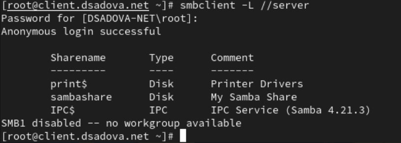{#fig:024 width=90%}

В отчёте укажите, под какой учётной записью вы просматриваете ресурсы сервера.

Подключение к серверу выполнено с анонимным доступом. Это означает, что просмотр общих ресурсов сервера осуществляется без использования учётной записи пользователя.

7. Подключитесь с клиента к серверу с помощью smbclient под учётной записью вашего пользователя:(рис. [-@fig:025])

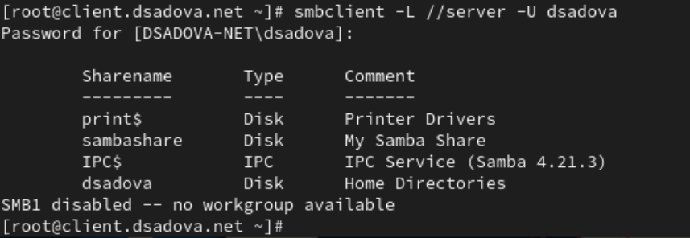{#fig:025 width=90%}

В отчёте укажите, под какой учётной записью вы просматриваете ресурсы сервера.

Просмотр общих ресурсов сервера выполняется под учётной записью пользователя dsadova.

8. На клиенте создайте точку монтирования:(рис. [-@fig:026])

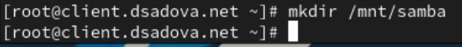{#fig:026 width=90%}

9. На клиенте получите доступ к общему ресурсу с помощью mount. При появлении запроса пароля введите пароль SMB-пользователя.(рис. [-@fig:027])

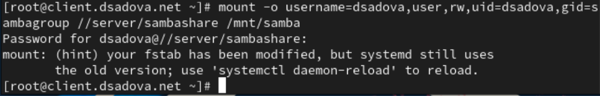{#fig:027 width=90%}

10. Убедитесь, что user может записывать файлы на разделяемом ресурсе:(рис. [-@fig:030])

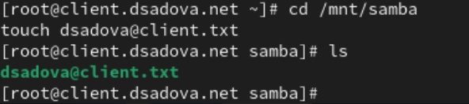{#fig:030 width=90%}

11. Отмонтируйте каталог /mnt/samba:(рис. [-@fig:031])

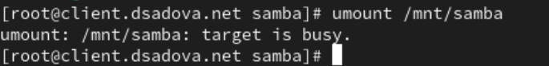{#fig:031 width=90%}

12. Для настройки работы с Samba с помощью файла учётных данных:

(a) на клиенте создайте файл smbusers в каталоге /etc/samba/:(рис. [-@fig:032])

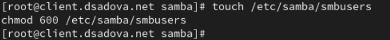{#fig:032 width=90%}

с содержанием следующего формата:(рис. [-@fig:033])

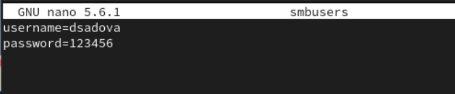{#fig:033 width=90%}

(b) На клиенте в файле /etc/fstab добавьте следующую строку (вместо user_name укажите ваш логин):(рис. [-@fig:034])

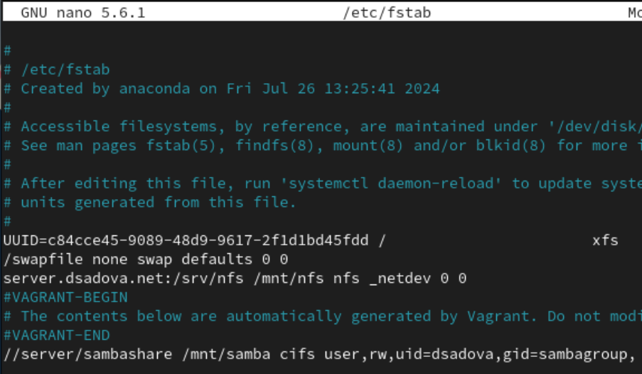{#fig:034 width=90%}

(c) Подмонтируйте общий ресурс:(рис. [-@fig:035])

{#fig:035 width=90%}

13. Убедившись, что ресурс монтируется, вы можете перезагрузить клиента для проверки, что ресурс монтируется и после перезагрузки, а у пользователя есть доступ к разделяемым ресурсам.(рис. [-@fig:036])

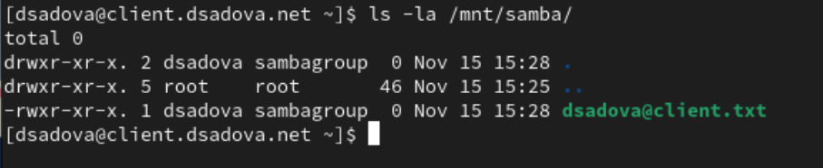{#fig:036 width=90%}

### Внесение изменений в настройки внутреннего окружения виртуальных машин

1. На виртуальной машине server перейдите в каталог для внесения изменений в настройки внутреннего окружения /vagrant/provision/server/, создайте в нём каталог smb, в который поместите в соответствующие подкаталоги конфигурационные файлы:(рис. [-@fig:037])

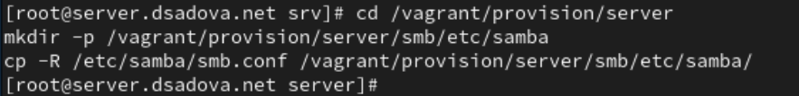{#fig:037 width=90%}

2. В каталоге /vagrant/provision/server создайте исполняемый файл smb.sh. Открыв его на редактирование, пропишите в нём следующий скрипт:(рис. [-@fig:038])

{#fig:038 width=90%}

3. На виртуальной машине client перейдите в каталог для внесения изменений в настройки внутреннего окружения /vagrant/provision/client/, создайте в нём каталог smb, в который поместите в соответствующие подкаталоги конфигурационные файлы:(рис. [-@fig:039])

{#fig:039 width=90%}

4. В каталоге /vagrant/provision/client создайте исполняемый файл smb.sh. Открыв его на редактирование, пропишите в нём следующий скрипт:(рис. [-@fig:040])

{#fig:040 width=90%}

5. Для отработки созданных скриптов во время загрузки виртуальных машин server и client в конфигурационном файле Vagrantfile необходимо добавить в соответствующих разделах конфигураций для сервера и клиента:(рис. [-@fig:041])

{#fig:041 width=90%}

# Выводы

Приобрели навыки по настройке доступа групп пользователей к общим ресурсам по протоколу SMB.

# Список литературы{.unnumbered}

::: {#refs}
:::
