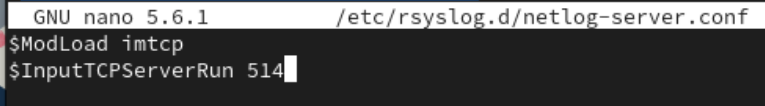
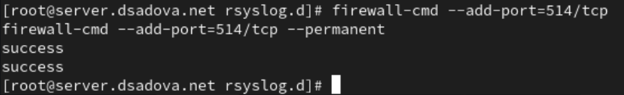
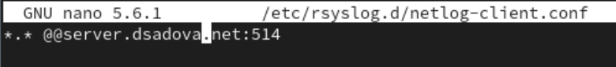
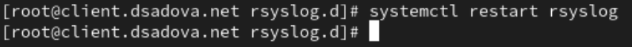
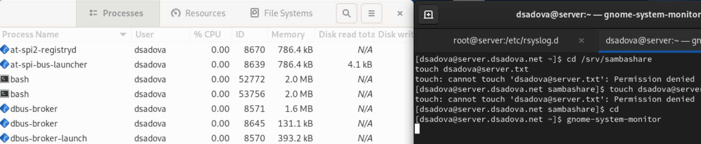
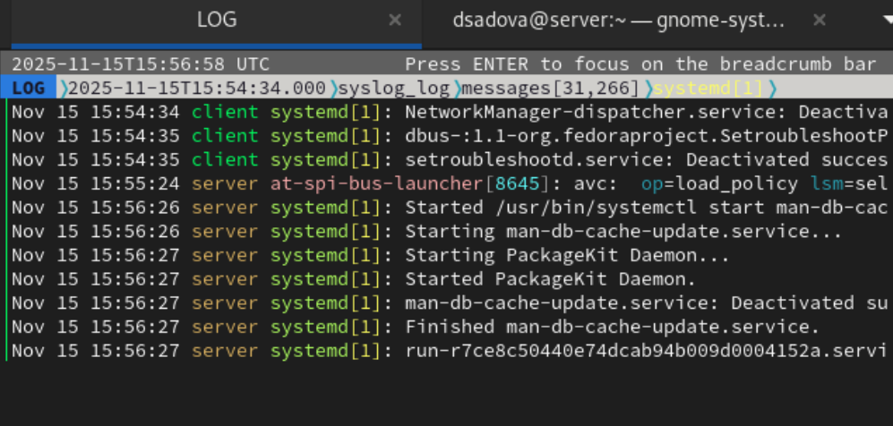
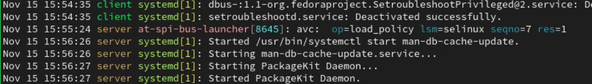
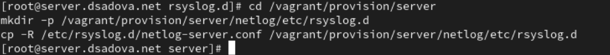
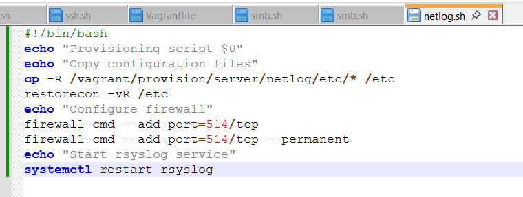
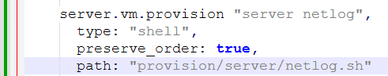

---
## Front matter
lang: ru-RU
title: Лабораторная работа № 15.
subtitle: Настройка сетевого журналирования
author:
  - Cадова Д. А.
institute:
  - Российский университет дружбы народов, Москва, Россия

## i18n babel
babel-lang: russian
babel-otherlangs: english
## Fonts
mainfont: PT Serif
romanfont: PT Serif
sansfont: PT Sans
monofont: PT Mono
mainfontoptions: Ligatures=TeX
romanfontoptions: Ligatures=TeX
sansfontoptions: Ligatures=TeX,Scale=MatchLowercase
monofontoptions: Scale=MatchLowercase,Scale=0.9

## Formatting pdf
toc: false
toc-title: Содержание
slide_level: 2
aspectratio: 169
section-titles: true
theme: metropolis
header-includes:
 - \metroset{progressbar=frametitle,sectionpage=progressbar,numbering=fraction}
 - '\makeatletter'
 - '\beamer@ignorenonframefalse'
 - '\makeatother'
---

# Информация

## Докладчик

:::::::::::::: {.columns align=center}
::: {.column width="70%"}

  * Садова Диана Алексеевна
  * студент бакалавриата
  * Российский университет дружбы народов
  * [113229118@pfur.ru]
  * <https://DianaSadova.github.io/ru/>

:::
::::::::::::::

# Вводная часть

## Актуальность

- В современных микросервисных архитектурах и облачных средах централизация логов критически важна для мониторинга.

## Цели и задачи

- Получение навыков по работе с журналами системных событий.

## Материалы и методы

- Текст лабороторной работы № 15
- Интеранет для устранения ошибок 

## Содержание 

1. Настройте сервер сетевого журналирования событий.
2. Настройте клиент для передачи системных сообщений в сетевой журнал на сервере.
3. Просмотрите журналы системных событий с помощью нескольких программ. При наличии сообщений о некорректной работе сервисов исправьте ошибки в настройках соответствующих служб.
4. Напишите скрипты для Vagrant, фиксирующие действия по установке и настройке сетевого сервера журналирования 

## Настройка сервера сетевого журнала

1. На сервере создайте файл конфигурации сетевого хранения журналов:

##

2. В файле конфигурации /etc/rsyslog.d/netlog-server.conf включите приём записей журнала по TCP-порту 514:

##

3. Перезапустите службу rsyslog и посмотрите, какие порты, связанные с rsyslog, прослушиваются:

##

4. На сервере настройте межсетевой экран для приёма сообщений по TCP-порту 514:

## Настройка клиента сетевого журнала

1. На клиенте создайте файл конфигурации сетевого хранения журналов:

##

2. На клиенте в файле конфигурации /etc/rsyslog.d/netlog-client.conf включите перенаправление сообщений журнала на 514 TCP-порт сервера (вместо user укажите свой логин):

##

3. Перезапустите службу rsyslog:

## Просмотр журнала

1. На сервере просмотрите один из файлов журнала

##

2. На сервере под пользователем запустите графическую программу для просмотра журналов:

##

3. На сервере установите просмотрщик журналов системных сообщений lnav или его аналог:

##

4. Просмотрите логи с помощью lnav или его аналога:

##

Просмотрите записи с сервера и клиента.

##

Информация с сервера:

- 15:55:24 - операция с SELinux: avc: op=load_policy lsm=selinux seqno=7 res=1. Загрузка/обновление политики SELinux (успешно)

- 15:56:26-15:56:27 - серия системных задач: 
	1) Запуск обновления кэша документации (man-db-cache-update.service). 
	2) Старт демона управления пакетами (PackageKit Daemon). 

##

Информация с клиента:

- 15:54:34 - остановка службы NetworkManager-dispatcher.service (деактивация)

- 15:54:35 - остановка двух связанных служб:
	1) dbus--:1.1-org.fedoraproject.SetroubleshootPrivileged@2.service. 
	2) setroubleshootd.service (диагностика SELinux)

Как мы можем видеть, логи демонстрируют нормальную эксплуатацию систем без аномалий или сбоев. Все зафиксированные операции являются частью стандартного жизненного цикла системных служб в Linux-среде.

## Внесение изменений в настройки внутреннего окружения виртуальных машин

1. На виртуальной машине server перейдите в каталог для внесения изменений в настройки внутреннего окружения /vagrant/provision/server/, создайте в нём каталог netlog, в который поместите в соответствующие подкаталоги конфигурационные файлы:

##

2. В каталоге /vagrant/provision/server создайте исполняемый файл netlog.sh. Открыв его на редактирование, пропишите в нём следующий скрипт:

##

3. На виртуальной машине client перейдите в каталог для внесения изменений в настройки внутреннего окружения /vagrant/provision/client/, создайте в нём каталог nentlog, в который поместите в соответствующие подкаталоги конфигурационные файлы:

##

4. В каталоге /vagrant/provision/client создайте исполняемый файл netlog.sh. Открыв его на редактирование, пропишите в нём следующий скрипт:

##

5. Для отработки созданных скриптов во время загрузки виртуальных машин server и client в конфигурационном файле Vagrantfile необходимо добавить в соответствующих разделах конфигураций для сервера и клиента: 

##

## Результаты

- Получили навыки работы с журналами системных событий. Так же провели анализ некоторых записей.

