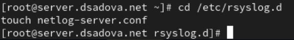
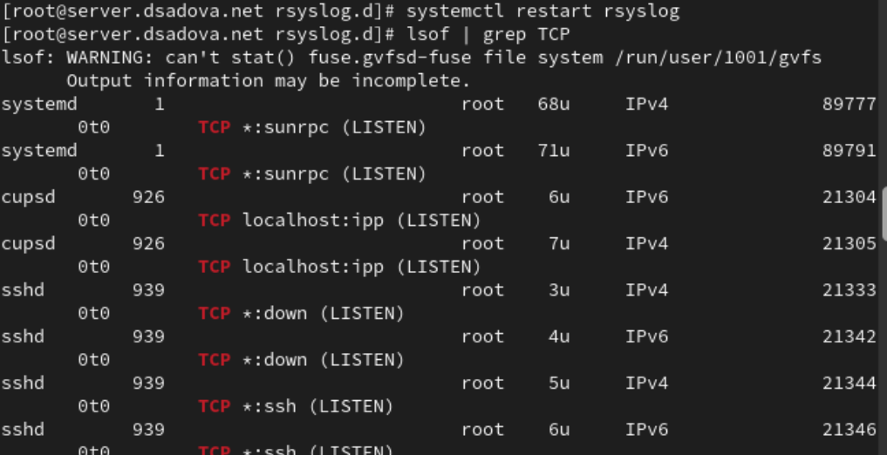
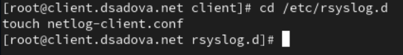
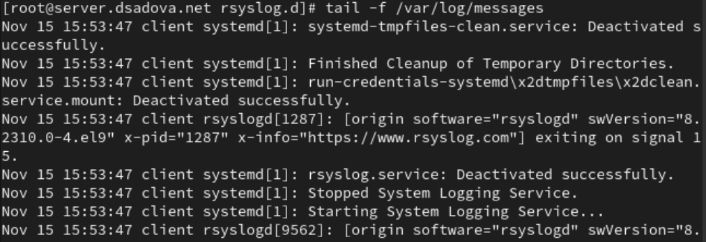
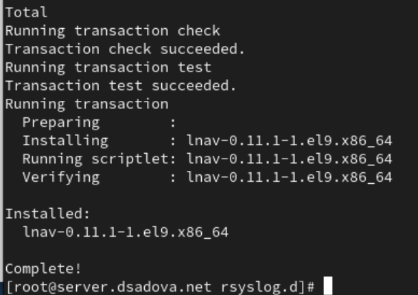
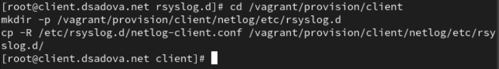
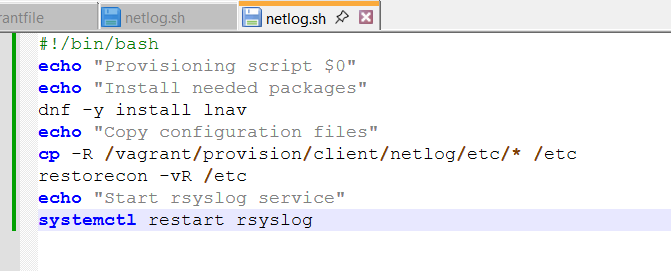
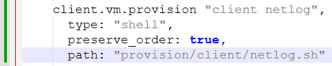

---
## Front matter
title: "Лабораторная работа № 15."
subtitle: "Настройка сетевого журналирования"
author: "Диана Алексеевна Садова"

## Generic otions
lang: ru-RU
toc-title: "Содержание"

## Bibliography
bibliography: bib/cite.bib
csl: pandoc/csl/gost-r-7-0-5-2008-numeric.csl

## Pdf output format
toc: true # Table of contents
toc-depth: 2
lof: true # List of figures
lot: true # List of tables
fontsize: 12pt
linestretch: 1.5
papersize: a4
documentclass: scrreprt
## I18n polyglossia
polyglossia-lang:
  name: russian
  options:
	- spelling=modern
	- babelshorthands=true
polyglossia-otherlangs:
  name: english
## I18n babel
babel-lang: russian
babel-otherlangs: english
## Fonts
mainfont: PT Serif
romanfont: PT Serif
sansfont: PT Sans
monofont: PT Mono
mainfontoptions: Ligatures=TeX
romanfontoptions: Ligatures=TeX
sansfontoptions: Ligatures=TeX,Scale=MatchLowercase
monofontoptions: Scale=MatchLowercase,Scale=0.9
## Biblatex
biblatex: true
biblio-style: "gost-numeric"
biblatexoptions:
  - parentracker=true
  - backend=biber
  - hyperref=auto
  - language=auto
  - autolang=other*
  - citestyle=gost-numeric
## Pandoc-crossref LaTeX customization
figureTitle: "Рис."
tableTitle: "Таблица"
listingTitle: "Листинг"
lofTitle: "Список иллюстраций"
lotTitle: "Список таблиц"
lolTitle: "Листинги"
## Misc options
indent: true
header-includes:
  - \usepackage{indentfirst}
  - \usepackage{float} # keep figures where there are in the text
  - \floatplacement{figure}{H} # keep figures where there are in the text
---

# Цель работы

Получение навыков по работе с журналами системных событий.

# Задание

1. Настройте сервер сетевого журналирования событий.
2. Настройте клиент для передачи системных сообщений в сетевой журнал на сервере.
3. Просмотрите журналы системных событий с помощью нескольких программ. При наличии сообщений о некорректной работе сервисов исправьте ошибки в настройках соответствующих служб.
4. Напишите скрипты для Vagrant, фиксирующие действия по установке и настройке сетевого сервера журналирования 

## Последовательность выполнения работы

### Настройка сервера сетевого журнала

1. На сервере создайте файл конфигурации сетевого хранения журналов:(рис. [-@fig:001])

{#fig:001 width=90%}

2. В файле конфигурации /etc/rsyslog.d/netlog-server.conf включите приём записей журнала по TCP-порту 514:(рис. [-@fig:002])

{#fig:002 width=90%}

3. Перезапустите службу rsyslog и посмотрите, какие порты, связанные с rsyslog, прослушиваются:(рис. [-@fig:003])

{#fig:003 width=90%}

4. На сервере настройте межсетевой экран для приёма сообщений по TCP-порту 514:(рис. [-@fig:004])

{#fig:004 width=90%}

### Настройка клиента сетевого журнала

1. На клиенте создайте файл конфигурации сетевого хранения журналов:(рис. [-@fig:005])

{#fig:005 width=90%}

2. На клиенте в файле конфигурации /etc/rsyslog.d/netlog-client.conf включите перенаправление сообщений журнала на 514 TCP-порт сервера (вместо user укажите свой логин):(рис. [-@fig:006])

{#fig:006 width=90%}

3. Перезапустите службу rsyslog:(рис. [-@fig:007])

{#fig:007 width=90%}

### Просмотр журнала

1. На сервере просмотрите один из файлов журнала(рис. [-@fig:008])

{#fig:008 width=90%}

Обратите внимание на имя хоста и другие сообщения о работе сервисов. При наличии сообщений о некорректной работе сервисов исправьте ошибки в настройках соответствующих служб.

Ошибок небыло.

2. На сервере под пользователем запустите графическую программу для просмотра журналов:(рис. [-@fig:009])

{#fig:009 width=90%}

3. На сервере установите просмотрщик журналов системных сообщений lnav или его аналог:(рис. [-@fig:010])

{#fig:010 width=90%}

4. Просмотрите логи с помощью lnav или его аналога:(рис. [-@fig:011])

{#fig:011 width=90%}

Просмотрите записи с сервера и клиента.(рис. [-@fig:012])

{#fig:012 width=90%}

Информация с сервера:

- 15:55:24 - операция с SELinux: avc: op=load_policy lsm=selinux seqno=7 res=1. Загрузка/обновление политики SELinux (успешно)

- 15:56:26-15:56:27 - серия системных задач: 
	1) Запуск обновления кэша документации (man-db-cache-update.service). 
	2) Старт демона управления пакетами (PackageKit Daemon). 

Информация с клиента:

- 15:54:34 - остановка службы NetworkManager-dispatcher.service (деактивация)

- 15:54:35 - остановка двух связанных служб:
	1) dbus--:1.1-org.fedoraproject.SetroubleshootPrivileged@2.service. 
	2) setroubleshootd.service (диагностика SELinux)

Как мы можем видеть, логи демонстрируют нормальную эксплуатацию систем без аномалий или сбоев. Все зафиксированные операции являются частью стандартного жизненного цикла системных служб в Linux-среде.

### Внесение изменений в настройки внутреннего окружения виртуальных машин

1. На виртуальной машине server перейдите в каталог для внесения изменений в настройки внутреннего окружения /vagrant/provision/server/, создайте в нём каталог netlog, в который поместите в соответствующие подкаталоги конфигурационные файлы:(рис. [-@fig:013])

{#fig:013 width=90%}

2. В каталоге /vagrant/provision/server создайте исполняемый файл netlog.sh. Открыв его на редактирование, пропишите в нём следующий скрипт:(рис. [-@fig:014])

{#fig:014 width=90%}

3. На виртуальной машине client перейдите в каталог для внесения изменений в настройки внутреннего окружения /vagrant/provision/client/, создайте в нём каталог nentlog, в который поместите в соответствующие подкаталоги конфигурационные файлы:(рис. [-@fig:015])

{#fig:015 width=90%}

4. В каталоге /vagrant/provision/client создайте исполняемый файл netlog.sh. Открыв его на редактирование, пропишите в нём следующий скрипт:(рис. [-@fig:016])

{#fig:016 width=90%}

5. Для отработки созданных скриптов во время загрузки виртуальных машин server и client в конфигурационном файле Vagrantfile необходимо добавить в соответствующих разделах конфигураций для сервера и клиента: (рис. [-@fig:017]),(рис. [-@fig:018])

{#fig:017 width=90%}

{#fig:018 width=90%}

# Выводы

Получили навыки работы с журналами системных событий. Так же провели анализ некоторых записей.

# Список литературы{.unnumbered}

::: {#refs}
:::
