---
## Front matter
lang: ru-RU
title: Лабораторная работа № 16.
subtitle: Базовая защита от атак типа «brute force»
author:
  - Cадова Д. А.
institute:
  - Российский университет дружбы народов, Москва, Россия

## i18n babel
babel-lang: russian
babel-otherlangs: english
## Fonts
mainfont: PT Serif
romanfont: PT Serif
sansfont: PT Sans
monofont: PT Mono
mainfontoptions: Ligatures=TeX
romanfontoptions: Ligatures=TeX
sansfontoptions: Ligatures=TeX,Scale=MatchLowercase
monofontoptions: Scale=MatchLowercase,Scale=0.9

## Formatting pdf
toc: false
toc-title: Содержание
slide_level: 2
aspectratio: 169
section-titles: true
theme: metropolis
header-includes:
 - \metroset{progressbar=frametitle,sectionpage=progressbar,numbering=fraction}
 - '\makeatletter'
 - '\beamer@ignorenonframefalse'
 - '\makeatother'
---

# Информация

## Докладчик

:::::::::::::: {.columns align=center}
::: {.column width="70%"}

  * Садова Диана Алексеевна
  * студент бакалавриата
  * Российский университет дружбы народов
  * [113229118@pfur.ru]
  * <https://DianaSadova.github.io/ru/>

:::
::::::::::::::

# Вводная часть

## Актуальность

- В условиях повсеместного перехода на облачные инфраструктуры, умение автоматизировать настройку Fail2ban через скрипты становится критически важным навыком.

## Цели и задачи

- Получить навыки работы с программным средством Fail2ban для обеспечения базовой защиты от атак типа «brute force»

## Материалы и методы

- Текст лабороторной работы № 16
- Интеранет для устранения ошибок 

## Содержание 

1. Установите и настройте Fail2ban для отслеживания работы установленных на сервере служб.
2. Проверьте работу Fail2ban посредством попыток несанкционированного доступа с клиента на сервер через SSH.
3. Напишите скрипт для Vagrant, фиксирующий действия по установке и настройке Fail2ban.

## Защита с помощью Fail2ban

1. На сервере установите fail2ban:

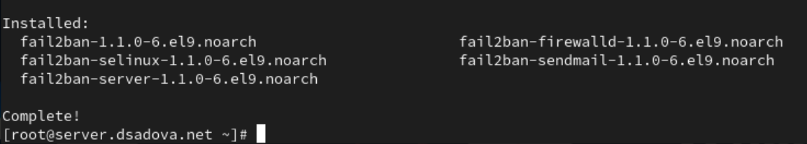

##

2. Запустите сервер fail2ban:

##

3. В дополнительном терминале запустите просмотр журнала событий fail2ban:

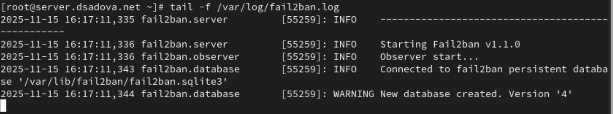

##

4. Создайте файл с локальной конфигурацией fail2ban:

##

5. В файле /etc/fail2ban/jail.d/customisation.local:
(a) задайте время блокирования на 1 час (время задаётся в секундах).
(b) включите защиту SSH:

##

6. Перезапустите fail2ban

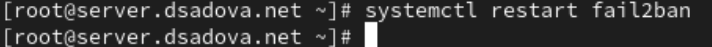

##

7. Посмотрите журнал событий:

##

8. В файле /etc/fail2ban/jail.d/customisation.local включите защиту HTTP:

##

9. Перезапустите fail2ban

##

10. Посмотрите журнал событий:

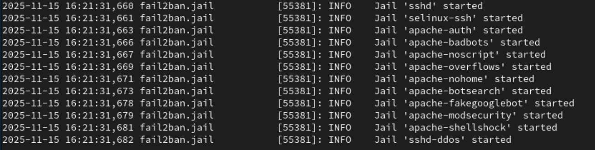

##

11. В файле /etc/fail2ban/jail.d/customisation.local включите защиту почты:

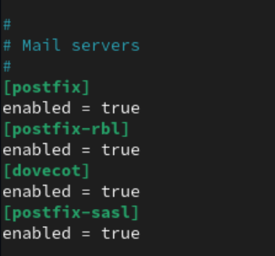

##

12. Перезапустите fail2ban:

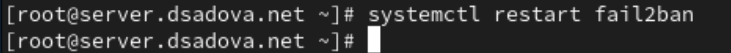

##

13. Посмотрите журнал событий:

## Проверка работы Fail2ban

1. На сервере посмотрите статус fail2ban:

##

2. Посмотрите статус защиты SSH в fail2ban:

##

3. Установите максимальное количество ошибок для SSH, равное 2:

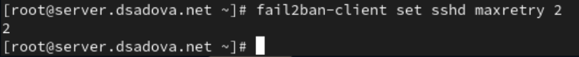

##

4. С клиента попытайтесь зайти по SSH на сервер с неправильным паролем.

##

5. На сервере посмотрите статус защиты SSH:

##

Убедитесь, что произошла блокировка адреса клиента.

На фотографии видно,что в списке заблокированных IP-адресов находится адрес 192.168.1.30, клиент, а количество текущих блокировок равно 1. Это показывает, что после нескольких неудачных попыток входа с неверным паролем, Fail2ban сработал и заблокировал атакующий IP-адрес на заданный срок.

##

6. Разблокируйте IP-адрес клиента:

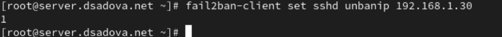

##

7. Вновь посмотрите статус защиты SSH:

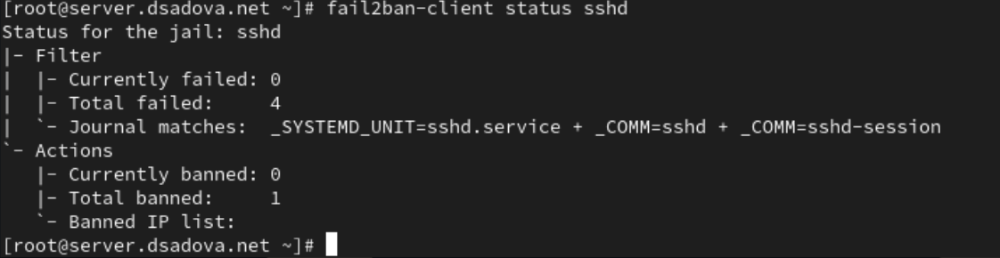

##

Убедитесь, что блокировка клиента снята.

На фотографии видно,что в списке заблокированных IP-адресов пусто, а количество текущих блокировок равно 0. Сдедовательно блакировка дреса 192.168.1.30 успешно снята. 

##

8. На сервере внесите изменение в конфигурационный файл /etc/fail2ban/jail.d/customisation.local, добавив в раздел по умолчанию игнорирование адреса клиента:

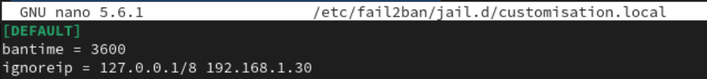

##

9. Перезапустите fail2ban.

##

10. Посмотрите журнал событий:

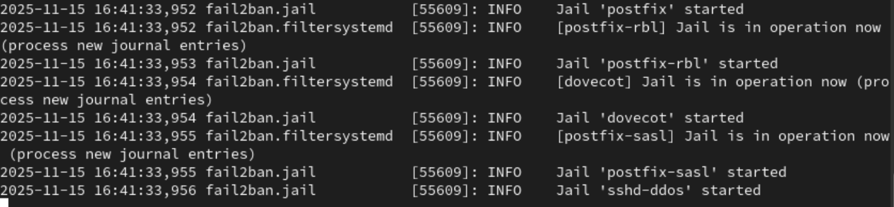

##

11. Вновь попытайтесь войти с клиента на сервер с неправильным паролем и посмотрите статус защиты SSH.

## Внесение изменений в настройки внутреннего окружения виртуальных машин

1. На виртуальной машине server перейдите в каталог для внесения изменений в настройки внутреннего окружения /vagrant/provision/server/, создайте в нём каталог protect, в который поместите в соответствующие подкаталоги конфигурационные файлы:

##

2. В каталоге /vagrant/provision/server создайте исполняемый файл protect.sh. Открыв его на редактирование, пропишите в нём следующий скрипт:

##

3. Для отработки созданного скрипта во время загрузки виртуальной машины server в конфигурационном файле Vagrantfile необходимо добавить в соответствующем разделе конфигураций для сервера:

## Результаты

- Получили навыки работы с программным средством Fail2ban для обеспечения базовой защиты от атак типа «brute force». Смогли поработать с тюрьмами (jails) и правилами блокировки.

