---
## Front matter
title: "Лабораторная работа № 16."
subtitle: "Базовая защита от атак типа «brute force»"
author: "Диана Алексеевна Садова"

## Generic otions
lang: ru-RU
toc-title: "Содержание"

## Bibliography
bibliography: bib/cite.bib
csl: pandoc/csl/gost-r-7-0-5-2008-numeric.csl

## Pdf output format
toc: true # Table of contents
toc-depth: 2
lof: true # List of figures
lot: true # List of tables
fontsize: 12pt
linestretch: 1.5
papersize: a4
documentclass: scrreprt
## I18n polyglossia
polyglossia-lang:
  name: russian
  options:
	- spelling=modern
	- babelshorthands=true
polyglossia-otherlangs:
  name: english
## I18n babel
babel-lang: russian
babel-otherlangs: english
## Fonts
mainfont: PT Serif
romanfont: PT Serif
sansfont: PT Sans
monofont: PT Mono
mainfontoptions: Ligatures=TeX
romanfontoptions: Ligatures=TeX
sansfontoptions: Ligatures=TeX,Scale=MatchLowercase
monofontoptions: Scale=MatchLowercase,Scale=0.9
## Biblatex
biblatex: true
biblio-style: "gost-numeric"
biblatexoptions:
  - parentracker=true
  - backend=biber
  - hyperref=auto
  - language=auto
  - autolang=other*
  - citestyle=gost-numeric
## Pandoc-crossref LaTeX customization
figureTitle: "Рис."
tableTitle: "Таблица"
listingTitle: "Листинг"
lofTitle: "Список иллюстраций"
lotTitle: "Список таблиц"
lolTitle: "Листинги"
## Misc options
indent: true
header-includes:
  - \usepackage{indentfirst}
  - \usepackage{float} # keep figures where there are in the text
  - \floatplacement{figure}{H} # keep figures where there are in the text
---

# Цель работы

Получить навыки работы с программным средством Fail2ban для обеспечения базовой защиты от атак типа «brute force»

# Задание

1. Установите и настройте Fail2ban для отслеживания работы установленных на сервере служб.
2. Проверьте работу Fail2ban посредством попыток несанкционированного доступа с клиента на сервер через SSH.
3. Напишите скрипт для Vagrant, фиксирующий действия по установке и настройке Fail2ban.

# Последовательность выполнения работы

### Защита с помощью Fail2ban

1. На сервере установите fail2ban:(рис. [-@fig:001])

{#fig:001 width=90%}

2. Запустите сервер fail2ban:(рис. [-@fig:002])

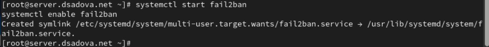{#fig:002 width=90%}

3. В дополнительном терминале запустите просмотр журнала событий fail2ban:(рис. [-@fig:003])

{#fig:003 width=90%}

4. Создайте файл с локальной конфигурацией fail2ban:(рис. [-@fig:004])

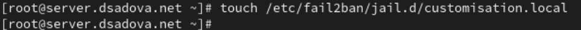{#fig:004 width=90%}

5. В файле /etc/fail2ban/jail.d/customisation.local:
(a) задайте время блокирования на 1 час (время задаётся в секундах).
(b) включите защиту SSH:(рис. [-@fig:005])

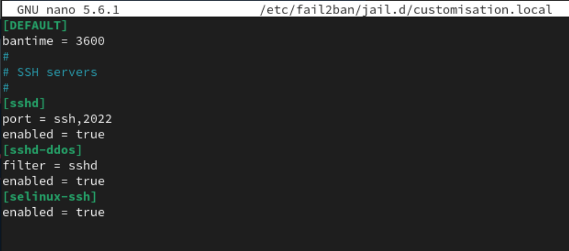{#fig:005 width=90%}

6. Перезапустите fail2ban(рис. [-@fig:006])

{#fig:006 width=90%}

7. Посмотрите журнал событий:(рис. [-@fig:007])

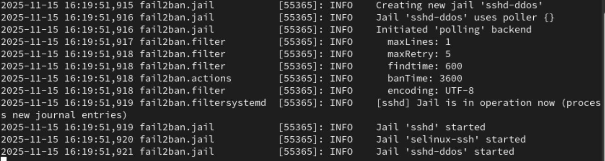{#fig:007 width=90%}

8. В файле /etc/fail2ban/jail.d/customisation.local включите защиту HTTP:(рис. [-@fig:008])

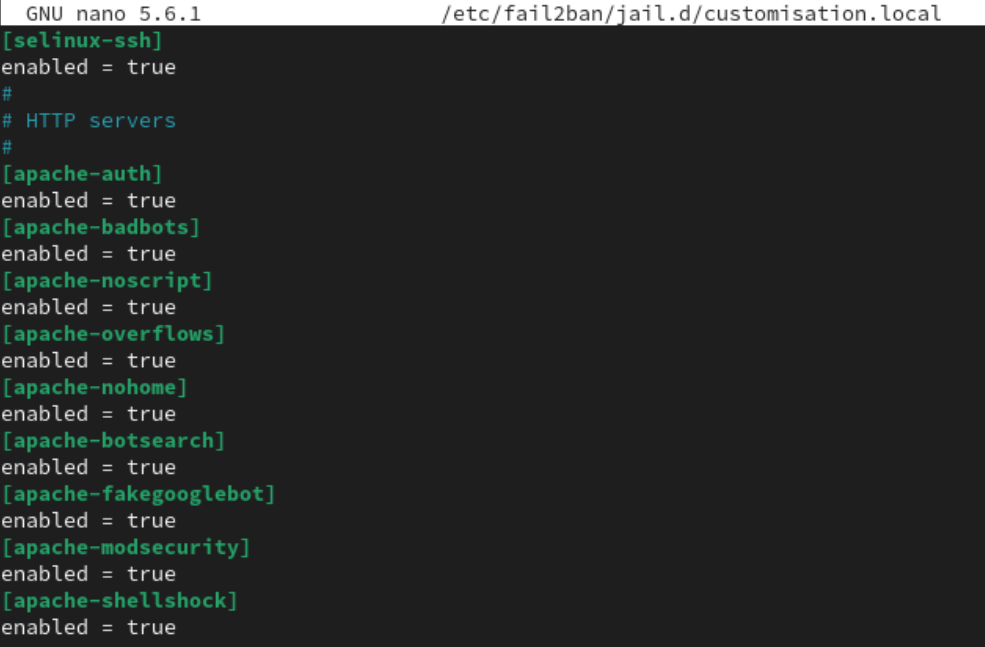{#fig:008 width=90%}

9. Перезапустите fail2ban(рис. [-@fig:009])

{#fig:009 width=90%}

10. Посмотрите журнал событий:(рис. [-@fig:010])

{#fig:010 width=90%}

11. В файле /etc/fail2ban/jail.d/customisation.local включите защиту почты:(рис. [-@fig:011])

{#fig:011 width=90%}

12. Перезапустите fail2ban:(рис. [-@fig:012])

{#fig:012 width=90%}

13. Посмотрите журнал событий:(рис. [-@fig:013])

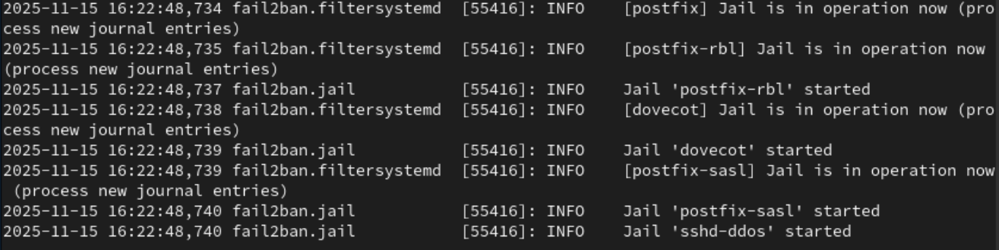{#fig:013 width=90%}

Ошибок или проблем с системой не обнаруженно.

### Проверка работы Fail2ban

1. На сервере посмотрите статус fail2ban:(рис. [-@fig:014])

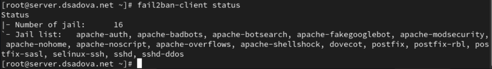{#fig:014 width=90%}

2. Посмотрите статус защиты SSH в fail2ban:(рис. [-@fig:015])

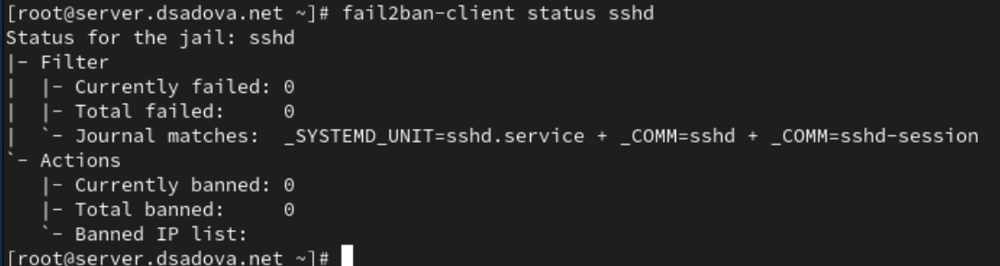{#fig:015 width=90%}

3. Установите максимальное количество ошибок для SSH, равное 2:(рис. [-@fig:016])

{#fig:016 width=90%}

4. С клиента попытайтесь зайти по SSH на сервер с неправильным паролем.

5. На сервере посмотрите статус защиты SSH:(рис. [-@fig:017])

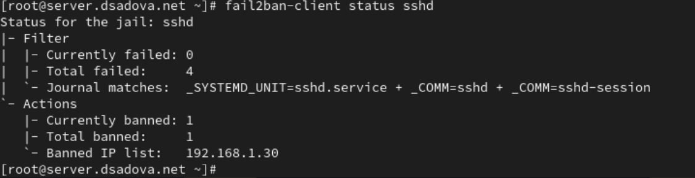{#fig:017 width=90%}

Убедитесь, что произошла блокировка адреса клиента.

На фотографии видно,что в списке заблокированных IP-адресов находится адрес 192.168.1.30, клиент, а количество текущих блокировок равно 1. Это показывает, что после нескольких неудачных попыток входа с неверным паролем, Fail2ban сработал и заблокировал атакующий IP-адрес на заданный срок.

6. Разблокируйте IP-адрес клиента:(рис. [-@fig:018])

{#fig:018 width=90%}

7. Вновь посмотрите статус защиты SSH:(рис. [-@fig:019])

{#fig:019 width=90%}

Убедитесь, что блокировка клиента снята.

На фотографии видно,что в списке заблокированных IP-адресов пусто, а количество текущих блокировок равно 0. Сдедовательно блакировка дреса 192.168.1.30 успешно снята. 

8. На сервере внесите изменение в конфигурационный файл /etc/fail2ban/jail.d/customisation.local, добавив в раздел по умолчанию игнорирование адреса клиента:(рис. [-@fig:020])

{#fig:020 width=90%}

9. Перезапустите fail2ban.(рис. [-@fig:021])

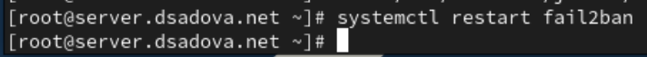{#fig:021 width=90%}

10. Посмотрите журнал событий:(рис. [-@fig:022])

{#fig:022 width=90%}

11. Вновь попытайтесь войти с клиента на сервер с неправильным паролем и посмотрите статус защиты SSH.(рис. [-@fig:023])

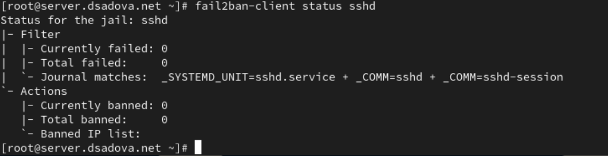{#fig:023 width=90%}

После добавления клиента (IP-адреса) в игнорируемый список (whitelist), Fail2ban больше не заблокирует клиента 

### Внесение изменений в настройки внутреннего окружения виртуальных машин

1. На виртуальной машине server перейдите в каталог для внесения изменений в настройки внутреннего окружения /vagrant/provision/server/, создайте в нём каталог protect, в который поместите в соответствующие подкаталоги конфигурационные файлы:(рис. [-@fig:024])

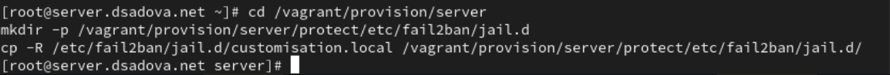{#fig:024 width=90%}

2. В каталоге /vagrant/provision/server создайте исполняемый файл protect.sh. Открыв его на редактирование, пропишите в нём следующий скрипт:(рис. [-@fig:025])

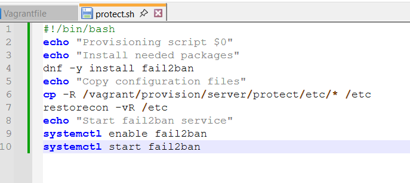{#fig:025 width=90%}

3. Для отработки созданного скрипта во время загрузки виртуальной машины server в конфигурационном файле Vagrantfile необходимо добавить в соответствующем разделе конфигураций для сервера:(рис. [-@fig:026])

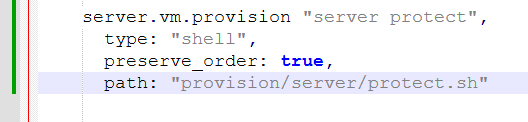{#fig:026 width=90%}

# Выводы

Получили навыки работы с программным средством Fail2ban для обеспечения базовой защиты от атак типа «brute force». Смогли поработать с тюрьмами (jails) и правилами блокировки.

# Список литературы{.unnumbered}

::: {#refs}
:::
