---
## Front matter
lang: ru-RU
title: Лабораторная работа № 2.
subtitle: Настройка DNS-сервера
author:
  - Cадова Д. А.
institute:
  - Российский университет дружбы народов, Москва, Россия

## i18n babel
babel-lang: russian
babel-otherlangs: english
## Fonts
mainfont: PT Serif
romanfont: PT Serif
sansfont: PT Sans
monofont: PT Mono
mainfontoptions: Ligatures=TeX
romanfontoptions: Ligatures=TeX
sansfontoptions: Ligatures=TeX,Scale=MatchLowercase
monofontoptions: Scale=MatchLowercase,Scale=0.9

## Formatting pdf
toc: false
toc-title: Содержание
slide_level: 2
aspectratio: 169
section-titles: true
theme: metropolis
header-includes:
 - \metroset{progressbar=frametitle,sectionpage=progressbar,numbering=fraction}
 - '\makeatletter'
 - '\beamer@ignorenonframefalse'
 - '\makeatother'
---

# Информация

## Докладчик

:::::::::::::: {.columns align=center}
::: {.column width="70%"}

  * Садова Диана Алексеевна
  * студент бакалавриата
  * Российский университет дружбы народов
  * [113229118@pfur.ru]
  * <https://DianaSadova.github.io/ru/>

:::
::::::::::::::

# Вводная часть

## Актуальность

- Умение настраивать и отлаживать DNS критически важно для DevOps-инженеров и администраторов облачных инфраструктур.

## Цели и задачи

- Приобретение практических навыков по установке и конфигурированию DNS-сервера, усвоение принципов работы системы доменных имён.

## Материалы и методы

- Текст лабороторной работы № 2
- Интернет для исправления ошибок 

## Содержание исследования

1. Установите на виртуальной машине server DNS-сервер bind и bind-utils.
2. Сконфигурируйте на виртуальной машине server кэширующий DNS-сервер .
3. Сконфигурируйте на виртуальной машине server первичный DNS-сервер.
4. При помощи утилит dig и host проанализируйте работу DNS-сервера .
5. Напишите скрипт для Vagrant, фиксирующий действия по установке и конфигурированию DNS-сервера во внутреннем окружении виртуальной машины server.

## Установка DNS-сервера

1. Загрузите вашу операционную систему и перейдите в рабочий каталог с проектом:

##

2. Запустите виртуальную машину server:

##

3. На виртуальной машине server войдите под созданным вами в предыдущей работе пользователем и откройте терминал. Перейдите в режим суперпользователя:

##

4. Установите bind и bind-utils:

##

5. В качестве упражнения с помощью утилиты dig сделайте запрос, например, к DNS-адресу www.yandex.ru:

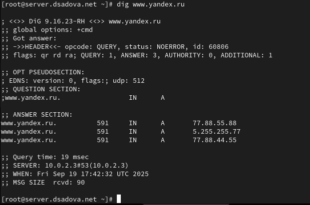

##

Проанализируйте в отчёте построчно выведенную на экран информацию.

Ответ не авторитативный (нет флага aa), значит, он получен из кэша или через рекурсивное разрешение.

Сервер — 10.0.2.3 (внешний DNS из /etc/resolv.conf), а не локальный BIND (127.0.0.1).

Яндекс использует несколько IP-адресов для распределения нагрузки.

DNS-запрос к www.yandex.ru выполнен через внешний рекурсивный DNS-сервер 10.0.2.3, который вернул три IPv4-адреса с балансировкой нагрузки. 

# Конфигурирование кэширующего DNS-сервера

## Конфигурирование кэширующего DNS-сервера при отсутствии фильтрации DNS-запросов маршрутизаторами

1. В отчёте проанализируйте построчно содержание файлов /etc/resolv.conf, /etc/named.conf, /var/named/named.ca, /var/named/named.localhost, /var/named/named.loopback.

##

search — это доменные суффиксы для неполных имён.

nameserver — указаны два DNS-сервера: IPv4 10.0.2.3 и IPv6 fd17:625c:f037:2::3. Это резолверы, которые будут использоваться для рекурсивных запросов.
  
##
  
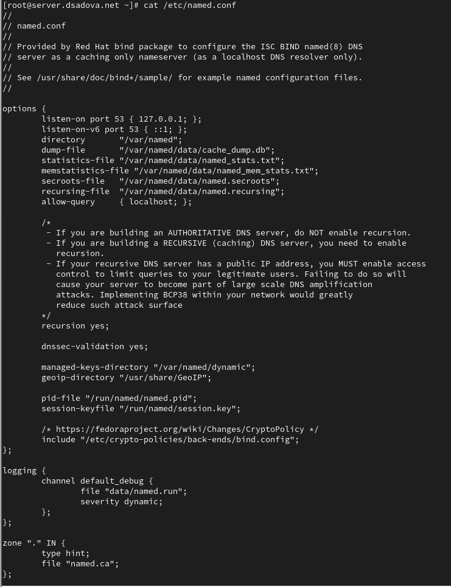

##

listen-on port 53 { 127.0.0.1; } — сервис слушает только на локальном интерфейсе.

allow-query { localhost; } — разрешены запросы только с localhost.

recursion yes — разрешена рекурсия (сервер может делать запросы к другим DNS-серверам).

dnssec-validation yes — включена проверка DNSSEC.

zone "." — корневая зона с файлом named.ca (подсказки для корневых серверов).
    
##

Зона для обратного просмотра 127.0.0.1: Есть PTR запись для localhost

##

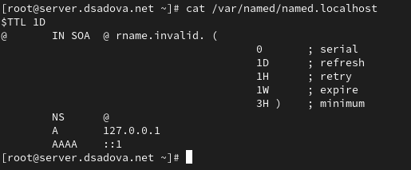

##

SOA — Start of Authority для домена @ (localhost).

NS — указывает на себя как на NS-сервер.

A 127.0.0.1 и AAAA ::1 — IPv4 и IPv6 записи для localhost.

##

2. Запустите DNS-сервер:

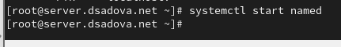

##

3. Включите запуск DNS-сервера в автозапуск при загрузке системы:

##

4. Проанализируйте в отчёте отличие в выведенной на экран информации при выполнении команд

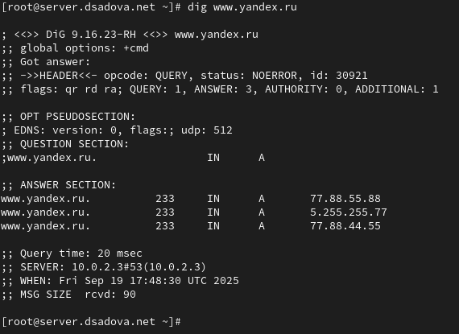

##

Запрос прошёл через внешний DNS-сервер, что указывает на то, что локальный BIND не используется как резолвер по умолчанию (или запрос пошёл мимо него).

##

5. Сделайте DNS-сервер сервером по умолчанию для хоста server и внутренней виртуальной сети. Для этого требуется изменить настройки сетевого соединения eth0 в NetworkManager, переключив его на работу с внутренней сетью и указав для него в качестве DNS-сервера по умолчанию адрес 127.0.0.1:

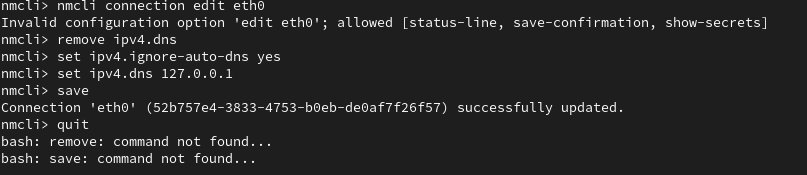

##

6. Сделайте тоже самое для соединения System eth0 (если оно активно):

##

7. Перезапустите NetworkManager:

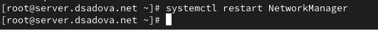

##

Проверьте наличие изменений в файле /etc/resolv.conf.

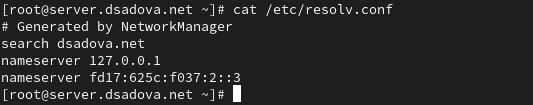

##

8. Требуется настроить направление DNS-запросов от всех узлов внутренней сети, включая запросы от узла server, через узел server. Для этого внесите изменения в файл /etc/named.conf, заменив строку listen-on port 53 { 127.0.0.1; }; на listen-on port 53 { 127.0.0.1; any; }; и строку allow-query { localhost; }; на allow-query { localhost; 192.168.0.0/16; };

##

9. Внесите изменения в настройки межсетевого экрана узла server, разрешив работу с DNS:

##

10. Убедитесь, что DNS-запросы идут через узел server, который прослушивает порт.Для этого на данном этапе используйте команду lsof:

## Конфигурирование первичного DNS-сервера

1. Скопируйте шаблон описания DNS-зон named.rfc1912.zones из каталога /etc в каталог /etc/named и переименуйте его в user.net (вместо user укажите свой логин):

##

2. Включите файл описания зоны /etc/named/user.net в конфигурационном файле DNS /etc/named.conf, добавив в нём в конце строку:

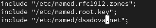

##

3. Откройте файл /etc/named/user.net на редактирование и вместо зоны

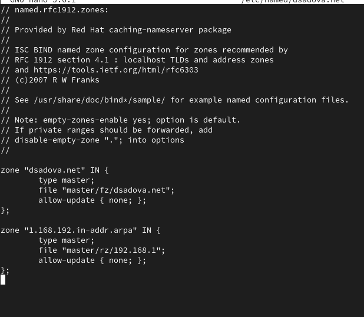

##

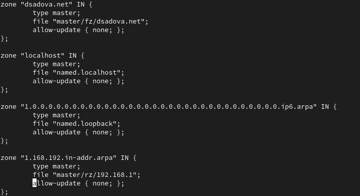

Остальные записи в файле /etc/named/user.net удалите.

##

4. В каталоге /var/named создайте подкаталоги master/fz и master/rz, в которых будут располагаться файлы прямой и обратной зоны соответственно:

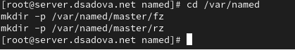

##

5. Скопируйте шаблон прямой DNS-зоны named.localhost из каталога /var/named в каталог /var/named/master/fz и переименуйте его в user.net:

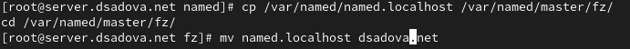

##

6. Измените файл /var/named/master/fz/user.net, указав необходимые DNS-записи для прямой зоны. 

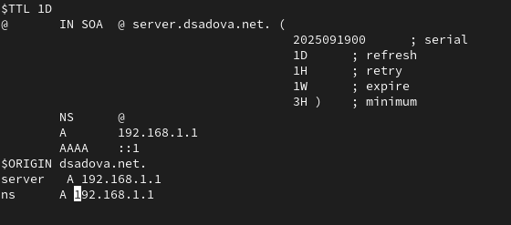

##

7. Скопируйте шаблон обратной DNS-зоны named.loopback из каталога /var/named в каталог /var/named/master/rz и переименуйте его в 192.168.1:

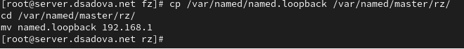

##

8. Измените файл /var/named/master/rz/192.168.1, указав необходимые DNS-записи для обратной зоны. 

##

9. Далее требуется исправить права доступа к файлам в каталогах /etc/named и /var/named, чтобы демон named мог с ними работать:

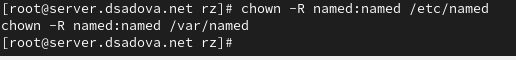

##

10. В системах с запущенным SELinux все процессы и файлы имеют специальные метки безопасности (так называемый «контекст безопасности»), используемые системой для принятия решений по доступу к этим процессам и файлам. После изменения доступа к конфигурационным файлам named требуется корректно восстановить их метки в SELinux:

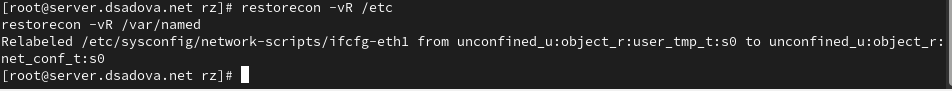

##

Для проверки состояния переключателей SELinux, относящихся к named, введите:

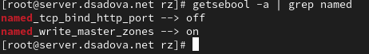

##

При необходимости дайте named разрешение на запись в файлы DNS-зоны:

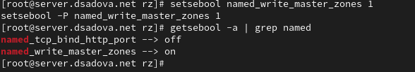

##

11. Во дополнительном терминале запустите в режиме реального времени расширенный лог системных сообщений, чтобы проверить корректность работы системы и в первом терминале перезапустите DNS-сервер.

Если в логе выдаются сообщения об ошибках, то устраните их и повторно перезапустите DNS-сервер.

В моем случае ошибок не было.

## Анализ работы DNS-сервера

1. При помощи утилиты dig получите описание DNS-зоны с сервера ns.user.net (вместо user должен быть указан ваш логин):

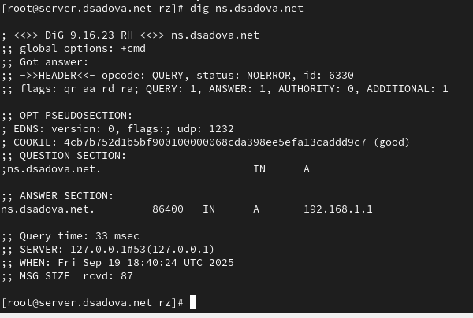

##

named.rfc1912.zones — зоны для частных IP-сетей (обратные зоны для 127.0.0.0/8, 10.0.0.0/8, 192.168.0.0/16).

named.root.key — ключ для проверки корневых серверов (DNSSEC).

##

2. При помощи утилиты host проанализируйте корректность работы DNS-сервера:

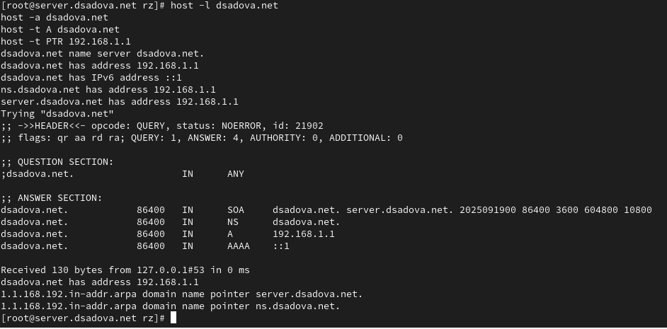

##

Прямое разрешение имён - A, AAAA, NS, SOA записи возвращаются корректно

Обратное разрешение — PTR-записи настроены и работают

Структура зоны — SOA-запись содержит все необходимые параметры

DNS-сервер работает корректно — отвечает на запросы, имеет настроенные прямые и обратные зоны. 

## Внесение изменений в настройки внутреннего окружения виртуальной машины

1. На виртуальной машине server перейдите в каталог для внесения изменений в настройки внутреннего окружения /vagrant/provision/server/, создайте в нём каталог dns, в который поместите в соответствующие каталоги конфигурационные файлы DNS:

##

2. В каталоге /vagrant/provision/server создайте исполняемый файл dns.sh. Открыв его на редактирование, пропишите в нём следующий скрипт:

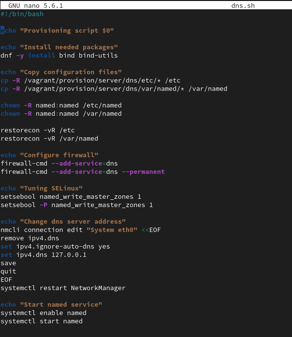

##

3. Для отработки созданного скрипта во время загрузки виртуальной машины server в конфигурационном файле Vagrantfile необходимо добавить в разделе конфигурации для сервера:

## Результаты

- Приобрели практические навыки по установке и конфигурированию DNS-сервера, усвояли принципы работы системы доменных имён. Попрактиковались с настройкой.

