---
## Front matter
title: "Лабораторная работа № 2."
subtitle: "Настройка DNS-сервера"
author: "Диана Алексеевна Садова"

## Generic otions
lang: ru-RU
toc-title: "Содержание"

## Bibliography
bibliography: bib/cite.bib
csl: pandoc/csl/gost-r-7-0-5-2008-numeric.csl

## Pdf output format
toc: true # Table of contents
toc-depth: 2
lof: true # List of figures
lot: true # List of tables
fontsize: 12pt
linestretch: 1.5
papersize: a4
documentclass: scrreprt
## I18n polyglossia
polyglossia-lang:
  name: russian
  options:
	- spelling=modern
	- babelshorthands=true
polyglossia-otherlangs:
  name: english
## I18n babel
babel-lang: russian
babel-otherlangs: english
## Fonts
mainfont: PT Serif
romanfont: PT Serif
sansfont: PT Sans
monofont: PT Mono
mainfontoptions: Ligatures=TeX
romanfontoptions: Ligatures=TeX
sansfontoptions: Ligatures=TeX,Scale=MatchLowercase
monofontoptions: Scale=MatchLowercase,Scale=0.9
## Biblatex
biblatex: true
biblio-style: "gost-numeric"
biblatexoptions:
  - parentracker=true
  - backend=biber
  - hyperref=auto
  - language=auto
  - autolang=other*
  - citestyle=gost-numeric
## Pandoc-crossref LaTeX customization
figureTitle: "Рис."
tableTitle: "Таблица"
listingTitle: "Листинг"
lofTitle: "Список иллюстраций"
lotTitle: "Список таблиц"
lolTitle: "Листинги"
## Misc options
indent: true
header-includes:
  - \usepackage{indentfirst}
  - \usepackage{float} # keep figures where there are in the text
  - \floatplacement{figure}{H} # keep figures where there are in the text
---

# Цель работы

Приобретение практических навыков по установке и конфигурированию DNS-сервера, усвоение принципов работы системы доменных имён.

# Последовательность выполнения работы

## Задание

1. Установите на виртуальной машине server DNS-сервер bind и bind-utils.
2. Сконфигурируйте на виртуальной машине server кэширующий DNS-сервер .
3. Сконфигурируйте на виртуальной машине server первичный DNS-сервер.
4. При помощи утилит dig и host проанализируйте работу DNS-сервера .
5. Напишите скрипт для Vagrant, фиксирующий действия по установке и конфигурированию DNS-сервера во внутреннем окружении виртуальной машины server.

Соответствующим образом внесите изменения в Vagrantfile.

## Последовательность выполнения работы

### Установка DNS-сервера

1. Загрузите вашу операционную систему и перейдите в рабочий каталог с проектом:(рис. [-@fig:001]).

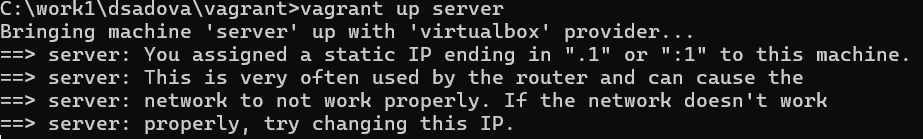{#fig:001 width=90%}

2. Запустите виртуальную машину server:(рис. [-@fig:002]).

{#fig:002 width=90%}

3. На виртуальной машине server войдите под созданным вами в предыдущей работе пользователем и откройте терминал. Перейдите в режим суперпользователя:(рис. [-@fig:003]).

{#fig:003 width=90%}

4. Установите bind и bind-utils:(рис. [-@fig:004]).

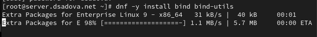{#fig:004 width=90%}

5. В качестве упражнения с помощью утилиты dig сделайте запрос, например, к DNS-адресу www.yandex.ru:(рис. [-@fig:005]).

{#fig:005 width=90%}

Проанализируйте в отчёте построчно выведенную на экран информацию.

Ответ не авторитативный (нет флага aa), значит, он получен из кэша или через рекурсивное разрешение.

Сервер — 10.0.2.3 (внешний DNS из /etc/resolv.conf), а не локальный BIND (127.0.0.1).

Яндекс использует несколько IP-адресов для распределения нагрузки.

DNS-запрос к www.yandex.ru выполнен через внешний рекурсивный DNS-сервер 10.0.2.3, который вернул три IPv4-адреса с балансировкой нагрузки. 

## Конфигурирование кэширующего DNS-сервера

### Конфигурирование кэширующего DNS-сервера при отсутствии фильтрации DNS-запросов маршрутизаторами

1. В отчёте проанализируйте построчно содержание файлов /etc/resolv.conf, /etc/named.conf, /var/named/named.ca, /var/named/named.localhost, /var/named/named.loopback.(рис. [-@fig:006]),(рис. [-@fig:007]),(рис. [-@fig:009]),(рис. [-@fig:010]).

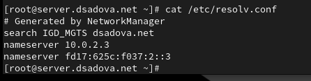{#fig:006 width=90%}

search — это доменные суффиксы для неполных имён.

nameserver — указаны два DNS-сервера: IPv4 10.0.2.3 и IPv6 fd17:625c:f037:2::3. Это резолверы, которые будут использоваться для рекурсивных запросов.
    
{#fig:007 width=90%}

listen-on port 53 { 127.0.0.1; } — сервис слушает только на локальном интерфейсе.

allow-query { localhost; } — разрешены запросы только с localhost.

recursion yes — разрешена рекурсия (сервер может делать запросы к другим DNS-серверам).

dnssec-validation yes — включена проверка DNSSEC.

zone "." — корневая зона с файлом named.ca (подсказки для корневых серверов).
    
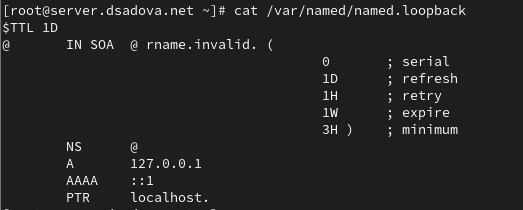{#fig:009 width=90%}

Зона для обратного просмотра 127.0.0.1: Есть PTR запись для localhost

{#fig:010 width=90%}

SOA — Start of Authority для домена @ (localhost).

NS — указывает на себя как на NS-сервер.

A 127.0.0.1 и AAAA ::1 — IPv4 и IPv6 записи для localhost.

2. Запустите DNS-сервер:(рис. [-@fig:011]).

{#fig:011 width=90%}

3. Включите запуск DNS-сервера в автозапуск при загрузке системы:(рис. [-@fig:012]).

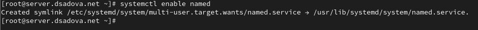{#fig:012 width=90%}

4. Проанализируйте в отчёте отличие в выведенной на экран информации при выполнении команд(рис. [-@fig:013]).

{#fig:013 width=90%}

Запрос прошёл через внешний DNS-сервер, что указывает на то, что локальный BIND не используется как резолвер по умолчанию (или запрос пошёл мимо него).

5. Сделайте DNS-сервер сервером по умолчанию для хоста server и внутренней виртуальной сети. Для этого требуется изменить настройки сетевого соединения eth0 в NetworkManager, переключив его на работу с внутренней сетью и указав для него в качестве DNS-сервера по умолчанию адрес 127.0.0.1:(рис. [-@fig:014]).

{#fig:014 width=90%}

6. Сделайте тоже самое для соединения System eth0 (если оно активно):(рис. [-@fig:015]).

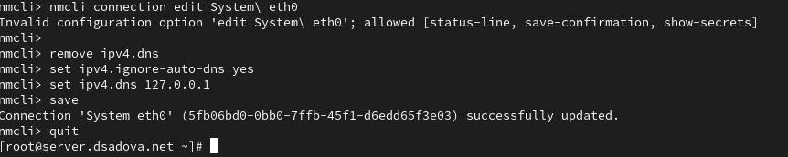{#fig:015 width=90%}

7. Перезапустите NetworkManager:(рис. [-@fig:016]).

{#fig:016 width=90%}

Проверьте наличие изменений в файле /etc/resolv.conf.(рис. [-@fig:017]).

{#fig:017 width=90%}

8. Требуется настроить направление DNS-запросов от всех узлов внутренней сети, включая запросы от узла server, через узел server. Для этого внесите изменения в файл /etc/named.conf, заменив строку listen-on port 53 { 127.0.0.1; }; на listen-on port 53 { 127.0.0.1; any; }; и строку allow-query { localhost; }; на allow-query { localhost; 192.168.0.0/16; }; (рис. [-@fig:018]).

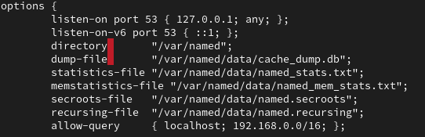{#fig:018 width=90%}

9. Внесите изменения в настройки межсетевого экрана узла server, разрешив работу с DNS:(рис. [-@fig:019]).

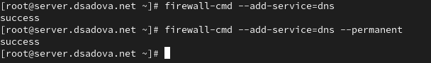{#fig:019 width=90%}

10. Убедитесь, что DNS-запросы идут через узел server, который прослушивает порт.Для этого на данном этапе используйте команду lsof:(рис. [-@fig:020]).

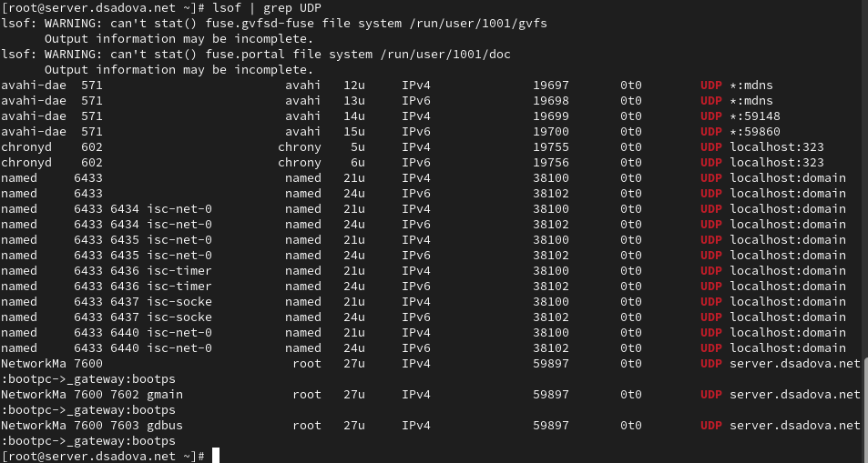{#fig:020 width=90%}

## Конфигурирование первичного DNS-сервера

1. Скопируйте шаблон описания DNS-зон named.rfc1912.zones из каталога /etc в каталог /etc/named и переименуйте его в user.net (вместо user укажите свой логин):(рис. [-@fig:021]).

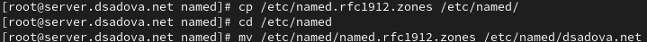{#fig:021 width=90%}

2. Включите файл описания зоны /etc/named/user.net в конфигурационном файле DNS /etc/named.conf, добавив в нём в конце строку:(рис. [-@fig:022]).

{#fig:022 width=90%}

3. Откройте файл /etc/named/user.net на редактирование и вместо зоны(рис. [-@fig:023]),(рис. [-@fig:100])

{#fig:023 width=90%}

{#fig:100 width=90%}

Остальные записи в файле /etc/named/user.net удалите.

4. В каталоге /var/named создайте подкаталоги master/fz и master/rz, в которых будут располагаться файлы прямой и обратной зоны соответственно:(рис. [-@fig:024]).

{#fig:024 width=90%}

5. Скопируйте шаблон прямой DNS-зоны named.localhost из каталога /var/named в каталог /var/named/master/fz и переименуйте его в user.net:(рис. [-@fig:025]).

{#fig:025 width=90%}

6. Измените файл /var/named/master/fz/user.net, указав необходимые DNS-записи для прямой зоны. В этом файле DNS-имя сервера @ rname.invalid. должно быть заменено на @ server.user.net. (вместо user должен быть указан ваш логин); формат серийного номера ГГГГММДДВВ (ГГГГ — год, ММ — месяц, ДД — день, ВВ — номер ревизии) [1]; адрес в A-записи должен быть заменён с 127.0.0.1 на 192.168.1.1; в директиве $ORIGIN должно быть задано текущее имя домена user.net. (вместо user должен быть указан ваш логин), а затем указаны имена и адреса серверов в этом домене в виде A-записей DNS (на данном этапе должен быть прописан сервер с именем ns и адресом 192.168.1.1). При этом внимательно отнеситесь к синтаксису в этом файле, а именно к пробелам и табуляции. В результате должен получиться файл следующего содержания:(рис. [-@fig:026]).

{#fig:026 width=90%}

7. Скопируйте шаблон обратной DNS-зоны named.loopback из каталога /var/named в каталог /var/named/master/rz и переименуйте его в 192.168.1:(рис. [-@fig:027]).

{#fig:027 width=90%}

8. Измените файл /var/named/master/rz/192.168.1, указав необходимые DNS-записи для обратной зоны. В этом файле DNS-имя сервера @ rname.invalid. должно быть заменено на @ server.user.net. (вместо user должен быть указан ваш логин); формат серийного номера ГГГГММДДВВ (ГГГГ — год, ММ — месяц, ДД — день, ВВ — номер ревизии); адрес в A-записи должен быть заменён с 127.0.0.1 на 192.168.1.1; в директиве $ORIGIN должно быть задано название обратной зоны в виде 1.168.192.in-addr.arpa., затем заданы PTR-записи (на данном этапе должна быть задана PTR запись, ставящая в соответствие адресу 192.168.1.1 DNS-адрес ns.user.net). В результате должен получиться файл следующего содержания:(рис. [-@fig:028]).

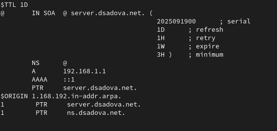{#fig:028 width=90%}

9. Далее требуется исправить права доступа к файлам в каталогах /etc/named и /var/named, чтобы демон named мог с ними работать:(рис. [-@fig:029]).

{#fig:029 width=90%}

10. В системах с запущенным SELinux все процессы и файлы имеют специальные метки безопасности (так называемый «контекст безопасности»), используемые системой для принятия решений по доступу к этим процессам и файлам. После изменения доступа к конфигурационным файлам named требуется корректно восстановить их метки в SELinux:(рис. [-@fig:030]).

{#fig:030 width=90%}

Для проверки состояния переключателей SELinux, относящихся к named, введите:(рис. [-@fig:031]).

{#fig:031 width=90%}

При необходимости дайте named разрешение на запись в файлы DNS-зоны:(рис. [-@fig:032]).

{#fig:032 width=90%}

11. Во дополнительном терминале запустите в режиме реального времени расширенный лог системных сообщений, чтобы проверить корректность работы системы и в первом терминале перезапустите DNS-сервер.

Если в логе выдаются сообщения об ошибках, то устраните их и повторно перезапустите DNS-сервер.

В моем случае ошибок не было.

## Анализ работы DNS-сервера

1. При помощи утилиты dig получите описание DNS-зоны с сервера ns.user.net (вместо user должен быть указан ваш логин):(рис. [-@fig:033]).

{#fig:033 width=90%}

и проанализируйте его.

named.rfc1912.zones — зоны для частных IP-сетей (обратные зоны для 127.0.0.0/8, 10.0.0.0/8, 192.168.0.0/16).

named.root.key — ключ для проверки корневых серверов (DNSSEC).

2. При помощи утилиты host проанализируйте корректность работы DNS-сервера:(рис. [-@fig:034]).

{#fig:034 width=90%}

Прямое разрешение имён - A, AAAA, NS, SOA записи возвращаются корректно

Обратное разрешение — PTR-записи настроены и работают

Структура зоны — SOA-запись содержит все необходимые параметры

DNS-сервер работает корректно — отвечает на запросы, имеет настроенные прямые и обратные зоны. 

### Внесение изменений в настройки внутреннего окружения виртуальной машины

1. На виртуальной машине server перейдите в каталог для внесения изменений в настройки внутреннего окружения /vagrant/provision/server/, создайте в нём каталог dns, в который поместите в соответствующие каталоги конфигурационные файлы DNS:
(рис. [-@fig:035]).

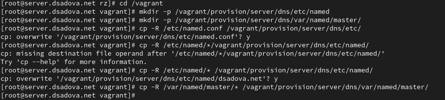{#fig:035 width=90%}

2. В каталоге /vagrant/provision/server создайте исполняемый файл dns.sh. Открыв его на редактирование, пропишите в нём следующий скрипт:(рис. [-@fig:036]).

{#fig:036 width=90%}

Этот скрипт, по сути, повторяет произведённые вами действия по установке и настройке DNS-сервера: подставляет в нужные каталоги подготовленные вами конфигурационные файлы; меняет соответствующим образом права доступа, метки безопасности SELinux и правила межсетевого экрана; настраивает сетевое соединение так, чтобы сервер выступал DNS-сервером по умолчанию для узлов внутренней виртуальной сети; запускает DNS-сервер.

3. Для отработки созданного скрипта во время загрузки виртуальной машины server в конфигурационном файле Vagrantfile необходимо добавить в разделе конфигурации для сервера:(рис. [-@fig:037]).

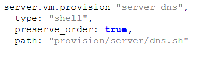{#fig:037 width=90%}

# Выводы

Приобрели практические навыки по установке и конфигурированию DNS-сервера, усвояли принципы работы системы доменных имён. Попрактиковались с настройкой.

# Список литературы{.unnumbered}

::: {#refs}
:::
