---
## Front matter
lang: ru-RU
title: Лабораторная работа № 4.
subtitle: Базовая настройка HTTP-сервера Apache
author:
  - Cадова Д. А.
institute:
  - Российский университет дружбы народов, Москва, Россия

## i18n babel
babel-lang: russian
babel-otherlangs: english
## Fonts
mainfont: PT Serif
romanfont: PT Serif
sansfont: PT Sans
monofont: PT Mono
mainfontoptions: Ligatures=TeX
romanfontoptions: Ligatures=TeX
sansfontoptions: Ligatures=TeX,Scale=MatchLowercase
monofontoptions: Scale=MatchLowercase,Scale=0.9

## Formatting pdf
toc: false
toc-title: Содержание
slide_level: 2
aspectratio: 169
section-titles: true
theme: metropolis
header-includes:
 - \metroset{progressbar=frametitle,sectionpage=progressbar,numbering=fraction}
 - '\makeatletter'
 - '\beamer@ignorenonframefalse'
 - '\makeatother'
---

# Информация

## Докладчик

:::::::::::::: {.columns align=center}
::: {.column width="70%"}

  * Садова Диана Алексеевна
  * студент бакалавриата
  * Российский университет дружбы народов
  * [113229118@pfur.ru]
  * <https://DianaSadova.github.io/ru/>

:::
::::::::::::::

# Вводная часть

## Актуальность

- Нужно вспомнить как настраивать HTTP-сервер Apache.
- Как с ним работать.

## Цели и задачи

- Приобретение практических навыков по установке и базовому конфигурированию HTTP-сервера Apache.

## Материалы и методы

- Текст лабороторной работы № 4

# Содержание 

1. Установите необходимые для работы HTTP-сервера пакеты 
2. Запустите HTTP-сервер с базовой конфигурацией и проанализируйте его работу 
3. Настройте виртуальный хостинг 
4. Напишите скрипт для Vagrant, фиксирующий действия по установке и настройке HTTP-сервера во внутреннем окружении виртуальной машины server. Соответствующим образом внесите изменения в Vagrantfile 

# Установка HTTP-сервера

- Запустите виртуальную машину server: vagrant up server

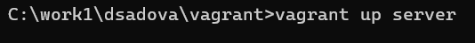

##
 
- На виртуальной машине server войдите под вашим пользователем и откройте терминал. Перейдите в режим суперпользователя.

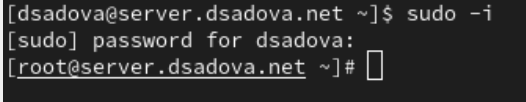

##

- Установите из репозитория стандартный веб-сервер (HTTP-сервер и утилиты httpd, криптоутилиты и пр.):

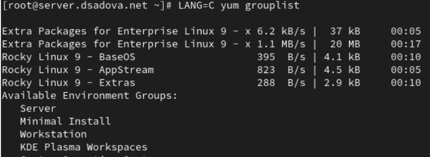

# Базовое конфигурирование HTTP-сервера

1. Просмотрите и прокомментируйте в отчёте содержание конфигурационных файлов в каталогах /etc/httpd/conf и /etc/httpd/conf.d.

Основные настройки сервера: ServerRoot и порт прослушивания (80). Закомментирована опция специфического IP-адреса.

##

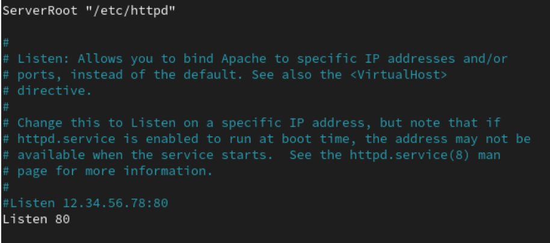

##
Настройка отображения иконок для FancyIndex. Заметна опечатка "Atlas" вместо "Alias". Определены иконки для разных типов файлов.

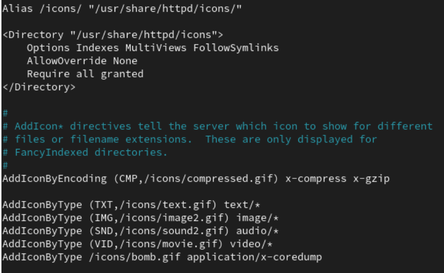{#fig:005 width=90%}

##

Настройка доступа к документации Apache (/manual). Есть опечатка "Altias" вместо "Alias". Настроен редирект для языковых версий документации.

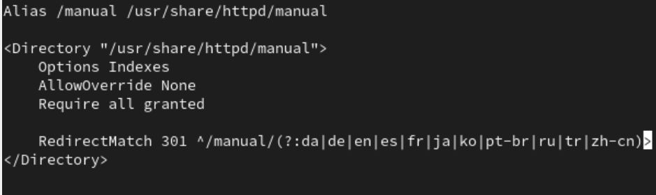{#fig:006 width=90%}

##

Часть SSL-конфигурации (закомментирована). Настройки кэширования SSL-сессий и диалога ввода passphrase.

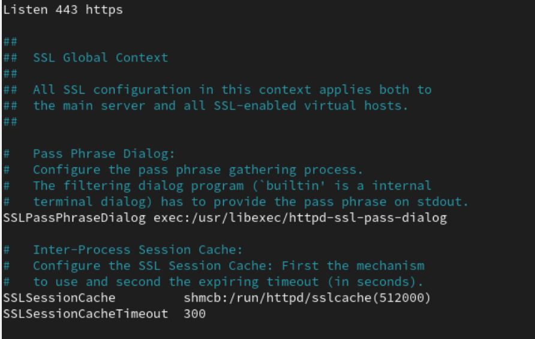{#fig:007 width=90%}

##

Конфигурация для отключения листинга директорий в корне сайта. При доступе к "/" показывается кастомная страница 403 ошибки (.noindex.html). Также настроены алиасы для иконок Apache

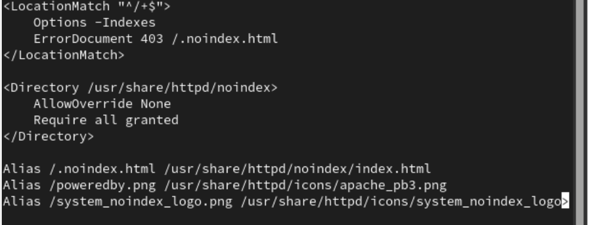{#fig:008 width=90%}

##

Закомментированная версия конфигурации из 10.png. Вероятно, Welcome-страница отключена.

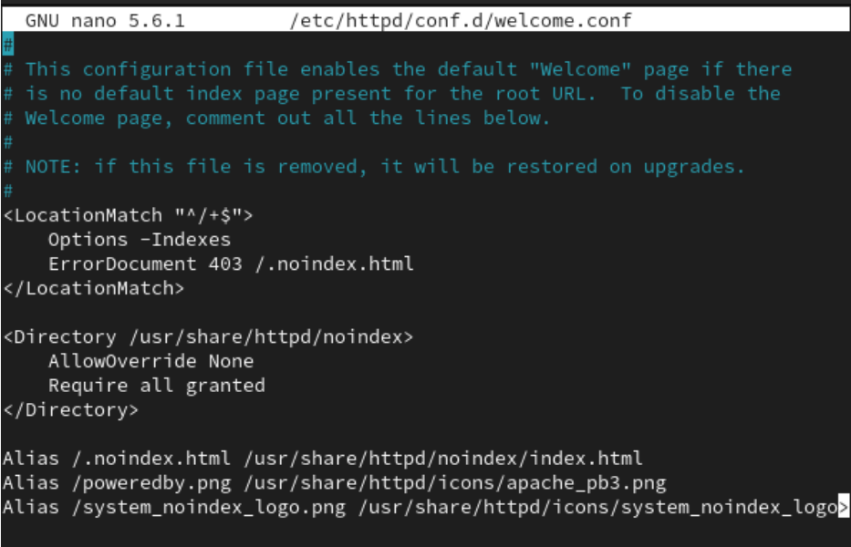{#fig:009 width=90%}

##

Конфигурация модуля mod_fcgid для обработки FastCGI-скриптов. Указаны пути для IPC-сокетов и разделяемой памяти.

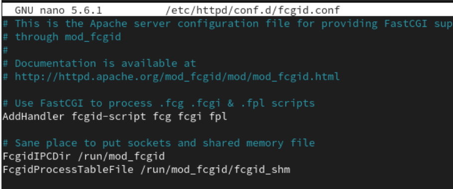{#fig:010 width=90%}

##

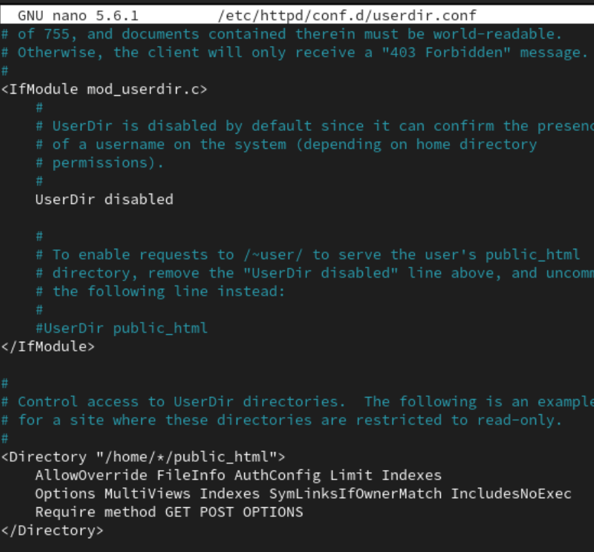{#fig:011 width=90%}

##

2. Внесите изменения в настройки межсетевого экрана узла server, разрешив работу с http:

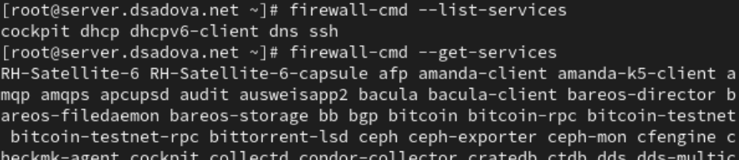

##

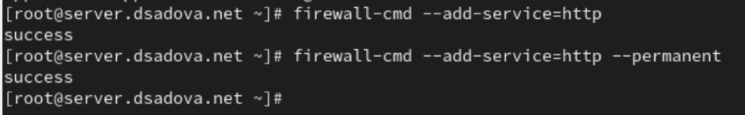

##

3. В дополнительном терминале запустите в режиме реального времени расширенный лог системных сообщений, чтобы проверить корректность работы системы:

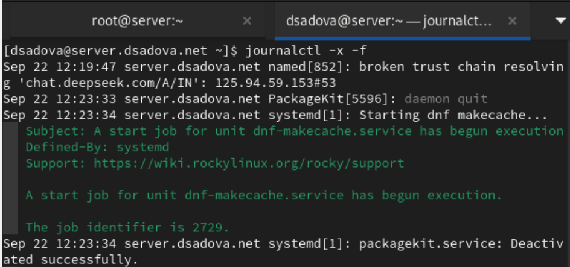

##

4. В первом терминале активируйте и запустите HTTP-сервер:

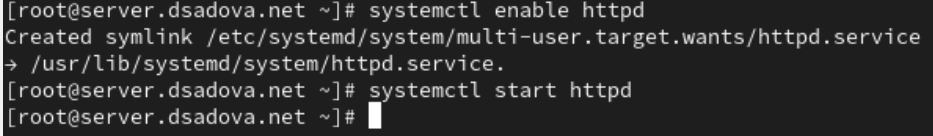

##

Просмотрев расширенный лог системных сообщений, убедитесь, что веб-сервер успешно запустился.

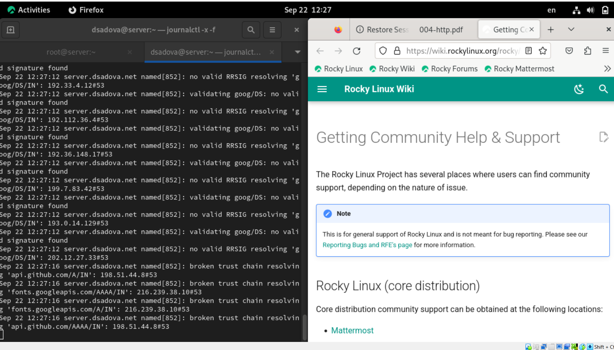

# Анализ работы HTTP-сервера

1. Запустите виртуальную машину client.

2. На виртуальной машине server просмотрите лог ошибок работы веб-сервера:

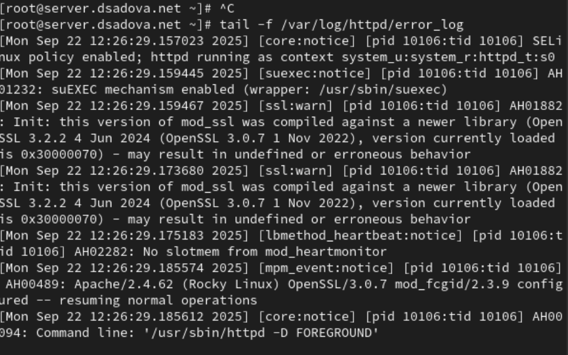

##

3. На виртуальной машине server запустите мониторинг доступа к веб-серверу:

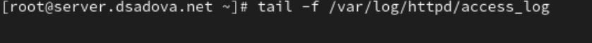

##

На виртуальной машине client запустите браузер и в адресной строке введите 192.168.1.1. Проанализируйте информацию, отразившуюся при мониторинге.

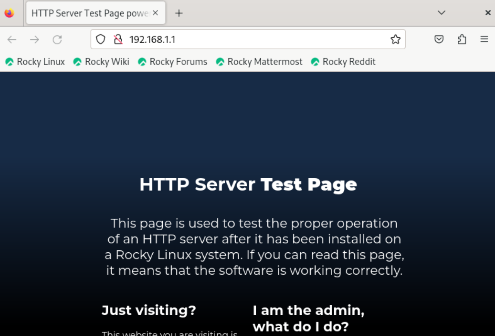

##

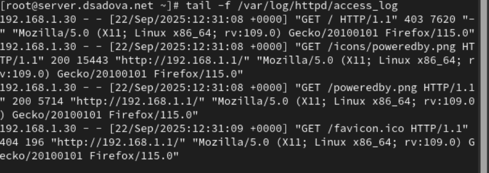

##

GET / - код ответа 403 (Forbidden)

- Сервер блокирует доступ к корневой директории

- Соответствует настройкам из предыдущих конфигураций (Options -Indexes)

- Размер ответа: 7620 байт (вероятно, страница с ошибкой 403)

GET /icons/poweredby.png - код 200 (OK)

- Успешная загрузка иконки Apache через алиас /icons/

- Размер: 15443 байт

##

GET /poweredby.png - код 200 (OK)

- Успешная загрузка той же иконки через прямой алиас

- Размер: 5714 байт (возможно, другой файл или сжатая версия)

GET /favicon.ico - код 404 (Not Found)

- Стандартная иконка сайта отсутствует

- Ожидаемое поведение для тестовой страницы

##

Технические детали:

- Клиент: Firefox 115 на Linux

- IP клиента: 192.168.1.30

- Сервер: server.dsadova.net (192.168.1.1)

# Настройка виртуального хостинга для HTTP-сервера

Требуется настроить виртуальный хостинг по двум DNS-адресам: server.user.net и www.user.net.

1. Остановите работу DNS-сервера для внесения изменений в файлы описания DNS-зон:

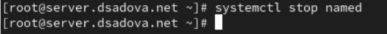

##

2. Добавьте запись для HTTP-сервера в конце файла прямой DNS-зоны /var/named/master/fz/user.net:

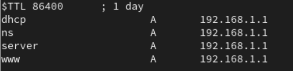

##

и в конце файла обратной зоны /var/named/master/rz/192.168.1:

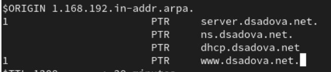

##

При этом не забудьте из соответствующих каталогов удалить файлы журналов DNS: user.net.jnl и 192.168.1.jnl.

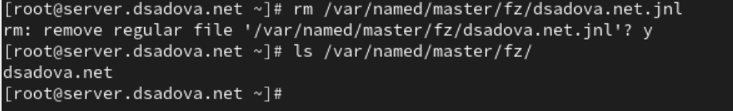

##

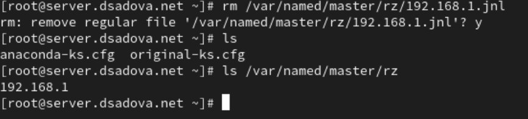

##

3. Перезапустите DNS-сервер:

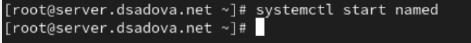

##

4. В каталоге /etc/httpd/conf.d создайте файлы server.user.net.conf и www.user.net.conf (вместо user укажите свой логин)

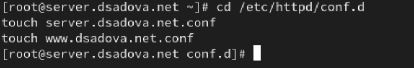

##

5. Откройте на редактирование файл server.user.net.conf и внесите следующее содержание:

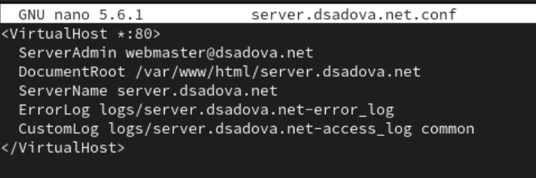

##

6. Откройте на редактирование файл www.user.net.conf и внесите следующее содержание:

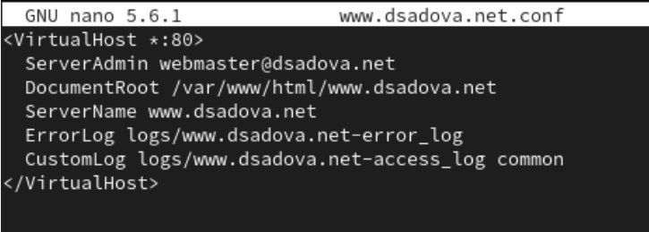

##

7. Перейдите в каталог /var/www/html, в котором должны находиться файлы с содержимым (контентом) веб-серверов, и создайте тестовые страницы для виртуальных веб-серверов server.user.net и www.user.net. Для виртуального веб-сервера server.user.net (вместо user укажите свой логин):

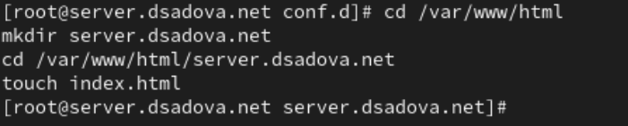

##

Откройте на редактирование файл index.html и внесите следующее содержание:

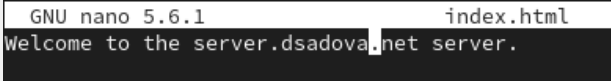

##

Для виртуального веб-сервера www.user.net (вместо user укажите свой логин):

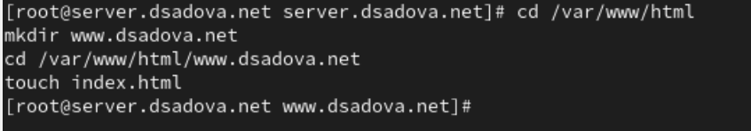

##

Откройте на редактирование файл index.html и внесите следующее содержание:

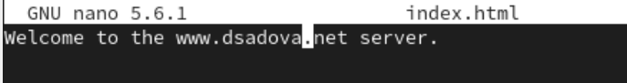

##

8. Скорректируйте права доступа в каталог с веб-контентом:

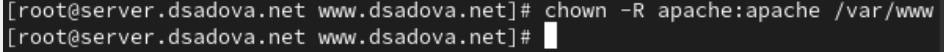

##

9. Восстановите контекст безопасности в SELinux:

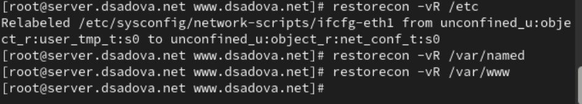

##

10. Перезапустите HTTP-сервер:

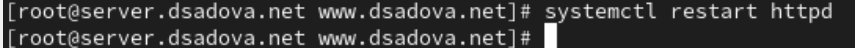

##

11. На виртуальной машине client убедитесь в корректном доступе к веб-серверу по адресам server.user.net и www.user.net (вместо user укажите свой логин) в адресной строке веб-браузера.

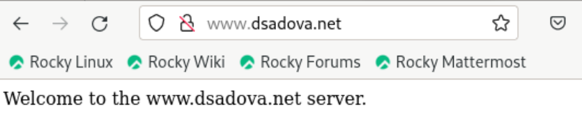

##

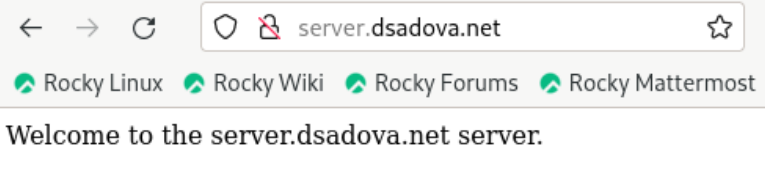

# Внесение изменений в настройки внутреннего окружения виртуальной машины

1. На виртуальной машине server перейдите в каталог для внесения изменений в настройки внутреннего окружения /vagrant/provision/server/, создайте в нём каталог http, в который поместите в соответствующие подкаталоги конфигурационные файлы HTTP-сервера:

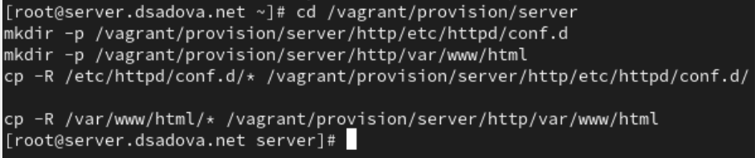

##

2. Замените конфигурационные файлы DNS-сервера:

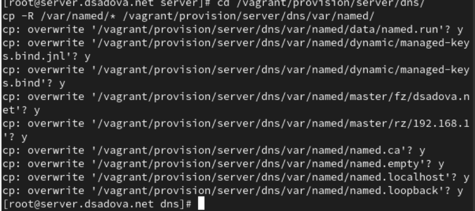

##

3. В каталоге /vagrant/provision/server создайте исполняемый файл http.sh:

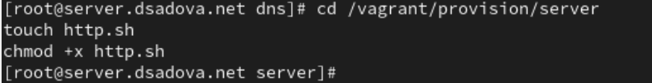

##

Открыв его на редактирование, пропишите в нём следующий скрипт:

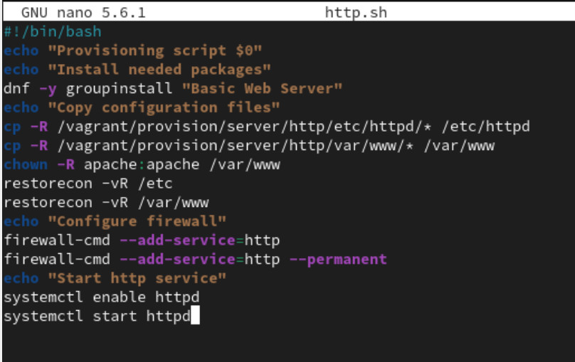

##

4. Для отработки созданного скрипта во время загрузки виртуальных машин в конфигурационном файле Vagrantfile необходимо добавить в конфигурации сервера следующую запись:

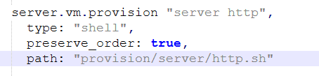

## Результаты

- Приобрели практические навыки по установке и базовому конфигурированию HTTP-сервера Apache

