---
## Front matter
title: "Лабораторная работа № 4."
subtitle: "Базовая настройка HTTP-сервера Apache"
author: "Диана Алексеевна Садова"

## Generic otions
lang: ru-RU
toc-title: "Содержание"

## Bibliography
bibliography: bib/cite.bib
csl: pandoc/csl/gost-r-7-0-5-2008-numeric.csl

## Pdf output format
toc: true # Table of contents
toc-depth: 2
lof: true # List of figures
lot: true # List of tables
fontsize: 12pt
linestretch: 1.5
papersize: a4
documentclass: scrreprt
## I18n polyglossia
polyglossia-lang:
  name: russian
  options:
	- spelling=modern
	- babelshorthands=true
polyglossia-otherlangs:
  name: english
## I18n babel
babel-lang: russian
babel-otherlangs: english
## Fonts
mainfont: PT Serif
romanfont: PT Serif
sansfont: PT Sans
monofont: PT Mono
mainfontoptions: Ligatures=TeX
romanfontoptions: Ligatures=TeX
sansfontoptions: Ligatures=TeX,Scale=MatchLowercase
monofontoptions: Scale=MatchLowercase,Scale=0.9
## Biblatex
biblatex: true
biblio-style: "gost-numeric"
biblatexoptions:
  - parentracker=true
  - backend=biber
  - hyperref=auto
  - language=auto
  - autolang=other*
  - citestyle=gost-numeric
## Pandoc-crossref LaTeX customization
figureTitle: "Рис."
tableTitle: "Таблица"
listingTitle: "Листинг"
lofTitle: "Список иллюстраций"
lotTitle: "Список таблиц"
lolTitle: "Листинги"
## Misc options
indent: true
header-includes:
  - \usepackage{indentfirst}
  - \usepackage{float} # keep figures where there are in the text
  - \floatplacement{figure}{H} # keep figures where there are in the text
---

# Цель работы

Приобретение практических навыков по установке и базовому конфигурированию HTTP-сервера Apache.

# Задание

1. Установите необходимые для работы HTTP-сервера пакеты 
2. Запустите HTTP-сервер с базовой конфигурацией и проанализируйте его работу 
3. Настройте виртуальный хостинг 
4. Напишите скрипт для Vagrant, фиксирующий действия по установке и настройке HTTP-сервера во внутреннем окружении виртуальной машины server. Соответствующим образом внесите изменения в Vagrantfile 

## Последовательность выполнения работы

### Установка HTTP-сервера

1. Загрузите вашу операционную систему и перейдите в рабочий каталог с проектом.

2. Запустите виртуальную машину server: vagrant up server(рис. [-@fig:001])

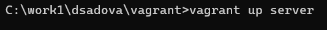{#fig:001 width=90%}
 
3. На виртуальной машине server войдите под вашим пользователем и откройте терминал. Перейдите в режим суперпользователя.(рис. [-@fig:002])

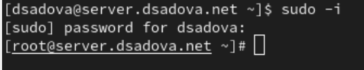{#fig:002 width=90%}

4. Установите из репозитория стандартный веб-сервер (HTTP-сервер и утилиты httpd, криптоутилиты и пр.):(рис. [-@fig:003])

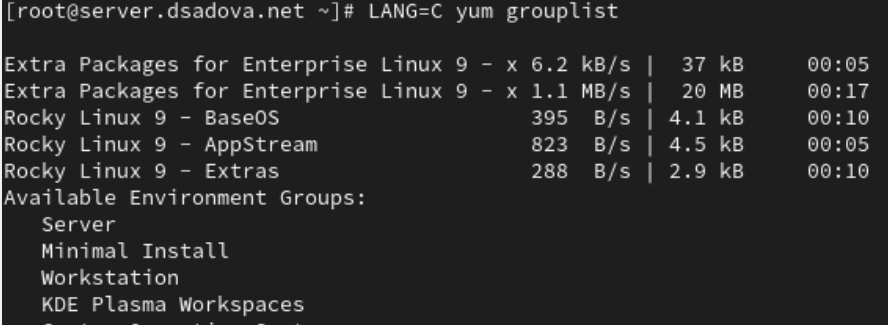{#fig:003 width=90%}

### Базовое конфигурирование HTTP-сервера

1. Просмотрите и прокомментируйте в отчёте содержание конфигурационных файлов в каталогах /etc/httpd/conf и /etc/httpd/conf.d.(рис. [-@fig:004]),(рис. [-@fig:005]),(рис. [-@fig:006]),(рис. [-@fig:007]),(рис. [-@fig:008]),(рис. [-@fig:009]),(рис. [-@fig:010]),(рис. [-@fig:011])

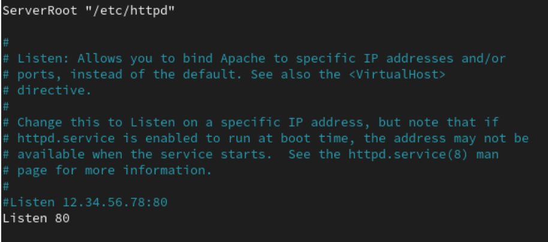{#fig:004 width=90%}

Основные настройки сервера: ServerRoot и порт прослушивания (80). Закомментирована опция специфического IP-адреса.

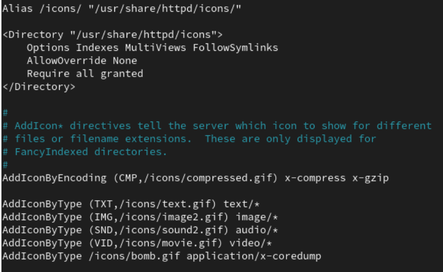{#fig:005 width=90%}

Настройка отображения иконок для FancyIndex. Заметна опечатка "Atlas" вместо "Alias". Определены иконки для разных типов файлов.

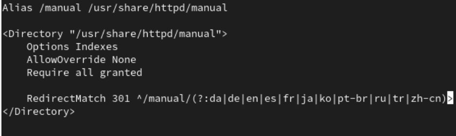{#fig:006 width=90%}

Настройка доступа к документации Apache (/manual). Есть опечатка "Altias" вместо "Alias". Настроен редирект для языковых версий документации.

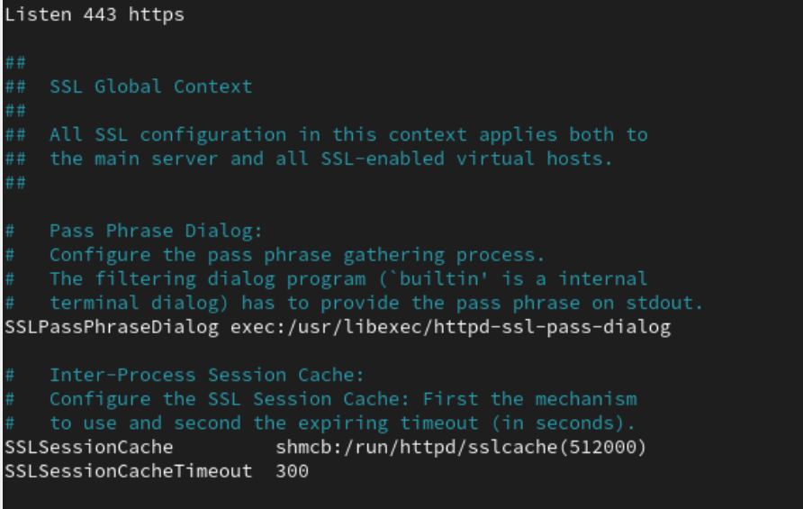{#fig:007 width=90%}

Часть SSL-конфигурации (закомментирована). Настройки кэширования SSL-сессий и диалога ввода passphrase.

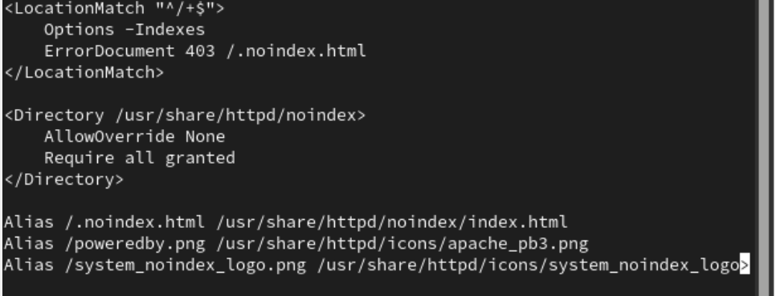{#fig:008 width=90%}

Конфигурация для отключения листинга директорий в корне сайта. При доступе к "/" показывается кастомная страница 403 ошибки (.noindex.html). Также настроены алиасы для иконок Apache

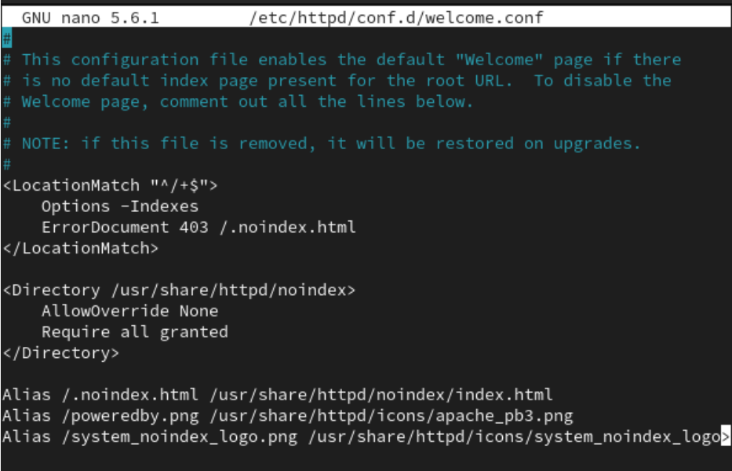{#fig:009 width=90%}

Закомментированная версия конфигурации из 10.png. Вероятно, Welcome-страница отключена.

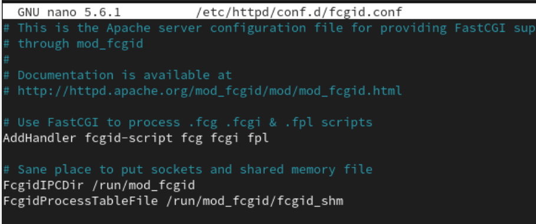{#fig:010 width=90%}

Конфигурация модуля mod_fcgid для обработки FastCGI-скриптов. Указаны пути для IPC-сокетов и разделяемой памяти.

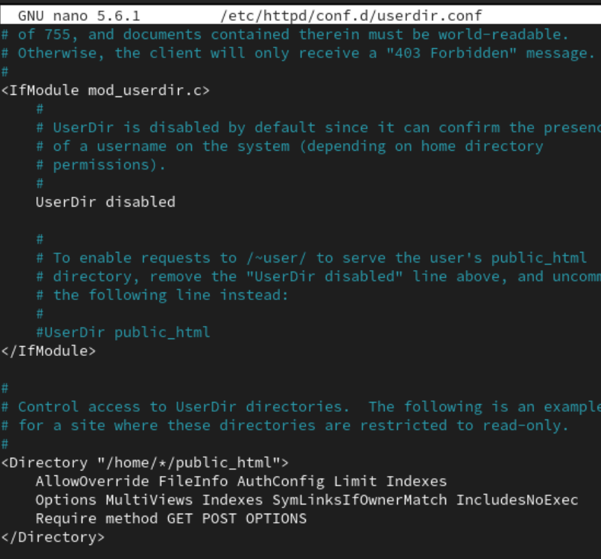{#fig:011 width=90%}

2. Внесите изменения в настройки межсетевого экрана узла server, разрешив работу с http:(рис. [-@fig:012]),(рис. [-@fig:013])

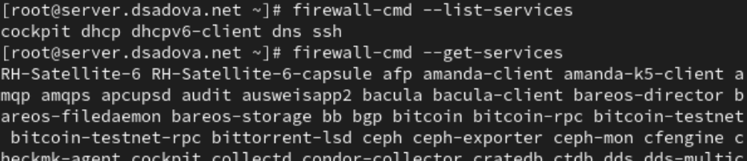{#fig:012 width=90%}

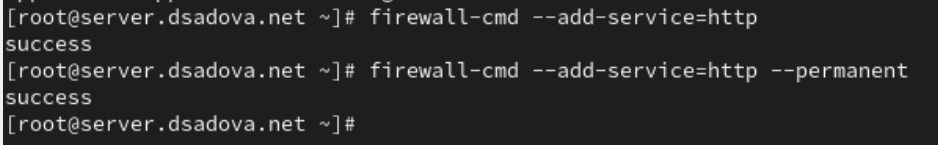{#fig:013 width=90%}

3. В дополнительном терминале запустите в режиме реального времени расширенный лог системных сообщений, чтобы проверить корректность работы системы:(рис. [-@fig:014])

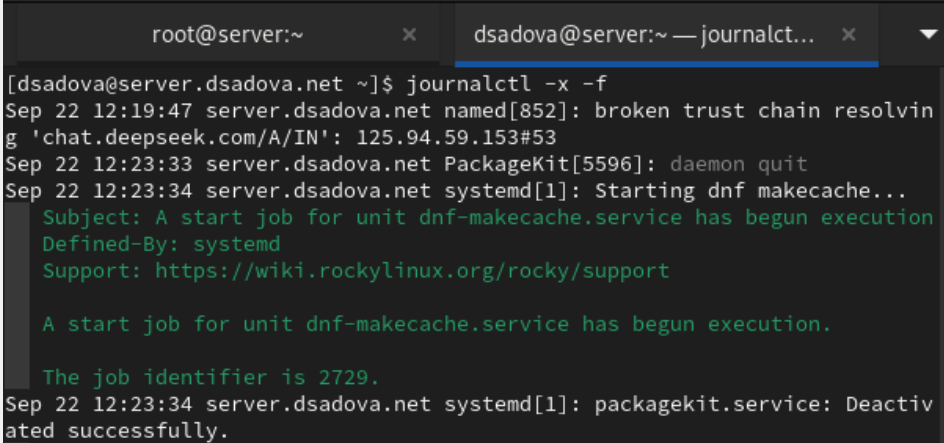{#fig:014 width=90%}

4. В первом терминале активируйте и запустите HTTP-сервер:(рис. [-@fig:015])

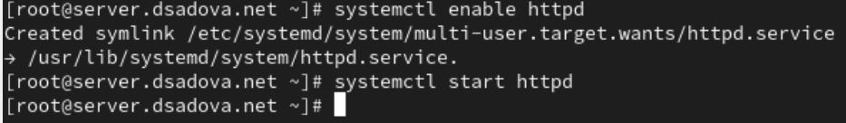{#fig:015 width=90%}

Просмотрев расширенный лог системных сообщений, убедитесь, что веб-сервер успешно запустился.(рис. [-@fig:016])

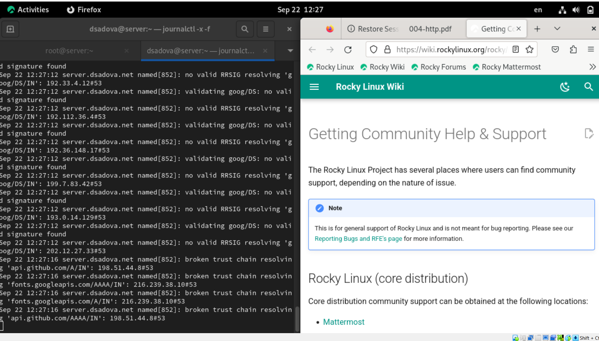{#fig:016 width=90%}

Сервер успешно запустился

### Анализ работы HTTP-сервера

1. Запустите виртуальную машину client.

2. На виртуальной машине server просмотрите лог ошибок работы веб-сервера:(рис. [-@fig:017])

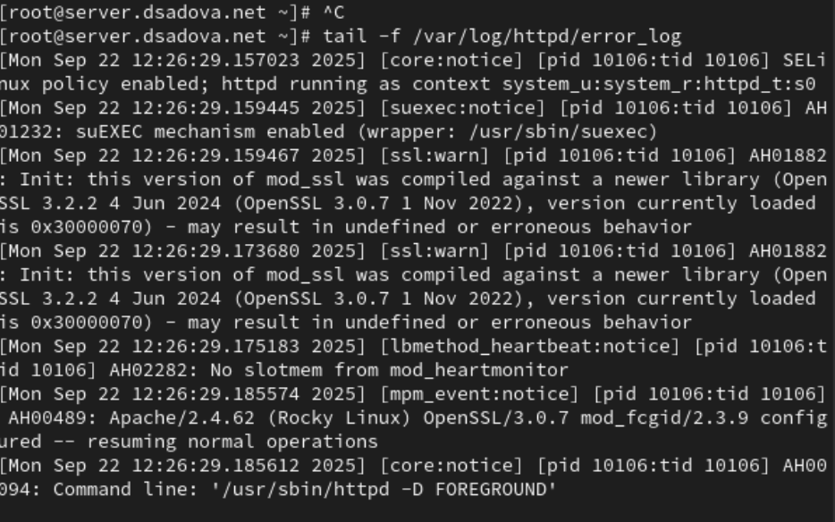{#fig:017 width=90%}

3. На виртуальной машине server запустите мониторинг доступа к веб-серверу:(рис. [-@fig:018])

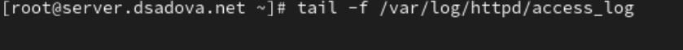{#fig:018 width=90%}

На виртуальной машине client запустите браузер и в адресной строке введите 192.168.1.1. Проанализируйте информацию, отразившуюся при мониторинге.(рис. [-@fig:019]),(рис. [-@fig:020])

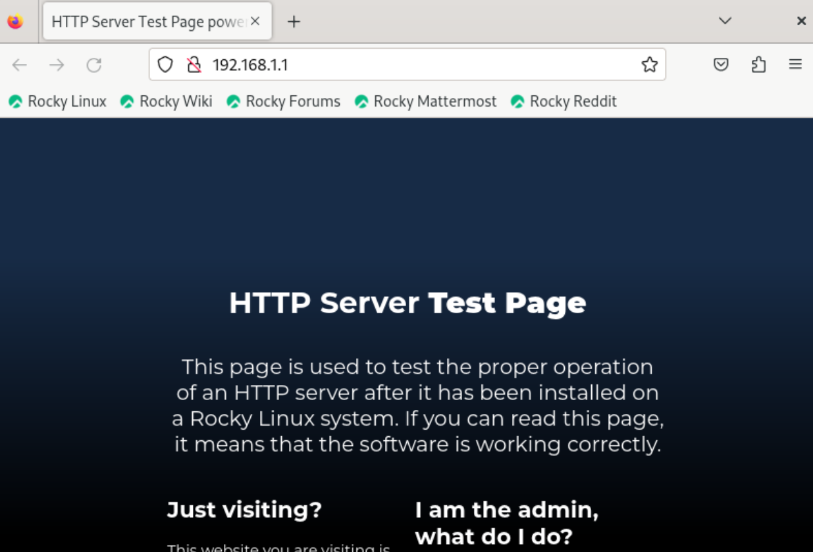{#fig:019 width=90%}

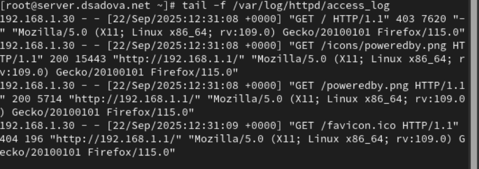{#fig:020 width=90%}

GET / - код ответа 403 (Forbidden)

- Сервер блокирует доступ к корневой директории

- Соответствует настройкам из предыдущих конфигураций (Options -Indexes)

- Размер ответа: 7620 байт (вероятно, страница с ошибкой 403)

GET /icons/poweredby.png - код 200 (OK)

- Успешная загрузка иконки Apache через алиас /icons/

- Размер: 15443 байт

GET /poweredby.png - код 200 (OK)

- Успешная загрузка той же иконки через прямой алиас

- Размер: 5714 байт (возможно, другой файл или сжатая версия)

GET /favicon.ico - код 404 (Not Found)

- Стандартная иконка сайта отсутствует

- Ожидаемое поведение для тестовой страницы

Технические детали:

- Клиент: Firefox 115 на Linux

- IP клиента: 192.168.1.30

- Сервер: server.dsadova.net (192.168.1.1)

### Настройка виртуального хостинга для HTTP-сервера

Требуется настроить виртуальный хостинг по двум DNS-адресам: server.user.net и www.user.net.

1. Остановите работу DNS-сервера для внесения изменений в файлы описания DNS-зон:(рис. [-@fig:021])

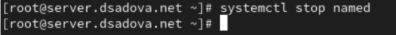{#fig:021 width=90%}

2. Добавьте запись для HTTP-сервера в конце файла прямой DNS-зоны /var/named/master/fz/user.net:(рис. [-@fig:022])

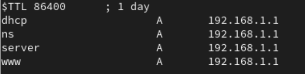{#fig:022 width=90%}

и в конце файла обратной зоны /var/named/master/rz/192.168.1:(рис. [-@fig:023])

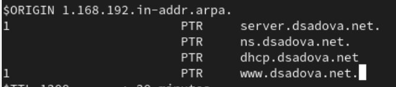{#fig:023 width=90%}

При этом не забудьте из соответствующих каталогов удалить файлы журналов DNS: user.net.jnl и 192.168.1.jnl.(рис. [-@fig:024]),(рис. [-@fig:025])

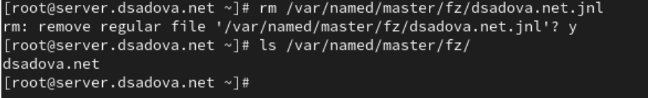{#fig:024 width=90%}

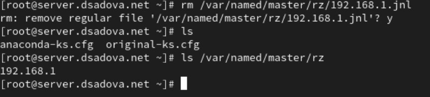{#fig:025 width=90%}

3. Перезапустите DNS-сервер:(рис. [-@fig:026])

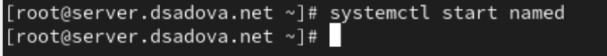{#fig:026 width=90%}

4. В каталоге /etc/httpd/conf.d создайте файлы server.user.net.conf и www.user.net.conf (вместо user укажите свой логин):(рис. [-@fig:027])

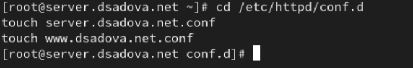{#fig:027 width=90%}

5. Откройте на редактирование файл server.user.net.conf и внесите следующее содержание:(рис. [-@fig:028])

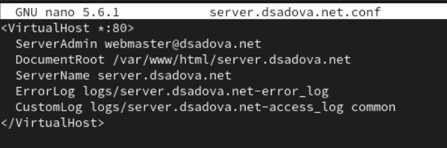{#fig:028 width=90%}

6. Откройте на редактирование файл www.user.net.conf и внесите следующее содержание:(рис. [-@fig:029])

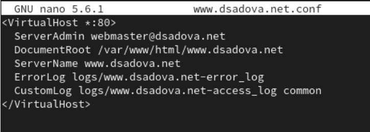{#fig:029 width=90%}

7. Перейдите в каталог /var/www/html, в котором должны находиться файлы с содержимым (контентом) веб-серверов, и создайте тестовые страницы для виртуальных веб-серверов server.user.net и www.user.net. Для виртуального веб-сервера server.user.net (вместо user укажите свой логин):(рис. [-@fig:030])

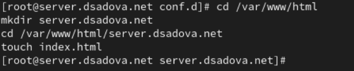{#fig:030 width=90%}

Откройте на редактирование файл index.html и внесите следующее содержание:(рис. [-@fig:031])

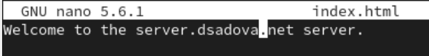{#fig:031 width=90%}

Для виртуального веб-сервера www.user.net (вместо user укажите свой логин):(рис. [-@fig:032])

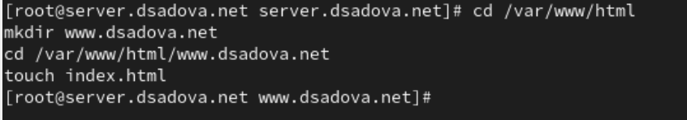{#fig:032 width=90%}

Откройте на редактирование файл index.html и внесите следующее содержание:(рис. [-@fig:033])

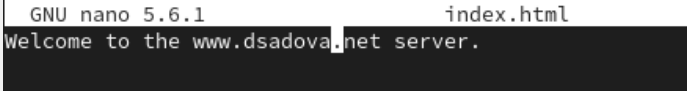{#fig:033 width=90%}

8. Скорректируйте права доступа в каталог с веб-контентом:(рис. [-@fig:034])

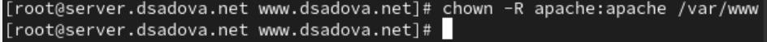{#fig:034 width=90%}

9. Восстановите контекст безопасности в SELinux:(рис. [-@fig:035])

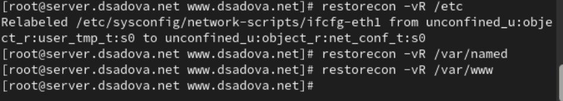{#fig:035 width=90%}

10. Перезапустите HTTP-сервер:(рис. [-@fig:036])

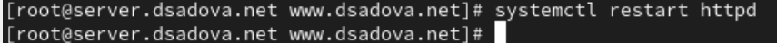{#fig:036 width=90%}

11. На виртуальной машине client убедитесь в корректном доступе к веб-серверу по адресам server.user.net и www.user.net (вместо user укажите свой логин) в адресной строке веб-браузера.(рис. [-@fig:037]),(рис. [-@fig:038])

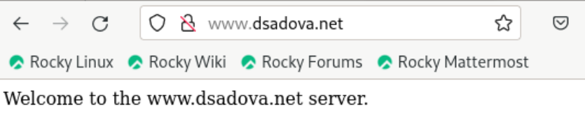{#fig:037 width=90%}

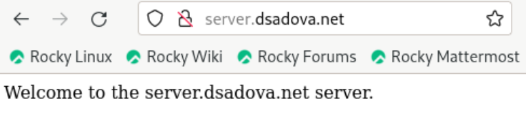{#fig:038 width=90%}

### Внесение изменений в настройки внутреннего окружения виртуальной машины

1. На виртуальной машине server перейдите в каталог для внесения изменений в настройки внутреннего окружения /vagrant/provision/server/, создайте в нём каталог http, в который поместите в соответствующие подкаталоги конфигурационные файлы HTTP-сервера:(рис. [-@fig:039])

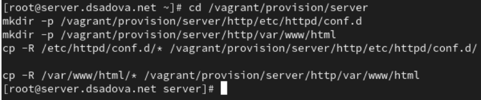{#fig:039 width=90%}

2. Замените конфигурационные файлы DNS-сервера:(рис. [-@fig:040])

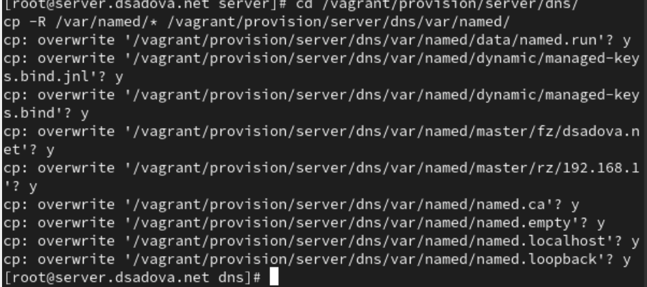{#fig:040 width=90%}

3. В каталоге /vagrant/provision/server создайте исполняемый файл http.sh:(рис. [-@fig:041])

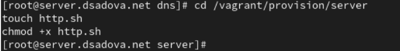{#fig:041 width=90%}

Открыв его на редактирование, пропишите в нём следующий скрипт:(рис. [-@fig:042])

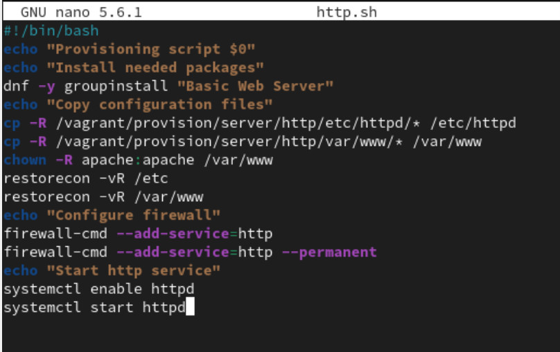{#fig:042 width=90%}

Этот скрипт, по сути, повторяет произведённые вами действия по установке и настройке HTTP-сервера.

4. Для отработки созданного скрипта во время загрузки виртуальных машин в конфигурационном файле Vagrantfile необходимо добавить в конфигурации сервера следующую запись:(рис. [-@fig:043])

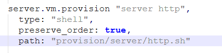{#fig:043 width=90%}

# Выводы

Приобрели практические навыки по установке и базовому конфигурированию HTTP-сервера Apache

# Список литературы{.unnumbered}

::: {#refs}
:::
