---
## Front matter
lang: ru-RU
title: Лабораторная работа № 6.
subtitle: Приобретение практических навыков по установке и конфигурированию системы управления базами данных на примере программного обеспечения MariaDB
author:
  - Cадова Д. А.
institute:
  - Российский университет дружбы народов, Москва, Россия

## i18n babel
babel-lang: russian
babel-otherlangs: english
## Fonts
mainfont: PT Serif
romanfont: PT Serif
sansfont: PT Sans
monofont: PT Mono
mainfontoptions: Ligatures=TeX
romanfontoptions: Ligatures=TeX
sansfontoptions: Ligatures=TeX,Scale=MatchLowercase
monofontoptions: Scale=MatchLowercase,Scale=0.9

## Formatting pdf
toc: false
toc-title: Содержание
slide_level: 2
aspectratio: 169
section-titles: true
theme: metropolis
header-includes:
 - \metroset{progressbar=frametitle,sectionpage=progressbar,numbering=fraction}
 - '\makeatletter'
 - '\beamer@ignorenonframefalse'
 - '\makeatother'
---

# Информация

## Докладчик

:::::::::::::: {.columns align=center}
::: {.column width="70%"}

  * Садова Диана Алексеевна
  * студент бакалавриата
  * Российский университет дружбы народов
  * [113229118@pfur.ru]
  * <https://DianaSadova.github.io/ru/>

:::
::::::::::::::

# Вводная часть

## Актуальность

- Важно понимания работы с базами данных. Как они устрояны

## Цели и задачи

- Система управления базами данных MariaDB представляет собой ответвление от MySQL компании Oracle. MariaDB имеет высокую совместимость с MySQL. Документацию по работе с MariaDB и основы синтаксиса SQL 

## Материалы и методы

- Текст лабороторной работы № 6
- Интеранет для устранения ошибок 

## Содержание 

1. Установите необходимые для работы MariaDB пакеты.

2. Настройте в качестве кодировки символов по умолчанию utf8 в базах данных.

3. В базе данных MariaDB создайте тестовую базу addressbook, содержащую таблицу city с полями name и city, т.е., например, для некоторого сотрудника указан город, в котором он работает.

4. Создайте резервную копию базы данных addressbook и восстановите из неё данные.

5. Напишите скрипт для Vagrant, фиксирующий действия по установке и настройке базы данных MariaDB во внутреннем окружении виртуальной машины server. Соответствующим образом следует внести изменения в Vagrantfile.

# Последовательность выполнения работы

## Установка MariaDB

В упражнении выполняется базовая установка MariaDB. Также отключается доступ к базе данных по сети и применяются параметры безопасности. Затем проверяется наличие доступных системных баз данных по умолчанию.
 
1. Загрузите вашу операционную систему и перейдите в рабочий каталог с проектом.

##

2. Запустите виртуальную машину server:

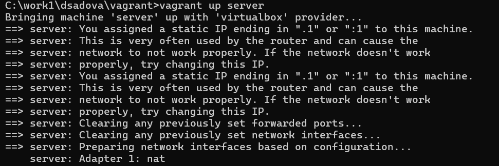

##

3. На виртуальной машине server войдите под вашим пользователем и откройте терминал. Перейдите в режим суперпользователя:

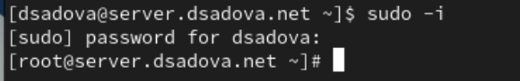

##

4. Установите необходимые для работы с базами данных пакеты:

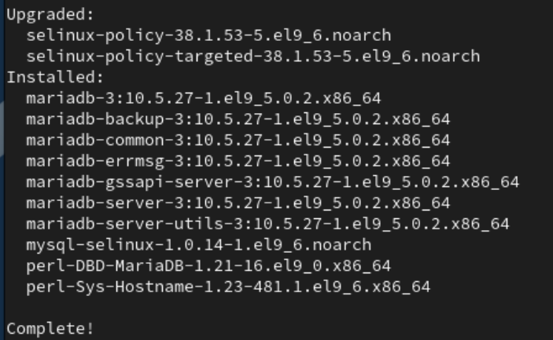

##

5. Просмотрите конфигурационные файлы mariadb в каталоге /etc/my.cnf.d и в файле /etc/my.cnf. В отчёте прокомментируйте построчно их содержание.

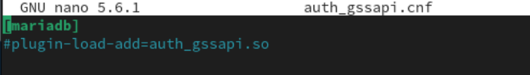

##

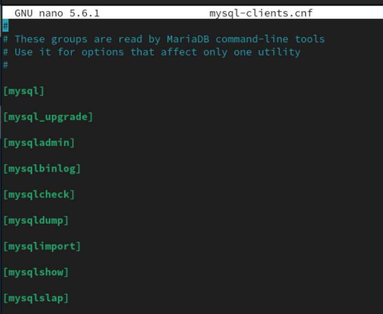

##

Комментарий говорит, что этот файл предназначен для утилит командной строки, и настройки здесь влияют только на конкретную утилиту.

[mysql] - настройки для утилиты mysql (основной клиент для выполнения SQL).

[mysqldump] - настройки для утилиты резервного копирования mysqldump.

[mysqladmin] - настройки для утилиты администрирования mysqladmin.

##

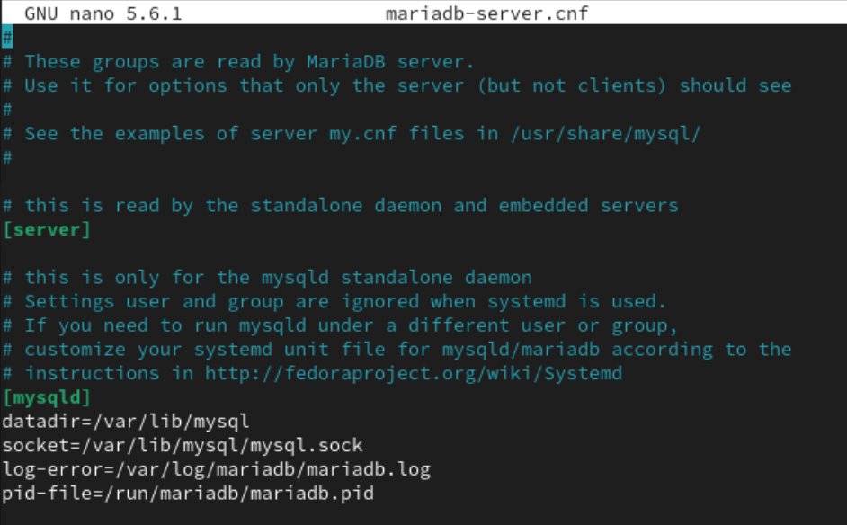

##

Комментарий говорит, что этот файл читается сервером MariaDB, и настройки здесь не применяются к клиентским утилитам.

Секция [server] читается всеми типами серверов MariaDB (standalone, embedded). Настройки здесь являются общими для всех.

Секция для standalone-сервера (демона mysqld). Содержит критически важные параметры:

- datadir=/var/lib/mysql - Определяет каталог, где хранятся все файлы баз данных.

- socket=/var/lib/mysql/mysql.sock - Задает путь к сокет-файлу, который используется для локальных соединений.

- log-error=/var/log/mariadb/mariadb.log - Указывает файл, в который записываются ошибки и важные события сервера.

- pid-file=/run/mariadb/mariadb.pid - Определяет файл, в который записывается Process ID (PID) запущенного демона MariaDB. Используется системой для управления службой.

##

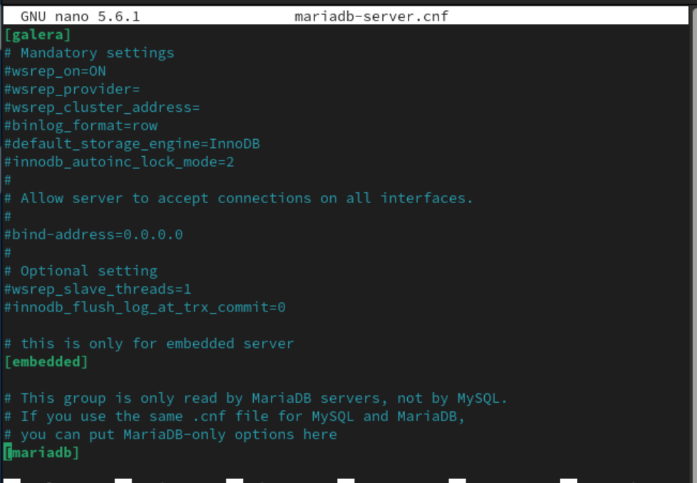

Содержит настройки для кластеризации на основе Galera.

- wsrep_on=ON - Включает поддержку Galera.

- wsrep_provider= - Путь к библиотеке провайдера WSREP (например, /usr/lib64/galera-4/libgalera_smm.so).

- wsrep_cluster_address= - Адреса узлов кластера (например, gcomm://node1,node2,node3).

- binlog_format=row - Обязательный формат бинарного лога для репликации.

- default_storage_engine=InnoDB - Обязательный механизм хранения.

- innodb_autoinc_lock_mode=2 - Специальный режим блокировки для InnoDB, необходимый для параллельной вставки в кластере.

##

Закомментированная директива bind-address позволяет серверу слушать соединения на всех сетевых интерфейсах. По умолчанию, если параметр не задан, сервер слушает только localhost (127.0.0.1). Раскомментирование необходимо для удаленного доступа к серверу.

[embedded] - Для встроенного (embedded) сервера MariaDB, который используется внутри других приложений.

[mariadb] - Аналог секции [mysqld], но читается только сервером MariaDB (игнорируется MySQL). Позволяет использовать специфичные для MariaDB опции, обеспечивая совместимость конфига с MySQL.

##

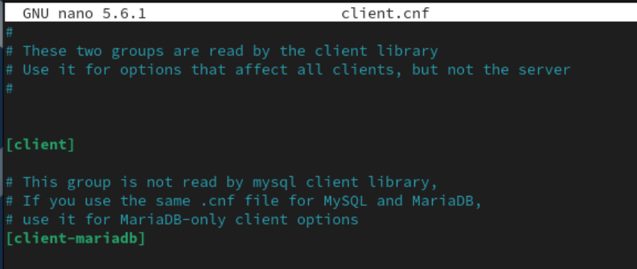

##

Комментарий говорит, что файл читается клиентскими библиотеками, и настройки здесь влияют на все клиентские утилиты.

[client] - Самая важная клиентская секция. Любая утилита командной строки (mysql, mysqldump, mysqladmin и др.) читает параметры из этой секции. Сюда обычно добавляют:

- host - хост сервера по умолчанию.

- user= - пользователь по умолчанию.

- password= - пароль (небезопасно!).

- default-character-set=utf8mb4 - кодировка подключения.

[client-mariadb] - Специфичная для MariaDB клиентская секция. Читается только клиентами MariaDB. Полезно, если конфигурационный файл используется одновременно с клиентами MySQL и MariaDB.
    
##

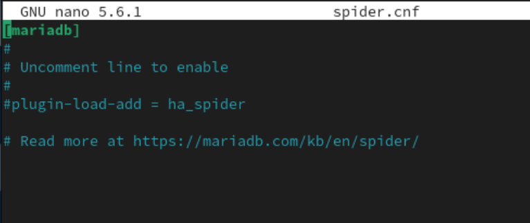

##

Файла содержит настройки для подключения механизма хранения Spider.

[mariadb] - Указывает, что следующие настройки относятся к серверу MariaDB.

Закоментированна инструкция по включению механизма Spider.

- plugin-load-add = ha_spider - Директива для динамической загрузки плагина Spider. В текущем состоянии плагин не загружен, так как строка закомментирована.

##

6. Для запуска и включения программного обеспечения mariadb используйте:

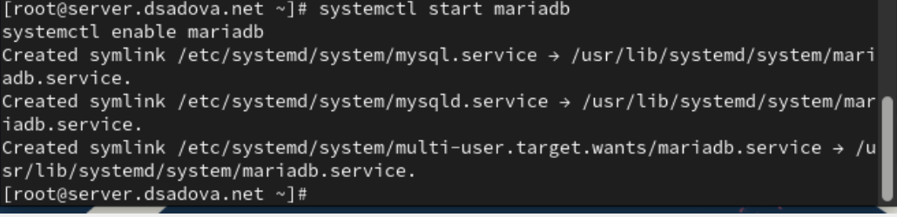

##

7. Убедитесь, что mariadb прослушивает порт, используя ss -tulpen | grep mysql Вы должны увидеть процесс mysqld, прослушивающий порт 3306.

##

8. Запустите скрипт конфигурации безопасности mariadb, используя:

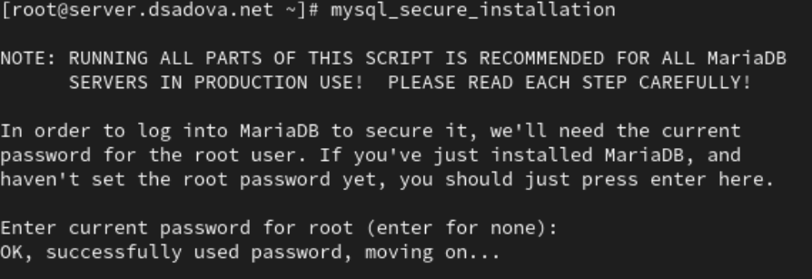

##

9. Для входа в базу данных с правами администратора базы данных введите

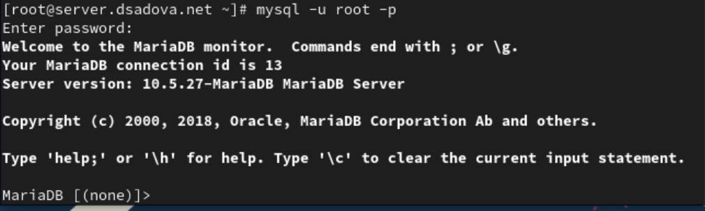

##

10. Просмотрите список команд MySQL, введя '/h'

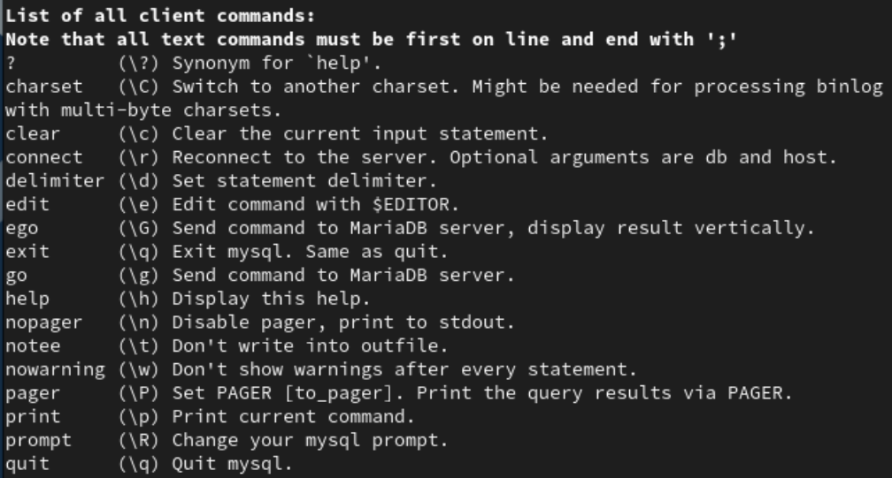

##

11. Из приглашения интерактивной оболочки MariaDB для отображения доступных в настоящее время баз данных введите MySQL-запрос

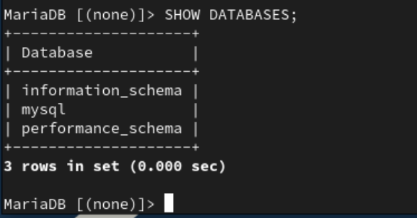

##

В отчёте укажите, какие базы данных есть в системе.

В системе есть 3 базы данных:

- information_schema

- mysql

- performance_schema

##

12. Для выхода из интерфейса интерактивной оболочки MariaDB введите

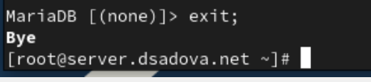

## Конфигурация кодировки символов

1. Войдите в базу данных с правами администратора:

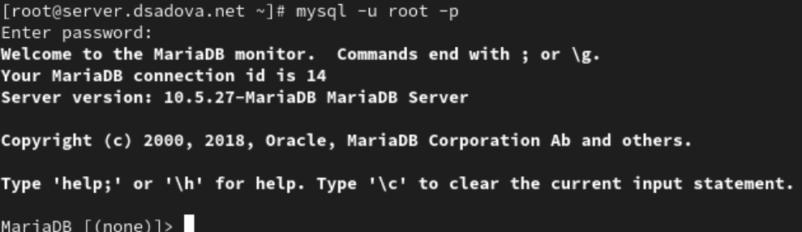

##

2. Для отображения статуса MariaDB введите из приглашения интерактивной оболочки MariaDB:

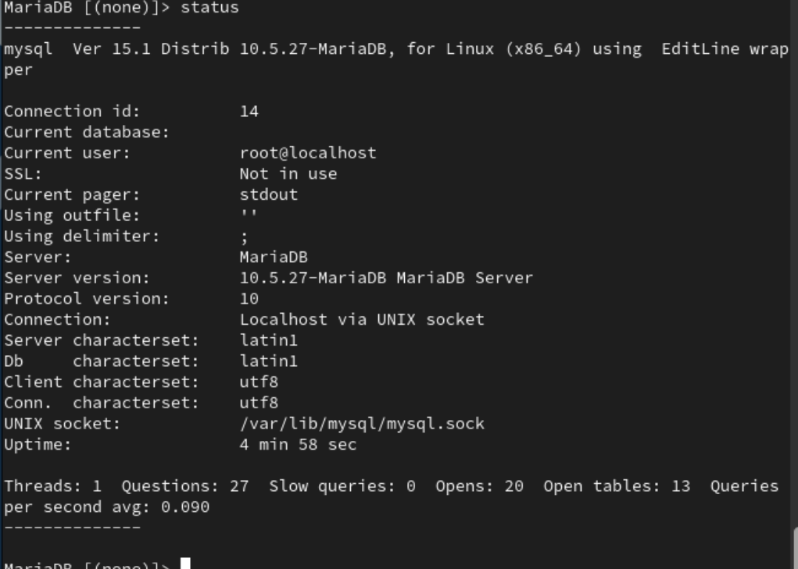

##

В отчёте построчно поясните выведенную на экран информацию.

- Сonnection id: 14 - уникальный идентификатор текущего соединения с сервером баз данных

- Current database: - в данный момент не выбрана ни одна база данных для использования

- Current user: root@localhost - с акаунта какого пользователя мы совершили вход 

- SSL: Not in use - защищенное SSL-соединение не используется

- Current pager: stdout - вывод направляется в стандартный поток вывода (экран)

##

- Using outfile: '' - не используется запросов с выводом в файл

- Using delimiter: ; - в качестве разделителя команд используется точка с запятой

- Server: MariaDB - используется сервер баз данных MariaDB

- Server version: 10.5.27-MariaDB MariaDB Server - версия сервера MariaDB 10.5.27

- Protocol version: 10 - версия протокола соединения

##

- Connection: Localhost via UNIX socket - подключение выполнено через UNIX-сокет на локальной машине

- Server characterset: latin1 - кодировка символов на стороне сервера

- Db characterset: latin1 - кодировка символов по умолчанию для баз данных

- Client characterset: utf8 - кодировка символов на стороне клиента

- Conn. characterset: utf8 - кодировка символов соединения

- UNIX socket: /var/lib/mysql/mysql.sock - путь к файлу UNIX-сокета для соединения

##

- Uptime: 4 min 58 sec - время работы сервера без перезагрузки

- Threads: 1 - количество активных подключений к серверу

- Questions: 27 - общее количество выполненных запросов

- Slow queries: 0 - количество медленных запросов

- Opens: 20 - количество открытых таблиц

##

- Open tables: 13 - количество таблиц, открытых в настоящее время

- Queries per second avg: 0.090 - среднее количество запросов в секунду

##

3. В каталоге /etc/my.cnf.d создайте файл utf8.cnf:

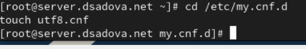

##

Откройте его на редактирование и укажите в нём следующую конфигурацию:

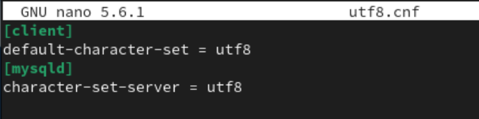

##

4. Перезапустите MariaDB.

5. Войдите в базу данных с правами администратора и посмотрите статус MariaDB.

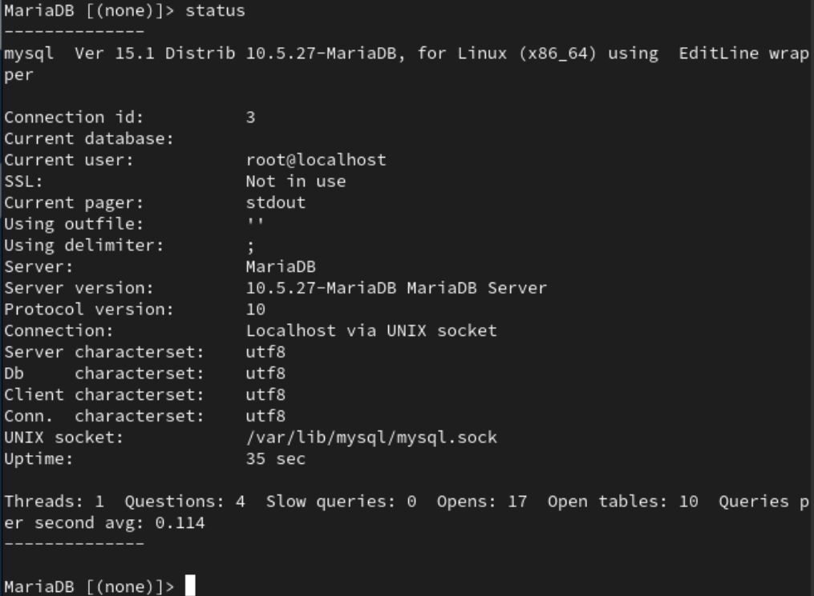

##

В отчёте поясните, что изменилось.

Изменился уникальный идентификатор текущего соединения с сервером баз данных
- Сonnection id: 14 -> Сonnection id: 3

Изменились кодировки символов на стороне сервера и по умолчанию для баз данных

- Server characterset: latin1 -> Server characterset: utf8

- Db characterset: latin1 -> Db characterset: utf8

##

Изменилось время работы сервера без перезагрузки

- 4 min 58 sec -> 35 sec

Изменилось общее количество выполненных запросов

- Questions: 27 -> Questions: 4

##

Изменилось количество открытых таблиц

- Opens: 20 -> Opens: 17

Изменилось количество таблиц, открытых в настоящее время

- Open tables: 13 -> Open tables: 10

## Создание базы данных

1. Войдите в базу данных с правами администратора.

2. Создайте базу данных с именем addressbook:

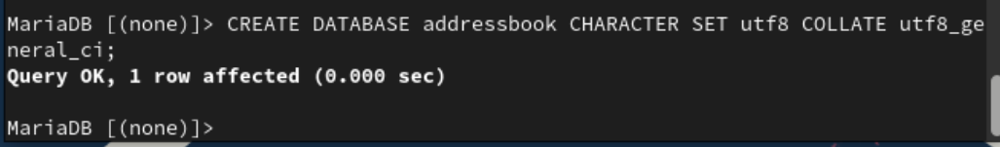

##

3. Перейдите к базе данных addressbook

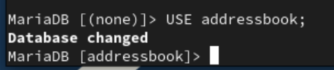

##

4. Отобразите имеющиеся в базе данных addressbook таблицы:

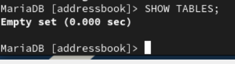

##

5. Создайте таблицу city с полями name и city:

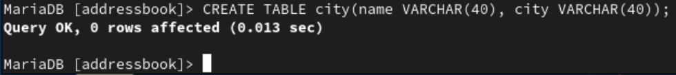{#fig:026 width=90%}

##

6. Заполните несколько строк таблицы некоторыми данными по аналогии в соответствии с синтаксисом MySQL: INSERT INTO city(name,city) VALUES ('Иванов','Москва');

В частности, добавьте в базу сведения о Петрове и Сидорове: 

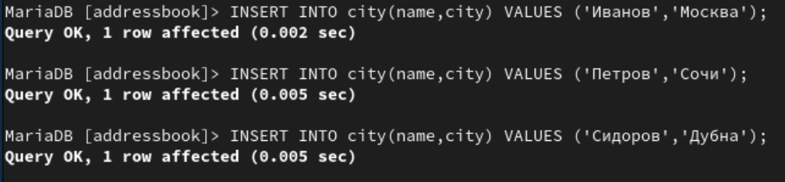

##

7. Сделайте следующий MySQL-запрос:

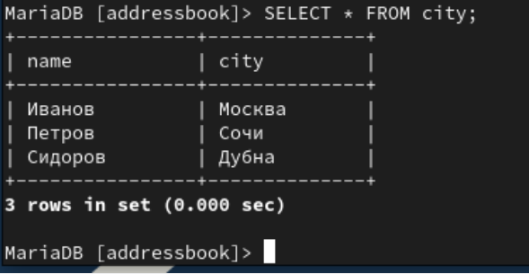

##

и в отчёте поясните результат его выполнения.

Мы вывели содержимое таблицы city на экран с информацией, которую заполнили раниие 

##

8. Создайте пользователя для работы с базой данных addressbook и задайте для него пароль:

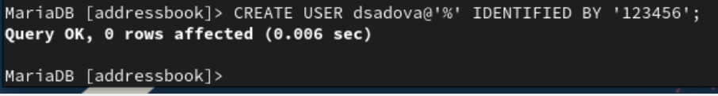

##

9. Предоставьте права доступа созданному пользователю user на действия с базой данных addressbook (просмотр, добавление, обновление, удаление данных):

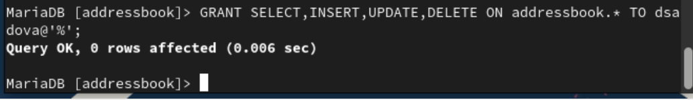

##

10. Обновите привилегии (права доступа) базы данных addressbook:

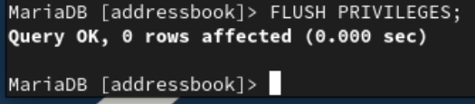

##

11. Посмотрите общую информацию о таблице city базы данных addressbook:

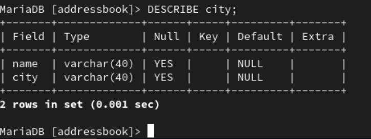

##

12. Выйдете из окружения MariaDB:

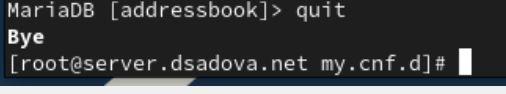

##

13. Просмотрите список баз данных:

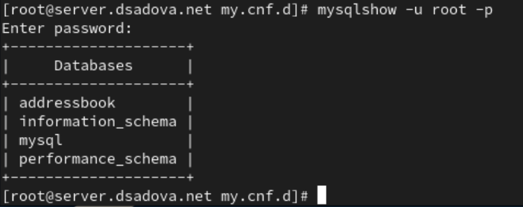

##

14. Просмотрите список таблиц базы данных addressbook:

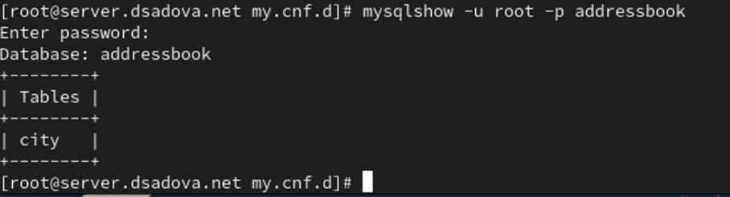

## Резервные копии

1. На виртуальной машине server создайте каталог для резервных копий:

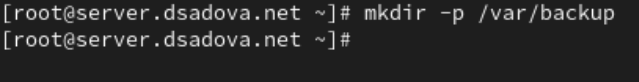

##

2. Сделайте резервную копию базы данных addressbook:

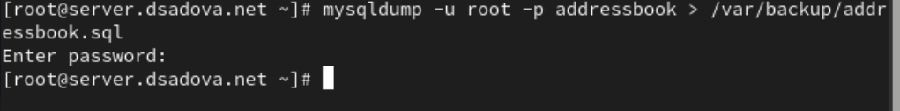

##

3. Сделайте сжатую резервную копию базы данных addressbook:

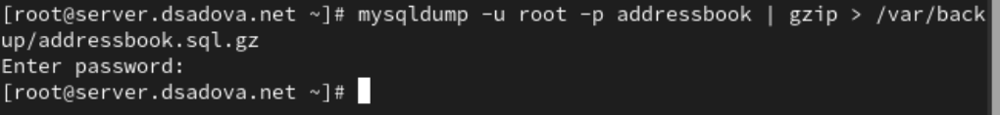

##

4. Сделайте сжатую резервную копию базы данных addressbook с указанием даты создания копии:

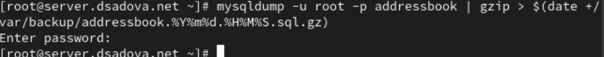

##

5. Восстановите базу данных addressbook из резервной копии:

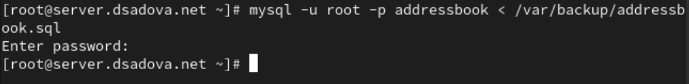

##

6. Восстановите базу данных addressbook из сжатой резервной копии:

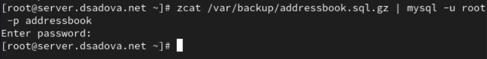

## Внесение изменений в настройки внутреннего окружения виртуальной машины

1. На виртуальной машине server перейдите в каталог для внесения изменений в настройки внутреннего окружения /vagrant/provision/server/, создайте в нём каталог mysql, в который поместите в соответствующие подкаталоги конфигурационные файлы MariaDB и резервную копию базы данных addressbook:

##

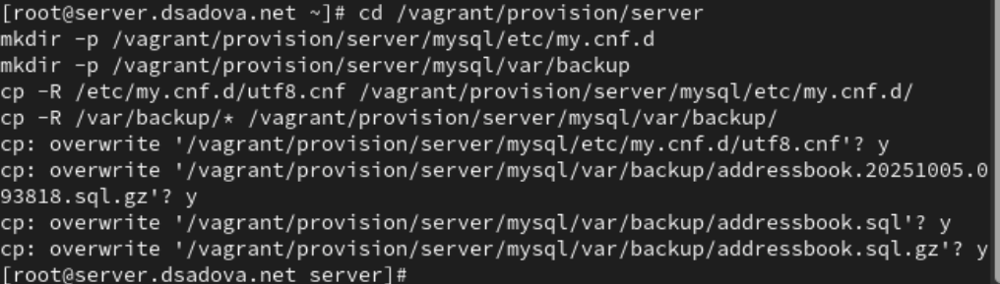

##

2. В каталоге /vagrant/provision/server создайте исполняемый файл mysql.sh. Открыв его на редактирование, пропишите в нём следующий скрипт:

##

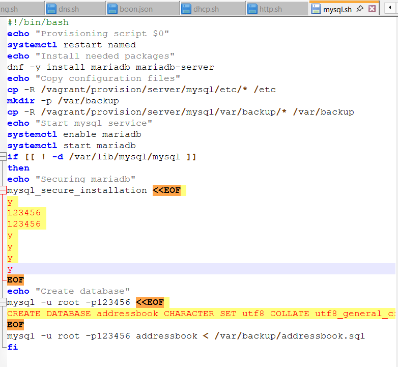

## Результаты

- Изучили систему управления базами данных MariaDB. Поработали с созданием, редактированием, сжатием и востановлением баз данных. 

