---
## Front matter
lang: ru-RU
title: Лабораторная работа № 8.
subtitle: Настройка SMTP-сервера
author:
  - Cадова Д. А.
institute:
  - Российский университет дружбы народов, Москва, Россия

## i18n babel
babel-lang: russian
babel-otherlangs: english
## Fonts
mainfont: PT Serif
romanfont: PT Serif
sansfont: PT Sans
monofont: PT Mono
mainfontoptions: Ligatures=TeX
romanfontoptions: Ligatures=TeX
sansfontoptions: Ligatures=TeX,Scale=MatchLowercase
monofontoptions: Scale=MatchLowercase,Scale=0.9

## Formatting pdf
toc: false
toc-title: Содержание
slide_level: 2
aspectratio: 169
section-titles: true
theme: metropolis
header-includes:
 - \metroset{progressbar=frametitle,sectionpage=progressbar,numbering=fraction}
 - '\makeatletter'
 - '\beamer@ignorenonframefalse'
 - '\makeatother'
---

# Информация

## Докладчик

:::::::::::::: {.columns align=center}
::: {.column width="70%"}

  * Садова Диана Алексеевна
  * студент бакалавриата
  * Российский университет дружбы народов
  * [113229118@pfur.ru]
  * <https://DianaSadova.github.io/ru/>

:::
::::::::::::::

# Вводная часть

## Актуальность

- Важно понимать как работать с SMTP-сервер postfix. Как правильно его настраивать и отправлять сообщения.

## Цели и задачи

- Приобретение практических навыков по установке и конфигурированию SMTP-сервера.

## Материалы и методы

- Текст лабороторной работы № 8
- Интеранет для устранения ошибок 

## Содержание 

1. Установите на виртуальной машине server SMTP-сервер postfix.
2. Сделайте первоначальную настройку postfix при помощи утилиты postconf, задав отправку писем не на локальный хост, а на сервер в домене.
3. Проверьте отправку почты с сервера и клиента.
4. Сконфигурируйте Postfix для работы в домене. Проверьте отправку почты с сервера и клиента.
5. Напишите скрипт для Vagrant, фиксирующий действия по установке и настройке Postfix во внутреннем окружении виртуальной машины server. Соответствующим образом внесите изменения в Vagrantfile.

## Установка Postfix

1. На виртуальной машине server войдите под вашим пользователем и откройте терминал. Перейдите в режим суперпользователя:

##

2. Установите необходимые для работы пакеты:

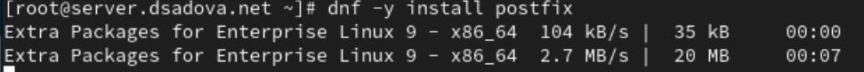

##

##

3. Сконфигурируйте межсетевой экран, разрешив работать службе протокола SMTP:

##

4. Восстановите контекст безопасности в SELinux:

##

5. Запустите Postfix:

## Изменение параметров Postfix с помощью postconf

Первоначальную настройку Postfix осуществите, используя postconf.

1. Для просмотра списка текущих настроек Postfix введите:

##

2. Посмотрите текущее значение параметра myorigin:

##

3. Посмотрите текущее значение параметра mydomain:

##

4. Замените значение параметра myorigin на значение параметра mydomain:

##

5. Повторите команду

##

6. Проверьте корректность содержания конфигурационного файла main.cf:

##

7. Перезагрузите (перечитайте) конфигурационные файлы Postfix:

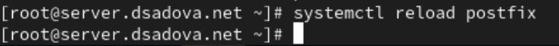

##

8. Просмотрите все параметры с значением, отличным от значения по умолчанию:

##

9. Задайте жёстко значение домена:

##

10. Отключите IPv6 в списке разрешённых в работе Postfix протоколов и оставьте только IPv4:

##

11. Перезагрузите конфигурацию Postfix:

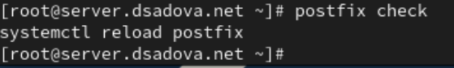

## Проверка работы Postfix

1. На сервере под учётной записью пользователя отправьте себе письмо, используя утилиту mail:

##

2. На втором терминале запустите мониторинг работы почтовой службы и посмотрите, что произошло с вашим сообщением:

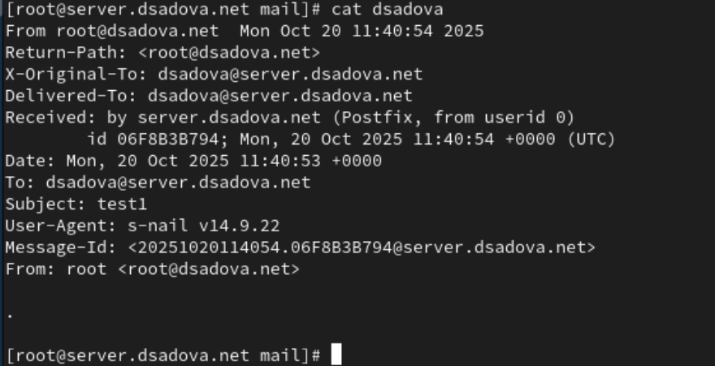

##

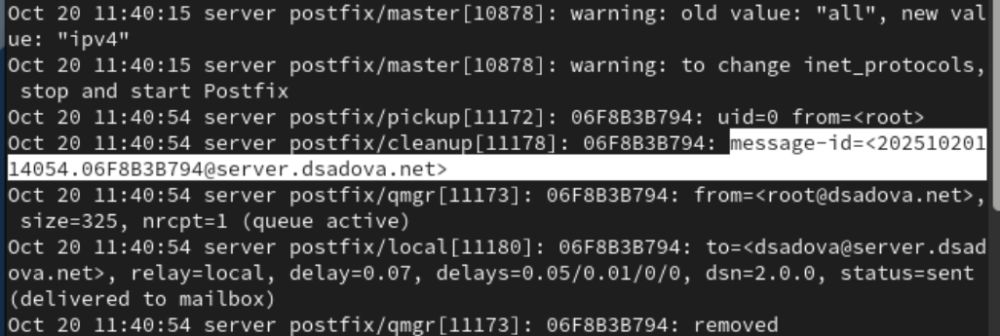

##

В отчёте отразите, доставлено сообщение или нет с пояснением, на основе каких строк лога вы сделали вывод. Дополнительно посмотрите содержание каталога /var/spool/mail на предмет того, появился ли там каталог вашего пользователя с отправленным письмом.

Сообщение было доставлено. Его можно увидеть в папке /var/spool/mail. А так же мы можем предпологать что сообщение было доставлено на основе лагов server postfix/pickup и server postfix/cleanup. Они первые поймали информацию о том что пришло новое сообщение. 

##

3. На виртуальной машине client войдите под вашим пользователем и откройте терминал. Перейдите в режим суперпользователя:

##

4. На клиенте установите необходимые для работы пакеты:

##

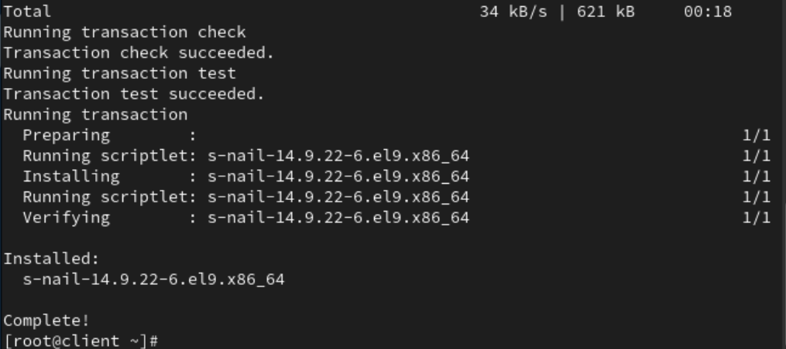

##

5. Отключите IPv6 в списке разрешённых в работе Postfix протоколов и оставьте только IPv4:

##

6. На клиенте запустите Postfix:

##

7. На клиенте под учётной записью пользователя аналогичным образом отправьте себе второе письмо, используя утилиту mail. Сравните результат мониторинга почтовой службы на сервере при отправке сообщения с сервера и с клиента. В отчёте отразите, доставлено сообщение или нет. 

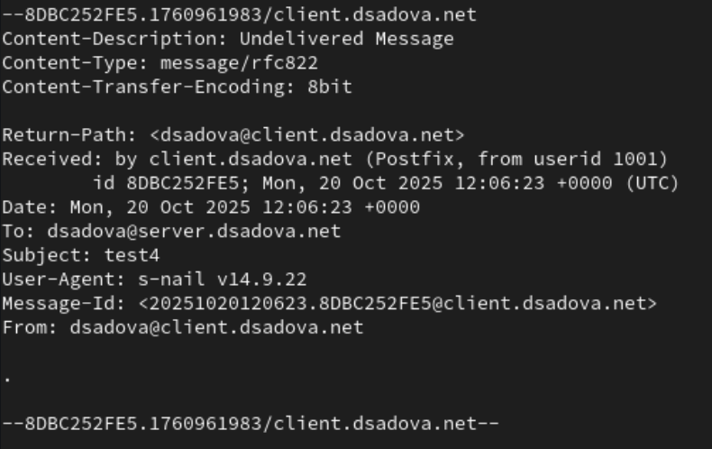

##

8. На сервере в конфигурации Postfix посмотрите значения параметров сетевых интерфейсов inet_interfaces и сетевых адресов mynetworks:

##

9. Разрешите Postfix прослушивать соединения не только с локального узла, но и с других интерфейсов сети:

##

10. Добавьте адрес внутренней сети, разрешив таким образом пересылку сообщений между узлами сети:

##

11. Перезагрузите конфигурацию Postfix и перезапустите Postfix:

##

12. Повторите отправку сообщения с клиента. В отчёте отразите, что произошло с вашим сообщением.

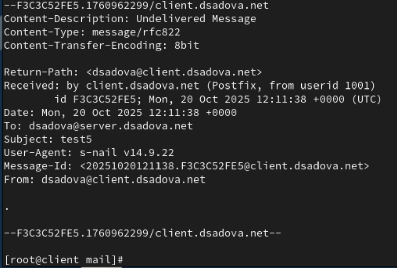

## Конфигурация Postfix для домена

1. С клиента отправьте письмо на свой доменный адрес:

##

2. Запустите мониторинг работы почтовой службы и посмотрите, что произошло с вашим сообщением:

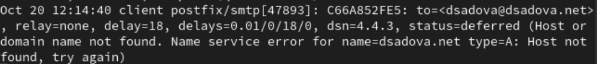

##

В отчёте отразите, что произошло с вашим сообщением.

Письмо было отправлено, но как мы написали неточный адрес, а имено ошиблись в оправили на конкретный узел сети, письмо было остановлено. 

##

3. Дополнительно посмотрите, какие сообщения ожидают в очереди на отправление:

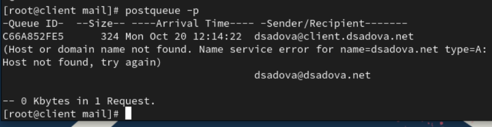

##

4. Для настройки возможности отправки сообщений не на конкретный узел сети, а на доменный адрес пропишите MX-запись с указанием имени почтового сервера mail.user.net (вместо user укажите свой логин) в файле прямой DNS-зоны:

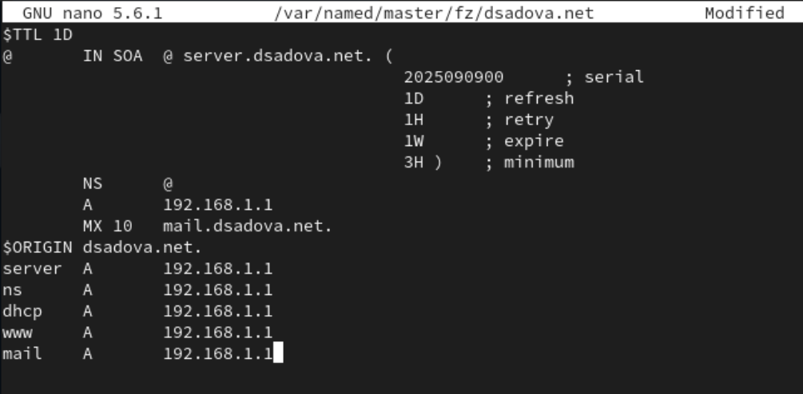

##

и в файле обратной DNS-зоны:

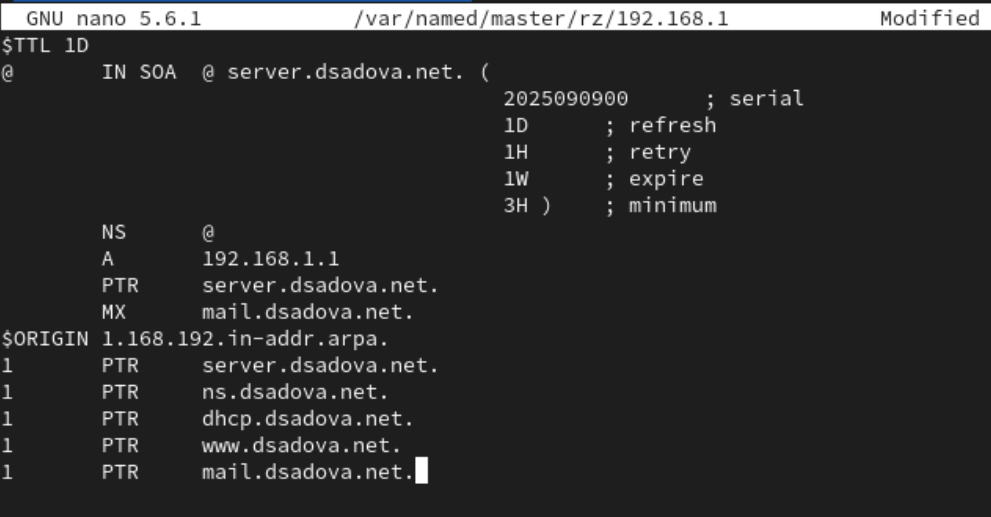

##

5. В конфигурации Postfix добавьте домен в список элементов сети, для которых данный сервер является конечной точкой доставки почты:

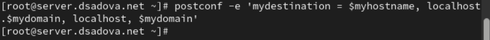

##

6. Перезагрузите конфигурацию Postfix:

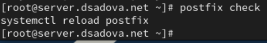

##

7. Восстановите контекст безопасности в SELinux:

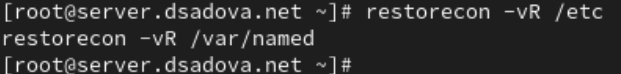

##

8. Перезапустите DNS:

##

9. Попробуйте отправить сообщения, находящиеся в очереди на отправление:

##

10. Проверьте отправку почты с клиента на доменный адрес.

Письмо было отправлено клиенту 

## Внесение изменений в настройки внутреннего окружения виртуальной машины

1. На виртуальной машине server перейдите в каталог для внесения изменений в настройки внутреннего окружения /vagrant/provision/server/.

2. Замените конфигурационные файлы DNS-сервера:

##

3. В каталоге /vagrant/provision/server создайте исполняемый файл mail.sh. Открыв его на редактирование, пропишите в нём следующий скрипт:

##

4. На виртуальной машине client перейдите в каталог для внесения изменений в настройки внутреннего окружения /vagrant/provision/client/.

5. В каталоге /vagrant/provision/client создайте исполняемый файл mail.sh. Открыв его на редактирование, пропишите в нём следующий скрипт:

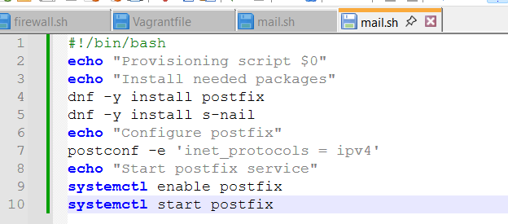

##

6. Для отработки созданного скрипта во время загрузки виртуальной машины server в конфигурационном файле Vagrantfile необходимо добавить в разделе конфигурации для сервера:

##

7. Для отработки созданного скрипта во время загрузки виртуальной машины client в конфигурационном файле Vagrantfile необходимо добавить в разделе конфигурации для клиента:

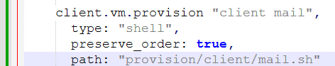

## Результаты

- Приобрели практические навыки по установке и конфигурированию SMTP-сервера. Разобрались с отправкой и получением писем.

