---
## Front matter
title: "Лабораторная работа № 8."
subtitle: "Настройка SMTP-сервера"
author: "Диана Алексеевна Садова"

## Generic otions
lang: ru-RU
toc-title: "Содержание"

## Bibliography
bibliography: bib/cite.bib
csl: pandoc/csl/gost-r-7-0-5-2008-numeric.csl

## Pdf output format
toc: true # Table of contents
toc-depth: 2
lof: true # List of figures
lot: true # List of tables
fontsize: 12pt
linestretch: 1.5
papersize: a4
documentclass: scrreprt
## I18n polyglossia
polyglossia-lang:
  name: russian
  options:
	- spelling=modern
	- babelshorthands=true
polyglossia-otherlangs:
  name: english
## I18n babel
babel-lang: russian
babel-otherlangs: english
## Fonts
mainfont: PT Serif
romanfont: PT Serif
sansfont: PT Sans
monofont: PT Mono
mainfontoptions: Ligatures=TeX
romanfontoptions: Ligatures=TeX
sansfontoptions: Ligatures=TeX,Scale=MatchLowercase
monofontoptions: Scale=MatchLowercase,Scale=0.9
## Biblatex
biblatex: true
biblio-style: "gost-numeric"
biblatexoptions:
  - parentracker=true
  - backend=biber
  - hyperref=auto
  - language=auto
  - autolang=other*
  - citestyle=gost-numeric
## Pandoc-crossref LaTeX customization
figureTitle: "Рис."
tableTitle: "Таблица"
listingTitle: "Листинг"
lofTitle: "Список иллюстраций"
lotTitle: "Список таблиц"
lolTitle: "Листинги"
## Misc options
indent: true
header-includes:
  - \usepackage{indentfirst}
  - \usepackage{float} # keep figures where there are in the text
  - \floatplacement{figure}{H} # keep figures where there are in the text
---

# Цель работы

Приобретение практических навыков по установке и конфигурированию SMTP-сервера.

# Задание

1. Установите на виртуальной машине server SMTP-сервер postfix.
2. Сделайте первоначальную настройку postfix при помощи утилиты postconf, задав отправку писем не на локальный хост, а на сервер в домене.
3. Проверьте отправку почты с сервера и клиента.
4. Сконфигурируйте Postfix для работы в домене. Проверьте отправку почты с сервера и клиента.
5. Напишите скрипт для Vagrant, фиксирующий действия по установке и настройке Postfix во внутреннем окружении виртуальной машины server. Соответствующим образом внесите изменения в Vagrantfile.

## Последовательность выполнения работы

### Установка Postfix

1. На виртуальной машине server войдите под вашим пользователем и откройте терминал. Перейдите в режим суперпользователя:(рис. [-@fig:001])

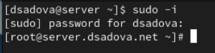{#fig:001 width=90%}

2. Установите необходимые для работы пакеты:(рис. [-@fig:002]),(рис. [-@fig:003])

{#fig:002 width=90%}

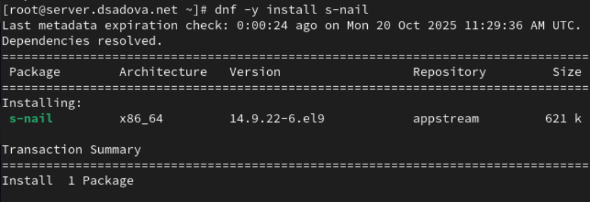{#fig:003 width=90%}

3. Сконфигурируйте межсетевой экран, разрешив работать службе протокола SMTP:(рис. [-@fig:004])

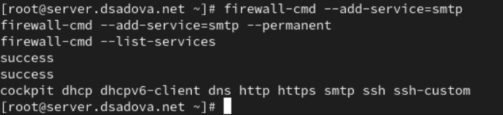{#fig:004 width=90%}

4. Восстановите контекст безопасности в SELinux:(рис. [-@fig:005])

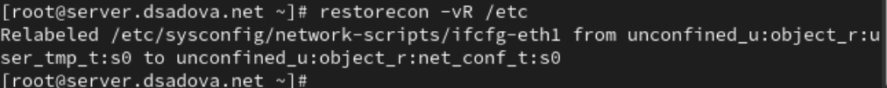{#fig:005 width=90%}

5. Запустите Postfix:(рис. [-@fig:006])

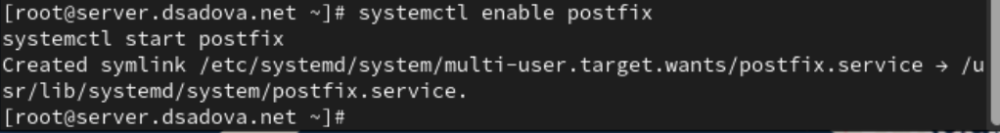{#fig:006 width=90%}

### Изменение параметров Postfix с помощью postconf

Первоначальную настройку Postfix осуществите, используя postconf.

1. Для просмотра списка текущих настроек Postfix введите:(рис. [-@fig:007])

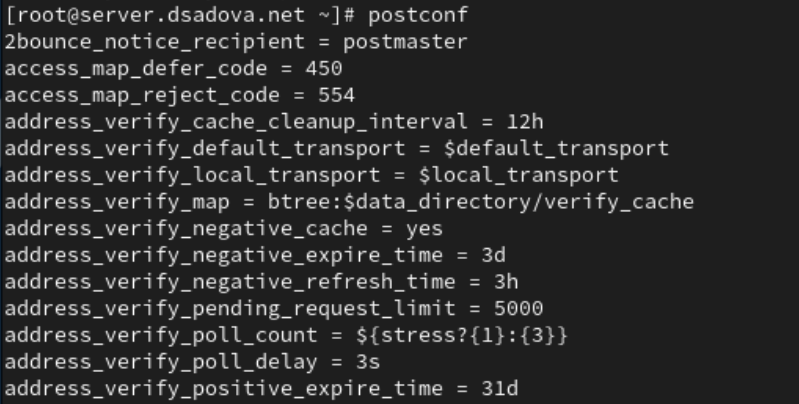{#fig:007 width=90%}

2. Посмотрите текущее значение параметра myorigin:(рис. [-@fig:008])

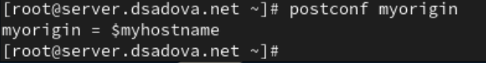{#fig:008 width=90%}

3. Посмотрите текущее значение параметра mydomain:(рис. [-@fig:009])

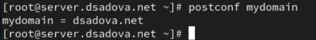{#fig:009 width=90%}

4. Замените значение параметра myorigin на значение параметра mydomain:(рис. [-@fig:010])

{#fig:010 width=90%}

5. Повторите команду(рис. [-@fig:011])

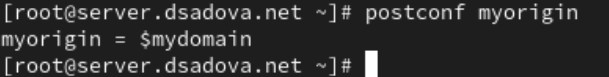{#fig:011 width=90%}

Убедитесь, что замена параметра была произведена.

Замена была произведена. 

6. Проверьте корректность содержания конфигурационного файла main.cf:(рис. [-@fig:012])

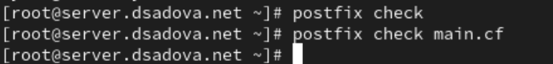{#fig:012 width=90%}

7. Перезагрузите (перечитайте) конфигурационные файлы Postfix:(рис. [-@fig:013])

{#fig:013 width=90%}

8. Просмотрите все параметры с значением, отличным от значения по умолчанию:(рис. [-@fig:014])

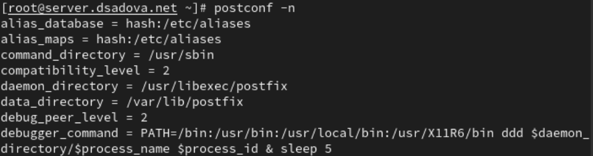{#fig:014 width=90%}

9. Задайте жёстко значение домена:(рис. [-@fig:015])

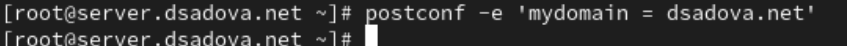{#fig:015 width=90%}

10. Отключите IPv6 в списке разрешённых в работе Postfix протоколов и оставьте только IPv4:(рис. [-@fig:016])

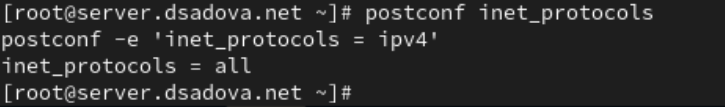{#fig:016 width=90%}

11. Перезагрузите конфигурацию Postfix:(рис. [-@fig:017])

{#fig:017 width=90%}

### Проверка работы Postfix

1. На сервере под учётной записью пользователя отправьте себе письмо, используя утилиту mail:(рис. [-@fig:018])

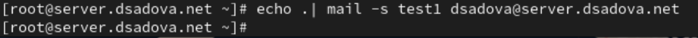{#fig:018 width=90%}

2. На втором терминале запустите мониторинг работы почтовой службы и посмотрите, что произошло с вашим сообщением:(рис. [-@fig:019]),(рис. [-@fig:020])

{#fig:019 width=90%}

{#fig:020 width=90%}

В отчёте отразите, доставлено сообщение или нет с пояснением, на основе каких строк лога вы сделали вывод. Дополнительно посмотрите содержание каталога /var/spool/mail на предмет того, появился ли там каталог вашего пользователя с отправленным письмом.

Сообщение было доставлено. Его можно увидеть в папке /var/spool/mail. А так же мы можем предпологать что сообщение было доставлено на основе лагов server postfix/pickup и server postfix/cleanup. Они первые поймали информацию о том что пришло новое сообщение. 

3. На виртуальной машине client войдите под вашим пользователем и откройте терминал. Перейдите в режим суперпользователя:(рис. [-@fig:021])

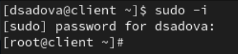{#fig:021 width=90%}

4. На клиенте установите необходимые для работы пакеты:(рис. [-@fig:022]),(рис. [-@fig:023])

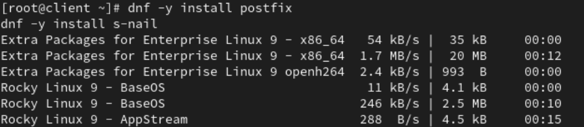{#fig:022 width=90%}

{#fig:023 width=90%}

5. Отключите IPv6 в списке разрешённых в работе Postfix протоколов и оставьте только IPv4:(рис. [-@fig:024])

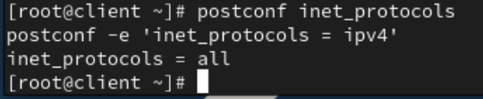{#fig:024 width=90%}

6. На клиенте запустите Postfix:(рис. [-@fig:025])

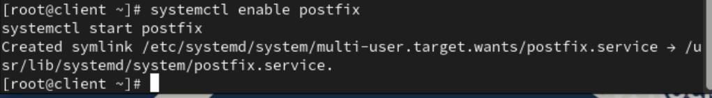{#fig:025 width=90%}

7. На клиенте под учётной записью пользователя аналогичным образом отправьте себе второе письмо, используя утилиту mail. Сравните результат мониторинга почтовой службы на сервере при отправке сообщения с сервера и с клиента. В отчёте отразите, доставлено сообщение или нет. (рис. [-@fig:026])

{#fig:026 width=90%}

Письмо пришло, но отразилось только у client.

8. На сервере в конфигурации Postfix посмотрите значения параметров сетевых интерфейсов inet_interfaces и сетевых адресов mynetworks:(рис. [-@fig:027])

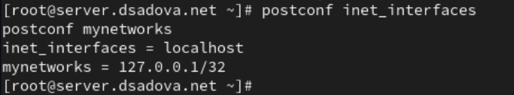{#fig:027 width=90%}

9. Разрешите Postfix прослушивать соединения не только с локального узла, но и с других интерфейсов сети:(рис. [-@fig:028])

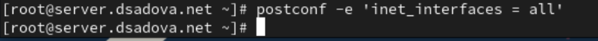{#fig:028 width=90%}

10. Добавьте адрес внутренней сети, разрешив таким образом пересылку сообщений между узлами сети:(рис. [-@fig:029])

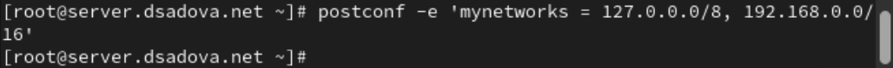{#fig:029 width=90%}

11. Перезагрузите конфигурацию Postfix и перезапустите Postfix:(рис. [-@fig:030])

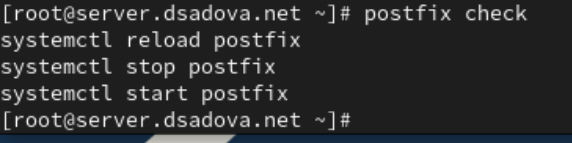{#fig:030 width=90%}

12. Повторите отправку сообщения с клиента. В отчёте отразите, что произошло с вашим сообщением.(рис. [-@fig:031])

{#fig:031 width=90%}

Письмо пришло, но отразилось только у client.

### Конфигурация Postfix для домена

1. С клиента отправьте письмо на свой доменный адрес:(рис. [-@fig:032])

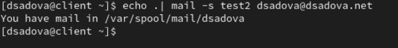{#fig:032 width=90%}

2. Запустите мониторинг работы почтовой службы и посмотрите, что произошло с вашим сообщением:(рис. [-@fig:033])

{#fig:033 width=90%}

В отчёте отразите, что произошло с вашим сообщением.

Письмо было отправлено, но как мы написали неточный адрес, а имено ошиблись в оправили на конкретный узел сети, письмо было остановлено. 

3. Дополнительно посмотрите, какие сообщения ожидают в очереди на отправление:(рис. [-@fig:034])

{#fig:034 width=90%}

4. Для настройки возможности отправки сообщений не на конкретный узел сети, а на доменный адрес пропишите MX-запись с указанием имени почтового сервера mail.user.net (вместо user укажите свой логин) в файле прямой DNS-зоны:(рис. [-@fig:035])

{#fig:035 width=90%}

и в файле обратной DNS-зоны:(рис. [-@fig:036])

{#fig:036 width=90%}

5. В конфигурации Postfix добавьте домен в список элементов сети, для которых данный сервер является конечной точкой доставки почты:(рис. [-@fig:037])

{#fig:037 width=90%}

6. Перезагрузите конфигурацию Postfix:(рис. [-@fig:038])

{#fig:038 width=90%}

7. Восстановите контекст безопасности в SELinux:(рис. [-@fig:039])

{#fig:039 width=90%}

8. Перезапустите DNS:(рис. [-@fig:040])

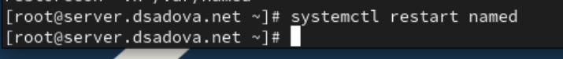{#fig:040 width=90%}

9. Попробуйте отправить сообщения, находящиеся в очереди на отправление:(рис. [-@fig:041])

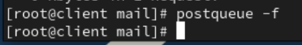{#fig:041 width=90%}

10. Проверьте отправку почты с клиента на доменный адрес.

Письмо было отправлено клиенту 

### Внесение изменений в настройки внутреннего окружения виртуальной машины
1. На виртуальной машине server перейдите в каталог для внесения изменений в настройки внутреннего окружения /vagrant/provision/server/.

2. Замените конфигурационные файлы DNS-сервера:(рис. [-@fig:042])

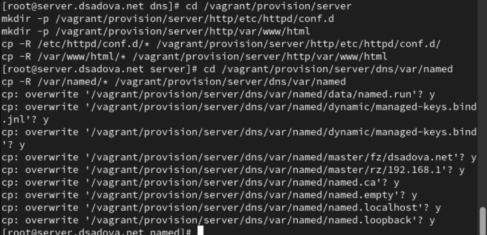{#fig:042 width=90%}

3. В каталоге /vagrant/provision/server создайте исполняемый файл mail.sh. Открыв его на редактирование, пропишите в нём следующий скрипт:(рис. [-@fig:043])

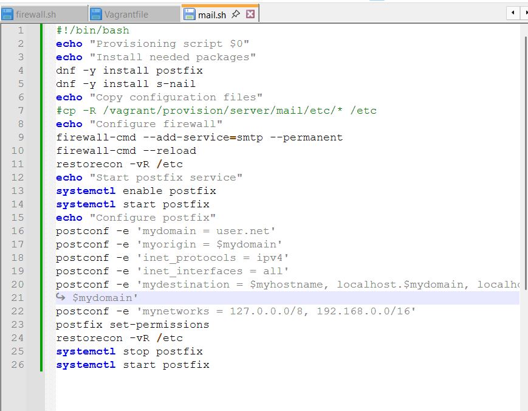{#fig:043 width=90%}

4. На виртуальной машине client перейдите в каталог для внесения изменений в настройки внутреннего окружения /vagrant/provision/client/.

5. В каталоге /vagrant/provision/client создайте исполняемый файл mail.sh. Открыв его на редактирование, пропишите в нём следующий скрипт:
(рис. [-@fig:044])

{#fig:044 width=90%}

6. Для отработки созданного скрипта во время загрузки виртуальной машины server в конфигурационном файле Vagrantfile необходимо добавить в разделе конфигурации для сервера:(рис. [-@fig:045])

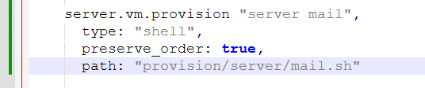{#fig:045 width=90%}

7. Для отработки созданного скрипта во время загрузки виртуальной машины client в конфигурационном файле Vagrantfile необходимо добавить в разделе конфигурации для клиента:(рис. [-@fig:046])

{#fig:046 width=90%}

# Выводы

Приобрели практические навыки по установке и конфигурированию SMTP-сервера. Разобрались с отправкой и получением писем.

# Список литературы{.unnumbered}

::: {#refs}
:::
