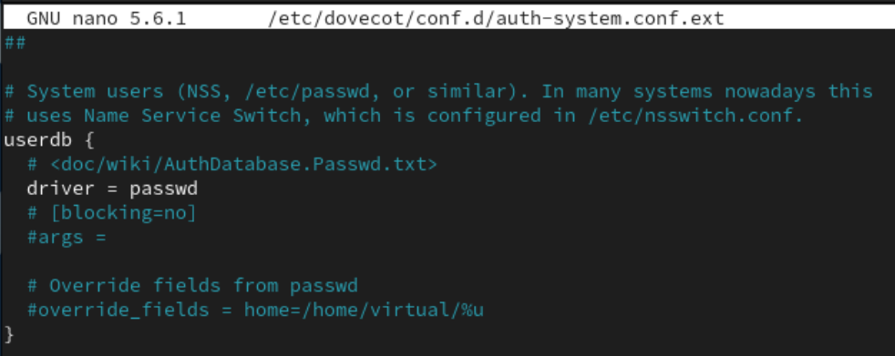
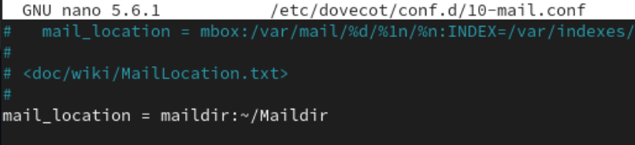
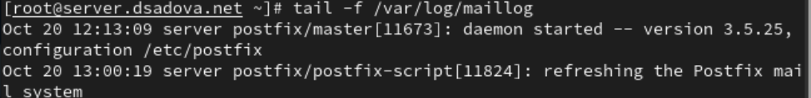
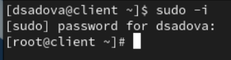
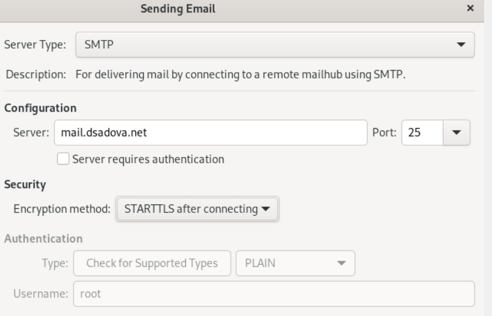
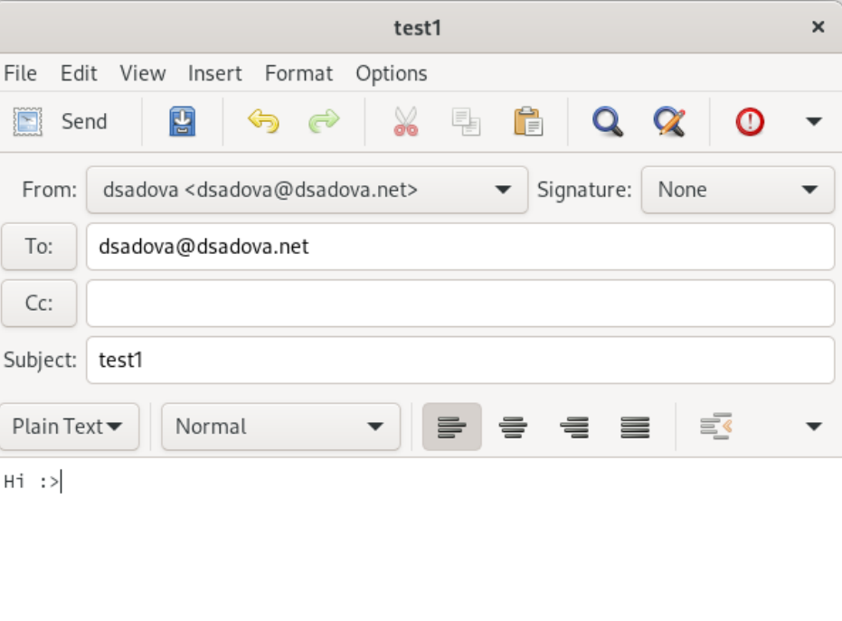

---
## Front matter
lang: ru-RU
title: Лабораторная работа № 9.
subtitle: Настройка POP3/IMAP сервера
author:
  - Cадова Д. А.
institute:
  - Российский университет дружбы народов, Москва, Россия

## i18n babel
babel-lang: russian
babel-otherlangs: english
## Fonts
mainfont: PT Serif
romanfont: PT Serif
sansfont: PT Sans
monofont: PT Mono
mainfontoptions: Ligatures=TeX
romanfontoptions: Ligatures=TeX
sansfontoptions: Ligatures=TeX,Scale=MatchLowercase
monofontoptions: Scale=MatchLowercase,Scale=0.9

## Formatting pdf
toc: false
toc-title: Содержание
slide_level: 2
aspectratio: 169
section-titles: true
theme: metropolis
header-includes:
 - \metroset{progressbar=frametitle,sectionpage=progressbar,numbering=fraction}
 - '\makeatletter'
 - '\beamer@ignorenonframefalse'
 - '\makeatother'
---

# Информация

## Докладчик

:::::::::::::: {.columns align=center}
::: {.column width="70%"}

  * Садова Диана Алексеевна
  * студент бакалавриата
  * Российский университет дружбы народов
  * [113229118@pfur.ru]
  * <https://DianaSadova.github.io/ru/>

:::
::::::::::::::

# Вводная часть

## Актуальность

- Важно понимать как связаны POP3/IMAP-сервера.
- Уметь правильно их настраивать.

## Цели и задачи

- Приобретение практических навыков по установке и простейшему конфигурированию POP3/IMAP-сервера.

## Материалы и методы

- Текст лабороторной работы № 9
- Интеранет для устранения ошибок 

## Содержание 

1. Установите на виртуальной машине server Dovecot и Telnet для дальнейшей проверки корректности работы почтового сервера.
2. Настройте Dovecot.
3. Установите на виртуальной машине client программу для чтения почты Evolution и настройте её для манипуляций с почтой вашего пользователя. Проверьте корректность работы почтового сервера как с виртуальной машины server, так и с виртуальной машины client.
4. Измените скрипт для Vagrant, фиксирующий действия по установке и настройке Postfix и Dovecote во внутреннем окружении виртуальной машины server, создайте скрипт для Vagrant, фиксирующий действия по установке Evolution во внутреннем окружении виртуальной машины client. Соответствующим образом внесите изменения в Vagrantfile .

## Установка Dovecot

1. На виртуальной машине server войдите под вашим пользователем и откройте терминал. Перейдите в режим суперпользователя:

##

2. Установите необходимые для работы пакеты:

## Настройка dovecot

1. В конфигурационном файле /etc/dovecot/dovecot.conf пропишите список почтовых протоколов, по которым разрешено работать Dovecot:

##

2. В конфигурационном файле /etc/dovecot/conf.d/10-auth.conf проверьте, что указан метод аутентификации plain:

##

3. В конфигурационном файле /etc/dovecot/conf.d/auth-system.conf.ext проверьте, что для поиска пользователей и их паролей используется pam и файл passwd:

##

##

4. В конфигурационном файле /etc/dovecot/conf.d/10-mail.conf настройте месторасположение почтовых ящиков пользователей:

##

5. В Postfix задайте каталог для доставки почты:

##

6. Сконфигурируйте межсетевой экран, разрешив работать службам протоколов POP3 и IMAP:

##

7. Восстановите контекст безопасности в SELinux:

##

8. Перезапустите Postfix и запустите Dovecot:

## Проверка работы Dovecot

1. На дополнительном терминале виртуальной машины server запустите мониторинг работы почтовой службы:

##

2. На терминале сервера для просмотра имеющейся почты используйте

##

3. Для просмотра mailbox пользователя на сервере на терминале с правами суперпользователя используйте команду

##

4. На виртуальной машине client войдите под вашим пользователем и откройте терминал. Перейдите в режим суперпользователя:

##

5. Установите почтовый клиент:

##

6. Запустите и настройте почтовый клиент Evolution:

##

##

##

##

7. Из почтового клиента отправьте себе несколько тестовых писем, убедитесь, что они доставлены.

##

8. Параллельно посмотрите, какие сообщения выдаются при мониторинге почтовой службы на сервере, а также при использовании doveadm и mail.

9. Проверьте работу почтовой службы, используя на сервере протокол Telnet:
 
## Внесение изменений в настройки внутреннего окружения виртуальной машины

1. На виртуальной машине server перейдите в каталог для внесения изменений в настройки внутреннего окружения /vagrant/provision/server/. В соответствующие подкаталоги поместите конфигурационные файлы Dovecot.

##

2. Внесите изменения в файл /vagrant/provision/server/mail.sh, добавив в негостроки:
- по установке Dovecot и Telnet;
- по настройке межсетевого экрана;
- по настройке Postfix в части задания месторасположения почтового ящика;
- по перезапуску Postfix и запуску Dovecot.

##

##

3. На виртуальной машине client в каталоге /vagrant/provision/client скорректируйте файл mail.sh, прописав в нём:

dnf -y install evolution

## Результаты

- Приобрели практический навык по установке и простейшему конфигурированию POP3/IMAP-сервера. Научились отправлять mail с client.

