---
## Front matter
title: "Лабораторная работа № 9."
subtitle: "Настройка POP3/IMAP сервера"
author: "Диана Алексеевна Садова"

## Generic otions
lang: ru-RU
toc-title: "Содержание"

## Bibliography
bibliography: bib/cite.bib
csl: pandoc/csl/gost-r-7-0-5-2008-numeric.csl

## Pdf output format
toc: true # Table of contents
toc-depth: 2
lof: true # List of figures
lot: true # List of tables
fontsize: 12pt
linestretch: 1.5
papersize: a4
documentclass: scrreprt
## I18n polyglossia
polyglossia-lang:
  name: russian
  options:
	- spelling=modern
	- babelshorthands=true
polyglossia-otherlangs:
  name: english
## I18n babel
babel-lang: russian
babel-otherlangs: english
## Fonts
mainfont: PT Serif
romanfont: PT Serif
sansfont: PT Sans
monofont: PT Mono
mainfontoptions: Ligatures=TeX
romanfontoptions: Ligatures=TeX
sansfontoptions: Ligatures=TeX,Scale=MatchLowercase
monofontoptions: Scale=MatchLowercase,Scale=0.9
## Biblatex
biblatex: true
biblio-style: "gost-numeric"
biblatexoptions:
  - parentracker=true
  - backend=biber
  - hyperref=auto
  - language=auto
  - autolang=other*
  - citestyle=gost-numeric
## Pandoc-crossref LaTeX customization
figureTitle: "Рис."
tableTitle: "Таблица"
listingTitle: "Листинг"
lofTitle: "Список иллюстраций"
lotTitle: "Список таблиц"
lolTitle: "Листинги"
## Misc options
indent: true
header-includes:
  - \usepackage{indentfirst}
  - \usepackage{float} # keep figures where there are in the text
  - \floatplacement{figure}{H} # keep figures where there are in the text
---

# Цель работы

Приобретение практических навыков по установке и простейшему конфигурированию POP3/IMAP-сервера.

# Задание

1. Установите на виртуальной машине server Dovecot и Telnet для дальнейшей проверки корректности работы почтового сервера.

2. Настройте Dovecot.

3. Установите на виртуальной машине client программу для чтения почты Evolution и настройте её для манипуляций с почтой вашего пользователя. Проверьте корректность работы почтового сервера как с виртуальной машины server, так и с виртуальной машины client.

4. Измените скрипт для Vagrant, фиксирующий действия по установке и настройке Postfix и Dovecote во внутреннем окружении виртуальной машины server, создайте скрипт для Vagrant, фиксирующий действия по установке Evolution во внутреннем окружении виртуальной машины client. Соответствующим образом внесите изменения в Vagrantfile .

## Последовательность выполнения работы

### Установка Dovecot

1. На виртуальной машине server войдите под вашим пользователем и откройте терминал. Перейдите в режим суперпользователя:(рис. [-@fig:001])

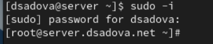{#fig:001 width=90%}

2. Установите необходимые для работы пакеты:(рис. [-@fig:002])

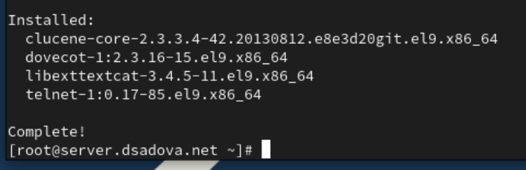{#fig:002 width=90%}

### Настройка dovecot

1. В конфигурационном файле /etc/dovecot/dovecot.conf пропишите список почтовых протоколов, по которым разрешено работать Dovecot:(рис. [-@fig:003])

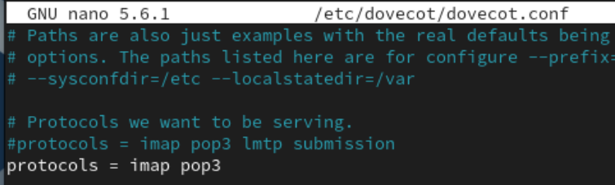{#fig:003 width=90%}

2. В конфигурационном файле /etc/dovecot/conf.d/10-auth.conf проверьте, что указан метод аутентификации plain:(рис. [-@fig:004])

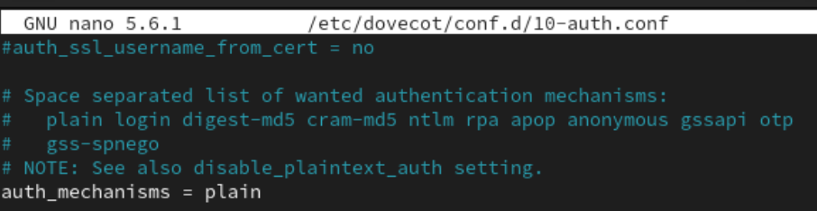{#fig:004 width=90%}

3. В конфигурационном файле /etc/dovecot/conf.d/auth-system.conf.ext проверьте, что для поиска пользователей и их паролей используется pam и файл passwd:(рис. [-@fig:005]),(рис. [-@fig:006])

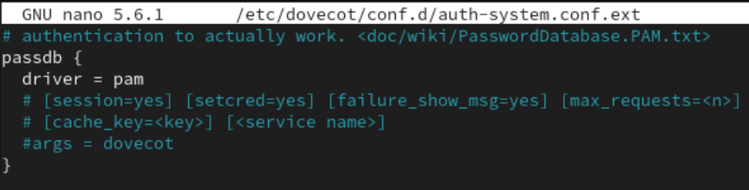{#fig:005 width=90%}

{#fig:006 width=90%}

4. В конфигурационном файле /etc/dovecot/conf.d/10-mail.conf настройте месторасположение почтовых ящиков пользователей:(рис. [-@fig:007])

{#fig:007 width=90%}

5. В Postfix задайте каталог для доставки почты:(рис. [-@fig:008])

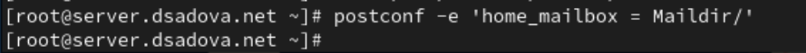{#fig:008 width=90%}

6. Сконфигурируйте межсетевой экран, разрешив работать службам протоколов POP3 и IMAP:(рис. [-@fig:009])

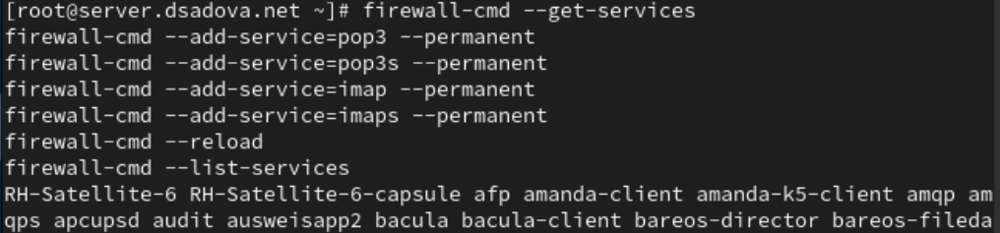{#fig:009 width=90%}

7. Восстановите контекст безопасности в SELinux:(рис. [-@fig:010])

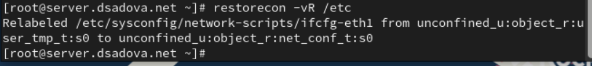{#fig:010 width=90%}

8. Перезапустите Postfix и запустите Dovecot:(рис. [-@fig:011])

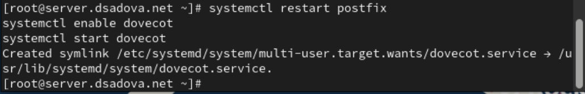{#fig:011 width=90%}

### Проверка работы Dovecot

1. На дополнительном терминале виртуальной машины server запустите мониторинг работы почтовой службы:(рис. [-@fig:012])

{#fig:012 width=90%}

2. На терминале сервера для просмотра имеющейся почты используйте(рис. [-@fig:013])

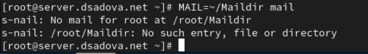{#fig:013 width=90%}

Папка пустая, так как новой почты еще нет.

3. Для просмотра mailbox пользователя на сервере на терминале с правами суперпользователя используйте команду(рис. [-@fig:014])

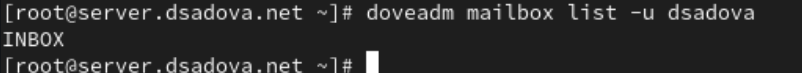{#fig:014 width=90%}

4. На виртуальной машине client войдите под вашим пользователем и откройте терминал. Перейдите в режим суперпользователя:(рис. [-@fig:015])

{#fig:015 width=90%}

5. Установите почтовый клиент:(рис. [-@fig:016])

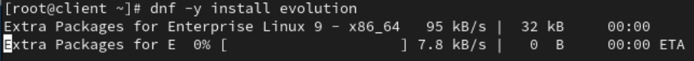{#fig:016 width=90%}

6. Запустите и настройте почтовый клиент Evolution:

- в окне настройки учётной записи почты укажите имя, адрес почты в виде user@user.net (вместо user укажите свой логин), введите пароль вашего пользователя, нажмите «Продолжить», затем нажмите «Настроить вручную»;

- в качестве IMAP-сервера для входящих сообщений и SMTP-сервера для исходящих сообщений пропишите mail.user.net, в качестве пользователя для входящих и исходящих сообщений укажите user (вместо user укажите свой логин);

- проверьте номера портов: для IMAP — порт 143, для SMTP — порт 25;

- проверьте настройки SSL и метода аутентификации: для IMAP — STARTTLS, аутентификация по обычному паролю, для SMTP — без аутентификации, аутентификация — «Без аутентификации»;

- при возникновении сообщения о небезопасном соединении выставьте галочку о понимании риска работы по такому соединению и нажмите «Ок», затем подтвердите исключение безопасности, нажав в появившемся окне соответствующую кнопку.(рис. [-@fig:017]),(рис. [-@fig:018]),(рис. [-@fig:019]),(рис. [-@fig:020])

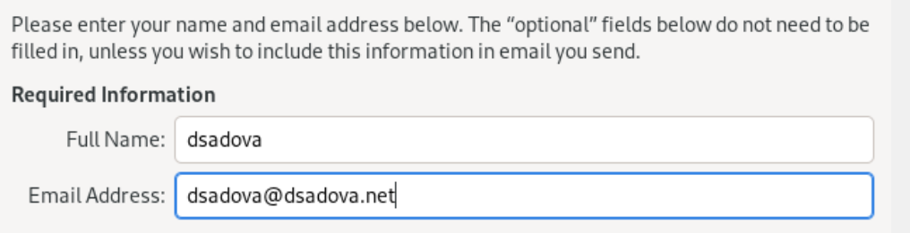{#fig:017 width=90%}

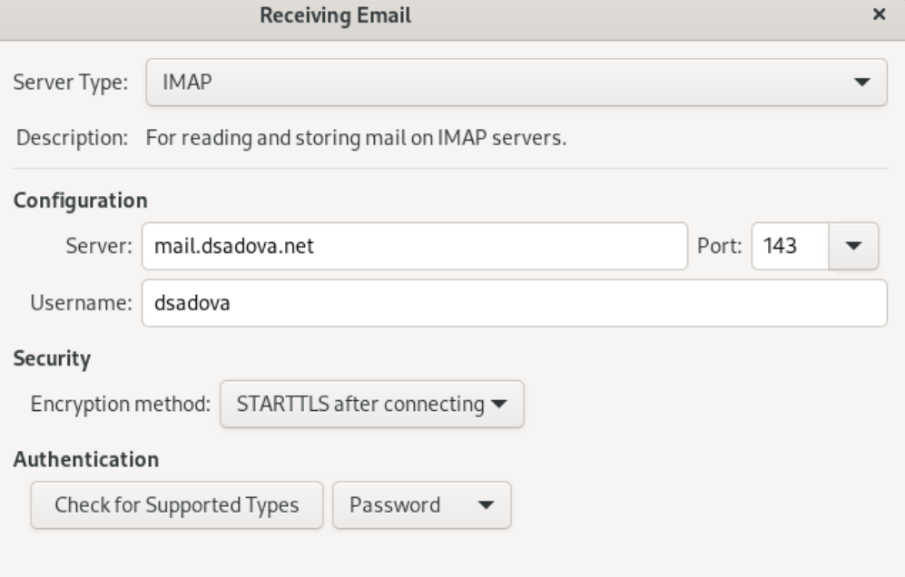{#fig:018 width=90%}

{#fig:019 width=90%}

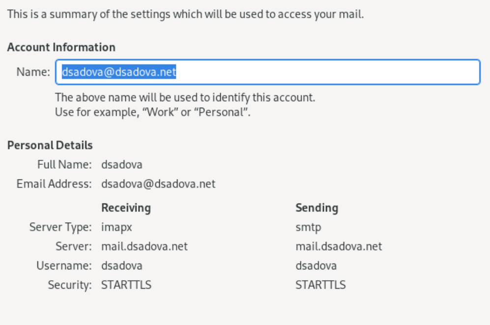{#fig:020 width=90%}

7. Из почтового клиента отправьте себе несколько тестовых писем, убедитесь, что они доставлены.(рис. [-@fig:021])

{#fig:021 width=90%}

8. Параллельно посмотрите, какие сообщения выдаются при мониторинге почтовой службы на сервере, а также при использовании doveadm и mail. В отчёте прокомментируйте эту информацию.

9. Проверьте работу почтовой службы, используя на сервере протокол Telnet:

- подключитесь с помощью протокола Telnet к почтовому серверу по протоколу POP3 (через порт 110), введите свой логин для подключения и пароль:

telnet mail.user.net 110
user имя_пользователя
pass ваш_пароль

(в названии почтового сервера и в имени пользователя вместо user используйте свой логин);
– с помощью команды list получите список писем;
– с помощью команды retr 1 получите первое письмо из списка;
– с помощью команды dele 2 удалите второе письмо из списка;
– с помощью команды quit завершите сеанс работы с telnet.
 
### Внесение изменений в настройки внутреннего окружения виртуальной машины

1. На виртуальной машине server перейдите в каталог для внесения изменений в настройки внутреннего окружения /vagrant/provision/server/. В соответствующие подкаталоги поместите конфигурационные файлы Dovecot.

2. Внесите изменения в файл /vagrant/provision/server/mail.sh, добавив в негостроки:(рис. [-@fig:022])
- по установке Dovecot и Telnet;
- по настройке межсетевого экрана;
- по настройке Postfix в части задания месторасположения почтового ящика;
- по перезапуску Postfix и запуску Dovecot.

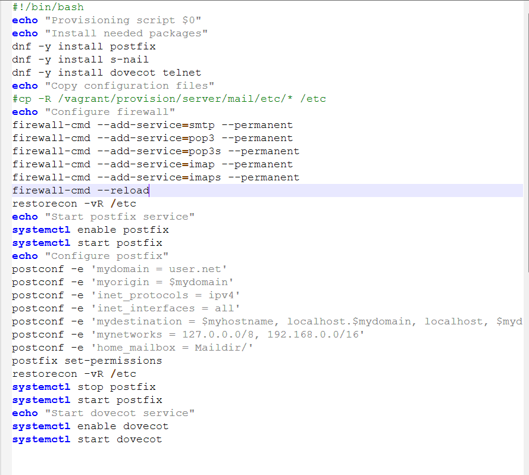{#fig:022 width=90%}

3. На виртуальной машине client в каталоге /vagrant/provision/client скорректируйте файл mail.sh, прописав в нём:

dnf -y install evolution

# Выводы

Приобрели практический навык по установке и простейшему конфигурированию POP3/IMAP-сервера. Научились отправлять mail с client. 

# Список литературы{.unnumbered}

::: {#refs}
:::
