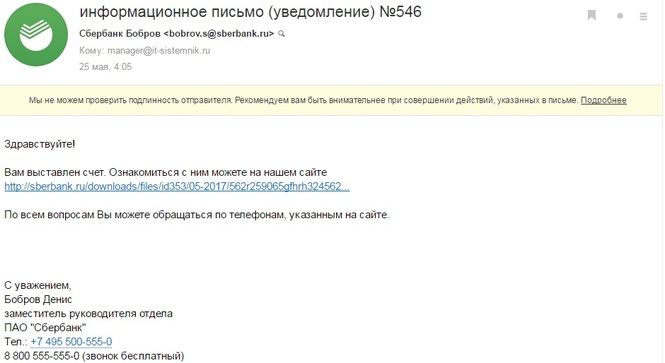
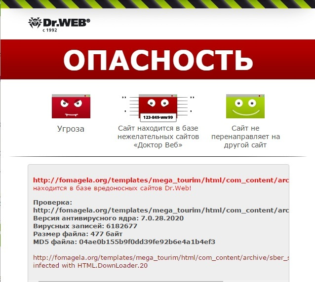

---
## Front matter
lang: ru-RU
title: Доклад
subtitle: Тема «Проверка на вирусы»
author:
  - Cадова Д. А.
  - Кулябов Дмитрий Сергеевич. Доцент по кафедре систем телекоммуникаций. Доктор физико-математических наук по специальности 05.13.18 «Математическое моделирование, численные методы и комплексы программ». Профессор кафедры прикладной информатики и теории вероятностей РУДН. Заведующий сектором Управления информационно-технологического обеспечения, слаботочных и телекоммуникационных систем РУДН (по совместительству). 
institute:
  - Российский университет дружбы народов, Москва, Россия

## i18n babel
babel-lang: russian
babel-otherlangs: english
## Fonts
mainfont: PT Serif
romanfont: PT Serif
sansfont: PT Sans
monofont: PT Mono
mainfontoptions: Ligatures=TeX
romanfontoptions: Ligatures=TeX
sansfontoptions: Ligatures=TeX,Scale=MatchLowercase
monofontoptions: Scale=MatchLowercase,Scale=0.9

## Formatting pdf
toc: false
toc-title: Содержание
slide_level: 2
aspectratio: 169
section-titles: true
theme: metropolis
header-includes:
 - \metroset{progressbar=frametitle,sectionpage=progressbar,numbering=fraction}
 - '\makeatletter'
 - '\beamer@ignorenonframefalse'
 - '\makeatother'
---

## Информация о докладчике

:::::::::::::: {.columns align=center}
::: {.column width="70%"}

  * Садова Диана Алексеевна
  * студент бакалавриата
  * Российский университет дружбы народов
  * [113229118@pfur.ru]
  * <https://DianaSadova.github.io/ru/>
  
:::
::: {.column width="30%"}

:::
::::::::::::::

## Актуальность

- По данным последних отчетов компаний в сфере кибербезопасности **более 70% успешных кибератак начинаются именно с фишинговых писем**. Программы-вымогатели (Ransomware), такие как WannaCry или Petya, часто распространяются через спам-рассылки с вредоносными вложениями.

## Цели и задачи

- Ознакомится с принципами и значениями системы проверки на вирусы в корпоративной почтовой системе.

## Материалы и методы

- Материалы находящиеся на просторах Internet

## Введение

- Электронная почта уже несколько десятилетий остается основным каналом деловой коммуникации. Однако именно эта популярность и доверие пользователей сделали электронную почту одним из главных векторов для кибератак. 

- Вредоносное программное обеспечение часто проникает в сеть организации именно через вложения и ссылки в письмах. В связи с этим, обязательным компонентом любой современной корпоративной ИТ-инфраструктуры является система проверки почтового трафика на вирусы.

## Что такое проверка на вирусы в корпоративной почтовой системе?

**Проверка на вирусы в корпоративной почтовой системе** — это комплекс технологий и процессов, направленных на обнаружение, блокировку и удаление вредоносного программного обеспечения из почтового трафика (как входящего, исходящего, так и внутреннего).

## Ключевые объекты проверки

:::::::::::::: {.columns align=center}
::: {.column width="50%"}

1.  **Вложения файлов:** 
  - исполняемые файлы (.exe, .scr, .msi)
  - документы Microsoft Office с макросами (.docm, .xlsm)
  - архивы (.zip, .rar)
  - PDF-файлы.

:::
::: {.column width="50%"}

:::
::::::::::::::

##

:::::::::::::: {.columns align=center}
::: {.column width="50%"}

2.  **Тело письма:** 

3.  **Скрипты:** встроенные в HTML-письма.

:::
::: {.column width="50%"}

:::
::::::::::::::

## Основные методы проверки:

:::::::::::::: {.columns align=center}
::: {.column width="50%"}

- Сигнатурный анализ.

- Эвристический анализ. 

- Песочница (Sandboxing).

:::
::: {.column width="50%"}

:::
::::::::::::::

## Зачем нужна проверка на вирусы в почтовой системе?

:::::::::::::: {.columns align=center}
::: {.column width="50%"}

1.  Защита конечных пользователей
2.  Блокировка распространения
3.  Соблюдение комплаенс
4.  Сохранение производительности
5.  Защита репутации

:::
::: {.column width="50%"}

:::
::::::::::::::

## На каких уровнях используется антивирусная защита почты?

:::::::::::::: {.columns align=center}
::: {.column width="50%"}

1.  **Облачные сервисы (SaaS-защита):** такие решения, как Microsoft Defender for Office 365

2.  **Почтовый шлюз (аппаратный или программный):** например, на базе Dr.Web Mail Security

3.  **Модули на самом почтовом сервере:** например, в Zimbra Collaboration Suite

4.  **Антивирус на рабочей станции:**

:::
::: {.column width="50%"}

:::
::::::::::::::

## Достоинства

1. Эффективное сдерживание массовых угроз

2. Снижение нагрузки на ИТ-отдел

3. Централизованное управление

4. Защита "на подлете"

5. Соответствие требованиям регуляторов

## Недостатки

1. Не 100% защита

2. Ложные срабатывания (False Positives)

3. Затраты на лицензии и hardware

4. Задержка доставки почты

5. Сложность конфигурации

## Заключение

Проверка на вирусы в корпоративной почтовой системе является неотъемлемым и критически важным компонентом современной системы информационной безопасности. Это первый и один из самых важных рубежей обороны, который защищает организацию от огромного количества киберугроз, распространяемых через электронную почту.

# Список литературы{.unnumbered}

1. Microsoft. Официальная документация по Microsoft Defender for Office 365. – 2023.
2. ClamAV. Documentation [Электронный ресурс]. – Режим доступа: https://docs.clamav.net/
3. Лаборатория Касперского. Отчеты об угрозах информационной безопасности. – 2023.
4. Positive Technologies. Обзор киберугроз для корпоративного сектора. – 2023.
5. ФСТЭК России. Методические документы по защите информации. – 2023.
6. Cisco. Cybersecurity Threat Trends Report. – 2023.
7. Proofpoint. Human Factor Report. – 2023.
